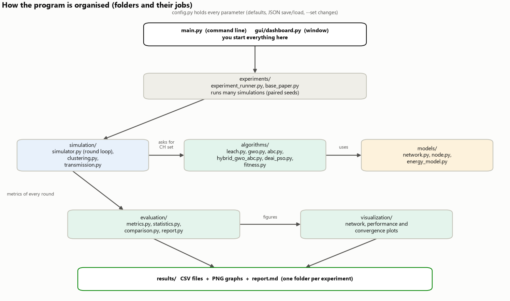

# Start here — beginner's guide to the project

**Project:** *Hybrid Grey Wolf Optimizer (GWO) and Artificial Bee Colony (ABC) for energy-efficient Cluster Head
selection in Wireless Sensor Networks* — implemented and run completely in **Python** (MATLAB is not needed).

This folder (`docs/`) teaches the project from zero. You do not need any previous knowledge of sensor networks,
optimisation or programming. Every number quoted in these documents was produced by the program in this
project; where the proposed method is **not** better, the documents say so.

## The project in one picture


*Small battery-powered sensors are spread over a field. In every round some sensors are chosen as
**cluster heads (CHs)**. The others send their data to the nearest CH, and each CH sends one combined packet to the
**base station (BS)**. Being a CH costs about 20 times more energy than being a normal sensor, so **which** nodes
are chosen as CHs decides how long the network lives. This project chooses the CHs with a new hybrid of two
nature-inspired search methods (GWO + ABC) and compares it fairly with other methods.*

## The project in five sentences

1. We simulate a wireless sensor network in Python: nodes, batteries, a base station, radio energy, rounds and
   node death.
2. Every round, an algorithm chooses the cluster heads: Random choice, LEACH (the classic protocol), GWO, ABC,
   the **proposed Hybrid GWO-ABC**, and the base paper's DEAI-PSO.
3. A **fitness function** gives every possible CH choice a score (energy, distances, balance); GWO, ABC and the
   hybrid search for the CH choice with the best (lowest) score.
4. The program runs every algorithm on the same 20 random networks until all nodes are dead and measures
   lifetime (FND, HND, LND), energy, throughput and delivery ratio.
5. Statistics decide which differences are real; CSV files, graphs and a written report are generated
   automatically.

## Reading order

| # | File | What you will learn | Time |
|---|---|---|---|
| 1 | [01_INSTALL_AND_RUN.md](01_INSTALL_AND_RUN.md) | Install Python, run the project, what happens when you press Run, what the outputs are | 45 min |
| 2 | [08_STUDY_GUIDE.md](08_STUDY_GUIDE.md) | **If you know nothing**: 23 small steps from "what is a sensor?" to "what does the conclusion mean?" | 2 h |
| 3 | [02_CONCEPTS.md](02_CONCEPTS.md) | Every concept explained: what, why, how, inside the program, analogy, link to the project | 2 h |
| 4 | [03_MATHEMATICS.md](03_MATHEMATICS.md) | Every equation with variables, meaning, purpose, a worked example and where the code uses it | 2 h |
| 5 | [04_ALGORITHMS.md](04_ALGORITHMS.md) | LEACH, GWO, ABC, the Hybrid GWO-ABC and the base paper's DEAI-PSO, step by step | 2 h |
| 6 | [05_RESULTS_AND_GRAPHS.md](05_RESULTS_AND_GRAPHS.md) | The real results and how to read and explain every graph | 1.5 h |
| 7 | [06_MATLAB_TO_PYTHON.md](06_MATLAB_TO_PYTHON.md) | Why the project moved from MATLAB to Python, and what that does and does not change | 20 min |
| 8 | [07_TROUBLESHOOTING.md](07_TROUBLESHOOTING.md) | Problem → Reason → Solution for common errors | as needed |
| 9 | [09_PRESENTATION_AND_VIVA.md](09_PRESENTATION_AND_VIVA.md) | 30–60 second explanation, technical explanation, demo plan, viva questions and answers | 2 h |
| 10 | [10_FINAL_CHECKLIST.md](10_FINAL_CHECKLIST.md) | Checklist proving each part of the project is implemented, with evidence | 10 min |

The technical reference for the whole project is the main [README.md](../README.md); the automatically generated
reports are in `results/<experiment>/report.md`.

## The commands you need first

**Easiest (Windows):** double-click **`install.bat`** once, then double-click **`run.bat`** and choose from the
menu (open the simulator window, run a simulation, compare the algorithms, run the tests …).

**By hand:** open a terminal in the project folder (see [01_INSTALL_AND_RUN.md](01_INSTALL_AND_RUN.md) for the full
step-by-step guide) and type:

```powershell
python -m pip install -r requirements.txt     # once: install the libraries
python -m pytest                              # check that everything works (all tests should pass)
python main.py                                # open the window (GUI) and press Run
```

## Where everything is

```text
Hybrid-GWO-ABC-WSN/
├── install.bat          ← double-click once: installs everything (Windows)
├── run.bat              ← double-click: menu to run the project (Windows)
├── main.py              ← every command (GUI, simulate, compare, scenarios, …)
├── config.py            ← every parameter and its default value
├── models/              ← sensor node, network, radio energy model
├── simulation/          ← the round loop, cluster formation, data transmission
├── algorithms/          ← LEACH, Random, GWO, ABC, Hybrid GWO-ABC, DEAI-PSO, fitness function
├── evaluation/          ← metrics, statistics, automatic reports
├── visualization/       ← all graphs (and the diagrams used in these documents)
├── gui/                 ← the window (dashboard)
├── experiments/         ← runs many simulations and saves the results
├── tests/               ← automatic checks (pytest)
├── results/             ← generated CSV files, graphs and report.md files (the evidence)
└── docs/                ← these beginner documents and their figures
```



## Units and words used everywhere

| Word | Meaning |
|---|---|
| J (joule) | unit of energy. Every node starts with 0.5 J (a tiny battery, as in the research literature) |
| mJ | millijoule = 0.001 J |
| bit | one 0/1 value; a data packet here is 4000 bits (500 bytes) |
| round | one cycle of "choose CHs → send data → spend energy" (see the study guide, step 14) |
| CH | cluster head |
| BS | base station |
| FND / HND / LND | round in which the First / Half / Last node died |
| fitness | score of a CH choice; **lower is better** in this project |
