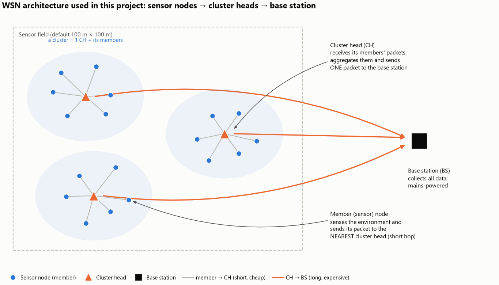
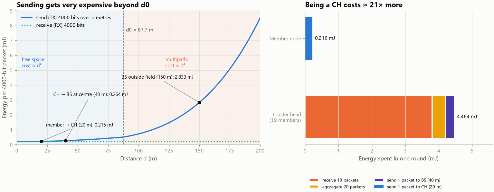
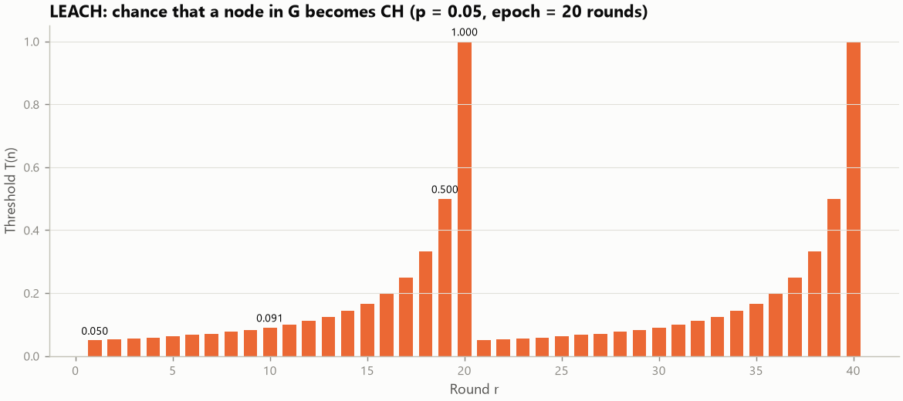
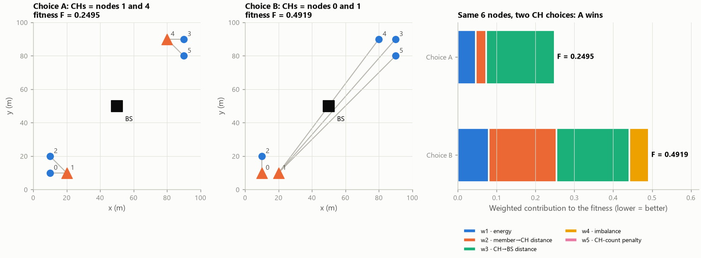
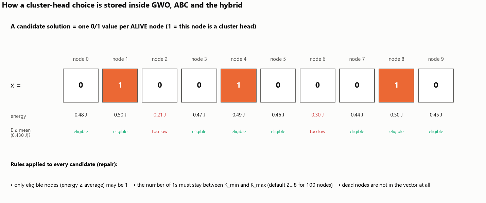
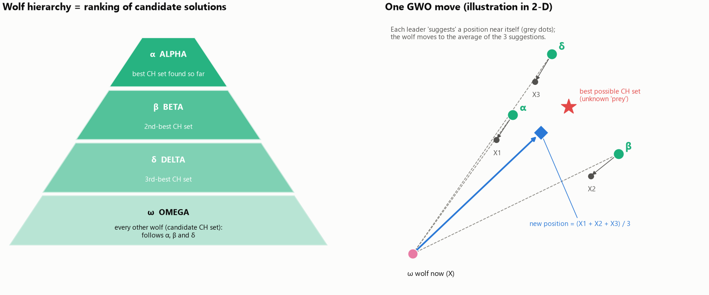
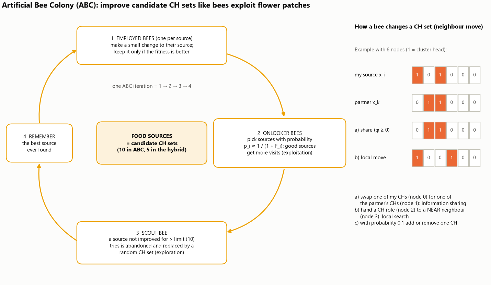
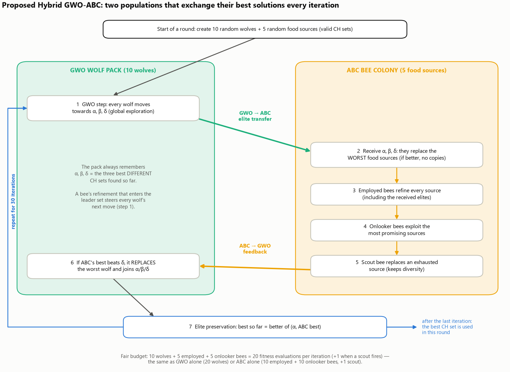
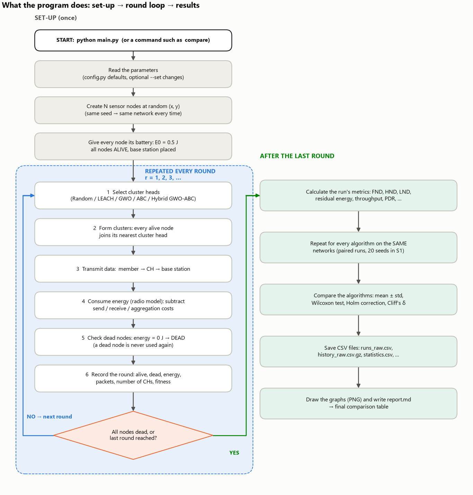
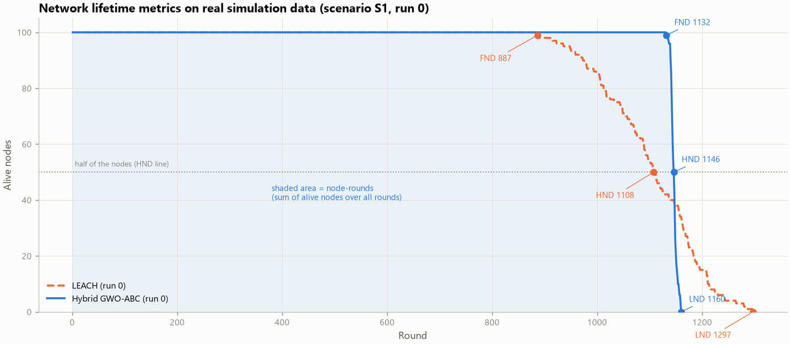

# 2. Every concept, explained from zero

Each concept is explained in the same six parts:

* **What it is**
* **Why it is required**
* **How it works**
* **Inside the program** (which file / function does it)
* **Analogy** (a simple real-world comparison)
* **In this project** (how it is used here)

If you are completely new, read [08_STUDY_GUIDE.md](08_STUDY_GUIDE.md) first; it uses these explanations in
the right order.

Contents: [A. The network](#a-the-network) · [B. Energy](#b-energy) · [C. Clusters](#c-clusters-and-cluster-heads) ·
[D. Optimisation](#d-optimisation) · [E. Simulation](#e-simulation) · [F. Performance metrics](#f-performance-metrics) ·
[G. Fair comparison](#g-fair-comparison-and-statistics)

---

## A. The network

### A1. Sensor (sensor node)

* **What it is:** a tiny, cheap device that measures something (temperature, humidity, vibration, gas, …), has a
  small processor, a radio and a battery.
* **Why it is required:** it is the "eye" of the network; without sensors there is no data.
* **How it works:** it senses, packs the reading into a data packet (here 4000 bits) and sends it by radio.
  Every send and receive drains its battery.
* **Inside the program:** `models/node.py` (`SensorNode`: id, x, y, initial and residual energy, ALIVE/DEAD,
  CH flag, cluster id, distances, packet counters). For speed, the values of all nodes are stored together in
  arrays in `models/network.py`; `SensorNode` is a view of one row, so both always agree.
* **Analogy:** a weather volunteer with a walkie-talkie whose batteries cannot be replaced.
* **In this project:** 100 nodes by default (also 160, 200 and 300 in other scenarios), each with 0.5 J of energy,
  placed at random positions.

### A2. Wireless Sensor Network (WSN)

* **What it is:** many sensor nodes spread over an area that work together and send their data wirelessly to a
  collection point.
* **Why it is required:** one sensor sees one spot; a network covers a whole field, building or forest, often in
  places where cables are impossible.
* **How it works:** nodes are deployed (here: randomly), they measure periodically and forward the data —
  directly or through other nodes — to the base station.
* **Inside the program:** `Network.deploy(config, seed)` in `models/network.py` creates the network: random
  positions in a W × H field, the base station position, every node-to-node and node-to-BS distance.
* **Analogy:** a team of reporters spread across a city, all phoning news to one newsroom.
* **In this project:** a 100 m × 100 m field (also 150 m × 150 m and others in experiments) with a single base
  station.

### A3. Base Station (BS)

* **What it is:** the collection point (also called *sink*) that receives the network's data and connects it to
  the outside world (internet, a computer).
* **Why it is required:** the data is useless unless it reaches a user; the BS is that gateway.
* **How it works:** it only receives. It is mains-powered, so its energy is **not** limited and not simulated.
  In centralised protocols it also computes the CH choice and announces it.
* **Inside the program:** a position `(bs_x, bs_y)` in `config.py` (default (50, 50), the centre); distances to it
  are in `network.dist_to_bs`. GWO, ABC, the hybrid and DEAI-PSO are "centralised": they run at the BS with
  knowledge of every node's position and energy.
* **Analogy:** the newsroom that receives every reporter's call; it never runs out of power.
* **In this project:** at the centre (S1–S3), on the field edge (S4), outside the field (S5) and at (200, 50) in
  the base paper's scenarios. The farther the BS, the more expensive each transmission to it.

---

## B. Energy

### B1. Battery energy: initial and residual energy

* **What it is:** *initial energy* E0 is the battery charge at the start (0.5 J per node). *Residual energy* is
  what is left at a given moment.
* **Why it is required:** a node with 0 J is dead. Energy is the resource every protocol tries to save.
* **How it works:** every send, receive and aggregation subtracts a small amount from the node's battery.
* **Inside the program:** `network.energy` (one value per node), reduced by `spend()` in
  `simulation/transmission.py`; `network.total_energy` is the sum over all nodes.
* **Analogy:** prepaid phone credit: every call costs money; when the credit reaches zero the phone is useless.
* **In this project:** 100 nodes × 0.5 J = 50 J in total at the start. The "residual energy" metric is the total
  left at round 500 (round 300 in the base-paper scenarios).

### B2. Energy consumption and the radio energy model

* **What it is:** the energy a node spends on radio communication. The project uses the **first-order radio
  model** (Heinzelman et al., the model used by LEACH and most WSN papers).
* **Why it is required:** without a model of energy we cannot predict when nodes die, so we cannot compare
  algorithms.
* **How it works:** sending k bits costs electronics energy (proportional to k) plus amplifier energy that grows
  with distance: with d² for short distances, with d⁴ beyond d0 ≈ 87.7 m. Receiving costs electronics energy only;
  combining (aggregating) packets costs a little processing energy.
* **Inside the program:** `models/energy_model.py` (`tx_energy`, `rx_energy`, `aggregation_energy`, `d0`);
  formulas and numbers in [03_MATHEMATICS.md](03_MATHEMATICS.md#2-radio-energy-model).
* **Analogy:** shouting: talking to someone next to you is cheap; shouting across a football field takes much more
  effort, and the effort grows much faster than the distance.
* **In this project:** sending a 4000-bit packet 20 m costs 0.216 mJ; 150 m costs 2.833 mJ (13 times more).
  That is why short links and a sensible CH placement matter.

### B3. Data aggregation

* **What it is:** a CH combines the packets of its members and its own reading into **one** packet.
* **Why it is required:** without it, the CH would forward every packet separately over the long CH → BS link,
  wasting energy.
* **How it works:** the CH pays a small processing cost (5 nJ per bit per packet) for each packet it combines,
  then sends a single 4000-bit packet to the BS.
* **Inside the program:** `aggregation_energy` in `models/energy_model.py`, charged in `execute_round`
  (`simulation/transmission.py`).
* **Analogy:** a class representative collects everybody's forms and posts one envelope to the office.
* **In this project:** one aggregated packet per CH per round. The readings inside it count as delivered when the
  packet reaches the BS.

---

## C. Clusters and cluster heads

### C1. Cluster

* **What it is:** a group of nearby nodes that send their data to the same leader (the cluster head).
* **Why it is required:** if every node talked directly to a distant BS, all would spend a lot of energy on long
  links. Clustering replaces many long links with many short ones plus a few long ones.
* **How it works:** after the CHs are chosen, every other alive node joins the **nearest** CH (in real radios: the
  CH whose announcement it receives most strongly).
* **Inside the program:** `form_clusters()` in `simulation/clustering.py`. It also removes dead or duplicate CHs.
* **Analogy:** students sit in groups; each group has a leader who reports to the teacher.
* **In this project:** about 5 clusters per round with 100 nodes (10 % = 10 clusters in the base-paper
  scenarios). Clusters are formed again every round.

### C2. Cluster Head (CH)

* **What it is:** the leader node of a cluster. It receives its members' packets, aggregates them and sends one
  packet to the BS.
* **Why it is required:** it makes clustering possible (see C1).
* **How it works:** it is an ordinary sensor node with extra duties for one round. In the next round another node
  may take the role.
* **Inside the program:** the selected CH ids are returned by the algorithm (`Selection.ch`); `network.is_ch` marks
  them; `ch_log_run0.csv` records every CH of every round (id, position, energy, distance to BS, cluster size).
* **Analogy:** the class representative — useful, but it is extra work.
* **In this project:** in a typical cluster of 20 nodes, a CH spends **4.464 mJ** in one round while a member
  spends **0.216 mJ** — about **21 times more** (worked out in
  [03_MATHEMATICS.md](03_MATHEMATICS.md#3-energy-of-one-round-for-a-member-and-for-a-cluster-head)).

### C3. Why cluster heads must be chosen carefully (CH selection)

* **What it is:** deciding, every round, which nodes become CHs.
* **Why it is required:** a bad choice kills nodes early: a CH with little energy dies; a CH far from its members
  makes them spend a lot; a CH far from the BS spends a lot itself; very unequal clusters overload some CHs.
* **How it works:** each algorithm uses a different rule: Random picks at random, LEACH uses a probability that
  rotates the role, GWO/ABC/Hybrid search for the CH set with the best fitness score.
* **Inside the program:** every algorithm has `select(network, round)` in `algorithms/`; it returns the CH ids.
* **Analogy:** choosing team captains every day: pick tired people or people far from their team and the team
  works badly.
* **In this project:** this choice is the **only** thing that differs between the algorithms. Everything else
  (network, energy model, packets, clustering rule) is identical, so differences in lifetime come from the CH
  choice.

### C4. LEACH (the conventional protocol)

* **What it is:** *Low-Energy Adaptive Clustering Hierarchy* (Heinzelman et al., 2000), the classic clustering
  protocol and the usual baseline in WSN research.
* **Why it is required here:** it represents "conventional" CH selection, so it shows what is gained by using
  optimisation.
* **How it works:** every node decides **by itself** with a random number: it becomes CH if the number is below a
  threshold T(n). The threshold rises during an "epoch" of 1/p rounds so that every node is CH once per epoch.
* **Inside the program:** `algorithms/leach.py` (`threshold`, `select`). It uses the same radio model and
  clustering code as all other algorithms.
* **Analogy:** a lottery for captain duty, where people who were already captain this month cannot win again.
* **In this project:** p = 5 %, epoch = 20 rounds. Because the choice is random, the number of CHs varies and
  sometimes no node volunteers.

### C5. Random selection (sanity baseline)

* **What it is:** choose K_opt alive nodes completely at random every round (5 CHs for 100 alive nodes).
* **Why it is required:** it is the "no intelligence" reference. Any smart method must beat it; otherwise the
  intelligence is useless.
* **How it works:** uniform random choice, no energy check, no rotation memory.
* **Inside the program:** `RandomSelector` in `algorithms/base.py`.
* **Analogy:** drawing captains' names from a hat every day.
* **In this project:** included in the main comparison (scenario S1).

---

## D. Optimisation

### D1. Optimisation

* **What it is:** finding the best option among many possible options, according to a score.
* **Why it is required:** with 100 nodes and 2 to 8 CHs there are about **2 × 10¹¹** (203,366,882,895) possible CH
  sets. Checking them all would take days **per round**, so we need a clever search that finds a very good set
  quickly.
* **How it works:** define a score (the fitness function), then search: try candidate solutions, keep the good
  ones, change them a little, repeat.
* **Inside the program:** `algorithms/fitness.py` (the score) and `gwo.py`, `abc.py`, `hybrid_gwo_abc.py` (the
  searches). Each round, each optimiser evaluates about 620 candidate CH sets (30 iterations × ~20 candidates +
  the starting population).
* **Analogy:** finding the best route through a city without checking every possible street combination.
* **In this project:** optimisation is done at the BS, once per round, before the data is sent.

### D2. Fitness function

* **What it is:** a formula that gives a **score** to any CH set. Here **lower is better**.
* **Why it is required:** the optimiser needs a way to tell a good CH set from a bad one.
* **How it works:** it adds five weighted parts, each scaled to the range 0–1: energy (CHs should have much
  energy and the round should be cheap; weight 0.30), member → CH distance (0.25), CH → BS distance (0.20), unequal
  cluster sizes (0.15), wrong number of CHs (0.10). An impossible CH set (no CH, too many or too few CHs, or a CH
  that cannot afford its work) gets +10 as a penalty.
* **Inside the program:** `FitnessContext.evaluate()` in `algorithms/fitness.py`; the weights are in `config.py`.
* **Analogy:** a judge's scorecard with five criteria and different importance for each.
* **In this project:** the same function and weights score the CH sets of **every** algorithm (also LEACH's and
  Random's), so "final fitness" can be compared fairly. Full formula and a worked example:
  [03_MATHEMATICS.md](03_MATHEMATICS.md#7-the-fitness-function).

### D3. Candidate solution (encoding)

* **What it is:** the way a CH choice is stored inside the optimisers: a list of 0/1 values, one per alive node
  (1 = this node is CH).
* **Why it is required:** the algorithms need a precise object they can change and score.
* **How it works:** e.g. `x = [0, 1, 0, 0, 1, 0, …]`. A *repair* step makes sure only nodes with at least average
  energy are 1 and that the number of 1s stays between K_min and K_max.
* **Inside the program:** NumPy boolean arrays; `FitnessContext.repair()`, `random_solutions()`,
  `to_node_ids()`.
* **Analogy:** a checklist with one tick box per person: ticked = captain.
* **In this project:** 100 alive nodes → vectors of length 100; dead nodes are not in the vector at all.

### D4. Metaheuristic (population-based search)

* **What it is:** a general search strategy, often inspired by nature, that improves a *population* of candidate
  solutions step by step. It does not guarantee the perfect answer but finds very good ones quickly.
* **Why it is required:** exact methods are far too slow for 10¹¹ options every round.
* **How it works:** start with random candidates → score them → create new candidates from the good ones →
  keep the better ones → repeat for a fixed number of iterations.
* **Inside the program:** GWO (`gwo.py`), ABC (`abc.py`), Hybrid (`hybrid_gwo_abc.py`), PSO (`deai_pso.py`).
* **Analogy:** a group of people searching for the highest hill in fog, telling each other where they found high
  ground.
* **In this project:** every metaheuristic gets the same budget (~620 fitness evaluations per round).

### D5. Exploration and exploitation

* **What it is:** *exploration* = searching new, distant areas; *exploitation* = improving around the best
  solutions already found.
* **Why it is required:** only exploring never settles on a good answer; only exploiting gets stuck on the first
  "good enough" answer (a *local optimum*).
* **How it works:** good algorithms explore first and exploit later, or mix both.
* **Inside the program:** GWO's parameter *a* (2 → 0) moves it from exploration to exploitation; ABC's employed
  and onlooker bees exploit, its scout bees explore.
* **Analogy:** looking for a restaurant: first walk through different streets (explore), then try dishes in the
  best one (exploit).
* **In this project:** the hybrid uses GWO mainly for global exploration and ABC for local refinement.

### D6. Grey Wolf Optimizer (GWO)

* **What it is:** a metaheuristic (Mirjalili et al., 2014) inspired by how grey wolves hunt in a pack with a
  strict hierarchy.
* **Why it is required:** it is fast and simple, and the three leaders guide the whole pack towards good regions.
* **How it works:** the three best solutions are the leaders **alpha (α), beta (β), delta (δ)**; all other
  wolves (**omega, ω**) move to positions computed from the three leaders. A parameter *a* falls from 2 to 0, so
  early moves are large (exploration) and later moves small (exploitation).
* **Inside the program:** `algorithms/gwo.py` (`WolfPack.step`, `control_parameter`, `sigmoid_transfer`).
  Because a CH set is 0/1, the continuous GWO move is turned into a probability with a sigmoid and then into 0/1.
* **Analogy:** a pack that follows its three best hunters, circling the prey more tightly as the hunt goes on.
* **In this project:** 20 wolves, 30 iterations per round (10 wolves inside the hybrid). Full explanation:
  [04_ALGORITHMS.md](04_ALGORITHMS.md#3-grey-wolf-optimizer-gwo-from-zero).

### D7. Artificial Bee Colony (ABC)

* **What it is:** a metaheuristic (Karaboga, 2005) inspired by how honey bees find and exploit flower patches.
* **Why it is required:** it is good at careful local improvement and keeps diversity by abandoning poor patches.
* **How it works:** each *food source* is a candidate CH set. **Employed bees** try a small change to their source
  and keep it if better; **onlooker bees** choose good sources more often and try changes there; a **scout bee**
  replaces a source that has not improved for too long with a random one.
* **Inside the program:** `algorithms/abc.py` (`employed_phase`, `onlooker_phase`, `scout_phase`, `neighbours`).
* **Analogy:** bees report good flower patches with a dance; more bees visit the best patches; an exhausted patch
  is abandoned and a scout looks for a new one.
* **In this project:** 20 bees (10 food sources), abandonment limit 10, 30 iterations (5 food sources inside the
  hybrid). Full explanation: [04_ALGORITHMS.md](04_ALGORITHMS.md#4-artificial-bee-colony-abc-from-zero).

### D8. Hybrid optimisation (the proposed Hybrid GWO-ABC)

* **What it is:** a combination of two algorithms in which they **exchange solutions while they run**, so each
  one's strength covers the other's weakness.
* **Why it is required:** GWO converges fast but can crowd around its leaders and stop improving; ABC refines well
  but starts from random sources and spreads its effort. Together they can find better CH sets with the same
  effort.
* **How it works:** in every iteration: GWO moves the wolves → the three GWO leaders are copied into the bee
  colony (replacing its worst sources) → the bees refine them (employed, onlooker, scout) → if the bees found
  something better than the third leader, it is copied back into the wolf pack and becomes a leader → the best
  solution of both is kept.
* **Inside the program:** `HybridGWOABC.optimize()` in `algorithms/hybrid_gwo_abc.py` (steps 1–7 are marked in
  the code). It counts the transfers and feedbacks, and the tests check that both directions really happen.
* **Analogy:** a wolf pack scouts the land quickly and tells the bees where the best areas are; the bees inspect
  those areas flower by flower and tell the wolves when they find something even better.
* **In this project:** 10 wolves + 5 food sources = the same number of fitness evaluations per iteration as GWO or
  ABC alone (fair comparison). Full explanation:
  [04_ALGORITHMS.md](04_ALGORITHMS.md#5-the-proposed-hybrid-gwo-abc).

### D9. Convergence

* **What it is:** how quickly an optimiser's best fitness improves and then stops improving.
* **Why it is required:** a better optimiser reaches a lower (better) fitness with the same effort.
* **How it works:** after every iteration we record the best fitness found so far; plotted against iterations, the
  curve goes down and flattens.
* **Inside the program:** every optimiser returns its "best-so-far" curve; `results/convergence/` compares GWO,
  ABC and the hybrid on identical network states (`run_convergence` in `experiments/experiment_runner.py`).
* **Analogy:** a student's best test score over a term: rising quickly at first, then levelling off.
* **In this project:** with the same effort, the hybrid reaches a 4.7–7.5 % lower (better) final fitness than
  GWO and ABC alone (statistically significant, `results/convergence/report.md`).

### D10. CH eligibility rule

* **What it is:** optimisers may only choose CHs among nodes whose energy is at least the average energy of the
  alive nodes (the LEACH-C rule).
* **Why it is required:** without it, the distance terms keep choosing the same nodes near the BS until they die
  early. A pilot run showed this, so the rule was added for all optimisers equally (and disclosed).
* **How it works:** `eligible = energy ≥ 1.0 × mean(alive energy)`; ineligible nodes are removed by the repair
  step.
* **Inside the program:** `FitnessContext.eligible` and `repair()` in `algorithms/fitness.py`;
  `ch_energy_threshold` in `config.py` (0 switches it off).
* **Analogy:** only rested team members may be captain today.
* **In this project:** the sensitivity analysis measures its effect (switching it off cuts FND by about 42 % but
  raises LND by about 12 %).

---

## E. Simulation

### E1. Simulation

* **What it is:** a computer program that imitates a real system step by step so that we can measure it without
  building it.
* **Why it is required:** deploying hundreds of real sensors many times for each algorithm would be very
  expensive and impossible to repeat exactly.
* **How it works:** the program keeps the state of every node (position, energy, alive/dead) and applies the
  rules of the radio model and the protocol, round after round.
* **Inside the program:** `simulation/simulator.py` (`Simulator.step`, `Simulator.run`).
* **Analogy:** a flight simulator: pilots practise and are tested without risking a real plane.
* **In this project:** a discrete, round-based simulator, as used in the LEACH literature.

### E2. Simulation round

* **What it is:** one cycle of the network's operation: choose CHs → form clusters → every alive node sends one
  reading → energy is subtracted → dead nodes are detected → metrics are recorded.
* **Why it is required:** lifetime is measured in rounds (FND, HND, LND are round numbers).
* **How it works:** see the flowchart below; the loop repeats until every node is dead or the round limit (2000;
  3000 in the base-paper scenarios) is reached.
* **Inside the program:** `Simulator.step()`; each round produces one `RoundRecord` (`evaluation/metrics.py`).
* **Analogy:** one school day: choose class representatives, collect homework, deliver it to the office.
* **In this project:** about 1,100–1,300 rounds until the last node dies in scenario S1.

### E3. Data transmission (simulated)

* **What it is:** the movement of packets member → CH → BS within a round.
* **Why it is required:** sending and receiving is what consumes energy; delivered packets measure the network's
  usefulness.
* **How it works:** (optional control packets) → members send to their CH → nodes without a CH send directly to the
  BS → each CH receives, aggregates and sends one packet to the BS. If a node cannot afford a send, its battery is
  emptied and the packet is lost; if a CH dies before sending, its cluster's readings of that round are lost.
* **Inside the program:** `execute_round()` in `simulation/transmission.py`, which also records the energy of
  each activity (member TX, CH RX, aggregation, CH TX, direct TX, control).
* **Analogy:** post office: letters go to a local office first, which sends one bag to the main office.
* **In this project:** an ideal radio channel (no collisions or retransmissions), single-hop, as in LEACH studies
  (a stated limitation).

### E4. Node death

* **What it is:** a node is DEAD when its residual energy reaches 0 J.
* **Why it is required:** dead nodes can no longer sense or forward; the area they covered is no longer monitored.
* **How it works:** at the end of every round, nodes with 0 J are marked DEAD and their death round is stored.
  Dead nodes are never selected, clustered or simulated again.
* **Inside the program:** `Network.detect_dead()` in `models/network.py`; tests check that dead nodes never
  participate.
* **Analogy:** a phone with an empty battery that cannot be charged.
* **In this project:** the death rounds of all nodes give FND, HND and LND.

### E5. Random seed and reproducibility

* **What it is:** a number that fixes the sequence of "random" numbers a program uses.
* **Why it is required:** with the same seed, the same network and the same random choices are produced again,
  so anybody can reproduce every result exactly.
* **How it works:** NumPy's random generator is created with the seed; run *r* uses seed 42 + *r* for the network
  and the algorithm.
* **Inside the program:** `config.seed`, `Network.deploy(config, seed)`, `np.random.default_rng(seed)` in every
  algorithm; `reproducibility_check_run0.csv` shows the saved and re-simulated values are identical.
* **Analogy:** shuffling a deck in exactly the same way every time.
* **In this project:** all saved results can be regenerated with `python main.py reproduce <folder>`.

---

## F. Performance metrics

### F1. Network lifetime

* **What it is:** how long the network keeps working, measured in rounds.
* **Why it is required:** it is the main goal of energy-efficient CH selection.
* **How it works:** there is no single definition, so three standard points are used: FND, HND, LND (below),
  plus node-rounds (the area under the alive-nodes curve).
* **Inside the program:** `lifetime_rounds()` and `summarize()` in `evaluation/metrics.py`.
* **Analogy:** for a team: when does the first member quit, when has half quit, when has everybody quit?
* **In this project:** reported for every algorithm, run and scenario.

### F2. FND — First Node Death

* **What it is:** the round in which the **first** node died.
* **Why it is required:** until FND, every sensor still reports (full coverage). Many applications need the full
  network, so FND is often the most important lifetime number.
* **How it works:** the smallest death round over all nodes.
* **Inside the program:** `lifetime_rounds()`: `deaths[0]` of the sorted death rounds.
* **Analogy:** the day the first light bulb in a building burns out.
* **In this project:** in S1, LEACH ≈ 892 rounds, Hybrid ≈ 1,128 rounds (mean of 20 runs).

### F3. HND — Half Node Death

* **What it is:** the round in which **half** of the nodes (50 of 100) were dead.
* **Why it is required:** a network with half of its nodes dead has lost much of its coverage.
* **How it works:** the ⌈N/2⌉-th smallest death round.
* **Inside the program:** `deaths[half - 1]` in `lifetime_rounds()`.
* **Analogy:** the day half of the bulbs are out.
* **In this project:** S1: LEACH ≈ 1,104, Hybrid ≈ 1,138.

### F4. LND — Last Node Death

* **What it is:** the round in which the **last** node died (the network is completely dead).
* **Why it is required:** it shows how long *any* data still arrives.
* **How it works:** the largest death round (only defined when all nodes died; otherwise the simulated horizon is
  used and the value is marked "≥").
* **Inside the program:** `deaths[-1]` in `lifetime_rounds()`.
* **Analogy:** the day the last bulb burns out.
* **In this project:** S1: LEACH ≈ 1,287, Hybrid ≈ 1,158 — LEACH is **better** on LND (explained in
  [05_RESULTS_AND_GRAPHS.md](05_RESULTS_AND_GRAPHS.md)).

### F5. Alive nodes and dead nodes (per round)

* **What it is:** how many nodes are alive / dead after each round.
* **Why it is required:** the curve shows the whole lifetime, not only three points.
* **How it works:** counted at the end of each round.
* **Inside the program:** `RoundRecord.alive`, `.dead`; graphs 09 and 10.
* **Analogy:** a daily head count of a team.
* **In this project:** the optimisers keep all 100 nodes alive longer, then nodes die within a short window;
  LEACH loses nodes earlier but more gradually.

### F6. Node-rounds

* **What it is:** the sum over all rounds of the number of alive nodes (the area under the alive-nodes curve).
* **Why it is required:** one number that combines early and late deaths.
* **How it works:** e.g. 4 nodes alive in rounds 1–2, 3 in round 3, 1 in round 4 → 4 + 4 + 3 + 1 = 12.
* **Inside the program:** `history["alive"].sum()` in `summarize()`.
* **Analogy:** "person-days" of work done by a team.
* **In this project:** used in the statistics and in the base-paper comparison.

### F7. Residual energy (metric)

* **What it is:** total energy left in all nodes at a fixed round (the *checkpoint*: round 500; round 300 in the
  base-paper scenarios).
* **Why it is required:** comparing at the same round shows which algorithm operated more cheaply.
* **How it works:** sum of all nodes' energy after the checkpoint round.
* **Inside the program:** `residual_energy_cp` in `summarize()`; graph 11 shows it for every round.
* **Analogy:** fuel left in the tank after the same 500 km.
* **In this project:** S1 at round 500: LEACH 27.40 J, Hybrid 28.10 J (of 50 J).

### F8. Energy consumption (metric)

* **What it is:** energy used up to the checkpoint round = initial total energy − residual energy.
* **Why it is required:** the same information as residual energy, seen as cost (lower is better).
* **How it works:** 50 J − residual energy at round 500.
* **Inside the program:** `energy_consumed_cp`; graph 12; graph 19 splits it by radio activity.
* **Analogy:** fuel used for the same 500 km.
* **In this project:** S1: LEACH 22.60 J, Hybrid 21.90 J.

### F9. Throughput

* **What it is:** the total number of sensor readings delivered to the BS during the whole simulation.
* **Why it is required:** the purpose of a WSN is to deliver data; longer life and fewer losses mean more data.
* **How it works:** a member's reading counts when its CH's aggregated packet reaches the BS; a direct
  transmission counts when it reaches the BS.
* **Inside the program:** `packets_delivered` (cumulative) in `Simulator.step`; `throughput_packets` in
  `summarize()`; graph 13.
* **Analogy:** total letters delivered by a postal service in a year.
* **In this project:** S1: LEACH ≈ 108,883 readings, Hybrid ≈ 113,662.

### F10. Packet Delivery Ratio (PDR)

* **What it is:** delivered readings ÷ generated readings (0–1; 1 = nothing lost).
* **Why it is required:** reliability: how much of the data gets lost.
* **How it works:** readings are lost when a CH dies before forwarding, or a node dies while sending.
* **Inside the program:** `pdr` in `summarize()`; graph 14.
* **Analogy:** share of letters that arrive.
* **In this project:** S1: LEACH 0.9892, Hybrid 0.9982.

### F11. Other implemented metrics

| Metric | Meaning | Better |
|---|---|---|
| Avg. cluster distance | mean member → CH distance (rounds 1–500) | lower |
| Avg. CH–BS distance | mean CH → BS distance (rounds 1–500) | lower |
| Cluster imbalance | coefficient of variation of cluster sizes (0 = all equal) | lower |
| Final fitness | mean fitness of the CH sets actually used (same formula for all) | lower |
| Runtime | computer time spent choosing CHs | lower |
| Fitness evaluations | how many candidate CH sets were scored (hardware-independent cost) | lower |

Definitions are in `evaluation/metrics.py` (`METRICS`) and every `report.md` explains them again.

---

## G. Fair comparison and statistics

### G1. Baselines and why we compare

* **What it is:** the methods the proposed algorithm is compared against: Random, LEACH, GWO alone, ABC alone, and
  the base paper's DEAI-PSO.
* **Why it is required:** a number such as "FND = 1,128" means nothing alone. It becomes meaningful only next to
  other methods tested in **exactly** the same conditions. Each baseline answers a question: Random — is
  intelligence needed? LEACH — is optimisation better than the classic protocol? GWO and ABC — is the hybrid better
  than its parts? DEAI-PSO — is it better than the existing system?
* **How it works:** same networks, seeds, radio model, packet sizes, round limit and fitness-evaluation budget.
* **Inside the program:** `run_comparison()` in `experiments/experiment_runner.py`.
* **Analogy:** testing a new medicine against no treatment, the standard treatment and each ingredient alone.
* **In this project:** 20 paired runs in the main scenario, 10 in the others.

### G2. Paired runs

* **What it is:** run *r* of every algorithm uses the same network (seed 42 + *r*).
* **Why it is required:** differences between networks (luck of placement) cancel out; only the algorithm differs.
* **How it works:** for each of 20 networks we get one result per algorithm and compare them pair by pair.
* **Inside the program:** `seeds = [config.seed + r for r in range(runs)]` in `run_comparison()`.
* **Analogy:** comparing two runners on the same track on the same day.

### G3. Mean ± standard deviation

* **What it is:** the average over runs and how much individual runs vary around it.
* **Why it is required:** one run can be lucky; the mean of 20 is reliable, the std shows the spread.
* **Inside the program:** `describe()` in `evaluation/statistics.py`; tables show "mean ± std".

### G4. Statistical significance (Wilcoxon test, Holm correction, Cliff's δ)

* **What it is:** a check whether a difference is **real** or could be **luck**.
* **Why it is required:** a 0.1 % difference over 20 runs may be noise; claiming it as an improvement would be
  dishonest.
* **How it works:** the paired **Wilcoxon signed-rank test** looks at the 20 per-network differences and gives a
  p-value (small p = unlikely to be luck). Because many comparisons are made, **Holm's correction** makes the
  p-values stricter. **Cliff's δ** measures how large the difference is (−1 … +1). The project calls a difference
  *significant* when the corrected p < 0.05 and flags differences below 1 % as *practically negligible*.
* **Inside the program:** `paired_test`, `holm`, `cliffs_delta` in `evaluation/statistics.py`; verdicts in
  `improvement_vs_baselines.csv`.
* **Analogy:** a coin that lands heads 20 times out of 20 is almost certainly not fair; 11 out of 20 could easily
  be luck.
* **In this project:** every "improved" claim in the reports passes this test; examples in
  [03_MATHEMATICS.md](03_MATHEMATICS.md#14-comparing-algorithms-improvement-and-statistics).

### G5. Improvement percentage

* **What it is:** how much better the proposed method is, in percent.
* **How it works:** for "higher is better" metrics (P − B)/B × 100, for "lower is better" metrics (B − P)/B × 100,
  so a **positive value always means the proposed method is better**.
* **Inside the program:** `improvement()` in `evaluation/statistics.py`.
* **In this project:** e.g. Hybrid FND vs LEACH in S1 (means of 20 runs): (1,127.65 − 891.50)/891.50 × 100 =
  +26.49 %.
