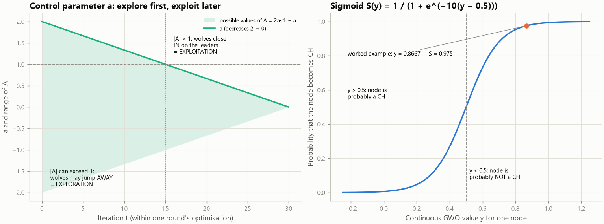

# 3. The mathematics, step by step (exactly as implemented)

Every important equation below is presented in six parts:

1. **Equation**
2. **Variables** — what every symbol means
3. **What it calculates**
4. **Why it is needed**
5. **Simple numerical example**
6. **In the program** — the file and function that implement it

All numerical examples were computed with the project's own functions, and
`tests/test_docs_examples.py` re-computes them every time the tests run, so the numbers here cannot silently
disagree with the code.

Default values used in the examples: packet size k = 4000 bits, E_elec = 50 nJ/bit, ε_fs = 10 pJ/bit/m²,
ε_mp = 0.0013 pJ/bit/m⁴, E_DA = 5 nJ/bit, initial energy 0.5 J (all from `config.py`).
1 nJ = 10⁻⁹ J, 1 pJ = 10⁻¹² J, 1 mJ = 10⁻³ J.

Contents: [1 Distance](#1-distance) · [2 Radio model](#2-radio-energy-model) ·
[3 Round energy](#3-energy-of-one-round-for-a-member-and-for-a-cluster-head) ·
[4 Battery and death](#4-battery-update-and-node-death) · [5 Number of CHs](#5-how-many-cluster-heads) ·
[6 Eligibility](#6-ch-eligibility-rule) · [7 Fitness](#7-the-fitness-function) · [8 LEACH](#8-leach-threshold) ·
[9 GWO](#9-gwo-equations) · [10 ABC](#10-abc-equations) · [11 Hybrid](#11-hybrid-gwo-abc-rules-and-the-fair-budget) ·
[12 DEAI-PSO](#12-the-base-papers-deai-pso-equations) · [13 Metrics](#13-performance-metrics) ·
[14 Statistics](#14-comparing-algorithms-improvement-and-statistics)

---

## 1. Distance

1. **Equation:** d(i, j) = √((x_i − x_j)² + (y_i − y_j)²)
2. **Variables:** (x_i, y_i) and (x_j, y_j) are the positions of two nodes (or a node and the BS) in metres.
3. **What it calculates:** the straight-line distance between two points.
4. **Why it is needed:** the energy to send a packet depends on the distance, and clusters are formed by
   distance.
5. **Example:** node (10, 10) and BS (50, 50): √(40² + 40²) = √3200 = **56.57 m**.
6. **In the program:** computed once for all pairs when the network is created
   (`Network.__init__` in `models/network.py`: `distances` and `dist_to_bs`).

## 2. Radio energy model


1. **Equations (first-order radio model):**

```text
E_tx(k, d) = E_elec·k + ε_fs·k·d²      if d < d0      (free space)
E_tx(k, d) = E_elec·k + ε_mp·k·d⁴      if d ≥ d0      (multipath)
E_rx(k)    = E_elec·k
E_DA(k)    = E_DA·k                     (aggregating one k-bit packet)
d0         = √(ε_fs / ε_mp)
```

2. **Variables:** k = bits in the packet (4000); d = distance (m); E_elec = 50 nJ/bit, energy of the radio
   electronics; ε_fs = 10 pJ/bit/m² and ε_mp = 0.0013 pJ/bit/m⁴, amplifier energy for short and long distances;
   E_DA = 5 nJ/bit, energy to aggregate one packet; d0 = crossover distance.
3. **What it calculates:** the energy in joules for one send (TX), one receive (RX) or one aggregation.
4. **Why it is needed:** it is the "physics" of the simulation; every battery reduction comes from these
   formulas. The d² / d⁴ growth explains why long links (especially to a distant BS) are so expensive.
5. **Examples:**
   * d0 = √(10 × 10⁻¹² / 0.0013 × 10⁻¹²) = √7692.3 = **87.7 m**
   * send 4000 bits over 20 m (20 < 87.7, free space):
     4000 × 50 nJ + 4000 × 10 pJ × 20² = 0.2 mJ + 0.016 mJ = **0.216 mJ**
   * send 4000 bits over 100 m (100 ≥ 87.7, multipath):
     4000 × 50 nJ + 4000 × 0.0013 pJ × 100⁴ = 0.2 mJ + 0.52 mJ = **0.72 mJ**
   * send 4000 bits over 150 m: **2.833 mJ**; receive 4000 bits: **0.2 mJ**; aggregate one packet: **0.02 mJ**
6. **In the program:** `EnergyModel.tx_energy`, `rx_energy`, `aggregation_energy`, `d0` in
   `models/energy_model.py`; parameters in `EnergyConfig` (`config.py`).

## 3. Energy of one round for a member and for a cluster head

1. **Equations:**

```text
member i              :  E_i = E_tx(k, d_i,CH)
cluster head j        :  E_j = n_j·(E_rx(k) + E_DA(k))  +  E_DA(k)  +  E_tx(k, d_j,BS)
                              (receive and aggregate n_j member packets, aggregate its own reading, send 1 packet)
node without a CH /   :  E_i = E_tx(k, d_i,BS)
free node (base paper)
```

2. **Variables:** d_i,CH = distance from member i to its CH; n_j = number of members of CH j; d_j,BS = distance
   from CH j to the BS.
3. **What it calculates:** how much energy each kind of node spends in one round.
4. **Why it is needed:** it shows *why the CH choice matters*: CHs pay far more than members.
5. **Example:** a cluster of 1 CH + 19 members; members 20 m from the CH; CH 40 m from the BS.
   * member: E_tx(4000, 20 m) = **0.216 mJ**
   * CH: 19 × (0.2 + 0.02) mJ + 0.02 mJ + E_tx(4000, 40 m) = 4.18 + 0.02 + 0.264 = **4.464 mJ**
   * the CH spends **≈ 21×** more. With 0.5 J a node could be a member for about 2,315 rounds but a CH for only
     about 112 rounds — so the CH role must rotate and should go to nodes that can afford it.
6. **In the program:** `execute_round()` in `simulation/transmission.py` charges exactly these costs (members →
   CH, direct → BS, CH receive + aggregate, CH own aggregation, CH → BS); the fitness function predicts the same
   costs before the round (`FitnessContext._evaluate`, variable `e_round`).

## 4. Battery update and node death

1. **Equations:**

```text
if E_i ≥ cost:  E_i ← E_i − cost                 (the operation succeeds)
else:           E_i ← 0, the packet is lost       (the node spends what it has and fails)
end of round r: if E_i ≤ 0 → node i is DEAD, death_round_i = r
```

2. **Variables:** E_i = residual energy of node i; cost = energy of the operation (section 2/3); r = round number.
3. **What it calculates:** the new battery level and whether the node is still alive.
4. **Why it is needed:** node death is what lifetime metrics measure.
5. **Example:** a CH with 3 mJ left must receive 19 packets (0.22 mJ each = 4.18 mJ). It can afford
   ⌊3 / 0.22⌋ = 13 receptions; it then runs out of energy, its battery is set to 0, it cannot send to the BS,
   and the readings of its cluster in that round are lost. At the end of the round it is marked DEAD.
6. **In the program:** `spend()` and `execute_round()` in `simulation/transmission.py`; `Network.detect_dead()`
   in `models/network.py`. Dead nodes are excluded from every later round (tested in
   `test_dead_nodes_never_participate`).

## 5. How many cluster heads

1. **Equations:**

```text
K_opt = max(1, ⌊p·m + 0.5⌋)                    (round p·m to the nearest whole number)
K_min = max(1, ⌊K_opt·(1 − tol)⌋)
K_max = max(K_min, ⌈K_opt·(1 + tol)⌉)
```

2. **Variables:** m = number of alive nodes that can be clustered; p = target CH fraction (`ch_percentage`,
   0.05); tol = `count_tolerance` (0.5).
3. **What it calculates:** the target number of CHs and the allowed range.
4. **Why it is needed:** too few CHs → long member links; too many → many expensive CH → BS links. The range gives
   the optimisers some freedom.
5. **Example:** m = 100, p = 0.05: K_opt = ⌊5.5⌋ = **5**, K_min = ⌊2.5⌋ = **2**, K_max = ⌈7.5⌉ = **8**.
   When 60 nodes are alive: K_opt = 3, K_min = 1, K_max = 5. Base-paper scenarios (p = 0.10, 100 nodes): 10, 5, 15.
6. **In the program:** `ch_count_bounds()` in `algorithms/fitness.py`. The optimisers' K_max is additionally
   limited by the number of eligible nodes (section 6). LEACH does not use K_min/K_max (its count is random).

## 6. CH eligibility rule

1. **Equation:** node i may be a CH (for the optimisers) if E_i ≥ θ · mean(E_alive)
2. **Variables:** E_i = residual energy of node i; mean(E_alive) = average residual energy of the alive nodes;
   θ = `ch_energy_threshold` (1.0; 0 switches the rule off).
3. **What it calculates:** the set of nodes allowed to be CHs in this round.
4. **Why it is needed:** without it the optimisers kept re-electing the same nodes near the BS, which died very
   early. It is the same rule as LEACH-C and applies equally to GWO, ABC, the hybrid and DEAI-PSO.
5. **Example:** energies [0.48, 0.50, 0.21, 0.47, 0.49, 0.46, 0.30, 0.44, 0.50, 0.45] J → mean 0.43 J → nodes 2
   (0.21 J) and 6 (0.30 J) are **not** eligible; all others are (see figure below).
6. **In the program:** `FitnessContext.eligible` and `repair()` in `algorithms/fitness.py`.


**Cluster formation rule** (used by every algorithm): every alive non-CH node i joins the CH j with the smallest
d(i, j) — `form_clusters()` in `simulation/clustering.py`. If a round has no CH (possible in LEACH), every alive
node sends directly to the BS.

---

## 7. The fitness function


### 7.0 The whole formula

```text
F(x) = w1·EnergyCost + w2·IntraDist + w3·CH_BS + w4·Imbalance + w5·CountPenalty  +  10·[x is infeasible]

with  w1 = 0.30, w2 = 0.25, w3 = 0.20, w4 = 0.15, w5 = 0.10      (lower F = better CH set)
```

* x is a candidate CH set (0/1 per alive node). Each of the five terms is scaled to the range 0…1, so the weights
  say how important each term is. The weights add up to 1.
* **Infeasible** means: no CH at all, a CH count outside [K_min, K_max], or a CH that cannot afford its predicted
  work in this round (it would die mid-round and lose its cluster's data). The +10 makes such sets much worse than
  any feasible set (feasible sets score below 1).
* In the program: `FitnessContext._evaluate()` in `algorithms/fitness.py` (vectorised: it scores many candidate
  sets at once). The **same** function and weights score the CH sets of every algorithm (LEACH, Random and
  DEAI-PSO too) for the "final fitness" metric.

### 7.1 Energy term (weight 0.30)

1. **Equation:**

```text
EnergyCost = 0.5·(1 − mean(E_CH) / E_max)  +  0.5·min(1, E_round / E_upper)

E_round = Σ_members E_tx(k, d_i,CH) + Σ_CHs [ n_j·(E_rx + E_DA) + E_DA + E_tx(k, d_j,BS) ]
E_upper = m·(E_tx(k, d_far) + E_rx + E_DA),   d_far = max(largest node–node distance, largest node–BS distance)
```

2. **Variables:** mean(E_CH) = average residual energy of the chosen CHs; E_max = highest residual energy among
   alive nodes; E_round = predicted radio energy of the whole round with this clustering (section 3); E_upper = an
   upper bound (every node sending over the longest possible distance), used only to scale E_round into 0…1.
3. **What it calculates:** a mix of "are the CHs rich in energy?" (first half) and "is this round cheap?" (second
   half).
4. **Why it is needed:** CHs with little energy die quickly, and a cheaper round leaves more energy for later
   rounds. This is the most important term (highest weight).
5. **Example:** see 7.7 (choice A: E_round = 2.344 mJ, E_upper = 7.632 mJ → EnergyCost = 0.1536).
6. **In the program:** variables `e_round`, `e_ch`, `energy` in `_evaluate`.

### 7.2 Member → CH distance term (weight 0.25)

1. **Equation:** IntraDist = (mean distance from each member to its CH) / d_norm
2. **Variables:** d_norm = largest distance between any two alive nodes.
3. **What it calculates:** how compact the clusters are (0 = members sit on their CH).
4. **Why it is needed:** members send every round; short member links save energy for most of the network (d²).
5. **Example:** choice A in 7.7: mean of (10, 14.14, 10, 14.14) m = 12.07 m; 12.07 / 113.14 = **0.1067**.
6. **In the program:** variable `intra` in `_evaluate`.

### 7.3 CH → BS distance term (weight 0.20)

1. **Equation:** CH_BS = (mean distance from the CHs to the BS) / bs_norm
2. **Variables:** bs_norm = largest distance from an alive node to the BS.
3. **What it calculates:** how far the CHs are from the BS (0 = at the BS).
4. **Why it is needed:** the CH → BS hop is the longest and most expensive link (it can reach the d⁴ region).
5. **Example:** choice A: both CHs are 50 m from the BS, bs_norm = 56.57 m → 50 / 56.57 = **0.8839**.
6. **In the program:** variable `chbs` in `_evaluate`.

### 7.4 Cluster imbalance term (weight 0.15)

1. **Equation:** Imbalance = min(1, std(cluster sizes) / mean(cluster sizes)) (the coefficient of variation)
2. **Variables:** cluster size = members + the CH; mean size = m / K.
3. **What it calculates:** how unequal the clusters are (0 = all the same size).
4. **Why it is needed:** a CH with a huge cluster receives many packets and dies early; balanced clusters spread
   the load.
5. **Example:** sizes (3, 3) → 0; sizes (2, 4): mean 3, std 1 → **0.333**.
6. **In the program:** variables `sizes`, `imbalance` in `_evaluate`.

### 7.5 CH count term (weight 0.10)

1. **Equation:** CountPenalty = min(1, |K − K_opt| / K_opt)
2. **Variables:** K = number of CHs in x; K_opt from section 5.
3. **What it calculates:** how far the number of CHs is from the target.
4. **Why it is needed:** keeps the CH count near the theoretical optimum while still allowing small deviations.
5. **Example:** K_opt = 5: K = 5 → 0; K = 6 → 0.2; K = 8 → 0.6.
6. **In the program:** variable `count` in `_evaluate`.

### 7.6 Feasibility penalty

1. **Equation:** + 10 if (K = 0) or (K < K_min) or (K > K_max) or (some CH has E_CH < its predicted load)
2. **Variables:** the predicted load of a CH is n_j·(E_rx + E_DA) + E_DA + E_tx(k, d_j,BS) (section 3).
3. **What it calculates:** whether the CH set is allowed at all.
4. **Why it is needed:** guarantees that the optimisers never return an impossible CH set.
5. **Example:** in the 6-node example below, "no CH" scores 10.40 and "4 CHs" (K_max = 3) scores 10.40.
6. **In the program:** variables `starving`, `invalid` in `_evaluate`; `invalid_penalty` in `config.py`.

### 7.7 Complete worked example (6 nodes, the figure above)

Six nodes with 0.5 J each, BS at (50, 50): N0 (10, 10), N1 (20, 10), N2 (10, 20) in the bottom-left corner and
N3 (90, 90), N4 (80, 90), N5 (90, 80) in the top-right corner. With p = 0.3: K_opt = 2, K_min = 1, K_max = 3.
Scales: d_norm = 113.14 m (N0–N3), bs_norm = 56.57 m, E_upper = 6 × (1.0520 + 0.2 + 0.02) mJ = 7.632 mJ.

| Term | Choice A: CHs = N1, N4 (one per corner) | Choice B: CHs = N0, N1 (both bottom-left) |
|---|---|---|
| Members join | N0, N2 → N1; N3, N5 → N4 | N2 → N0; N3, N4, N5 → N1 (≈ 100 m links!) |
| E_round | 0.824 (members) + 1.520 (CHs) = 2.344 mJ | 2.487 + 1.548 = 4.035 mJ |
| EnergyCost | 0.5·(1 − 0.5/0.5) + 0.5·(2.344/7.632) = **0.1536** | 0.5·0 + 0.5·(4.035/7.632) = **0.2644** |
| IntraDist | 12.07 / 113.14 = **0.1067** | 78.82 / 113.14 = **0.6967** |
| CH_BS | 50.00 / 56.57 = **0.8839** | 53.28 / 56.57 = **0.9419** |
| Imbalance | sizes (3, 3) → **0** | sizes (2, 4) → **0.3333** |
| CountPenalty | K = 2 = K_opt → **0** | **0** |
| **F** | 0.30·0.1536 + 0.25·0.1067 + 0.20·0.8839 = **0.2495** | 0.0793 + 0.1742 + 0.1884 + 0.0500 = **0.4919** |

Choice A is clearly better (lower F), which matches intuition: one CH per group, short member links, equal
clusters. An optimiser that compares these two numbers will keep A and discard B.

### 7.8 Why these five factors (justification)

| Factor | What goes wrong without it | Evidence in this project |
|---|---|---|
| Energy (CH residual + round cost) | low-energy nodes become CHs and die early; expensive rounds | ablation "Hybrid w/o energy": FND −1.0 %, LND far more variable |
| Member → CH distance | long member links waste energy (d², d⁴) | S1: hybrid member links 22.56 m vs 27.07 m for LEACH (17 % shorter) |
| CH → BS distance | CHs far from the BS pay d⁴ costs | the optimisers' FND gain over LEACH is largest when the BS is outside the field (S5: +37 %) |
| Cluster balance | some CHs overloaded | hybrid's clusters are 15–25 % more balanced than GWO's |
| CH count | too few/many CHs | keeps the count near K_opt (sensitivity: CH % strongly affects lifetime) |

The weights (0.30/0.25/0.20/0.15/0.10) are a reasonable, documented starting point, **not** proven optimal; the
sensitivity analysis tests five weight presets and reports their effect (`results/sensitivity/report.md`).

---

## 8. LEACH threshold

1. **Equation:**

```text
T(n) = p / (1 − p·(r mod 1/p))     if node n is in G
T(n) = 0                            otherwise
node n becomes CH if a random number u ~ U(0, 1) is below T(n)
```

2. **Variables:** p = desired CH fraction (0.05); r = round; 1/p = epoch length (20 rounds); G = nodes that have
   not been CH in the current epoch.
3. **What it calculates:** the probability that an eligible node elects itself CH in this round.
4. **Why it is needed:** it rotates the CH role so that, on average, every node is CH once per epoch.
5. **Example (p = 0.05):** round 1 → 0.05; round 10 → 0.05 / (1 − 0.45) = 0.0909; round 19 → 0.5; round 20 →
   **1.0** (every node that has not served yet must serve); round 21 → 0.05 again (new epoch).
6. **In the program:** `LEACH.threshold()` and `select()` in `algorithms/leach.py` (rounds are counted from 1, so
   the code uses (r − 1) mod 20). See `docs/figures/fig12_leach_threshold.png`.

---

## 9. GWO equations



1. **Equations (for every wolf X, every node j, and each leader L ∈ {α, β, δ}):**

```text
a(t) = 2 − 2·t / T                         (t = 0 … T−1, T = 30 iterations)
A = 2·a·r1 − a,     C = 2·r2                r1, r2 random numbers in [0, 1]
D_L = | C·L_j − X_j |
X_L = L_j − A·D_L
y_j = (X_α + X_β + X_δ) / 3                 (continuous new value)
S(y_j) = 1 / (1 + e^(−10·(y_j − 0.5)))      (sigmoid: probability that node j is CH)
new bit x_j = 1 if a random number u < S(y_j), else 0;   then repair (section 5/6)
```

2. **Variables:** X_j = 0/1 value of node j in this wolf; L_j = value of node j in leader L; a = control
   parameter (2 → 0); A = step factor (|A| > 1 pushes away = exploration, |A| < 1 pulls in = exploitation);
   C = random emphasis on the leader; D_L = distance to the leader; X_L = the position suggested by leader L.
3. **What it calculates:** the new candidate CH set of each wolf, guided by the three best sets.
4. **Why it is needed:** this is how GWO moves the population towards good CH sets while still exploring.
5. **Example (one node j, iteration t = 5 of 30 → a = 1.6667):** the wolf has X_j = 0 (not CH); α and β have
   node j as CH (L_j = 1), δ does not (L_j = 0). With r1 = 0.8 / 0.3 / 0.6 and r2 = 0.3 / 0.9 / 0.5:
   * α: A = 2·1.6667·0.8 − 1.6667 = 1.0; C = 0.6; D = |0.6·1 − 0| = 0.6; X_α = 1 − 1.0·0.6 = **0.4**
   * β: A = −0.6667; C = 1.8; D = 1.8; X_β = 1 − (−0.6667)·1.8 = **2.2**
   * δ: A = 0.3333; C = 1.0; D = |1.0·0 − 0| = 0; X_δ = 0 − 0.3333·0 = **0**
   * y_j = (0.4 + 2.2 + 0) / 3 = **0.8667** → S(0.8667) = **0.975**: node j becomes CH with 97.5 % probability
     (two of the three leaders "vote" for it).
6. **In the program:** `control_parameter()`, `WolfPack.step()`, `sigmoid_transfer()` in `algorithms/gwo.py`.
   The leaders are the three best **different** CH sets found so far (`distinct_best`, `update_leaders`).

## 10. ABC equations

1. **Equations:**

```text
neighbour (discrete version of  v_ij = x_ij + φ_ij·(x_ij − x_kj),  φ ∈ [−1, 1]):
    φ ≥ 0 and x_i ≠ x_k : swap one CH of x_i that x_k does not use for one CH of x_k that x_i does not use
    otherwise           : move one CH of x_i to one of its nearest eligible non-CH neighbours
    with probability 0.1: add or remove one CH (inside [K_min, K_max])
greedy selection: keep v_i if F(v_i) < F(x_i), else keep x_i and trial_i ← trial_i + 1
onlooker probability:  fit_i = 1 / (1 + F_i),   p_i = fit_i / Σ_s fit_s
scout: if max(trial) > limit (10) → replace that source with a random valid CH set
```

2. **Variables:** x_i = food source i (a CH set); x_k = a random partner source; F_i = fitness of source i;
   trial_i = consecutive failed improvement attempts; limit = 10.
3. **What it calculates:** new candidate CH sets near existing ones, and how often each source is visited.
4. **Why it is needed:** employed and onlooker bees refine good sources (exploitation); scouts restart stuck ones
   (exploration).
5. **Example (probabilities):** three sources with F = 0.20, 0.25, 0.40 → fit = 0.8333, 0.8000, 0.7143 → sum
   2.3476 → p = **0.355, 0.341, 0.304**: the best source gets the most onlooker visits, but worse sources still get
   some (diversity).
6. **In the program:** `BeeColony.neighbours`, `employed_phase`, `onlooker_phase`, `selection_probabilities`,
   `scout_phase` in `algorithms/abc.py`. Neighbour examples are drawn in `docs/figures/fig07_abc_cycle.png`.

## 11. Hybrid GWO-ABC rules and the fair budget

1. **Rules (every iteration, see [04_ALGORITHMS.md](04_ALGORITHMS.md#5-the-proposed-hybrid-gwo-abc)):**

```text
transfer  (GWO → ABC): for L in (α, β, δ): if L is not already a food source and F(L) < F(worst source):
                                              worst source ← L, its trial ← 0
feedback  (ABC → GWO): if F(ABC best) < F(δ) and ABC best is not already a leader:
                                              worst wolf ← ABC best, leaders updated (it becomes α, β or δ)
elite:                 best ← the better of (best so far, α, ABC best)
```

```text
evaluations per iteration = wolves + employed + onlookers (+1 if a scout fires)
GWO alone:   20                            = 20
ABC alone:   10 employed + 10 onlookers   = 20  (+1)
Hybrid:      10 wolves + 5 + 5             = 20  (+1)
```

2. **Variables:** F = fitness; wolves = round(20 × 0.5) = 10; food sources = round(20 × 0.5) / 2 = 5
   (`hybrid.budget_share` = 0.5).
3. **What it calculates:** when solutions move between the two populations and how much work each algorithm
   does.
4. **Why it is needed:** the exchange is what makes it a genuine hybrid; the equal budget is what makes the
   comparison fair (the hybrid does not win just by doing more work).
5. **Example:** per round (30 iterations + start): GWO 20 + 30×20 = **620** evaluations; ABC 10 + 30×20 = 610
   (+ scouts); Hybrid 15 + 30×20 = 615 (+ scouts). Measured: GWO 620, ABC 615–622, Hybrid 618–625 per round.
6. **In the program:** `HybridGWOABC.optimize()` and `from_config()` in `algorithms/hybrid_gwo_abc.py`;
   `BeeColony.inject()` (transfer) and `WolfPack.absorb()` (feedback). Tests:
   `test_hybrid_exchanges_information`, `test_hybrid_feedback_reaches_gwo`, `test_hybrid_budget_matches_standalone`.

## 12. The base paper's DEAI-PSO equations

Haris & Nam, *IEEE Access* 13 (2025) — re-implemented to compare with the "existing system".

1. **Equations:**

```text
V_i ← ω_i·V_i + c_p·r1·(Pbest_i − X_i) + c_g·r2·(Gbest − X_i)            (Eq. 8)
X_i ← X_i + V_i                                                           (Eq. 9)
c_p = (c_pf − c_pi)·k/T + c_pi,   c_g = (c_gf − c_gi)·k/T + c_gi          (Eqs. 10–11, time-varying)
ω_i = exp(−exp(−d(X_i, Pbest_i)·(T − k)))                                 (Eq. 13, DEAI inertia)
F_t = a·Σ_i E_t(N_i) + (1 − a)·n·√( 1/(n−1)·Σ_i (R_t(N_i) − mean R_t)² )  (Eq. 12, minimised)
```

2. **Variables:** X_i = particle i = coordinates of K CHs (each coordinate is turned into the nearest eligible
   node not used yet); V_i = velocity; Pbest_i / Gbest = best position of the particle / of the swarm; k =
   iteration, T = iterations; c_p from 2.5 to 0.5, c_g from 0.5 to 2.5; d = distance between the particle and its
   personal best; E_t(N_i) = predicted energy node i spends this round; R_t(N_i) = its residual energy after the
   round; n = alive nodes; a = weight of the energy part (0.8, tuned in the base paper's favour).
3. **What it calculates:** how the particles move, and the base paper's score of a CH set (total round energy plus
   the spread of residual energy).
4. **Why it is needed:** to compare against the base paper fairly we must run its method in our simulator under
   identical conditions.
5. **Examples:** ω with d = 0.1, k = 0, T = 17: exp(−exp(−1.7)) = **0.833**; at k = 16: **0.405**; a particle
   sitting on its personal best (d = 0): exp(−1) = **0.368**.
   Eq. 12 with three nodes spending 1, 2 and 5 mJ (R = 0.499, 0.498, 0.495 J), a = 0.8:
   0.8 × 0.008 + 0.2 × 3 × 0.002082 = **0.007649**.
6. **In the program:** `algorithms/deai_pso.py` (`DEAIPSO.optimize`, `decode`, `deai_inertia`, `tvac`,
   `PaperFitness`). Eq. 12 is checked against a hand calculation in `tests/test_base_paper.py`. The paper used
   36 particles and 5000 iterations in MATLAB R2023a; here every optimiser gets the same evaluation budget per
   round (36 particles × 18 = 648 evaluations ≈ 620).

---

## 13. Performance metrics


| Metric | Equation | Example |
|---|---|---|
| FND | min over nodes of death_round | death rounds 120, 150, 150, 200 → **120** |
| HND | the ⌈N/2⌉-th smallest death round | N = 4 → 2nd smallest → **150** |
| LND | max over nodes of death_round (all must be dead) | **200** |
| Node-rounds | Σ_rounds (alive nodes) | alive 4, 4, 3, 1 → **12** |
| Residual energy | Σ_i E_i after the checkpoint round (500) | S1 Hybrid: **28.10 J** of 50 J |
| Energy consumption | N·E0 − residual energy (checkpoint) | 50 − 28.10 = **21.90 J** |
| Throughput | Σ_rounds readings that reached the BS | S1 Hybrid: **113,662** |
| PDR | delivered readings / generated readings | 990 of 1000 → **0.99** |
| Avg. cluster distance | mean over rounds 1–500 of the mean member → CH distance | S1 Hybrid: **22.56 m** |
| Cluster imbalance | mean over rounds 1–500 of std/mean of cluster sizes | S1 Hybrid: **0.148** |
| Final fitness | mean over rounds 1–500 of F(CH set used) | S1 Hybrid: **0.2387** |

* **What they calculate / why:** lifetime (FND/HND/LND/node-rounds), energy efficiency (residual/consumed),
  usefulness (throughput) and reliability (PDR) — see [02_CONCEPTS.md](02_CONCEPTS.md#f-performance-metrics).
* If a node never dies within the simulated rounds, its FND/HND/LND is set to the last simulated round and marked
  "≥" (a lower bound) — this happens only in a few sensitivity settings (1.0 J initial energy).
* **In the program:** `lifetime_rounds()` and `summarize()` in `evaluation/metrics.py` (definitions in `METRICS`);
  the per-round values come from `Simulator.step()`.

---

## 14. Comparing algorithms: improvement and statistics

### 14.1 Improvement percentage

1. **Equation:** higher-is-better: (P − B) / B × 100; lower-is-better: (B − P) / B × 100
2. **Variables:** P = mean of the proposed method, B = mean of the baseline.
3. **What it calculates:** how much better the proposed method is; **positive always means better**.
4. **Why it is needed:** a common, direction-aware way to report differences.
5. **Example:** S1 FND: Hybrid 1,127.65 vs LEACH 891.50 → (1,127.65 − 891.50) / 891.50 × 100 = **+26.49 %**.
   Energy consumption (lower is better): 21.90 J vs 22.60 J → (22.60 − 21.90) / 22.60 × 100 = **+3.1 %**.
6. **In the program:** `improvement()` in `evaluation/statistics.py`.

### 14.2 Mean ± standard deviation

* **Equation:** mean = Σ v_r / n; std = √(Σ (v_r − mean)² / (n − 1)) over the n runs.
* **Example:** FND of LEACH in S1: 891.5 ± 28 rounds means the 20 runs vary by about 28 rounds around 891.5.
* **In the program:** `describe()` in `evaluation/statistics.py`.

### 14.3 Wilcoxon signed-rank test (paired)

1. **Idea:** for each of the n paired runs compute the difference d_r = P_r − B_r, rank the |d_r|, and compare the
   sum of ranks of positive and negative differences. If the proposed method were not really different, positive
   and negative differences would be mixed; if almost all are on one side, the p-value is small.
2. **Variables:** p-value = probability of seeing such a one-sided pattern by luck alone.
3. **What it calculates:** whether a difference is statistically real.
4. **Why it is needed:** to avoid claiming improvements that are only noise. It does not assume normal
   distributions and uses the pairing (same networks).
5. **Example:** if the proposed method wins on all 20 networks, p ≈ 0.00001 (real). With only 5 runs the smallest
   possible p is 0.0625 — 5 runs can never prove a difference at the 0.05 level.
6. **In the program:** `paired_test()` (SciPy `wilcoxon`, two-sided, `zero_method="zsplit"`) in
   `evaluation/statistics.py`.

### 14.4 Holm correction

1. **Equation:** sort the m p-values p(1) ≤ … ≤ p(m); adjusted p(i) = max over j ≤ i of min(1, (m − j + 1)·p(j)).
2. **Why it is needed:** with many comparisons, some would look significant by luck; Holm makes the test stricter.
3. **Example:** p = 0.01, 0.04, 0.03 → sorted 0.01, 0.03, 0.04 → 0.03, 0.06, 0.06. Only the first stays below 0.05.
4. **In the program:** `holm()` in `evaluation/statistics.py` (over the baselines of each metric; over all scenarios
   × metrics in the base-paper report). "Significant" = Holm-adjusted p < 0.05.

### 14.5 Cliff's δ (effect size)

1. **Equation:** δ = P(a > b) − P(a < b) over all pairs of values (a from the proposed method, b from the baseline).
2. **What it calculates:** how large and consistent the difference is, from −1 to +1 (oriented so that positive
   favours the proposed method). |δ| < 0.147 negligible, < 0.33 small, < 0.474 medium, otherwise large.
3. **Example:** a = (3, 4), b = (1, 3): pairs (3,1) +, (3,3) 0, (4,1) +, (4,3) + → δ = (3 − 0) / 4 = **0.75**.
4. **In the program:** `cliffs_delta()`, `effect_magnitude()` in `evaluation/statistics.py`.

A difference is reported as an **improvement** only if it is significant after Holm correction; differences below
1 % are additionally flagged as *practically negligible*.
