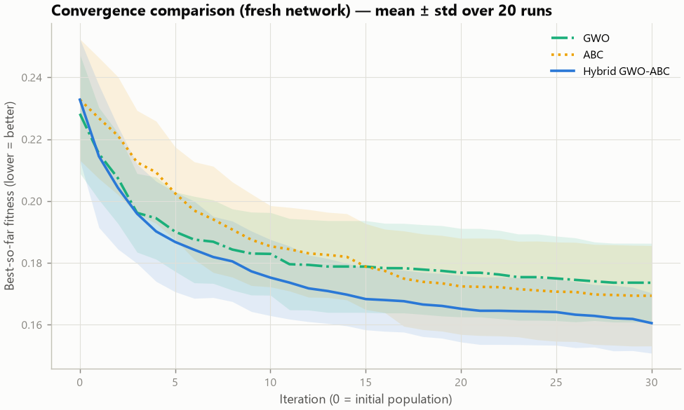
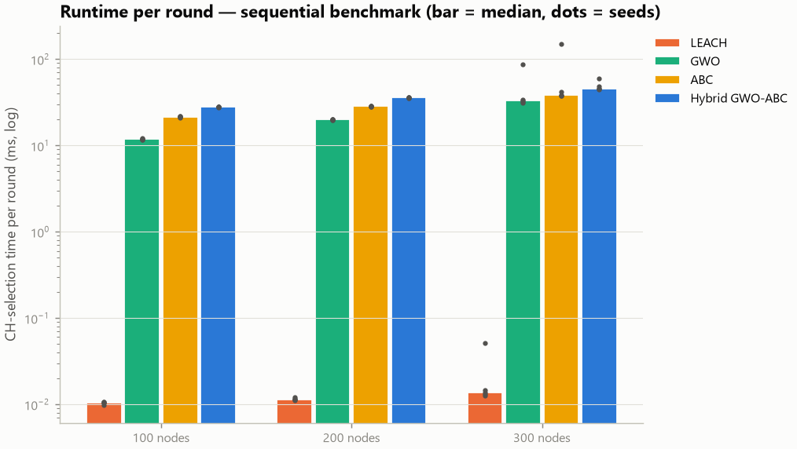
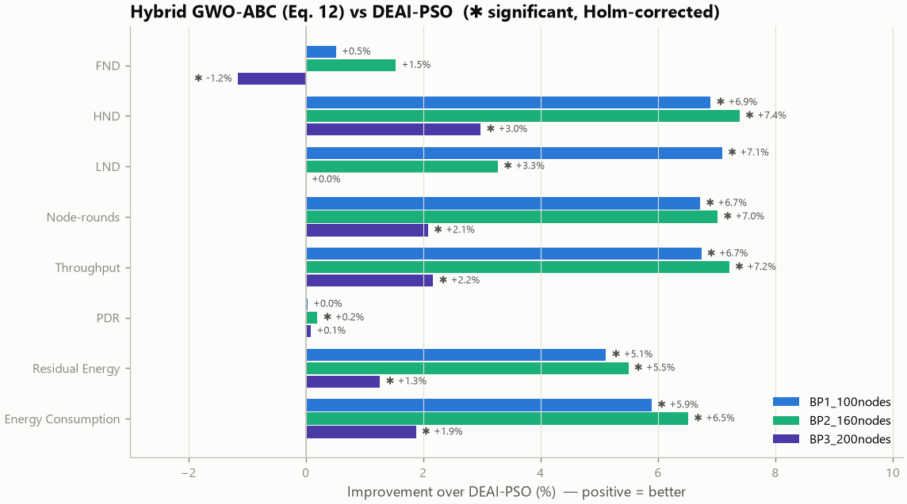
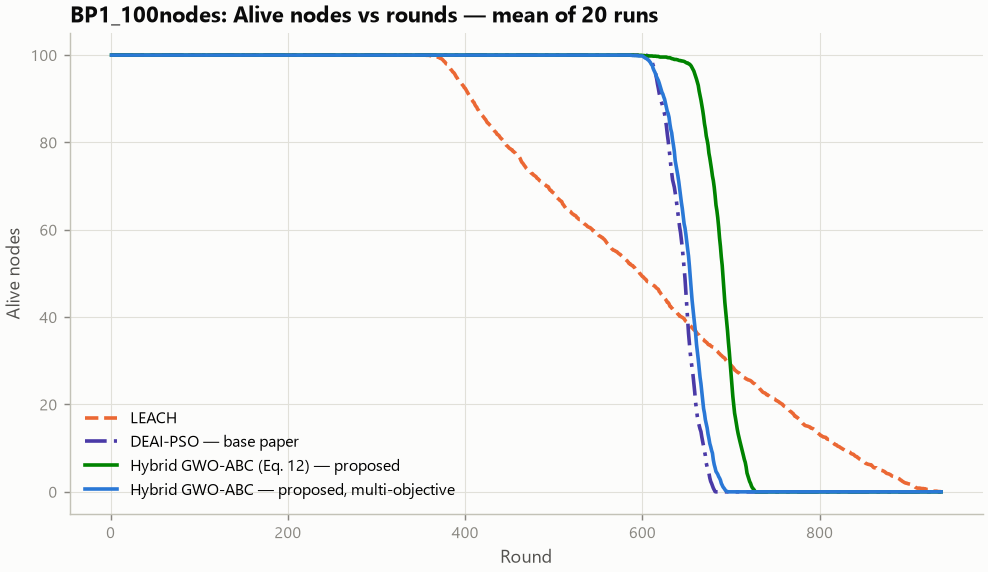

# 5. The results and how to explain every graph

Everything below was produced by the simulator and saved in `results/`. Nothing was typed in by hand: the
numbers come from `runs_raw.csv` / `report.md` of each experiment folder. For each important graph you get the same
seven answers: **What am I looking at? · X-axis · Y-axis · Which method performed better? · Why? · What does it mean
in a real WSN? · How do I explain it to my professor?**

Contents: [5.1 The main experiment](#51-the-main-experiment) · [5.2 Final result table](#52-final-result-table-scenario-s1) ·
[5.3 Is the difference real?](#53-is-the-difference-real-significance) · [5.4 Graphs](#54-the-graphs-one-by-one) ·
[5.5 Other scenarios](#55-other-scenarios-network-size-and-base-station-position) ·
[5.6 What happens when parameters change](#56-what-happens-when-parameters-change-sensitivity-analysis) ·
[5.7 Ablation](#57-which-part-of-the-hybrid-matters-ablation) · [5.8 Base paper](#58-improvement-over-the-base-paper) ·
[5.9 Conclusions](#59-conclusions-in-plain-words)

---

## 5.1 The main experiment

| Setting | Value |
|---|---|
| Scenario | **S1**: 100 nodes, 100 m × 100 m field, BS at the centre (50, 50) |
| Energy and traffic | 0.5 J per node, one 4000-bit reading per alive node per round, first-order radio model |
| Algorithms | Random, LEACH, GWO, ABC, **Hybrid GWO-ABC (proposed)** |
| Runs | 20 paired runs: run *r* of every algorithm uses the same network (seed 42 + *r*) |
| Length | until every node is dead (at most 2000 rounds) |
| Optimiser budget | 30 iterations, ≈ 620 fitness evaluations per round for GWO, ABC and the hybrid |
| Folder | `results/scenarios/S1_100nodes/` (report: `report.md`) |

Reproducibility check: the experiment was run again later with the Random baseline added; all 80 earlier runs
(LEACH, GWO, ABC, Hybrid × 20 networks) came out **bit-for-bit identical**, and run 0 of every algorithm re-simulated
from the saved settings is identical as well (`reproducibility_check_run0.csv`).

## 5.2 Final result table (scenario S1)

Mean ± standard deviation over 20 paired runs (`result_table.md`). ↑ = higher is better, ↓ = lower is better.

| Metric | Random | LEACH | GWO | ABC | **Hybrid GWO-ABC** |
|---|---:|---:|---:|---:|---:|
| FND (round) ↑ | 807 ± 31 | 892 ± 28 | 1,126 ± 7 | 1,125 ± 8 | **1,128 ± 7** |
| HND (round) ↑ | 1,125 ± 11 | 1,104 ± 8 | 1,138 ± 7 | 1,138 ± 6 | **1,138 ± 6** |
| LND (round) ↑ | **1,321 ± 27** | 1,287 ± 28 | 1,162 ± 11 | 1,162 ± 10 | 1,158 ± 13 |
| Residual energy at round 500 (J) ↑ | 27.75 | 27.40 | 28.11 | 28.11 | 28.10 |
| Energy consumed by round 500 (J) ↓ | 22.25 | 22.60 | 21.89 | 21.89 | 21.90 |
| Throughput (readings delivered) ↑ | 109,907 | 108,883 | 113,715 | 113,732 | 113,662 |
| PDR ↑ | 0.9898 | 0.9892 | 0.9985 | 0.9986 | 0.9982 |
| Avg. member → CH distance (m) ↓ | 25.05 | 27.07 | 22.50 | 22.47 | 22.56 |
| Cluster imbalance (CV) ↓ | 0.483 | 0.447 | 0.174 | 0.156 | **0.148** |
| Final fitness ↓ | 0.2904 | 1.3309 | 0.2416 | 0.2402 | **0.2387** |
| CH-selection time per round (ms, clean benchmark) ↓ | ≈ 0.4* | 0.01 | 11.9 | 21.5 | 27.8 |

\* Random's time is from the parallel runs; the others from the sequential benchmark (`results/runtime_benchmark/`).

**Reading the table in one breath:** the three optimisers keep *every* node alive much longer than Random and LEACH
(FND ≈ 1,126 vs 807/892), deliver ≈ 4 % more data, lose almost no packets and spend less energy; Random and LEACH
keep their *last* node alive longer (LND). Among the optimisers the hybrid has the best fitness and the most balanced
clusters, but its lifetime is statistically the same as GWO's and ABC's.

## 5.3 Is the difference real? (significance)

Improvement of the Hybrid GWO-ABC over each baseline in S1 (positive = hybrid better; `*` = significant after Holm
correction, paired Wilcoxon test, 20 runs; source: `improvement_vs_baselines.csv`):

| Metric | vs Random | vs LEACH | vs GWO | vs ABC |
|---|---:|---:|---:|---:|
| FND | **+39.75 %\*** | **+26.49 %\*** | +0.12 % | +0.20 % |
| HND | **+1.11 %\*** | **+3.02 %\*** | +0.01 % | −0.01 % |
| LND | −12.33 %\* | −9.99 %\* | −0.32 % | −0.35 % |
| Node-rounds | **+2.55 %\*** | **+3.45 %\*** | −0.02 % | −0.02 % |
| Residual energy (round 500) | **+1.27 %\*** | **+2.58 %\*** | −0.03 % | −0.04 %\* |
| Throughput | **+3.42 %\*** | **+4.39 %\*** | −0.05 % | −0.06 % |
| PDR | **+0.85 %\*** | **+0.91 %\*** | −0.03 % | −0.04 % |
| Member → CH distance | **+9.95 %\*** | **+16.66 %\*** | −0.28 % | −0.41 %\* |
| Cluster imbalance | **+69.31 %\*** | **+66.84 %\*** | **+14.71 %\*** | **+4.92 %\*** |
| Final fitness | **+17.80 %\*** | **+82.06 %\*** | **+1.19 %\*** | **+0.62 %\*** |

How to say it: *"Against Random and LEACH the hybrid is significantly better on FND, HND, energy, throughput and PDR
and worse only on LND. Against GWO and ABC, lifetime and energy differences are below 0.5 % and mostly not
significant — practically equal — while the hybrid's fitness and cluster balance are significantly better."*

---

## 5.4 The graphs, one by one

Graphs 1–14 are in `results/scenarios/S1_100nodes/`; network pictures show run 0 (seed 42). Curves are the mean of
the 20 runs.

### Graph 1 — Network topology (`01_topology.png`)

* **What am I looking at?** The field before the simulation starts: 100 sensor nodes (blue dots, numbered) placed at
  random and the base station (black square) in the middle.
* **X-axis / Y-axis:** position in metres (x and y coordinates of the 100 m × 100 m field).
* **Which method performed better?** None — this is the *same* starting network for every algorithm (fairness).
* **Why does it matter?** Every node is at most 62.9 m from the BS (mean 37.5 m), below d0 = 87.7 m, so in this
  scenario all transmissions are in the cheaper free-space (d²) regime.
* **In a real WSN:** sensors dropped randomly over a field (e.g. from a drone) around a gateway.
* **Explain to your professor:** *"This is the network of run 0, created from seed 42; all five algorithms start
  from exactly this network, so differences come only from the cluster-head selection."*

### Graph 2 — Sensor nodes and cluster heads (`02_ch_selection_Hybrid_GWO-ABC.png`)

* **What am I looking at?** The cluster heads (orange triangles) that the Hybrid GWO-ABC chose in round 1.
* **X / Y:** position in metres.
* **Better?** Compare with `02_ch_selection_LEACH.png` (4 CHs, mean CH–BS distance 45.5 m) and
  `02_ch_selection_Random.png`: the hybrid chose 5 CHs spread over the field, on average 20.0 m from the BS.
* **Why?** The fitness rewards CHs that are close to their members and to the BS and that split the field into
  similar parts; LEACH and Random choose without looking at positions.
* **In a real WSN:** well-spread CHs mean every sensor has a leader nearby.
* **Explain:** *"In round 1 the hybrid picked five CHs, roughly one per region, all with full energy; the choice
  changes every round as energies change."*

### Graph 3 — Cluster formation (`03_clusters_Hybrid_GWO-ABC.png` vs `03_clusters_LEACH.png`)

| Hybrid GWO-ABC | LEACH |
|---|---|
|  |  |

* **What am I looking at?** Which CH every node joined in round 1 (grey line = member → CH link).
* **X / Y:** position in metres.
* **Better?** The hybrid: 5 clusters of 18–22 nodes, member → CH links 24.1 m on average (longest 45.9 m). LEACH:
  4 clusters of 17–34 nodes, two CHs almost next to each other at the top and one at the right edge, so links are
  36.8 m on average and up to **91.2 m**.
* **Why?** LEACH elects CHs at random; the hybrid's fitness penalises long member links and unequal clusters.
* **In a real WSN:** long member links cost much more energy (d², d⁴), so LEACH's members drain faster.
* **Explain:** *"Same network, same round: the hybrid builds compact, equal clusters; LEACH's random CHs create
  very long links. Over rounds 1–500 the hybrid's average member link is 22.6 m vs 27.1 m for LEACH (17 % shorter)."*

### Graph 4 — Data communication (`04_communication_Hybrid_GWO-ABC.png`)

* **What am I looking at?** The data flow of round 1: members → CH (grey lines), CH → BS (orange arrows).
* **X / Y:** position in metres.
* **Better?** Illustration of the proposed method only.
* **Why it matters:** it is the two-hop path "sensor nodes → cluster heads → base station" that the energy model
  charges.
* **In a real WSN:** each CH sends one aggregated packet instead of ~20 separate ones.
* **Explain:** *"Each round, 95 short member transmissions and 5 CH transmissions replace 100 direct
  transmissions to the BS."*

### Graph 5 — Alive nodes vs rounds (`09_alive_vs_rounds.png`) — the most important graph

* **What am I looking at?** How many of the 100 nodes are still alive after each round (mean of 20 runs).
* **X-axis:** round number. **Y-axis:** number of alive nodes.
* **Better?** The three optimisers (overlapping blue/green/yellow lines) stay at 100 alive nodes until ≈ round 1,125;
  Random and LEACH start losing nodes around rounds 800–900. After ≈ round 1,140 the optimisers' nodes all die
  within a few rounds, while Random and LEACH keep a few nodes alive until ≈ 1,300.
* **Why?** The optimisers only use above-average-energy nodes as CHs and keep rounds cheap, so all batteries drain
  evenly and empty at almost the same time (LND − FND ≈ 31 rounds for the hybrid). Random and LEACH drain unevenly:
  unlucky nodes die early, lucky ones survive long (LND − FND ≈ 514 and 395 rounds).
* **In a real WSN:** with the optimisers the whole area stays fully monitored ≈ 26 % longer than with LEACH; with
  LEACH some parts of the area go dark much earlier, but a few sensors report a little longer at the end.
* **Explain:** *"The flat part is the stability period — full coverage. Our method extends it from about 892 rounds
  (LEACH) to 1,128 rounds. The price is a shorter tail: the last node dies at 1,158 instead of 1,287. For coverage
  applications the stability period matters most."*

### Graph 6 — Dead nodes vs rounds (`10_dead_vs_rounds.png`)

* **What am I looking at?** The mirror image of Graph 5: how many nodes have died by each round.
* **X:** round. **Y:** number of dead nodes.
* **Better?** A curve that stays at 0 longer is better for coverage: the optimisers (first death ≈ round 1,126);
  Random/LEACH start dying ≈ 300 rounds earlier.
* **Why / real WSN / explain:** as Graph 5. *"A steep rise means many nodes die close together — the sign of an
  even energy drain."*

### Graph 7 — Residual energy vs rounds (`11_residual_energy_vs_rounds.png`)

* **What am I looking at?** The total energy left in all nodes after each round (starts at 100 × 0.5 = 50 J).
* **X:** round. **Y:** total residual energy (J).
* **Better?** A higher line = cheaper operation. The lines are close (every algorithm uses the same radio model and
  traffic), but at round 500 the optimisers have 28.10–28.11 J left vs 27.75 J (Random) and 27.40 J (LEACH).
* **Why?** Shorter member links and a stable number of CHs (LEACH's CH count varies from round to round).
* **In a real WSN:** about 0.7 J more energy left after 500 rounds is what the whole network spends in ≈ 16 rounds
  (≈ 44 mJ per round).
* **Explain:** *"All algorithms pay mainly for the same basic traffic, so the lines are close; the optimisers'
  line is consistently above LEACH's, by 2.6 % at round 500 (significant)."*

### Graph 8 — Energy consumption vs rounds (`12_consumed_energy_vs_rounds.png`)

* **What am I looking at?** Cumulative energy spent (50 J − residual energy).
* **X:** round. **Y:** energy consumed (J).
* **Better?** Lower: by round 500 the hybrid used 21.90 J, LEACH 22.60 J, Random 22.25 J.
* **Why / real WSN / explain:** the same information as Graph 7, seen as cost. *"Lower line = less energy for the
  same work."*

### Graph 9 — Throughput vs rounds (`13_packets_delivered_vs_rounds.png`)

* **What am I looking at?** Total sensor readings that reached the BS up to each round.
* **X:** round. **Y:** readings delivered (cumulative).
* **Better?** The lines rise together while all nodes are alive (100 readings per round); after ≈ 900 rounds
  Random and LEACH flatten because their nodes start dying. Final totals: optimisers ≈ 113,700, Random 109,907,
  LEACH 108,883 (hybrid +4.4 % vs LEACH).
* **Why?** More rounds with all nodes alive, and almost no packets lost (PDR 0.998 vs 0.989).
* **In a real WSN:** about 4,800 more measurements reach the user.
* **Explain:** *"Throughput is the application's benefit: the longer the full network lives, the more data
  arrives."*

### Graph 10 — Network lifetime comparison (`18_lifetime_fnd_hnd_lnd.png`)

* **What am I looking at?** FND, HND and LND of every algorithm as bars (mean ± standard deviation over 20 runs).
* **X:** the three lifetime metrics. **Y:** round number.
* **Better?** FND: optimisers ≈ 1,126 ≫ LEACH 892 > Random 807. HND: optimisers 1,138 > Random 1,125 > LEACH
  1,104. LND: Random 1,321 > LEACH 1,287 > optimisers ≈ 1,160.
* **Why?** Even drain (optimisers) vs uneven drain (Random, LEACH) — see Graph 5. The small error bars of the
  optimisers show they behave consistently on every network.
* **In a real WSN:** choose the optimisers when the whole area must be covered; their advantage is largest at FND.
* **Explain:** *"The hybrid improves FND by 26.5 % over LEACH and 39.8 % over Random; HND is also better; LND is
  worse by 10–12 %. GWO, ABC and the hybrid are statistically equal here."*

### Graph 11 — Algorithm performance: optimiser quality (`20_final_fitness.png` and `results/convergence/conv_all_round0.png`)

* **What am I looking at?** Top: the mean fitness of the CH sets each algorithm actually used (rounds 1–500).
  Bottom: how fast GWO, ABC and the hybrid improve the fitness inside one round's optimisation (20 networks, same
  starting state, same number of evaluations).
* **X:** algorithm (top) / iteration 0–30 (bottom). **Y:** fitness — **lower is better**.
* **Better?** The hybrid: final fitness 0.2387 vs GWO 0.2416, ABC 0.2402, Random 0.2904, LEACH 1.3309. In the
  convergence test it ends at 0.1605 vs 0.1736 (GWO) and 0.1693 (ABC): 7.5 % and 5.2 % better (p < 0.01).
* **Why?** The two-way exchange: GWO's leaders give ABC good starting points, ABC's refinements become new GWO
  leaders, so the search keeps improving where GWO alone flattens (≈ iteration 15).
* **Why is LEACH's fitness so high?** LEACH does not use this objective; in 10.1 % of rounds 1–500 its random
  election produces a CH count outside the allowed range (0.5 % of rounds have no CH at all), which gets the
  infeasibility penalty.
* **In a real WSN:** a better fitness means CH sets that better match the design goals (energy, distance, balance).
* **Explain:** *"With exactly the same budget the hybrid is the best optimiser. That this does not give a longer
  lifetime than GWO/ABC in this scenario is an honest result: all three already find near-equivalent CH sets
  here."*

### Graph 12 — Where the energy goes (`19_energy_breakdown.png`)

* **What am I looking at?** Energy spent in rounds 1–500, split by radio activity.
* **X:** energy (J). **Y:** algorithm.
* **Better?** Shorter bar = less energy: optimisers 21.89–21.90 J, Random 22.25 J, LEACH 22.60 J. In every case about
  half is member → CH transmission and most of the rest is CH reception.
* **Why?** The optimisers save mainly on member → CH transmission (shorter links).
* **In a real WSN:** reception and short transmissions dominate when the BS is close; the CH → BS part grows when
  the BS is far away (see the base-paper scenarios).
* **Explain:** *"The saving comes from shorter member links, exactly the term the fitness function optimises."*

### Graph 13 — Cluster heads per round (`15_ch_count_vs_rounds.png`)

* **What am I looking at?** Number of CHs per round (20-round moving average, mean of 20 runs).
* **X:** round. **Y:** CHs per round.
* **Better?** Stability: Random always uses exactly 5 (5 % of alive nodes); the optimisers use 4.7–4.8 on average
  (they may choose 2–8); LEACH's count jumps from round to round (per-round standard deviation 2.20 vs ≈ 0.55).
* **Why?** LEACH's election is a random draw in every node.
* **In a real WSN:** rounds with too few CHs create long links; rounds with too many add expensive CH → BS packets.
* **Explain:** *"LEACH's random CH count is one reason why even Random selection with a fixed count beats it on HND
  and energy."*

### Graph 14 — Dead nodes on the map (`05_dead_nodes_Hybrid_GWO-ABC.png`)

* **What am I looking at?** The hybrid's network in run 0 at the round when half of the nodes were dead (1,146):
  red crosses = dead, light blue = alive (lighter = less energy), triangles = the remaining CHs.
* **X / Y:** position in metres.
* **Pattern:** dead nodes are on average closer to the BS (34.1 m) than alive ones (40.9 m) — most likely because
  nodes near the BS are chosen as CH more often (short CH → BS link) and therefore empty first.
* **In a real WSN:** the area around the gateway loses coverage first — a known "hot-spot" effect.
* **Explain:** *"Even with the energy rule, central nodes do slightly more CH work; that is why the nodes far from
  the BS survive longest."*

### Graph 15 — Computation time (`results/runtime_benchmark/runtime_benchmark.png`)

* **What am I looking at?** CH-selection time per round for 100, 200 and 300 nodes (median of 5 seeds, one process,
  no other load; dots = individual seeds). Logarithmic Y-axis.
* **Better?** Lower: LEACH ≈ 0.01 ms; GWO 11.9 / 19.9 / 33.4 ms; ABC 21.5 / 28.4 / 38.0 ms; Hybrid 27.8 / 35.9 /
  45.8 ms.
* **Why?** All optimisers evaluate ≈ 620 candidate sets per round; the hybrid runs two populations and more
  operators, so it is 1.2–2.3× slower than GWO/ABC.
* **In a real WSN:** below 50 ms per round at a mains-powered BS is negligible compared with a round's duration.
* **Explain:** *"The hybrid's better optimisation costs some extra computation, which is acceptable at the BS."*

### Graph 16 — Improvement over the base paper (`results/base_paper/fig_improvement_vs_base_paper.png`)

* **What am I looking at?** The improvement (%) of the proposed Hybrid GWO-ABC over the base paper's DEAI-PSO on the
  base paper's own three scenarios and objective; `*` marks significant differences.
* **X:** improvement % (positive = proposed better). **Y:** metric; colours = scenario.
* **Better?** The proposed method: HND +3.0 to +7.4 %, throughput +2.2 to +7.2 %, node-rounds +2.1 to +7.0 %, energy
  left at round 300 +1.3 to +5.5 % (all significant). FND: +0.5 % and +1.5 % (not significant) and −1.2 % in BP3
  (significant). LND +7.1 % and +3.3 % (significant), identical in BP3.
* **Why?** It uses fewer, better-placed CHs (≈ 5 instead of 10 in BP1), which nearly halves the expensive CH → BS
  transmissions to the distant BS; with the CH count fixed at 10 % it still wins, by ≈ 0.4 %.
* **In a real WSN:** more data and a longer half-network life from the same batteries.
* **Explain:** *"On the base paper's own problem and objective, only replacing its optimiser by ours improves 18 of
  24 measurements significantly; FND is the exception and I report it."*

*Alive nodes in the base paper's scenario 1 (BS outside the field at (200, 50)): the proposed method (green)
stays at 100 alive nodes longest and dies last among the centralised methods; DEAI-PSO (purple) dies ≈ 45 rounds
earlier; LEACH loses nodes from round ≈ 370 but keeps a long tail.*

---

## 5.5 Other scenarios (network size and base-station position)

Hybrid GWO-ABC vs LEACH (`results/scenarios/README.md`, 10 runs each except S1):

| Scenario | LEACH FND / HND / LND | Hybrid FND / HND / LND | Hybrid FND gain |
|---|---|---|---:|
| S1 100 nodes, BS centre | 892 / 1,104 / 1,287 | 1,128 / 1,138 / 1,158 | +26.5 %\* |
| S2 200 nodes, BS centre | 921 / 1,148 / 1,401 | 1,162 / 1,174 / 1,200 | +26.1 %\* |
| S3 300 nodes, BS centre | 940 / 1,164 / 1,440 | 1,173 / 1,187 / 1,236 | +24.9 %\* |
| S4 100 nodes, BS on the edge (50, 100) | 876 / 1,091 / 1,345 | 1,117 / 1,126 / 1,139 | +27.5 %\* |
| S5 100 nodes, BS outside (50, 175) | 703 / 895 / 1,218 | 963 / 978 / 989 | **+37.0 %\*** |

* The pattern of S1 holds everywhere: FND, HND, throughput, PDR and energy significantly better than LEACH; LND
  10–19 % worse.
* Against GWO and ABC, lifetime differences are at most 1.2 % in every scenario (mostly not significant, some
  slightly negative); the hybrid's fitness is better in all five scenarios (+0.6 % to +5.3 %).
* The farther the BS, the shorter all lifetimes and the larger the gain over LEACH (S5).

## 5.6 What happens when parameters change (sensitivity analysis)

One factor changed at a time, 5 paired runs per setting (`results/sensitivity/report.md`). Hybrid GWO-ABC (LEACH in
brackets), mean FND:

| Change | Result |
|---|---|
| Nodes 50 → 100 → 150 → 200 | FND 1,080 → 1,130 → 1,155 → 1,163 (LEACH 954 → 884 → 913 → 931): more nodes share the CH work |
| Initial energy 0.25 → 0.5 → 1.0 J | FND 563 → 1,130 → ≥ 2,000 (LEACH 417 → 884 → 1,829): lifetime ∝ energy |
| Field side 50 → 100 → 150 → 200 m (BS centre) | FND 1,180 → 1,130 → 1,055 → 589 (LEACH 918 → 884 → 822 → 493): bigger field, longer links |
| BS (50, 50) → (50, 100) → (50, 150) → (0, 0) | FND 1,130 → 1,118 → 1,050 → 1,105 (LEACH 884 → 873 → 813 → 868): farther BS, shorter life |
| CH percentage 3 → 5 → 8 → 10 % | FND 1,067 → 1,130 → 1,170 → 1,184: the default 5 % is not optimal for this network |
| GWO population 10–40, ABC colony 10–40, iterations 10–50 | FND 1,128–1,131: the optimiser budget is **not** the bottleneck; runtime grows with it |
| Fitness weights (5 presets) | energy-heavy best FND/HND (1,136 / 1,147), distance-heavy best LND (1,196), balance-heavy worst FND (1,115) |
| CH eligibility threshold 1.0 → 0.5 → 0 | FND 1,130 → 1,061 → 644 but LND 1,162 → 1,230 → 1,298: a trade-off |

## 5.7 Which part of the hybrid matters? (ablation)

`results/ablation/report.md` (S1 settings, 10 paired runs):

* **Co-evolution beats sequential combination:** the full hybrid's fitness (0.2439) is significantly better than
  GWO → ABC (0.2453) and ABC → GWO (0.2474); lifetime differences are not significant.
* **Energy term:** removing it lowers FND (−1.0 %), HND and throughput significantly and makes LND very variable.
* **Balance term:** removing it gives slightly better HND/energy (< 1 %) but much worse balance — balance costs a
  little energy.
* **Distance terms:** removing them changes lifetime only marginally; per-round optimisation is myopic.

## 5.8 Improvement over the base paper

Full justification: [`results/base_paper/README.md`](../results/base_paper/README.md) (generated from the data).

| Scenario | HND | LND | Node-rounds | Throughput | Energy left @300 | FND |
|---|---:|---:|---:|---:|---:|---:|
| BP1 (100 nodes) | +6.90 %\* | +7.09 %\* | +6.72 %\* | +6.74 %\* | +5.11 %\* | +0.51 % |
| BP2 (160 nodes) | +7.39 %\* | +3.27 %\* | +7.02 %\* | +7.22 %\* | +5.49 %\* | +1.53 % |
| BP3 (200 nodes) | +2.98 %\* | 0.00 % | +2.08 %\* | +2.17 %\* | +1.26 %\* | −1.16 %\* |

* **Fair:** same networks, radio model, packets (4000/200 bits), BS (200, 50), 10 % target, free nodes, evaluation
  budget; DEAI-PSO's open settings tuned in its favour on separate seeds; 20 held-out paired runs.
* **18 of 24** comparisons significantly better, **1** worse (FND in BP3), **5** not different.
* **Why:** fewer CHs per round (5.1 vs 10 in BP1) → CH → BS energy −44.5 %, member → CH energy +9.4 %, total −5.9 %
  by round 300. With the CH count fixed at 10 % the hybrid still wins (node-rounds +0.44 %, FND +0.77 %).
* **LND in BP3** is identical for every centralised method: the last survivors are the free nodes next to the BS,
  which send directly and do not depend on CH selection.
* **Runtime:** ×1.84 (100 nodes), ×1.05 (160), ×0.88 (200) of DEAI-PSO's time per round.
* **Published numbers** (LND up to 4,756 rounds) are physically impossible under the paper's own parameters
  (maximum 2,500 rounds), so they are listed for reference only.

## 5.9 Conclusions in plain words

1. **Optimised CH selection clearly beats conventional selection.** Compared with LEACH, the hybrid — like GWO
   and ABC — keeps all nodes alive 25–37 % longer (40 % longer than Random in S1), delivers more data, loses fewer
   packets and uses less energy. LEACH and Random keep the last node alive longer because they drain nodes unevenly.
2. **The hybrid is the best optimiser.** At equal cost it finds CH sets with a 4.7–7.5 % better fitness and more
   balanced clusters than GWO or ABC alone.
3. **Better optimisation ≠ longer life in every setting.** In the BS-centre scenarios, GWO, ABC and the hybrid give
   statistically the same lifetime.
4. **It improves the existing system.** On the base paper's own problem and objective, the hybrid beats DEAI-PSO
   in 18 of 24 tested measurements; FND is not improved.
5. **Everything is reproducible and checked:** same seeds → identical numbers; every claim passes a significance
   test; losses are reported as clearly as gains.
