# Base paper BP1_100nodes

Scenario 1: 100 nodes, 100 x 100 m, BS (200, 50), 10 % CHs — base paper Table 3 conditions; DEAI-PSO = existing system; Hybrid GWO-ABC (Eq. 12) = proposed optimiser on the base paper's own objective; GWO/ABC (Eq. 12) = its components on the same objective; Hybrid GWO-ABC = proposed optimiser with the project's multi-objective fitness.

All numbers below were produced by the simulator in this folder (20 independent paired runs per algorithm; run r uses deployment/algorithm seed 42 + r). Raw per-run results: `runs_raw.csv`; per-round histories: `history_raw.csv.gz`; statistics: `statistics.csv`; proposed-vs-baseline tests: `improvement_vs_baselines.csv`.

## Configuration

| Parameter | Value |
|---|---|
| Nodes | 100 |
| Area (m) | 100 x 100 |
| BS position | (200, 50) |
| Initial energy (J/node) | 0.5 |
| Packet size (bits) | 4000 |
| Control packet (bits) | 200 |
| Max rounds | 3000 |
| CH percentage p | 0.1 |
| CH count tolerance | K_opt x (1 ± 0.5) |
| CH eligibility (optimisers) | E ≥ 1.0 x mean alive energy |
| Optimisation iterations / round | 30 |
| GWO population | 20 |
| ABC colony size (food sources) | 20 (10) |
| ABC abandonment limit | 10 |
| Hybrid budget share / transfer / feedback | 0.5 / 3 / True |
| Fitness weights w1..w5 | 0.3, 0.25, 0.2, 0.15, 0.1 |
| Radio E_elec / E_fs / E_mp / E_DA | 5e-08 / 1e-11 / 1.3e-15 / 5e-09 |
| Checkpoint round (energy / averages) | 300 |
| Base seed | 42 |

## Final result table (mean ± std over runs)

| Metric | LEACH | DEAI-PSO | GWO (Eq. 12) | ABC (Eq. 12) | Hybrid GWO-ABC (Eq. 12) | Hybrid GWO-ABC |
|---|---:|---:|---:|---:|---:|---:|
| FND (rounds) | 374 ± 10 | 632 ± 16 | 635 ± 20 | 637 ± 20 | 636 ± 20 | 620 ± 17 |
| HND (rounds) | 595 ± 24 | 647 ± 17 | 691 ± 16 | 688 ± 16 | 691 ± 16 | 652 ± 18 |
| LND (rounds) | 915 ± 13 | 653 ± 18 | 699 ± 15 | 696 ± 16 | 700 ± 15 | 672 ± 15 |
| Residual Energy (J) | 23.362 ± 0.651 | 26.765 ± 0.598 | 28.119 ± 0.456 | 28.036 ± 0.456 | 28.134 ± 0.463 | 26.726 ± 0.642 |
| Energy Consumption (J) | 26.638 ± 0.651 | 23.235 ± 0.598 | 21.881 ± 0.456 | 21.964 ± 0.456 | 21.866 ± 0.463 | 23.274 ± 0.642 |
| Throughput (packets) | 59,914 ± 1,410 | 64,045 ± 1,710 | 68,299 ± 1,532 | 67,978 ± 1,525 | 68,360 ± 1,539 | 65,102 ± 1,692 |
| PDR (ratio) | 0.9910 ± 0.0013 | 0.9913 ± 0.0012 | 0.9914 ± 0.0019 | 0.9905 ± 0.0015 | 0.9915 ± 0.0018 | 0.9981 ± 0.0003 |
| Avg. Cluster Distance (m) | 18.087 ± 0.579 | 24.102 ± 1.524 | 27.536 ± 1.336 | 27.244 ± 1.377 | 27.482 ± 1.358 | 25.320 ± 1.517 |
| Avg. CH-BS Distance (m) | 153.941 ± 2.640 | 124.399 ± 2.627 | 127.472 ± 2.251 | 126.516 ± 2.409 | 127.608 ± 2.294 | 131.646 ± 2.853 |
| Runtime (s) | 0.05 ± 0.00 | 36.21 ± 2.04 | 43.11 ± 1.88 | 60.78 ± 4.39 | 84.10 ± 8.63 | 83.45 ± 8.23 |
| Final Fitness (-) | 0.9356 ± 0.1466 | 0.3255 ± 0.0049 | 0.3326 ± 0.0081 | 0.3363 ± 0.0077 | 0.3302 ± 0.0078 | 0.2993 ± 0.0061 |

Residual energy and energy consumption are measured at the checkpoint round 300; distance, imbalance and fitness averages cover rounds 1–300. '≥' marks lifetime values where at least one run had not reached the event within 3000 rounds (the horizon is then used as a lower bound).

## Descriptive statistics

**FND (rounds)**

| Algorithm | n | mean | std | min | max |
|---|---:|---:|---:|---:|---:|
| LEACH | 20 | 374 | 10 | 356 | 395 |
| DEAI-PSO | 20 | 632 | 16 | 603 | 663 |
| GWO (Eq. 12) | 20 | 635 | 20 | 589 | 673 |
| ABC (Eq. 12) | 20 | 637 | 20 | 591 | 672 |
| Hybrid GWO-ABC (Eq. 12) | 20 | 636 | 20 | 591 | 675 |
| Hybrid GWO-ABC | 20 | 620 | 17 | 587 | 646 |

**HND (rounds)**

| Algorithm | n | mean | std | min | max |
|---|---:|---:|---:|---:|---:|
| LEACH | 20 | 595 | 24 | 548 | 631 |
| DEAI-PSO | 20 | 647 | 17 | 615 | 677 |
| GWO (Eq. 12) | 20 | 691 | 16 | 663 | 721 |
| ABC (Eq. 12) | 20 | 688 | 16 | 660 | 718 |
| Hybrid GWO-ABC (Eq. 12) | 20 | 691 | 16 | 663 | 721 |
| Hybrid GWO-ABC | 20 | 652 | 18 | 616 | 681 |

**LND (rounds)**

| Algorithm | n | mean | std | min | max |
|---|---:|---:|---:|---:|---:|
| LEACH | 20 | 915 | 13 | 893 | 937 |
| DEAI-PSO | 20 | 653 | 18 | 620 | 683 |
| GWO (Eq. 12) | 20 | 699 | 15 | 671 | 728 |
| ABC (Eq. 12) | 20 | 696 | 16 | 668 | 725 |
| Hybrid GWO-ABC (Eq. 12) | 20 | 700 | 15 | 672 | 728 |
| Hybrid GWO-ABC | 20 | 672 | 15 | 643 | 697 |

**Residual Energy (J)**

| Algorithm | n | mean | std | min | max |
|---|---:|---:|---:|---:|---:|
| LEACH | 20 | 23.362 | 0.651 | 22.129 | 24.588 |
| DEAI-PSO | 20 | 26.765 | 0.598 | 25.631 | 27.781 |
| GWO (Eq. 12) | 20 | 28.119 | 0.456 | 27.262 | 28.995 |
| ABC (Eq. 12) | 20 | 28.036 | 0.456 | 27.198 | 28.903 |
| Hybrid GWO-ABC (Eq. 12) | 20 | 28.134 | 0.463 | 27.277 | 29.029 |
| Hybrid GWO-ABC | 20 | 26.726 | 0.642 | 25.356 | 27.752 |

**Energy Consumption (J)**

| Algorithm | n | mean | std | min | max |
|---|---:|---:|---:|---:|---:|
| LEACH | 20 | 26.638 | 0.651 | 25.412 | 27.871 |
| DEAI-PSO | 20 | 23.235 | 0.598 | 22.219 | 24.369 |
| GWO (Eq. 12) | 20 | 21.881 | 0.456 | 21.005 | 22.738 |
| ABC (Eq. 12) | 20 | 21.964 | 0.456 | 21.097 | 22.802 |
| Hybrid GWO-ABC (Eq. 12) | 20 | 21.866 | 0.463 | 20.971 | 22.723 |
| Hybrid GWO-ABC | 20 | 23.274 | 0.642 | 22.248 | 24.644 |

**Throughput (packets)**

| Algorithm | n | mean | std | min | max |
|---|---:|---:|---:|---:|---:|
| LEACH | 20 | 59,914 | 1,410 | 57,032 | 62,181 |
| DEAI-PSO | 20 | 64,045 | 1,710 | 60,858 | 66,995 |
| GWO (Eq. 12) | 20 | 68,299 | 1,532 | 65,451 | 71,331 |
| ABC (Eq. 12) | 20 | 67,978 | 1,525 | 65,236 | 70,864 |
| Hybrid GWO-ABC (Eq. 12) | 20 | 68,360 | 1,539 | 65,544 | 71,285 |
| Hybrid GWO-ABC | 20 | 65,102 | 1,692 | 61,712 | 68,007 |

**PDR (ratio)**

| Algorithm | n | mean | std | min | max |
|---|---:|---:|---:|---:|---:|
| LEACH | 20 | 0.9910 | 0.0013 | 0.9886 | 0.9930 |
| DEAI-PSO | 20 | 0.9913 | 0.0012 | 0.9885 | 0.9934 |
| GWO (Eq. 12) | 20 | 0.9914 | 0.0019 | 0.9882 | 0.9944 |
| ABC (Eq. 12) | 20 | 0.9905 | 0.0015 | 0.9874 | 0.9928 |
| Hybrid GWO-ABC (Eq. 12) | 20 | 0.9915 | 0.0018 | 0.9881 | 0.9944 |
| Hybrid GWO-ABC | 20 | 0.9981 | 0.0003 | 0.9974 | 0.9984 |

**Runtime (s)**

| Algorithm | n | mean | std | min | max |
|---|---:|---:|---:|---:|---:|
| LEACH | 20 | 0.05 | 0.00 | 0.04 | 0.05 |
| DEAI-PSO | 20 | 36.21 | 2.04 | 33.47 | 40.95 |
| GWO (Eq. 12) | 20 | 43.11 | 1.88 | 40.92 | 47.79 |
| ABC (Eq. 12) | 20 | 60.78 | 4.39 | 44.59 | 66.90 |
| Hybrid GWO-ABC (Eq. 12) | 20 | 84.10 | 8.63 | 51.67 | 91.63 |
| Hybrid GWO-ABC | 20 | 83.45 | 8.23 | 52.33 | 91.21 |

## Hybrid GWO-ABC (Eq. 12) vs baselines

Improvement % uses ((P − B) / B) × 100 for higher-is-better metrics and ((B − P) / B) × 100 for lower-is-better metrics, so a positive value always means the proposed algorithm did better. p-values: paired two-sided Wilcoxon signed-rank test, Holm-corrected over the baselines. Cliff's δ > 0 favours the proposed algorithm (|δ| < 0.147 negligible, < 0.33 small, < 0.474 medium, otherwise large).

| Metric | Baseline | Better | Improvement % | p (Holm) | Cliff's δ | Effect | Verdict |
|---|---|---|---:|---:|---:|---|---|
| FND | LEACH | higher | +70.09 | 0.000437 | +1.00 | large | proposed better |
| FND | DEAI-PSO | higher | +0.51 | 0.852 | +0.09 | negligible | no significant difference |
| FND | GWO (Eq. 12) | higher | +0.10 | 0.0276 | +0.04 | negligible | proposed better |
| FND | ABC (Eq. 12) | higher | -0.16 | 0.0131 | -0.08 | negligible | proposed worse |
| FND | Hybrid GWO-ABC | higher | +2.48 | 0.000437 | +0.49 | large | proposed better |
| HND | LEACH | higher | +16.18 | 0.000346 | +1.00 | large | proposed better |
| HND | DEAI-PSO | higher | +6.90 | 0.000346 | +0.95 | large | proposed better |
| HND | GWO (Eq. 12) | higher | +0.07 | 0.0236 | +0.04 | negligible | proposed better |
| HND | ABC (Eq. 12) | higher | +0.51 | 0.000342 | +0.15 | small | proposed better |
| HND | Hybrid GWO-ABC | higher | +6.10 | 0.000346 | +0.93 | large | proposed better |
| LND | LEACH | higher | -23.55 | 0.000364 | -1.00 | large | proposed worse |
| LND | DEAI-PSO | higher | +7.09 | 0.000364 | +0.96 | large | proposed better |
| LND | GWO (Eq. 12) | higher | +0.04 | 0.197 | +0.01 | negligible | no significant difference |
| LND | ABC (Eq. 12) | higher | +0.53 | 0.000364 | +0.17 | small | proposed better |
| LND | Hybrid GWO-ABC | higher | +4.15 | 0.000364 | +0.81 | large | proposed better |
| Node-rounds | LEACH | higher | +14.05 | 9.54e-06 | +1.00 | large | proposed better |
| Node-rounds | DEAI-PSO | higher | +6.72 | 9.54e-06 | +0.95 | large | proposed better |
| Node-rounds | GWO (Eq. 12) | higher | +0.07 | 8.82e-05 | +0.06 | negligible | proposed better |
| Node-rounds | ABC (Eq. 12) | higher | +0.46 | 9.54e-06 | +0.15 | small | proposed better |
| Node-rounds | Hybrid GWO-ABC | higher | +5.70 | 9.54e-06 | +0.93 | large | proposed better |
| Residual Energy | LEACH | higher | +20.43 | 9.54e-06 | +1.00 | large | proposed better |
| Residual Energy | DEAI-PSO | higher | +5.11 | 9.54e-06 | +0.94 | large | proposed better |
| Residual Energy | GWO (Eq. 12) | higher | +0.06 | 8.2e-05 | +0.05 | negligible | proposed better |
| Residual Energy | ABC (Eq. 12) | higher | +0.35 | 9.54e-06 | +0.14 | negligible | proposed better |
| Residual Energy | Hybrid GWO-ABC | higher | +5.27 | 9.54e-06 | +0.95 | large | proposed better |
| Energy Consumption | LEACH | lower | +17.92 | 9.54e-06 | +1.00 | large | proposed better |
| Energy Consumption | DEAI-PSO | lower | +5.89 | 9.54e-06 | +0.94 | large | proposed better |
| Energy Consumption | GWO (Eq. 12) | lower | +0.07 | 8.2e-05 | +0.05 | negligible | proposed better |
| Energy Consumption | ABC (Eq. 12) | lower | +0.45 | 9.54e-06 | +0.14 | negligible | proposed better |
| Energy Consumption | Hybrid GWO-ABC | lower | +6.05 | 9.54e-06 | +0.95 | large | proposed better |
| Throughput | LEACH | higher | +14.10 | 9.54e-06 | +1.00 | large | proposed better |
| Throughput | DEAI-PSO | higher | +6.74 | 0.000177 | +0.95 | large | proposed better |
| Throughput | GWO (Eq. 12) | higher | +0.09 | 0.00802 | +0.07 | negligible | proposed better |
| Throughput | ABC (Eq. 12) | higher | +0.56 | 9.54e-06 | +0.17 | small | proposed better |
| Throughput | Hybrid GWO-ABC | higher | +5.00 | 9.54e-06 | +0.84 | large | proposed better |
| PDR | LEACH | higher | +0.06 | 1 | +0.17 | small | no significant difference |
| PDR | DEAI-PSO | higher | +0.03 | 1 | +0.13 | negligible | no significant difference |
| PDR | GWO (Eq. 12) | higher | +0.02 | 1 | +0.01 | negligible | no significant difference |
| PDR | ABC (Eq. 12) | higher | +0.10 | 0.0093 | +0.34 | medium | proposed better |
| PDR | Hybrid GWO-ABC | higher | -0.65 | 9.54e-06 | -1.00 | large | proposed worse |
| Avg. Cluster Distance | LEACH | lower | -51.95 | 9.54e-06 | -1.00 | large | proposed worse |
| Avg. Cluster Distance | DEAI-PSO | lower | -14.03 | 9.54e-06 | -0.92 | large | proposed worse |
| Avg. Cluster Distance | GWO (Eq. 12) | lower | +0.20 | 0.0532 | +0.04 | negligible | no significant difference |
| Avg. Cluster Distance | ABC (Eq. 12) | lower | -0.88 | 9.54e-06 | -0.15 | small | proposed worse |
| Avg. Cluster Distance | Hybrid GWO-ABC | lower | -8.54 | 9.54e-06 | -0.69 | large | proposed worse |
| Avg. CH-BS Distance | LEACH | lower | +17.11 | 9.54e-06 | +1.00 | large | proposed better |
| Avg. CH-BS Distance | DEAI-PSO | lower | -2.58 | 9.54e-06 | -0.64 | large | proposed worse |
| Avg. CH-BS Distance | GWO (Eq. 12) | lower | -0.11 | 0.000105 | -0.07 | negligible | proposed worse |
| Avg. CH-BS Distance | ABC (Eq. 12) | lower | -0.86 | 9.54e-06 | -0.24 | small | proposed worse |
| Avg. CH-BS Distance | Hybrid GWO-ABC | lower | +3.07 | 9.54e-06 | +0.71 | large | proposed better |
| Final Fitness | LEACH | lower | +64.71 | 9.54e-06 | +1.00 | large | proposed better |
| Final Fitness | DEAI-PSO | lower | -1.44 | 0.000586 | -0.39 | medium | proposed worse |
| Final Fitness | GWO (Eq. 12) | lower | +0.74 | 9.54e-06 | +0.20 | small | proposed better |
| Final Fitness | ABC (Eq. 12) | lower | +1.81 | 9.54e-06 | +0.43 | medium | proposed better |
| Final Fitness | Hybrid GWO-ABC | lower | -10.32 | 9.54e-06 | -1.00 | large | proposed worse |
| Runtime | LEACH | lower | -186469.44 | 9.54e-06 | -1.00 | large | proposed worse |
| Runtime | DEAI-PSO | lower | -132.26 | 9.54e-06 | -1.00 | large | proposed worse |
| Runtime | GWO (Eq. 12) | lower | -95.08 | 9.54e-06 | -1.00 | large | proposed worse |
| Runtime | ABC (Eq. 12) | lower | -38.37 | 9.54e-06 | -0.91 | large | proposed worse |
| Runtime | Hybrid GWO-ABC | lower | -0.78 | 0.0215 | -0.13 | negligible | proposed worse |

### Trade-offs

- **Hybrid GWO-ABC (Eq. 12) vs LEACH** — significantly better: FND (+70.09%), HND (+16.18%), Node-rounds (+14.05%), Residual Energy (+20.43%), Energy Consumption (+17.92%), Throughput (+14.10%), Avg. CH-BS Distance (+17.11%), Final Fitness (+64.71%); significantly worse: LND (-23.55%), Avg. Cluster Distance (-51.95%), Cluster Imbalance (-12.37%), Runtime (-186469.44%), Runtime / round (-243895.24%); no significant difference: PDR, Fitness Evaluations.
- **Hybrid GWO-ABC (Eq. 12) vs DEAI-PSO** — significantly better: HND (+6.90%), LND (+7.09%), Node-rounds (+6.72%), Residual Energy (+5.11%), Energy Consumption (+5.89%), Throughput (+6.74%), Cluster Imbalance (+41.51%); significantly worse: Avg. Cluster Distance (-14.03%), Avg. CH-BS Distance (-2.58%), Final Fitness (-1.44%), Runtime (-132.26%), Runtime / round (-116.90%), Fitness Evaluations (-3.11%); no significant difference: FND, PDR.
- **Hybrid GWO-ABC (Eq. 12) vs GWO (Eq. 12)** — significantly better: FND (+0.10%, < 1%: practically negligible), HND (+0.07%, < 1%: practically negligible), Node-rounds (+0.07%, < 1%: practically negligible), Residual Energy (+0.06%, < 1%: practically negligible), Energy Consumption (+0.07%, < 1%: practically negligible), Throughput (+0.09%, < 1%: practically negligible), Cluster Imbalance (+3.26%), Final Fitness (+0.74%, < 1%: practically negligible); significantly worse: Avg. CH-BS Distance (-0.11%, < 1%: practically negligible), Runtime (-95.08%), Runtime / round (-94.97%), Fitness Evaluations (-0.67%, < 1%: practically negligible); no significant difference: LND, PDR, Avg. Cluster Distance.
- **Hybrid GWO-ABC (Eq. 12) vs ABC (Eq. 12)** — significantly better: HND (+0.51%, < 1%: practically negligible), LND (+0.53%, < 1%: practically negligible), Node-rounds (+0.46%, < 1%: practically negligible), Residual Energy (+0.35%, < 1%: practically negligible), Energy Consumption (+0.45%, < 1%: practically negligible), Throughput (+0.56%, < 1%: practically negligible), PDR (+0.10%, < 1%: practically negligible), Cluster Imbalance (+12.70%), Final Fitness (+1.81%); significantly worse: FND (-0.16%, < 1%: practically negligible), Avg. Cluster Distance (-0.88%, < 1%: practically negligible), Avg. CH-BS Distance (-0.86%, < 1%: practically negligible), Runtime (-38.37%), Runtime / round (-37.63%), Fitness Evaluations (-2.02%); no significant difference: none.
- **Hybrid GWO-ABC (Eq. 12) vs Hybrid GWO-ABC** — significantly better: FND (+2.48%), HND (+6.10%), LND (+4.15%), Node-rounds (+5.70%), Residual Energy (+5.27%), Energy Consumption (+6.05%), Throughput (+5.00%), Avg. CH-BS Distance (+3.07%), Runtime / round (+3.26%); significantly worse: PDR (-0.65%, < 1%: practically negligible), Avg. Cluster Distance (-8.54%), Final Fitness (-10.32%), Runtime (-0.78%, < 1%: practically negligible), Fitness Evaluations (-4.06%); no significant difference: Cluster Imbalance.

## Figures

### Initial WSN topology (run 0; every algorithm uses this same network in run 0).

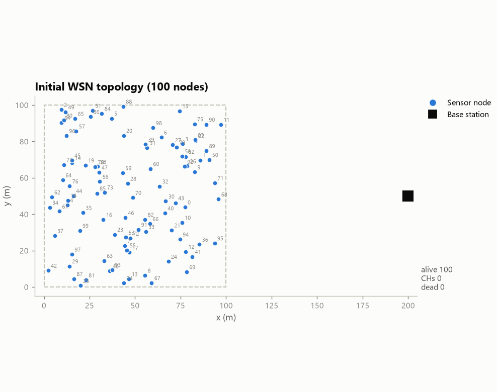

**Observed:** 100 nodes uniformly deployed in 100 x 100 m (seed 42); BS at (200, 50). Mean node–BS distance 155.7 m (max 201.9 m); d0 = 87.7 m, so 100% of nodes would use the multipath (d^4) model for a direct BS transmission.

### LEACH: cluster heads selected in round 1 (run 0).

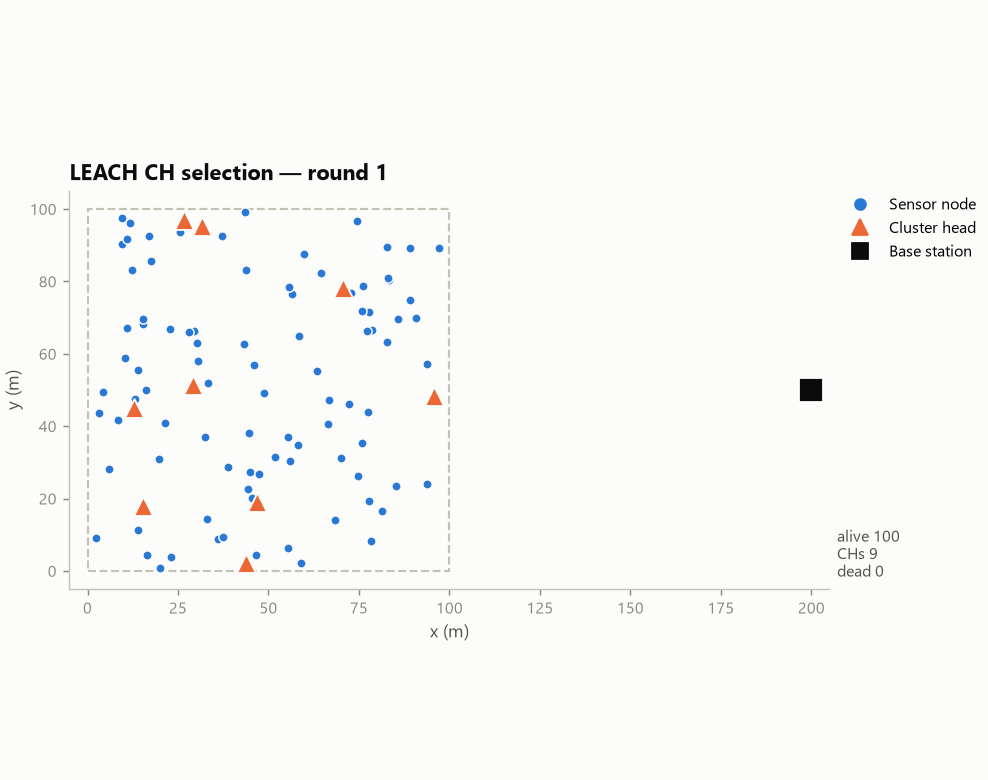

**Observed:** 9 CHs; mean CH–BS distance 161.7 m.

### LEACH: cluster formation in round 1 (members joined the nearest CH).

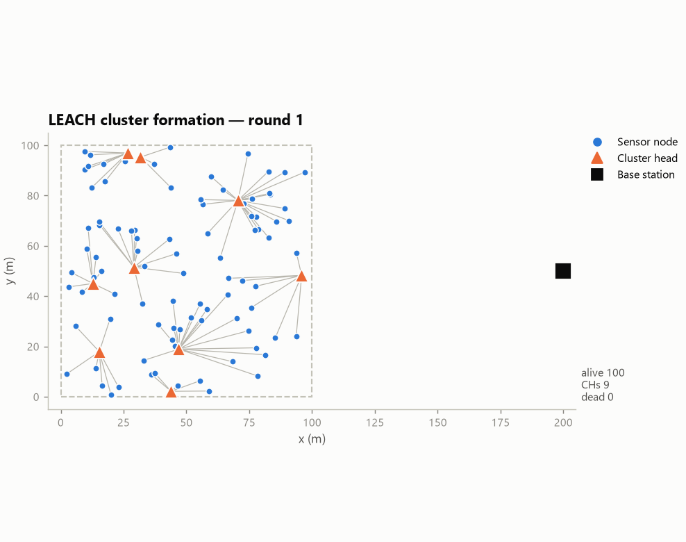

**Observed:** 9 clusters, sizes 4–23 (CV 0.53); member→CH distance mean 15.4 m, max 34.5 m.

### LEACH: network at its half-node-death round (run 0); dead nodes are marked x, alive nodes shaded by residual energy.

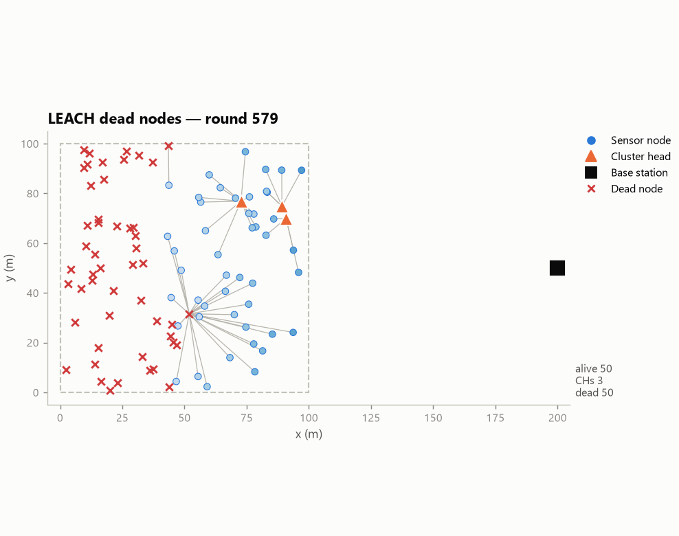

**Observed:** Round 579: 50 dead, 50 alive. Mean distance to BS — dead nodes 179.2 m, alive nodes 132.2 m (far nodes died first on average).

### DEAI-PSO: cluster heads selected in round 1 (run 0).

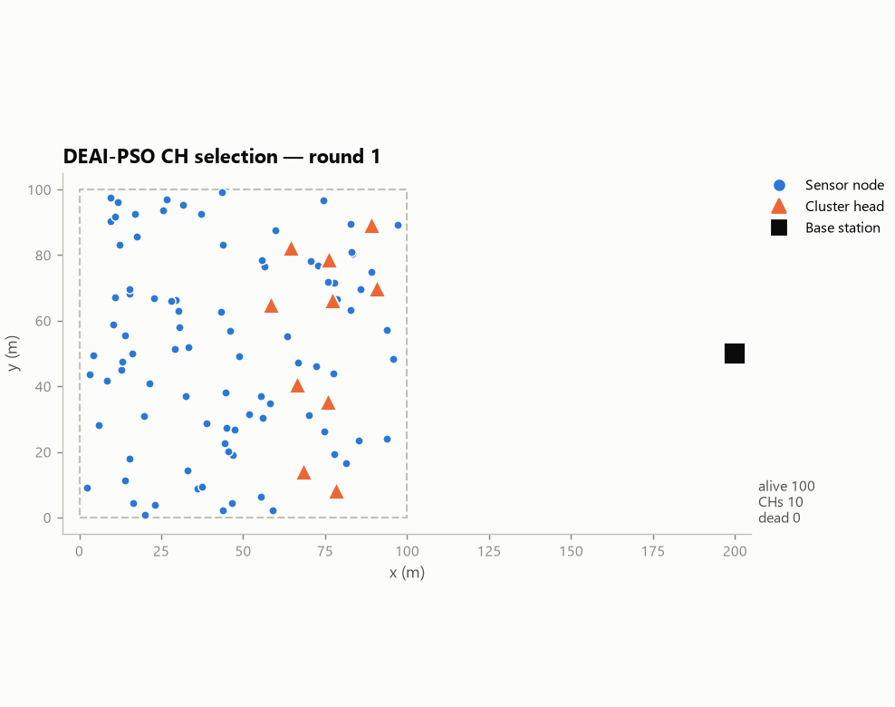

**Observed:** 10 CHs; mean CH–BS distance 128.6 m.

### DEAI-PSO: cluster formation in round 1 (members joined the nearest CH).

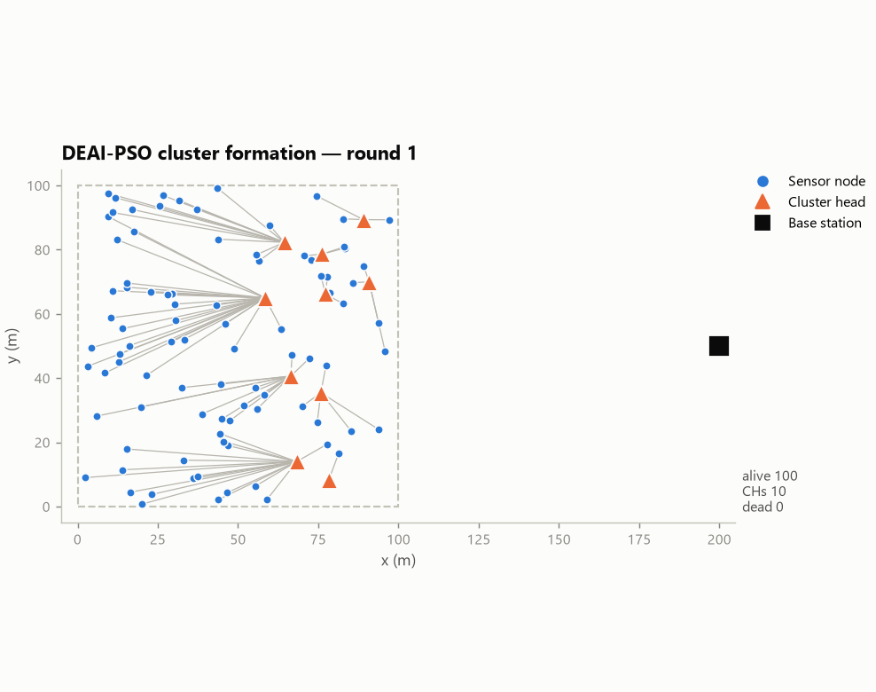

**Observed:** 10 clusters, sizes 2–27 (CV 0.76); member→CH distance mean 28.1 m, max 66.2 m.

### DEAI-PSO: network at its half-node-death round (run 0); dead nodes are marked x, alive nodes shaded by residual energy.


**Observed:** Round 630: 59 dead, 41 alive. Mean distance to BS — dead nodes 157.1 m, alive nodes 153.7 m (far nodes died first on average).

### GWO (Eq. 12): cluster heads selected in round 1 (run 0).

.png)

**Observed:** 7 CHs; mean CH–BS distance 123.4 m.

### GWO (Eq. 12): cluster formation in round 1 (members joined the nearest CH).

.png)

**Observed:** 7 clusters, sizes 7–23 (CV 0.40); member→CH distance mean 37.2 m, max 76.0 m.

### GWO (Eq. 12): network at its half-node-death round (run 0); dead nodes are marked x, alive nodes shaded by residual energy.

.png)

**Observed:** Round 679: 53 dead, 47 alive. Mean distance to BS — dead nodes 154.9 m, alive nodes 156.6 m (near nodes died first on average).

### ABC (Eq. 12): cluster heads selected in round 1 (run 0).

.png)

**Observed:** 5 CHs; mean CH–BS distance 121.2 m.

### ABC (Eq. 12): cluster formation in round 1 (members joined the nearest CH).

.png)

**Observed:** 5 clusters, sizes 5–32 (CV 0.45); member→CH distance mean 38.0 m, max 79.5 m.

### ABC (Eq. 12): network at its half-node-death round (run 0); dead nodes are marked x, alive nodes shaded by residual energy.

.png)

**Observed:** Round 677: 55 dead, 45 alive. Mean distance to BS — dead nodes 157.2 m, alive nodes 153.8 m (far nodes died first on average).

### Hybrid GWO-ABC (Eq. 12): cluster heads selected in round 1 (run 0).

.png)

**Observed:** 7 CHs; mean CH–BS distance 126.4 m.

### Hybrid GWO-ABC (Eq. 12): cluster formation in round 1 (members joined the nearest CH).

.png)

**Observed:** 7 clusters, sizes 5–25 (CV 0.40); member→CH distance mean 33.8 m, max 74.7 m.

### Hybrid GWO-ABC (Eq. 12): data communication in round 1 — members send to their CH (grey links), CHs aggregate and forward to the BS (arrows).

.png)

**Observed:** 7 clusters, sizes 5–25 (CV 0.40); member→CH distance mean 33.8 m, max 74.7 m.

### Hybrid GWO-ABC (Eq. 12): network at its half-node-death round (run 0); dead nodes are marked x, alive nodes shaded by residual energy.

.png)

**Observed:** Round 679: 53 dead, 47 alive. Mean distance to BS — dead nodes 154.0 m, alive nodes 157.6 m (near nodes died first on average).

### Hybrid GWO-ABC: cluster heads selected in round 1 (run 0).

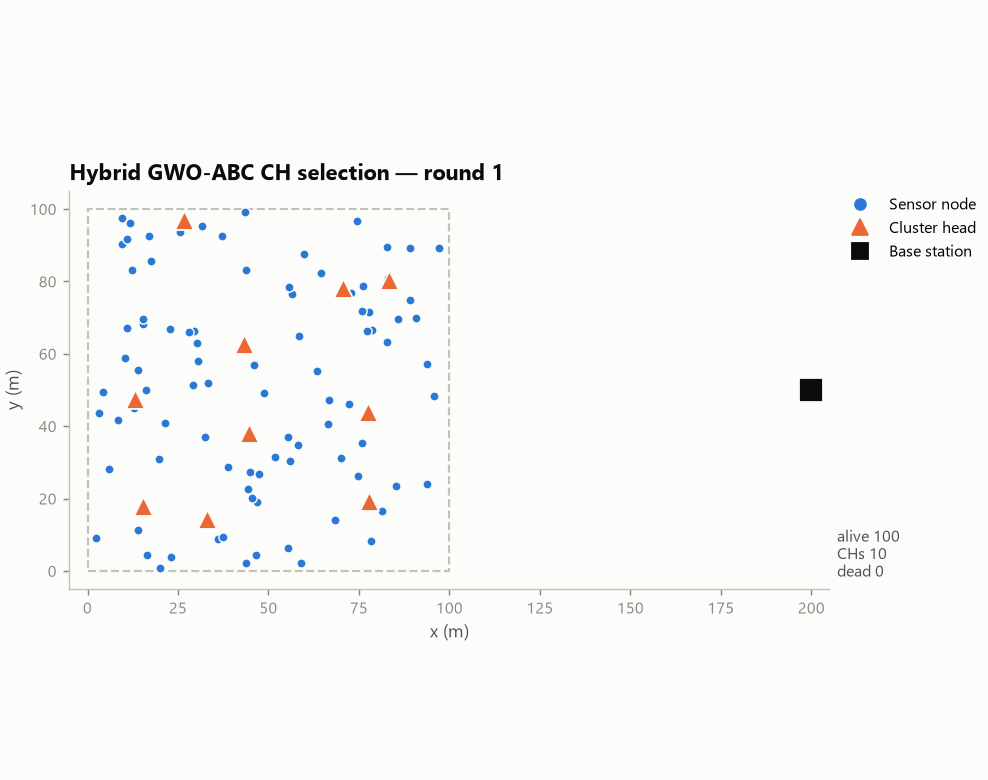

**Observed:** 10 CHs; mean CH–BS distance 154.0 m.

### Hybrid GWO-ABC: cluster formation in round 1 (members joined the nearest CH).


**Observed:** 10 clusters, sizes 7–13 (CV 0.17); member→CH distance mean 12.7 m, max 25.4 m.

### Hybrid GWO-ABC: network at its half-node-death round (run 0); dead nodes are marked x, alive nodes shaded by residual energy.

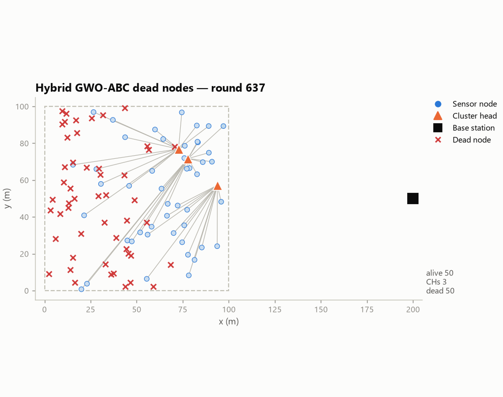

**Observed:** Round 637: 50 dead, 50 alive. Mean distance to BS — dead nodes 174.2 m, alive nodes 137.2 m (far nodes died first on average).

### DEAI-PSO: best-so-far fitness per iteration of the round-1 CH optimisation (mean ± std over runs).


**Observed:** mean best fitness 0.0797 → 0.0708 (11.2% lower); 95% of the improvement reached by iteration 15

### GWO (Eq. 12): best-so-far fitness per iteration of the round-1 CH optimisation (mean ± std over runs).

.png)

**Observed:** mean best fitness 0.0788 → 0.0679 (13.8% lower); 95% of the improvement reached by iteration 15

### ABC (Eq. 12): best-so-far fitness per iteration of the round-1 CH optimisation (mean ± std over runs).

.png)

**Observed:** mean best fitness 0.0812 → 0.0685 (15.6% lower); 95% of the improvement reached by iteration 20

### Hybrid GWO-ABC (Eq. 12): best-so-far fitness per iteration of the round-1 CH optimisation (mean ± std over runs).

.png)

**Observed:** GWO: mean best fitness 0.0812 → 0.0676 (16.7% lower); 95% of the improvement reached by iteration 13; ABC: mean best fitness 0.0823 → 0.0676 (17.8% lower); 95% of the improvement reached by iteration 12; HYBRID: mean best fitness 0.0790 → 0.0676 (14.4% lower); 95% of the improvement reached by iteration 14

### Hybrid GWO-ABC: best-so-far fitness per iteration of the round-1 CH optimisation (mean ± std over runs).

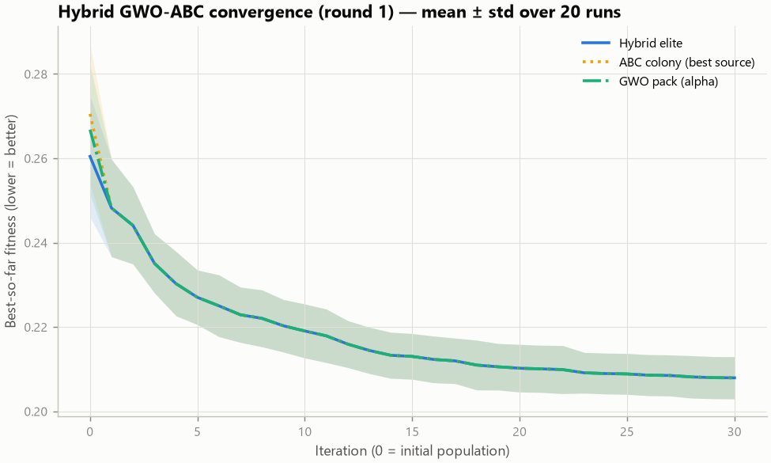

**Observed:** GWO: mean best fitness 0.2668 → 0.2079 (22.1% lower); 95% of the improvement reached by iteration 19; ABC: mean best fitness 0.2705 → 0.2079 (23.1% lower); 95% of the improvement reached by iteration 18; HYBRID: mean best fitness 0.2604 → 0.2079 (20.2% lower); 95% of the improvement reached by iteration 19

### Alive nodes vs rounds.

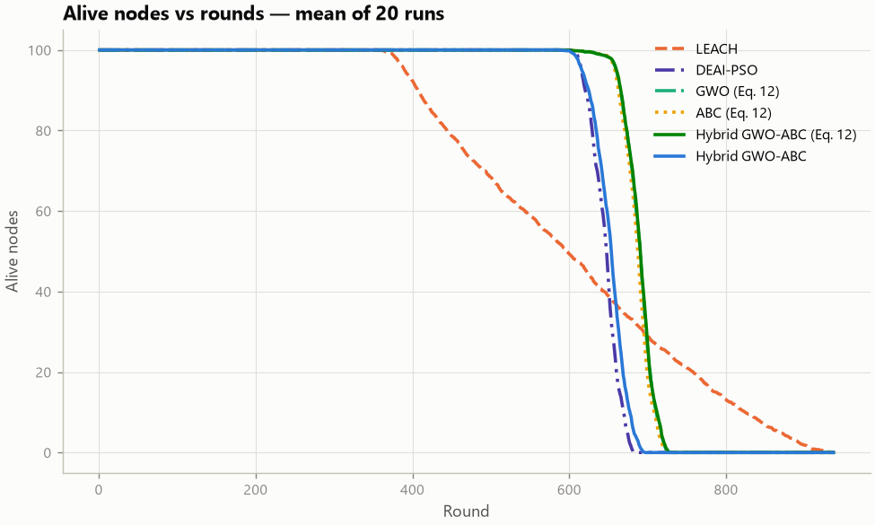

**Observed:** LEACH: FND 374, HND 595, LND 915; DEAI-PSO: FND 632, HND 647, LND 653; GWO (Eq. 12): FND 635, HND 691, LND 699; ABC (Eq. 12): FND 637, HND 688, LND 696; Hybrid GWO-ABC (Eq. 12): FND 636, HND 691, LND 700; Hybrid GWO-ABC: FND 620, HND 652, LND 672

### Dead nodes vs rounds.

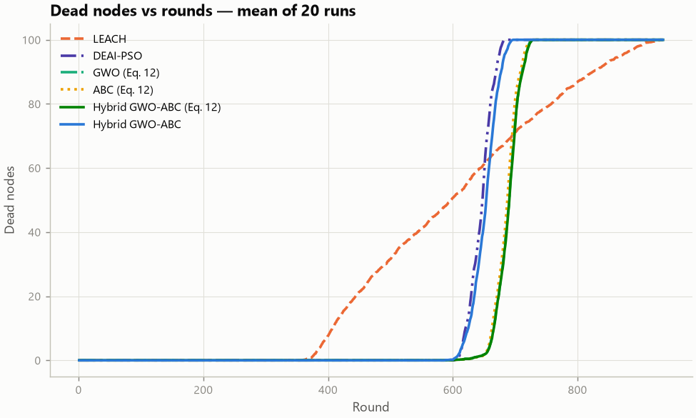

**Observed:** Mirror image of the alive-nodes curve; a steeper rise means nodes die closer together.

### Residual energy vs rounds.

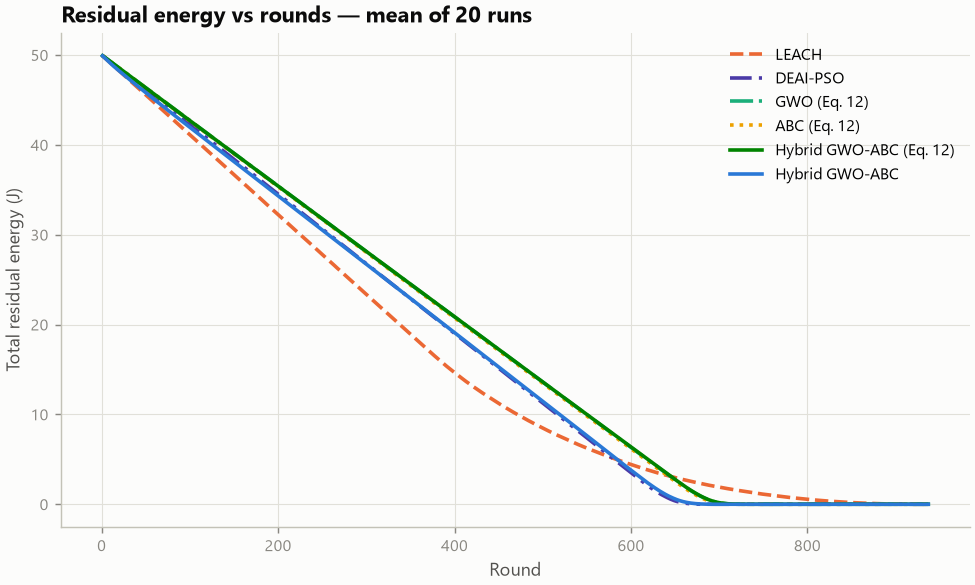

**Observed:** Residual energy at round 300: LEACH 23.36 J; DEAI-PSO 26.77 J; GWO (Eq. 12) 28.12 J; ABC (Eq. 12) 28.04 J; Hybrid GWO-ABC (Eq. 12) 28.13 J; Hybrid GWO-ABC 26.73 J

### Energy consumption vs rounds.

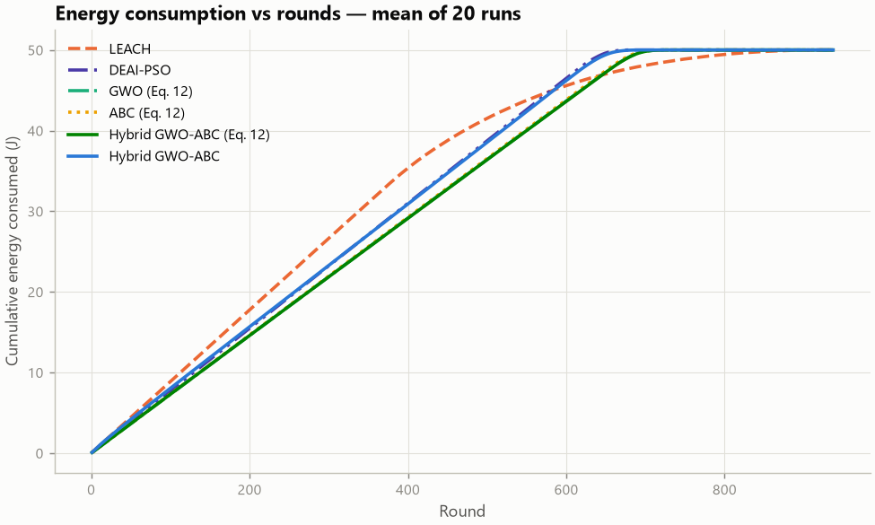

**Observed:** Consumed by round 300: LEACH 26.64 J; DEAI-PSO 23.23 J; GWO (Eq. 12) 21.88 J; ABC (Eq. 12) 21.96 J; Hybrid GWO-ABC (Eq. 12) 21.87 J; Hybrid GWO-ABC 23.27 J

### Throughput vs rounds (cumulative).

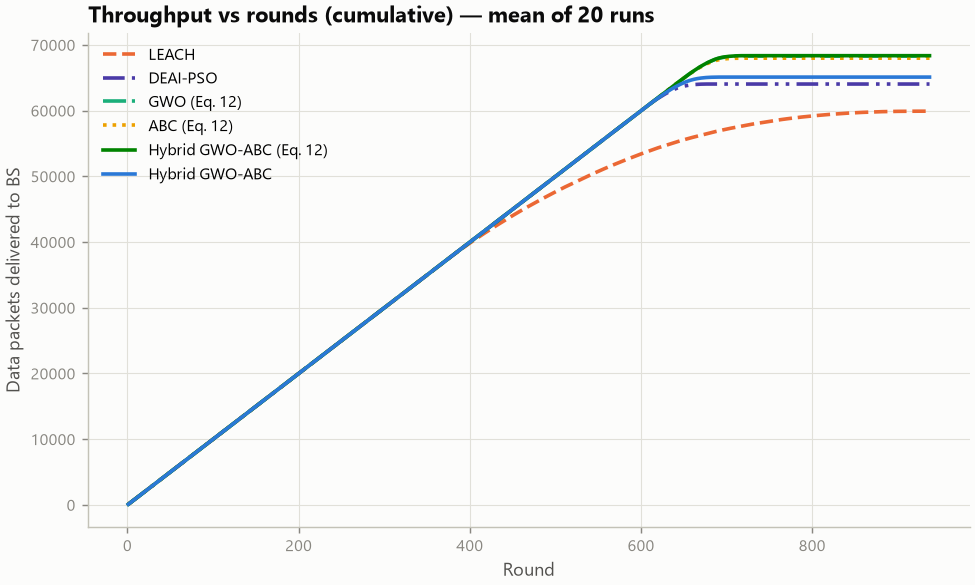

**Observed:** Total delivered: LEACH 59,914; DEAI-PSO 64,045; GWO (Eq. 12) 68,299; ABC (Eq. 12) 67,978; Hybrid GWO-ABC (Eq. 12) 68,360; Hybrid GWO-ABC 65,102

### PDR vs rounds.

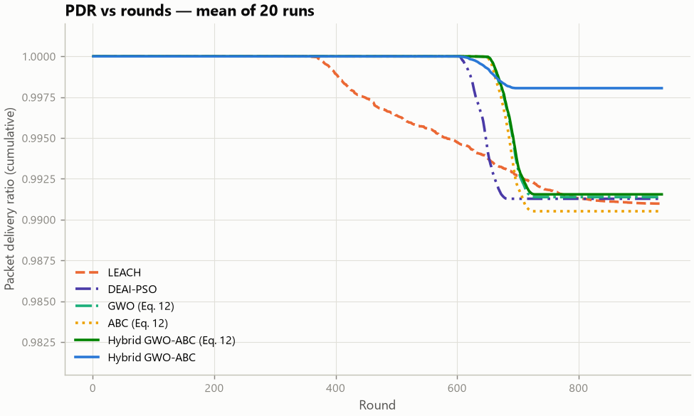

**Observed:** Final PDR: LEACH 0.9910; DEAI-PSO 0.9913; GWO (Eq. 12) 0.9914; ABC (Eq. 12) 0.9905; Hybrid GWO-ABC (Eq. 12) 0.9915; Hybrid GWO-ABC 0.9981

### CH count vs rounds (20-round rolling mean).

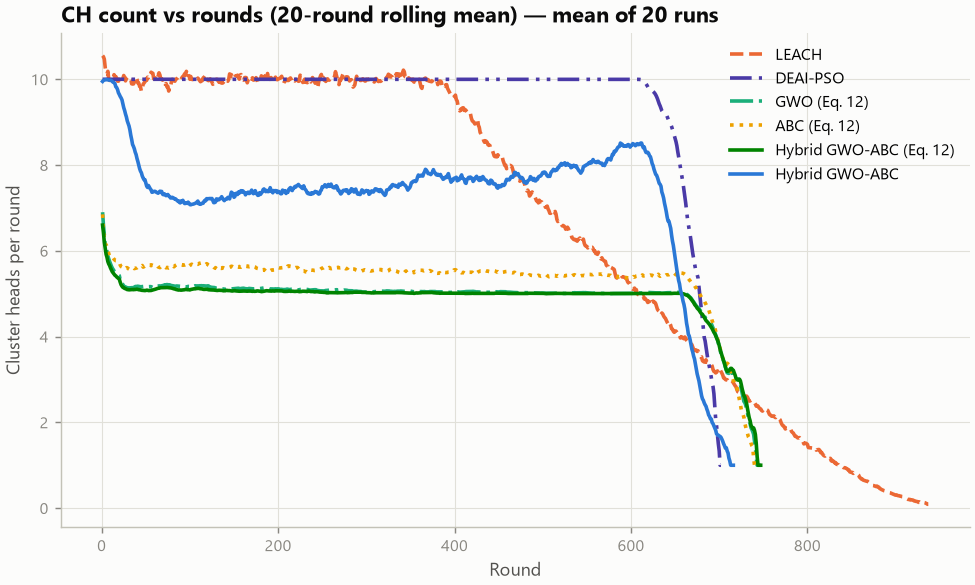

**Observed:** Mean CHs/round (rounds 1–300): LEACH 10.00 (per-round std 2.99); DEAI-PSO 10.00 (per-round std 0.00); GWO (Eq. 12) 5.14 (per-round std 0.38); ABC (Eq. 12) 5.62 (per-round std 0.86); Hybrid GWO-ABC (Eq. 12) 5.09 (per-round std 0.30); Hybrid GWO-ABC 7.54 (per-round std 2.21)

### Average cluster distance vs rounds (20-round rolling mean).

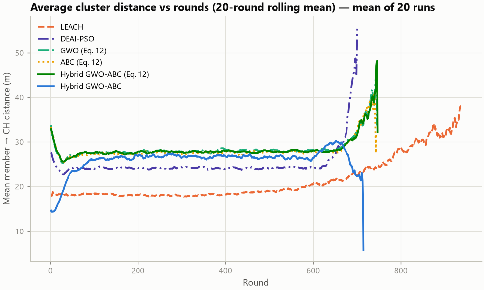

**Observed:** Mean member→CH distance: LEACH 18.09 m; DEAI-PSO 24.10 m; GWO (Eq. 12) 27.54 m; ABC (Eq. 12) 27.24 m; Hybrid GWO-ABC (Eq. 12) 27.48 m; Hybrid GWO-ABC 25.32 m

### Total CH-selection runtime per simulation (log scale, mean ± std).

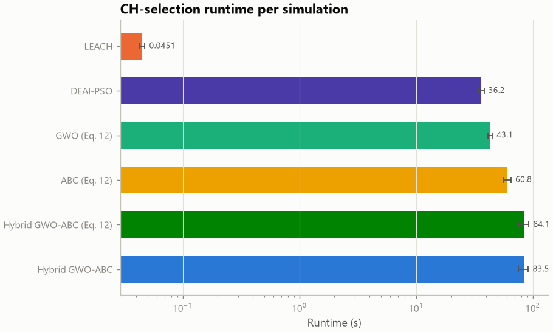

**Observed:** LEACH 0.05 s (0.05 ms/round, 0 fitness evaluations); DEAI-PSO 36.21 s (55.41 ms/round, 423,371 fitness evaluations); GWO (Eq. 12) 43.11 s (61.64 ms/round, 433,628 fitness evaluations); ABC (Eq. 12) 60.78 s (87.33 ms/round, 427,897 fitness evaluations); Hybrid GWO-ABC (Eq. 12) 84.10 s (120.19 ms/round, 436,543 fitness evaluations); Hybrid GWO-ABC 83.45 s (124.24 ms/round, 419,512 fitness evaluations)

### FND / HND / LND comparison (mean ± std over runs).

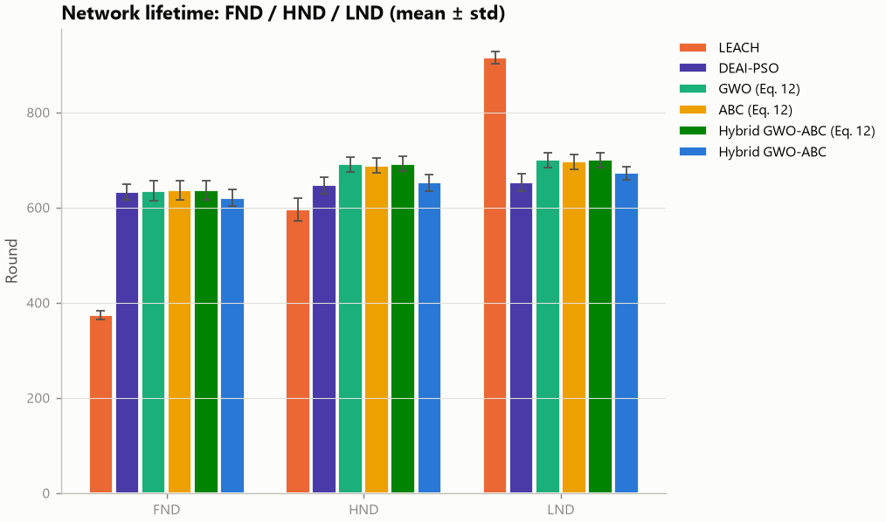

**Observed:** LEACH: FND 374, HND 595, LND 915; DEAI-PSO: FND 632, HND 647, LND 653; GWO (Eq. 12): FND 635, HND 691, LND 699; ABC (Eq. 12): FND 637, HND 688, LND 696; Hybrid GWO-ABC (Eq. 12): FND 636, HND 691, LND 700; Hybrid GWO-ABC: FND 620, HND 652, LND 672

### Where the energy goes: mean energy per radio activity over rounds 1–300.

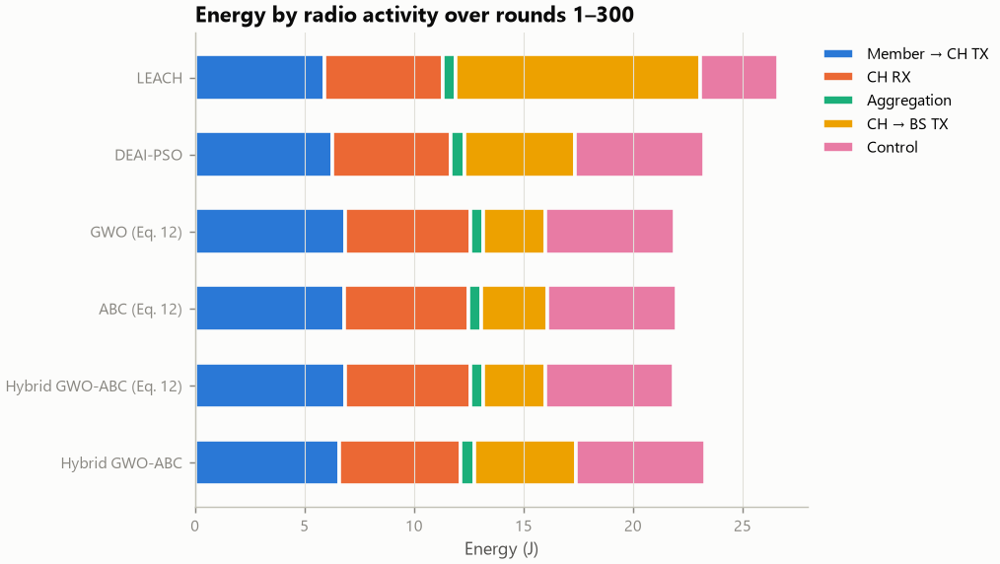

**Observed:** LEACH: total 23.06 J, largest share CH→BS TX (48%); DEAI-PSO: total 17.35 J, largest share member TX (36%); GWO (Eq. 12): total 16.00 J, largest share member TX (43%); ABC (Eq. 12): total 16.08 J, largest share member TX (42%); Hybrid GWO-ABC (Eq. 12): total 15.98 J, largest share member TX (43%); Hybrid GWO-ABC: total 17.39 J, largest share member TX (38%)

### Final fitness: same objective and weights for every algorithm.

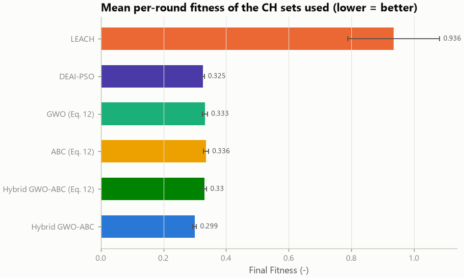

**Observed:** LEACH 0.9356; DEAI-PSO 0.3255; GWO (Eq. 12) 0.3326; ABC (Eq. 12) 0.3363; Hybrid GWO-ABC (Eq. 12) 0.3302; Hybrid GWO-ABC 0.2993

## Metric-by-metric interpretation

#### FND
- **What it represents:** First Node Death: the round in which the first node's residual energy reached 0.
- **How it was calculated:** min over nodes of the round in which residual energy reached 0 (simulation horizon if none died). (higher is better, unit: rounds)
- **Why it matters:** Marks the end of the stability period, during which every sensor still reports.
- **Observed (mean ± std over runs):** LEACH 374 (± 10), DEAI-PSO 632 (± 16), GWO (Eq. 12) 635 (± 20), ABC (Eq. 12) 637 (± 20), Hybrid GWO-ABC (Eq. 12) 636 (± 20), Hybrid GWO-ABC 620 (± 17). Best mean: **ABC (Eq. 12)**.
- **Proposed vs baselines:** vs LEACH: Hybrid GWO-ABC (Eq. 12) is 70.09% better (improvement formula), p = 0.000437 (Holm), Cliff's δ = +1.00 (large) → **proposed better**; vs DEAI-PSO: Hybrid GWO-ABC (Eq. 12) is 0.51% better (improvement formula), p = 0.852 (Holm), Cliff's δ = +0.09 (negligible) → **no significant difference** — practically small; vs GWO (Eq. 12): Hybrid GWO-ABC (Eq. 12) is 0.10% better (improvement formula), p = 0.0276 (Holm), Cliff's δ = +0.04 (negligible) → **proposed better** — practically small; vs ABC (Eq. 12): Hybrid GWO-ABC (Eq. 12) is 0.16% worse (improvement formula), p = 0.0131 (Holm), Cliff's δ = -0.08 (negligible) → **proposed worse** — practically small; vs Hybrid GWO-ABC: Hybrid GWO-ABC (Eq. 12) is 2.48% better (improvement formula), p = 0.000437 (Holm), Cliff's δ = +0.49 (large) → **proposed better**.
- **Is the difference meaningful?** 4 of 5 comparisons are statistically significant at α = 0.05 after Holm correction. Differences that are not significant, or below 1.0% in size, should not be presented as improvements.
- **Possible explanation:** CH selection that avoids low-energy nodes and rotates the CH role evenly delays the first death; a node chosen repeatedly as CH (e.g. because it is close to the BS) dies early. Measured LND − FND spread (rounds): LEACH 542, DEAI-PSO 21, GWO (Eq. 12) 64, ABC (Eq. 12) 59, Hybrid GWO-ABC (Eq. 12) 64, Hybrid GWO-ABC 52.

#### HND
- **What it represents:** Half Node Death: the round in which at least 50% of the nodes were dead.
- **How it was calculated:** round in which the number of dead nodes reached ceil(N/2). (higher is better, unit: rounds)
- **Why it matters:** Indicates how long the network keeps useful coverage.
- **Observed (mean ± std over runs):** LEACH 595 (± 24), DEAI-PSO 647 (± 17), GWO (Eq. 12) 691 (± 16), ABC (Eq. 12) 688 (± 16), Hybrid GWO-ABC (Eq. 12) 691 (± 16), Hybrid GWO-ABC 652 (± 18). Best mean: **Hybrid GWO-ABC (Eq. 12)**.
- **Proposed vs baselines:** vs LEACH: Hybrid GWO-ABC (Eq. 12) is 16.18% better (improvement formula), p = 0.000346 (Holm), Cliff's δ = +1.00 (large) → **proposed better**; vs DEAI-PSO: Hybrid GWO-ABC (Eq. 12) is 6.90% better (improvement formula), p = 0.000346 (Holm), Cliff's δ = +0.95 (large) → **proposed better**; vs GWO (Eq. 12): Hybrid GWO-ABC (Eq. 12) is 0.07% better (improvement formula), p = 0.0236 (Holm), Cliff's δ = +0.04 (negligible) → **proposed better** — practically small; vs ABC (Eq. 12): Hybrid GWO-ABC (Eq. 12) is 0.51% better (improvement formula), p = 0.000342 (Holm), Cliff's δ = +0.15 (small) → **proposed better** — practically small; vs Hybrid GWO-ABC: Hybrid GWO-ABC (Eq. 12) is 6.10% better (improvement formula), p = 0.000346 (Holm), Cliff's δ = +0.93 (large) → **proposed better**.
- **Is the difference meaningful?** 5 of 5 comparisons are statistically significant at α = 0.05 after Holm correction. Differences that are not significant, or below 1.0% in size, should not be presented as improvements.
- **Possible explanation:** HND reflects how evenly energy is drained across the whole network.

#### LND
- **What it represents:** Last Node Death: the round in which the last alive node died.
- **How it was calculated:** round in which the last node died (simulation horizon if nodes were still alive). (higher is better, unit: rounds)
- **Why it matters:** Upper bound of the network lifetime.
- **Observed (mean ± std over runs):** LEACH 915 (± 13), DEAI-PSO 653 (± 18), GWO (Eq. 12) 699 (± 15), ABC (Eq. 12) 696 (± 16), Hybrid GWO-ABC (Eq. 12) 700 (± 15), Hybrid GWO-ABC 672 (± 15). Best mean: **LEACH**.
- **Proposed vs baselines:** vs LEACH: Hybrid GWO-ABC (Eq. 12) is 23.55% worse (improvement formula), p = 0.000364 (Holm), Cliff's δ = -1.00 (large) → **proposed worse**; vs DEAI-PSO: Hybrid GWO-ABC (Eq. 12) is 7.09% better (improvement formula), p = 0.000364 (Holm), Cliff's δ = +0.96 (large) → **proposed better**; vs GWO (Eq. 12): Hybrid GWO-ABC (Eq. 12) is 0.04% better (improvement formula), p = 0.197 (Holm), Cliff's δ = +0.01 (negligible) → **no significant difference** — practically small; vs ABC (Eq. 12): Hybrid GWO-ABC (Eq. 12) is 0.53% better (improvement formula), p = 0.000364 (Holm), Cliff's δ = +0.17 (small) → **proposed better** — practically small; vs Hybrid GWO-ABC: Hybrid GWO-ABC (Eq. 12) is 4.15% better (improvement formula), p = 0.000364 (Holm), Cliff's δ = +0.81 (large) → **proposed better**.
- **Is the difference meaningful?** 4 of 5 comparisons are statistically significant at α = 0.05 after Holm correction. Differences that are not significant, or below 1.0% in size, should not be presented as improvements.
- **Possible explanation:** A very even energy drain makes all nodes die at nearly the same time: FND is delayed but the last node also dies sooner. Uneven drain leaves a few nodes with spare energy that keep running. Measured LND − FND spread (rounds): LEACH 542, DEAI-PSO 21, GWO (Eq. 12) 64, ABC (Eq. 12) 59, Hybrid GWO-ABC (Eq. 12) 64, Hybrid GWO-ABC 52.

#### Residual Energy
- **What it represents:** Total residual energy of all nodes at the checkpoint round.
- **How it was calculated:** sum of node residual energies after the checkpoint round. (higher is better, unit: J)
- **Why it matters:** More energy left at the same round means cheaper operation.
- **Observed (mean ± std over runs):** LEACH 23.362 (± 0.651), DEAI-PSO 26.765 (± 0.598), GWO (Eq. 12) 28.119 (± 0.456), ABC (Eq. 12) 28.036 (± 0.456), Hybrid GWO-ABC (Eq. 12) 28.134 (± 0.463), Hybrid GWO-ABC 26.726 (± 0.642). Best mean: **Hybrid GWO-ABC (Eq. 12)**.
- **Proposed vs baselines:** vs LEACH: Hybrid GWO-ABC (Eq. 12) is 20.43% better (improvement formula), p = 9.54e-06 (Holm), Cliff's δ = +1.00 (large) → **proposed better**; vs DEAI-PSO: Hybrid GWO-ABC (Eq. 12) is 5.11% better (improvement formula), p = 9.54e-06 (Holm), Cliff's δ = +0.94 (large) → **proposed better**; vs GWO (Eq. 12): Hybrid GWO-ABC (Eq. 12) is 0.06% better (improvement formula), p = 8.2e-05 (Holm), Cliff's δ = +0.05 (negligible) → **proposed better** — practically small; vs ABC (Eq. 12): Hybrid GWO-ABC (Eq. 12) is 0.35% better (improvement formula), p = 9.54e-06 (Holm), Cliff's δ = +0.14 (negligible) → **proposed better** — practically small; vs Hybrid GWO-ABC: Hybrid GWO-ABC (Eq. 12) is 5.27% better (improvement formula), p = 9.54e-06 (Holm), Cliff's δ = +0.95 (large) → **proposed better**.
- **Is the difference meaningful?** 5 of 5 comparisons are statistically significant at α = 0.05 after Holm correction. Differences that are not significant, or below 1.0% in size, should not be presented as improvements.
- **Possible explanation:** Residual energy at a fixed round depends on per-round radio cost: shorter member->CH links and shorter or fewer CH->BS links consume less.

#### Energy Consumption
- **What it represents:** Initial total energy minus residual energy at the checkpoint round.
- **How it was calculated:** N * E0 - residual energy at the checkpoint round. (lower is better, unit: J)
- **Why it matters:** Energy spent to operate the network for the same number of rounds.
- **Observed (mean ± std over runs):** LEACH 26.638 (± 0.651), DEAI-PSO 23.235 (± 0.598), GWO (Eq. 12) 21.881 (± 0.456), ABC (Eq. 12) 21.964 (± 0.456), Hybrid GWO-ABC (Eq. 12) 21.866 (± 0.463), Hybrid GWO-ABC 23.274 (± 0.642). Best mean: **Hybrid GWO-ABC (Eq. 12)**.
- **Proposed vs baselines:** vs LEACH: Hybrid GWO-ABC (Eq. 12) is 17.92% better (reduction formula), p = 9.54e-06 (Holm), Cliff's δ = +1.00 (large) → **proposed better**; vs DEAI-PSO: Hybrid GWO-ABC (Eq. 12) is 5.89% better (reduction formula), p = 9.54e-06 (Holm), Cliff's δ = +0.94 (large) → **proposed better**; vs GWO (Eq. 12): Hybrid GWO-ABC (Eq. 12) is 0.07% better (reduction formula), p = 8.2e-05 (Holm), Cliff's δ = +0.05 (negligible) → **proposed better** — practically small; vs ABC (Eq. 12): Hybrid GWO-ABC (Eq. 12) is 0.45% better (reduction formula), p = 9.54e-06 (Holm), Cliff's δ = +0.14 (negligible) → **proposed better** — practically small; vs Hybrid GWO-ABC: Hybrid GWO-ABC (Eq. 12) is 6.05% better (reduction formula), p = 9.54e-06 (Holm), Cliff's δ = +0.95 (large) → **proposed better**.
- **Is the difference meaningful?** 5 of 5 comparisons are statistically significant at α = 0.05 after Holm correction. Differences that are not significant, or below 1.0% in size, should not be presented as improvements.
- **Possible explanation:** Consumption is the complement of residual energy at the same checkpoint.

#### Throughput
- **What it represents:** Total sensor data packets delivered to the BS over the whole simulation (directly or inside an aggregated CH packet).
- **How it was calculated:** count of sensor readings that reached the BS over the whole run. (higher is better, unit: packets)
- **Why it matters:** Amount of sensed data the application actually receives.
- **Observed (mean ± std over runs):** LEACH 59,914 (± 1,410), DEAI-PSO 64,045 (± 1,710), GWO (Eq. 12) 68,299 (± 1,532), ABC (Eq. 12) 67,978 (± 1,525), Hybrid GWO-ABC (Eq. 12) 68,360 (± 1,539), Hybrid GWO-ABC 65,102 (± 1,692). Best mean: **Hybrid GWO-ABC (Eq. 12)**.
- **Proposed vs baselines:** vs LEACH: Hybrid GWO-ABC (Eq. 12) is 14.10% better (improvement formula), p = 9.54e-06 (Holm), Cliff's δ = +1.00 (large) → **proposed better**; vs DEAI-PSO: Hybrid GWO-ABC (Eq. 12) is 6.74% better (improvement formula), p = 0.000177 (Holm), Cliff's δ = +0.95 (large) → **proposed better**; vs GWO (Eq. 12): Hybrid GWO-ABC (Eq. 12) is 0.09% better (improvement formula), p = 0.00802 (Holm), Cliff's δ = +0.07 (negligible) → **proposed better** — practically small; vs ABC (Eq. 12): Hybrid GWO-ABC (Eq. 12) is 0.56% better (improvement formula), p = 9.54e-06 (Holm), Cliff's δ = +0.17 (small) → **proposed better** — practically small; vs Hybrid GWO-ABC: Hybrid GWO-ABC (Eq. 12) is 5.00% better (improvement formula), p = 9.54e-06 (Holm), Cliff's δ = +0.84 (large) → **proposed better**.
- **Is the difference meaningful?** 5 of 5 comparisons are statistically significant at α = 0.05 after Holm correction. Differences that are not significant, or below 1.0% in size, should not be presented as improvements.
- **Possible explanation:** Throughput grows with the number of rounds in which nodes are alive and with the share of packets that are not lost to CHs dying mid-round.

#### PDR
- **What it represents:** Packet Delivery Ratio = delivered data packets / generated data packets.
- **How it was calculated:** delivered readings / generated readings over the whole run. (higher is better, unit: ratio)
- **Why it matters:** Reliability: share of generated readings that reach the BS.
- **Observed (mean ± std over runs):** LEACH 0.9910 (± 0.0013), DEAI-PSO 0.9913 (± 0.0012), GWO (Eq. 12) 0.9914 (± 0.0019), ABC (Eq. 12) 0.9905 (± 0.0015), Hybrid GWO-ABC (Eq. 12) 0.9915 (± 0.0018), Hybrid GWO-ABC 0.9981 (± 0.0003). Best mean: **Hybrid GWO-ABC**.
- **Proposed vs baselines:** vs LEACH: Hybrid GWO-ABC (Eq. 12) is 0.06% better (improvement formula), p = 1 (Holm), Cliff's δ = +0.17 (small) → **no significant difference** — practically small; vs DEAI-PSO: Hybrid GWO-ABC (Eq. 12) is 0.03% better (improvement formula), p = 1 (Holm), Cliff's δ = +0.13 (negligible) → **no significant difference** — practically small; vs GWO (Eq. 12): Hybrid GWO-ABC (Eq. 12) is 0.02% better (improvement formula), p = 1 (Holm), Cliff's δ = +0.01 (negligible) → **no significant difference** — practically small; vs ABC (Eq. 12): Hybrid GWO-ABC (Eq. 12) is 0.10% better (improvement formula), p = 0.0093 (Holm), Cliff's δ = +0.34 (medium) → **proposed better** — practically small; vs Hybrid GWO-ABC: Hybrid GWO-ABC (Eq. 12) is 0.65% worse (improvement formula), p = 9.54e-06 (Holm), Cliff's δ = -1.00 (large) → **proposed worse** — practically small.
- **Is the difference meaningful?** 2 of 5 comparisons are statistically significant at α = 0.05 after Holm correction. Differences that are not significant, or below 1.0% in size, should not be presented as improvements.
- **Possible explanation:** Packets are lost when a CH runs out of energy before forwarding its cluster's data, or when a node dies while transmitting. Energy-feasibility checks on CHs reduce such losses.

#### Avg. Cluster Distance
- **What it represents:** Mean member->CH distance, averaged over rounds 1..checkpoint.
- **How it was calculated:** per round mean member->CH distance, averaged over rounds 1..checkpoint. (lower is better, unit: m)
- **Why it matters:** Shorter intra-cluster links cost less transmission energy (d^2 / d^4).
- **Observed (mean ± std over runs):** LEACH 18.087 (± 0.579), DEAI-PSO 24.102 (± 1.524), GWO (Eq. 12) 27.536 (± 1.336), ABC (Eq. 12) 27.244 (± 1.377), Hybrid GWO-ABC (Eq. 12) 27.482 (± 1.358), Hybrid GWO-ABC 25.320 (± 1.517). Best mean: **LEACH**.
- **Proposed vs baselines:** vs LEACH: Hybrid GWO-ABC (Eq. 12) is 51.95% worse (reduction formula), p = 9.54e-06 (Holm), Cliff's δ = -1.00 (large) → **proposed worse**; vs DEAI-PSO: Hybrid GWO-ABC (Eq. 12) is 14.03% worse (reduction formula), p = 9.54e-06 (Holm), Cliff's δ = -0.92 (large) → **proposed worse**; vs GWO (Eq. 12): Hybrid GWO-ABC (Eq. 12) is 0.20% better (reduction formula), p = 0.0532 (Holm), Cliff's δ = +0.04 (negligible) → **no significant difference** — practically small; vs ABC (Eq. 12): Hybrid GWO-ABC (Eq. 12) is 0.88% worse (reduction formula), p = 9.54e-06 (Holm), Cliff's δ = -0.15 (small) → **proposed worse** — practically small; vs Hybrid GWO-ABC: Hybrid GWO-ABC (Eq. 12) is 8.54% worse (reduction formula), p = 9.54e-06 (Holm), Cliff's δ = -0.69 (large) → **proposed worse**.
- **Is the difference meaningful?** 4 of 5 comparisons are statistically significant at α = 0.05 after Holm correction. Differences that are not significant, or below 1.0% in size, should not be presented as improvements.
- **Possible explanation:** The fitness function explicitly penalises member->CH distance; LEACH places CHs at random positions, which typically lengthens member links.

#### Avg. CH-BS Distance
- **What it represents:** Mean CH->BS distance, averaged over rounds 1..checkpoint.
- **How it was calculated:** per round mean CH->BS distance, averaged over rounds 1..checkpoint. (lower is better, unit: m)
- **Why it matters:** CH->BS is the longest and most expensive hop.
- **Observed (mean ± std over runs):** LEACH 153.941 (± 2.640), DEAI-PSO 124.399 (± 2.627), GWO (Eq. 12) 127.472 (± 2.251), ABC (Eq. 12) 126.516 (± 2.409), Hybrid GWO-ABC (Eq. 12) 127.608 (± 2.294), Hybrid GWO-ABC 131.646 (± 2.853). Best mean: **DEAI-PSO**.
- **Proposed vs baselines:** vs LEACH: Hybrid GWO-ABC (Eq. 12) is 17.11% better (reduction formula), p = 9.54e-06 (Holm), Cliff's δ = +1.00 (large) → **proposed better**; vs DEAI-PSO: Hybrid GWO-ABC (Eq. 12) is 2.58% worse (reduction formula), p = 9.54e-06 (Holm), Cliff's δ = -0.64 (large) → **proposed worse**; vs GWO (Eq. 12): Hybrid GWO-ABC (Eq. 12) is 0.11% worse (reduction formula), p = 0.000105 (Holm), Cliff's δ = -0.07 (negligible) → **proposed worse** — practically small; vs ABC (Eq. 12): Hybrid GWO-ABC (Eq. 12) is 0.86% worse (reduction formula), p = 9.54e-06 (Holm), Cliff's δ = -0.24 (small) → **proposed worse** — practically small; vs Hybrid GWO-ABC: Hybrid GWO-ABC (Eq. 12) is 3.07% better (reduction formula), p = 9.54e-06 (Holm), Cliff's δ = +0.71 (large) → **proposed better**.
- **Is the difference meaningful?** 5 of 5 comparisons are statistically significant at α = 0.05 after Holm correction. Differences that are not significant, or below 1.0% in size, should not be presented as improvements.
- **Possible explanation:** The fitness penalises CH->BS distance, but the energy-eligibility rule and the energy term limit how often nodes near the BS can be selected.

#### Runtime
- **What it represents:** Total wall-clock time spent selecting CHs over the whole simulation.
- **How it was calculated:** sum of wall-clock CH-selection time over all rounds (time.perf_counter). (lower is better, unit: s)
- **Why it matters:** Computational cost of the CH selection algorithm.
- **Observed (mean ± std over runs):** LEACH 0.05 (± 0.00), DEAI-PSO 36.21 (± 2.04), GWO (Eq. 12) 43.11 (± 1.88), ABC (Eq. 12) 60.78 (± 4.39), Hybrid GWO-ABC (Eq. 12) 84.10 (± 8.63), Hybrid GWO-ABC 83.45 (± 8.23). Best mean: **LEACH**.
- **Proposed vs baselines:** vs LEACH: Hybrid GWO-ABC (Eq. 12) is 186469.44% worse (reduction formula), p = 9.54e-06 (Holm), Cliff's δ = -1.00 (large) → **proposed worse** (proposed/baseline ratio 1866×); vs DEAI-PSO: Hybrid GWO-ABC (Eq. 12) is 132.26% worse (reduction formula), p = 9.54e-06 (Holm), Cliff's δ = -1.00 (large) → **proposed worse**; vs GWO (Eq. 12): Hybrid GWO-ABC (Eq. 12) is 95.08% worse (reduction formula), p = 9.54e-06 (Holm), Cliff's δ = -1.00 (large) → **proposed worse**; vs ABC (Eq. 12): Hybrid GWO-ABC (Eq. 12) is 38.37% worse (reduction formula), p = 9.54e-06 (Holm), Cliff's δ = -0.91 (large) → **proposed worse**; vs Hybrid GWO-ABC: Hybrid GWO-ABC (Eq. 12) is 0.78% worse (reduction formula), p = 0.0215 (Holm), Cliff's δ = -0.13 (negligible) → **proposed worse** — practically small.
- **Is the difference meaningful?** 5 of 5 comparisons are statistically significant at α = 0.05 after Holm correction. Differences that are not significant, or below 1.0% in size, should not be presented as improvements.
- **Possible explanation:** Metaheuristics evaluate hundreds of candidate CH sets per round; LEACH needs one random draw per node. The hybrid runs two populations and more operators per iteration, which adds overhead even at an equal number of fitness evaluations. Runtime relative to LEACH: DEAI-PSO 803×, GWO (Eq. 12) 956×, ABC (Eq. 12) 1348×, Hybrid GWO-ABC (Eq. 12) 1866×, Hybrid GWO-ABC 1851×.

#### Final Fitness
- **What it represents:** Mean per-round fitness (same function and weights for every algorithm) of the CH set actually used, over rounds 1..checkpoint. Lower is better.
- **How it was calculated:** per round fitness of the CH set used (same weights for all), mean over rounds 1..checkpoint. (lower is better, unit: -)
- **Why it matters:** Quality of the CH configurations according to the optimisation objective.
- **Observed (mean ± std over runs):** LEACH 0.9356 (± 0.1466), DEAI-PSO 0.3255 (± 0.0049), GWO (Eq. 12) 0.3326 (± 0.0081), ABC (Eq. 12) 0.3363 (± 0.0077), Hybrid GWO-ABC (Eq. 12) 0.3302 (± 0.0078), Hybrid GWO-ABC 0.2993 (± 0.0061). Best mean: **Hybrid GWO-ABC**.
- **Proposed vs baselines:** vs LEACH: Hybrid GWO-ABC (Eq. 12) is 64.71% better (reduction formula), p = 9.54e-06 (Holm), Cliff's δ = +1.00 (large) → **proposed better**; vs DEAI-PSO: Hybrid GWO-ABC (Eq. 12) is 1.44% worse (reduction formula), p = 0.000586 (Holm), Cliff's δ = -0.39 (medium) → **proposed worse**; vs GWO (Eq. 12): Hybrid GWO-ABC (Eq. 12) is 0.74% better (reduction formula), p = 9.54e-06 (Holm), Cliff's δ = +0.20 (small) → **proposed better** — practically small; vs ABC (Eq. 12): Hybrid GWO-ABC (Eq. 12) is 1.81% better (reduction formula), p = 9.54e-06 (Holm), Cliff's δ = +0.43 (medium) → **proposed better**; vs Hybrid GWO-ABC: Hybrid GWO-ABC (Eq. 12) is 10.32% worse (reduction formula), p = 9.54e-06 (Holm), Cliff's δ = -1.00 (large) → **proposed worse**.
- **Is the difference meaningful?** 5 of 5 comparisons are statistically significant at α = 0.05 after Holm correction. Differences that are not significant, or below 1.0% in size, should not be presented as improvements.
- **Possible explanation:** Optimisers minimise this objective directly; LEACH does not use it, and rounds in which LEACH elects zero CHs or too many receive the invalid-solution penalty.

#### Node-rounds
- **What it represents:** Sum over rounds of the number of alive nodes (area under the alive-nodes curve).
- **How it was calculated:** sum over rounds of alive nodes. (higher is better, unit: node x rounds)
- **Why it matters:** Single-number lifetime measure that accounts for the whole death curve.
- **Observed (mean ± std over runs):** LEACH 60,359 (± 1,415), DEAI-PSO 64,509 (± 1,718), GWO (Eq. 12) 68,792 (± 1,501), ABC (Eq. 12) 68,529 (± 1,501), Hybrid GWO-ABC (Eq. 12) 68,842 (± 1,514), Hybrid GWO-ABC 65,130 (± 1,701). Best mean: **Hybrid GWO-ABC (Eq. 12)**.
- **Proposed vs baselines:** vs LEACH: Hybrid GWO-ABC (Eq. 12) is 14.05% better (improvement formula), p = 9.54e-06 (Holm), Cliff's δ = +1.00 (large) → **proposed better**; vs DEAI-PSO: Hybrid GWO-ABC (Eq. 12) is 6.72% better (improvement formula), p = 9.54e-06 (Holm), Cliff's δ = +0.95 (large) → **proposed better**; vs GWO (Eq. 12): Hybrid GWO-ABC (Eq. 12) is 0.07% better (improvement formula), p = 8.82e-05 (Holm), Cliff's δ = +0.06 (negligible) → **proposed better** — practically small; vs ABC (Eq. 12): Hybrid GWO-ABC (Eq. 12) is 0.46% better (improvement formula), p = 9.54e-06 (Holm), Cliff's δ = +0.15 (small) → **proposed better** — practically small; vs Hybrid GWO-ABC: Hybrid GWO-ABC (Eq. 12) is 5.70% better (improvement formula), p = 9.54e-06 (Holm), Cliff's δ = +0.93 (large) → **proposed better**.
- **Is the difference meaningful?** 5 of 5 comparisons are statistically significant at α = 0.05 after Holm correction. Differences that are not significant, or below 1.0% in size, should not be presented as improvements.
- **Possible explanation:** The area under the alive-nodes curve combines stability period and tail length.

#### Cluster Imbalance
- **What it represents:** Coefficient of variation of cluster sizes, averaged over rounds 1..checkpoint.
- **How it was calculated:** per round std/mean of cluster sizes, averaged over rounds 1..checkpoint. (lower is better, unit: CV)
- **Why it matters:** Balanced clusters spread the CH load evenly.
- **Observed (mean ± std over runs):** LEACH 0.5357 (± 0.0106), DEAI-PSO 1.0292 (± 0.0609), GWO (Eq. 12) 0.6223 (± 0.0469), ABC (Eq. 12) 0.6896 (± 0.0492), Hybrid GWO-ABC (Eq. 12) 0.6020 (± 0.0456), Hybrid GWO-ABC 0.5872 (± 0.1005). Best mean: **LEACH**.
- **Proposed vs baselines:** vs LEACH: Hybrid GWO-ABC (Eq. 12) is 12.37% worse (reduction formula), p = 9.54e-06 (Holm), Cliff's δ = -0.91 (large) → **proposed worse**; vs DEAI-PSO: Hybrid GWO-ABC (Eq. 12) is 41.51% better (reduction formula), p = 9.54e-06 (Holm), Cliff's δ = +1.00 (large) → **proposed better**; vs GWO (Eq. 12): Hybrid GWO-ABC (Eq. 12) is 3.26% better (reduction formula), p = 9.54e-06 (Holm), Cliff's δ = +0.29 (small) → **proposed better**; vs ABC (Eq. 12): Hybrid GWO-ABC (Eq. 12) is 12.70% better (reduction formula), p = 9.54e-06 (Holm), Cliff's δ = +0.81 (large) → **proposed better**; vs Hybrid GWO-ABC: Hybrid GWO-ABC (Eq. 12) is 2.52% worse (reduction formula), p = 0.312 (Holm), Cliff's δ = -0.12 (negligible) → **no significant difference**.
- **Is the difference meaningful?** 4 of 5 comparisons are statistically significant at α = 0.05 after Holm correction. Differences that are not significant, or below 1.0% in size, should not be presented as improvements.
- **Possible explanation:** The fitness penalises unequal cluster sizes; nearest-CH assignment does not.

## Cluster-head records (run 0)

Every selected CH of every round is recorded in `ch_log_run0.csv` (round, CH id, coordinates, residual energy at selection, distance to the BS, cluster size including the CH). Dead and duplicate CHs are removed before clustering, so only valid CHs appear.

### LEACH

Over 820 rounds with CHs: 7.31 CHs/round on average; mean CH residual energy at selection 0.2514 J; mean CH–BS distance 149.21 m; 100 distinct nodes served as CH, the most frequent one 92 times.

Round 1 cluster heads:

| CH id | x (m) | y (m) | Residual energy (J) | CH–BS (m) | Cluster size |
|---|---:|---:|---:|---:|---:|
| 4 | 12.81 | 45.04 | 0.5 | 187.3 | 10 |
| 17 | 46.96 | 18.95 | 0.5 | 156.2 | 19 |
| 27 | 70.52 | 78.07 | 0.5 | 132.5 | 23 |
| 51 | 26.59 | 96.92 | 0.5 | 179.6 | 9 |
| 68 | 95.86 | 48.23 | 0.5 | 104.2 | 8 |
| 74 | 43.89 | 2.161 | 0.5 | 163.3 | 6 |
| 84 | 31.71 | 95.29 | 0.5 | 174.3 | 4 |
| 85 | 29.09 | 51.51 | 0.5 | 170.9 | 13 |
| 97 | 15.33 | 17.93 | 0.5 | 187.4 | 8 |

### DEAI-PSO

Over 635 rounds with CHs: 9.91 CHs/round on average; mean CH residual energy at selection 0.2517 J; mean CH–BS distance 128.43 m; 100 distinct nodes served as CH, the most frequent one 375 times.

Round 1 cluster heads:

| CH id | x (m) | y (m) | Residual energy (J) | CH–BS (m) | Cluster size |
|---|---:|---:|---:|---:|---:|
| 3 | 76.11 | 78.61 | 0.5 | 127.1 | 5 |
| 6 | 64.39 | 82.28 | 0.5 | 139.4 | 14 |
| 10 | 75.81 | 35.45 | 0.5 | 125 | 6 |
| 24 | 68.25 | 13.98 | 0.5 | 136.6 | 18 |
| 40 | 66.43 | 40.64 | 0.5 | 133.9 | 14 |
| 50 | 90.86 | 69.97 | 0.5 | 111 | 5 |
| 60 | 58.41 | 64.98 | 0.5 | 142.4 | 27 |
| 69 | 78.27 | 8.273 | 0.5 | 128.7 | 2 |
| 90 | 89.08 | 89.34 | 0.5 | 117.7 | 4 |
| 92 | 77.2 | 66.17 | 0.5 | 123.9 | 5 |

### GWO (Eq. 12)

Over 686 rounds with CHs: 4.99 CHs/round on average; mean CH residual energy at selection 0.2538 J; mean CH–BS distance 130.18 m; 99 distinct nodes served as CH, the most frequent one 203 times.

Round 1 cluster heads:

| CH id | x (m) | y (m) | Residual energy (J) | CH–BS (m) | Cluster size |
|---|---:|---:|---:|---:|---:|
| 0 | 77.4 | 43.89 | 0.5 | 122.8 | 7 |
| 10 | 75.81 | 35.45 | 0.5 | 125 | 21 |
| 12 | 77.84 | 19.46 | 0.5 | 125.9 | 12 |
| 52 | 77.88 | 71.69 | 0.5 | 124 | 23 |
| 69 | 78.27 | 8.273 | 0.5 | 128.7 | 11 |
| 89 | 89.17 | 74.86 | 0.5 | 113.6 | 9 |
| 92 | 77.2 | 66.17 | 0.5 | 123.9 | 17 |

### ABC (Eq. 12)

Over 686 rounds with CHs: 5.34 CHs/round on average; mean CH residual energy at selection 0.2531 J; mean CH–BS distance 129.31 m; 99 distinct nodes served as CH, the most frequent one 218 times.

Round 1 cluster heads:

| CH id | x (m) | y (m) | Residual energy (J) | CH–BS (m) | Cluster size |
|---|---:|---:|---:|---:|---:|
| 0 | 77.4 | 43.89 | 0.5 | 122.8 | 32 |
| 26 | 78.69 | 66.49 | 0.5 | 122.4 | 24 |
| 41 | 81.4 | 16.7 | 0.5 | 123.2 | 23 |
| 75 | 82.63 | 89.62 | 0.5 | 123.9 | 16 |
| 89 | 89.17 | 74.86 | 0.5 | 113.6 | 5 |

### Hybrid GWO-ABC (Eq. 12)

Over 688 rounds with CHs: 4.96 CHs/round on average; mean CH residual energy at selection 0.2535 J; mean CH–BS distance 130.20 m; 99 distinct nodes served as CH, the most frequent one 189 times.

Round 1 cluster heads:

| CH id | x (m) | y (m) | Residual energy (J) | CH–BS (m) | Cluster size |
|---|---:|---:|---:|---:|---:|
| 1 | 85.86 | 69.74 | 0.5 | 115.8 | 5 |
| 12 | 77.84 | 19.46 | 0.5 | 125.9 | 10 |
| 21 | 70.03 | 31.24 | 0.5 | 131.3 | 16 |
| 22 | 83.23 | 80.48 | 0.5 | 120.7 | 15 |
| 30 | 66.84 | 47.11 | 0.5 | 133.2 | 25 |
| 40 | 66.43 | 40.64 | 0.5 | 133.9 | 15 |
| 92 | 77.2 | 66.17 | 0.5 | 123.9 | 14 |

### Hybrid GWO-ABC

Over 661 rounds with CHs: 7.56 CHs/round on average; mean CH residual energy at selection 0.2588 J; mean CH–BS distance 130.85 m; 100 distinct nodes served as CH, the most frequent one 298 times.

Round 1 cluster heads:

| CH id | x (m) | y (m) | Residual energy (J) | CH–BS (m) | Cluster size |
|---|---:|---:|---:|---:|---:|
| 0 | 77.4 | 43.89 | 0.5 | 122.8 | 8 |
| 12 | 77.84 | 19.46 | 0.5 | 125.9 | 9 |
| 18 | 12.99 | 47.57 | 0.5 | 187 | 13 |
| 22 | 83.23 | 80.48 | 0.5 | 120.7 | 10 |
| 27 | 70.52 | 78.07 | 0.5 | 132.5 | 11 |
| 46 | 44.62 | 38.1 | 0.5 | 155.8 | 10 |
| 51 | 26.59 | 96.92 | 0.5 | 179.6 | 12 |
| 59 | 43.21 | 62.73 | 0.5 | 157.3 | 10 |
| 63 | 32.99 | 14.45 | 0.5 | 170.8 | 10 |
| 97 | 15.33 | 17.93 | 0.5 | 187.4 | 7 |


## Reproducing this experiment

```
python main.py reproduce "C:\Users\Admin\Hybrid-GWO-ABC-WSN\results\base_paper\BP1_100nodes"
```

`config.json` holds every parameter; `experiment.json` holds the algorithms, run count and seeds.
