# Base paper BP3_200nodes

Scenario 3: 200 nodes, 150 x 150 m, BS (200, 50), 10 % CHs — base paper Table 3 conditions; DEAI-PSO = existing system; Hybrid GWO-ABC (Eq. 12) = proposed optimiser on the base paper's own objective; GWO/ABC (Eq. 12) = its components on the same objective; Hybrid GWO-ABC = proposed optimiser with the project's multi-objective fitness.

All numbers below were produced by the simulator in this folder (20 independent paired runs per algorithm; run r uses deployment/algorithm seed 42 + r). Raw per-run results: `runs_raw.csv`; per-round histories: `history_raw.csv.gz`; statistics: `statistics.csv`; proposed-vs-baseline tests: `improvement_vs_baselines.csv`.

## Configuration

| Parameter | Value |
|---|---|
| Nodes | 200 |
| Area (m) | 150 x 150 |
| BS position | (200, 50) |
| Initial energy (J/node) | 0.5 |
| Packet size (bits) | 4000 |
| Control packet (bits) | 200 |
| Max rounds | 3000 |
| CH percentage p | 0.1 |
| CH count tolerance | K_opt x (1 ± 0.5) |
| CH eligibility (optimisers) | E ≥ 1.0 x mean alive energy |
| Optimisation iterations / round | 30 |
| GWO population | 20 |
| ABC colony size (food sources) | 20 (10) |
| ABC abandonment limit | 10 |
| Hybrid budget share / transfer / feedback | 0.5 / 3 / True |
| Fitness weights w1..w5 | 0.3, 0.25, 0.2, 0.15, 0.1 |
| Radio E_elec / E_fs / E_mp / E_DA | 5e-08 / 1e-11 / 1.3e-15 / 5e-09 |
| Checkpoint round (energy / averages) | 300 |
| Base seed | 42 |

## Final result table (mean ± std over runs)

| Metric | LEACH | DEAI-PSO | GWO (Eq. 12) | ABC (Eq. 12) | Hybrid GWO-ABC (Eq. 12) | Hybrid GWO-ABC |
|---|---:|---:|---:|---:|---:|---:|
| FND (rounds) | 292 ± 15 | 489 ± 33 | 483 ± 32 | 484 ± 32 | 483 ± 32 | 471 ± 31 |
| HND (rounds) | 602 ± 13 | 718 ± 12 | 739 ± 12 | 737 ± 12 | 740 ± 12 | 726 ± 11 |
| LND (rounds) | 920 ± 30 | 1,487 ± 51 | 1,487 ± 51 | 1,487 ± 51 | 1,487 ± 51 | 1,487 ± 51 |
| Residual Energy (J) | 43.278 ± 0.764 | 59.759 ± 0.550 | 60.482 ± 0.526 | 60.365 ± 0.535 | 60.514 ± 0.528 | 59.284 ± 0.558 |
| Energy Consumption (J) | 56.722 ± 0.764 | 40.241 ± 0.550 | 39.518 ± 0.526 | 39.635 ± 0.535 | 39.486 ± 0.528 | 40.716 ± 0.558 |
| Throughput (packets) | 115,698 ± 1,505 | 153,202 ± 2,951 | 156,419 ± 2,711 | 156,050 ± 2,729 | 156,526 ± 2,659 | 153,978 ± 2,614 |
| PDR (ratio) | 0.9904 ± 0.0006 | 0.9969 ± 0.0014 | 0.9980 ± 0.0008 | 0.9977 ± 0.0009 | 0.9978 ± 0.0010 | 0.9986 ± 0.0001 |
| Avg. Cluster Distance (m) | 18.542 ± 0.288 | 30.058 ± 1.300 | 30.687 ± 0.927 | 30.747 ± 0.890 | 30.653 ± 0.915 | 29.983 ± 1.298 |
| Avg. CH-BS Distance (m) | 135.940 ± 2.488 | 104.609 ± 1.804 | 110.364 ± 1.843 | 108.029 ± 1.982 | 110.377 ± 1.752 | 107.514 ± 2.619 |
| Runtime (s) | 0.06 ± 0.01 | 85.13 ± 8.50 | 84.79 ± 5.49 | 107.07 ± 8.95 | 139.45 ± 16.36 | 132.08 ± 16.00 |
| Final Fitness (-) | 0.4522 ± 0.0898 | 0.3168 ± 0.0048 | 8.2685 ± 1.0076 | 3.5708 ± 0.9743 | 8.7437 ± 0.7369 | 0.9795 ± 0.3413 |

Residual energy and energy consumption are measured at the checkpoint round 300; distance, imbalance and fitness averages cover rounds 1–300. '≥' marks lifetime values where at least one run had not reached the event within 3000 rounds (the horizon is then used as a lower bound).

## Descriptive statistics

**FND (rounds)**

| Algorithm | n | mean | std | min | max |
|---|---:|---:|---:|---:|---:|
| LEACH | 20 | 292 | 15 | 264 | 317 |
| DEAI-PSO | 20 | 489 | 33 | 429 | 542 |
| GWO (Eq. 12) | 20 | 483 | 32 | 423 | 531 |
| ABC (Eq. 12) | 20 | 484 | 32 | 424 | 533 |
| Hybrid GWO-ABC (Eq. 12) | 20 | 483 | 32 | 425 | 532 |
| Hybrid GWO-ABC | 20 | 471 | 31 | 413 | 522 |

**HND (rounds)**

| Algorithm | n | mean | std | min | max |
|---|---:|---:|---:|---:|---:|
| LEACH | 20 | 602 | 13 | 574 | 629 |
| DEAI-PSO | 20 | 718 | 12 | 696 | 752 |
| GWO (Eq. 12) | 20 | 739 | 12 | 712 | 775 |
| ABC (Eq. 12) | 20 | 737 | 12 | 713 | 772 |
| Hybrid GWO-ABC (Eq. 12) | 20 | 740 | 12 | 717 | 775 |
| Hybrid GWO-ABC | 20 | 726 | 11 | 707 | 758 |

**LND (rounds)**

| Algorithm | n | mean | std | min | max |
|---|---:|---:|---:|---:|---:|
| LEACH | 20 | 920 | 30 | 861 | 971 |
| DEAI-PSO | 20 | 1,487 | 51 | 1,360 | 1,536 |
| GWO (Eq. 12) | 20 | 1,487 | 51 | 1,360 | 1,536 |
| ABC (Eq. 12) | 20 | 1,487 | 51 | 1,360 | 1,536 |
| Hybrid GWO-ABC (Eq. 12) | 20 | 1,487 | 51 | 1,360 | 1,536 |
| Hybrid GWO-ABC | 20 | 1,487 | 51 | 1,360 | 1,536 |

**Residual Energy (J)**

| Algorithm | n | mean | std | min | max |
|---|---:|---:|---:|---:|---:|
| LEACH | 20 | 43.278 | 0.764 | 41.915 | 45.024 |
| DEAI-PSO | 20 | 59.759 | 0.550 | 58.777 | 60.789 |
| GWO (Eq. 12) | 20 | 60.482 | 0.526 | 59.655 | 61.476 |
| ABC (Eq. 12) | 20 | 60.365 | 0.535 | 59.488 | 61.380 |
| Hybrid GWO-ABC (Eq. 12) | 20 | 60.514 | 0.528 | 59.680 | 61.490 |
| Hybrid GWO-ABC | 20 | 59.284 | 0.558 | 58.153 | 60.429 |

**Energy Consumption (J)**

| Algorithm | n | mean | std | min | max |
|---|---:|---:|---:|---:|---:|
| LEACH | 20 | 56.722 | 0.764 | 54.976 | 58.085 |
| DEAI-PSO | 20 | 40.241 | 0.550 | 39.211 | 41.223 |
| GWO (Eq. 12) | 20 | 39.518 | 0.526 | 38.524 | 40.345 |
| ABC (Eq. 12) | 20 | 39.635 | 0.535 | 38.620 | 40.512 |
| Hybrid GWO-ABC (Eq. 12) | 20 | 39.486 | 0.528 | 38.510 | 40.320 |
| Hybrid GWO-ABC | 20 | 40.716 | 0.558 | 39.571 | 41.847 |

**Throughput (packets)**

| Algorithm | n | mean | std | min | max |
|---|---:|---:|---:|---:|---:|
| LEACH | 20 | 115,698 | 1,505 | 112,863 | 119,599 |
| DEAI-PSO | 20 | 153,202 | 2,951 | 148,659 | 159,577 |
| GWO (Eq. 12) | 20 | 156,419 | 2,711 | 152,582 | 162,544 |
| ABC (Eq. 12) | 20 | 156,050 | 2,729 | 152,163 | 162,200 |
| Hybrid GWO-ABC (Eq. 12) | 20 | 156,526 | 2,659 | 152,546 | 162,630 |
| Hybrid GWO-ABC | 20 | 153,978 | 2,614 | 149,649 | 159,907 |

**PDR (ratio)**

| Algorithm | n | mean | std | min | max |
|---|---:|---:|---:|---:|---:|
| LEACH | 20 | 0.9904 | 0.0006 | 0.9894 | 0.9914 |
| DEAI-PSO | 20 | 0.9969 | 0.0014 | 0.9938 | 0.9987 |
| GWO (Eq. 12) | 20 | 0.9980 | 0.0008 | 0.9952 | 0.9987 |
| ABC (Eq. 12) | 20 | 0.9977 | 0.0009 | 0.9960 | 0.9987 |
| Hybrid GWO-ABC (Eq. 12) | 20 | 0.9978 | 0.0010 | 0.9949 | 0.9987 |
| Hybrid GWO-ABC | 20 | 0.9986 | 0.0001 | 0.9981 | 0.9987 |

**Runtime (s)**

| Algorithm | n | mean | std | min | max |
|---|---:|---:|---:|---:|---:|
| LEACH | 20 | 0.06 | 0.01 | 0.05 | 0.11 |
| DEAI-PSO | 20 | 85.13 | 8.50 | 69.82 | 101.29 |
| GWO (Eq. 12) | 20 | 84.79 | 5.49 | 68.12 | 92.86 |
| ABC (Eq. 12) | 20 | 107.07 | 8.95 | 74.40 | 116.13 |
| Hybrid GWO-ABC (Eq. 12) | 20 | 139.45 | 16.36 | 79.17 | 154.36 |
| Hybrid GWO-ABC | 20 | 132.08 | 16.00 | 76.57 | 146.68 |

## Hybrid GWO-ABC (Eq. 12) vs baselines

Improvement % uses ((P − B) / B) × 100 for higher-is-better metrics and ((B − P) / B) × 100 for lower-is-better metrics, so a positive value always means the proposed algorithm did better. p-values: paired two-sided Wilcoxon signed-rank test, Holm-corrected over the baselines. Cliff's δ > 0 favours the proposed algorithm (|δ| < 0.147 negligible, < 0.33 small, < 0.474 medium, otherwise large).

| Metric | Baseline | Better | Improvement % | p (Holm) | Cliff's δ | Effect | Verdict |
|---|---|---|---:|---:|---:|---|---|
| FND | LEACH | higher | +65.22 | 0.000431 | +1.00 | large | proposed better |
| FND | DEAI-PSO | higher | -1.16 | 0.00175 | -0.11 | negligible | proposed worse |
| FND | GWO (Eq. 12) | higher | +0.12 | 0.0151 | +0.04 | negligible | proposed better |
| FND | ABC (Eq. 12) | higher | -0.19 | 0.0301 | -0.03 | negligible | proposed worse |
| FND | Hybrid GWO-ABC | higher | +2.68 | 0.000431 | +0.22 | small | proposed better |
| HND | LEACH | higher | +22.95 | 0.000362 | +1.00 | large | proposed better |
| HND | DEAI-PSO | higher | +2.98 | 0.000362 | +0.82 | large | proposed better |
| HND | GWO (Eq. 12) | higher | +0.11 | 0.0172 | +0.05 | negligible | proposed better |
| HND | ABC (Eq. 12) | higher | +0.41 | 0.000362 | +0.21 | small | proposed better |
| HND | Hybrid GWO-ABC | higher | +1.89 | 0.000362 | +0.70 | large | proposed better |
| LND | LEACH | higher | +61.59 | 0.000442 | +1.00 | large | proposed better |
| LND | DEAI-PSO | higher | +0.00 | 1 | +0.00 | negligible | no significant difference |
| LND | GWO (Eq. 12) | higher | +0.00 | 1 | +0.00 | negligible | no significant difference |
| LND | ABC (Eq. 12) | higher | +0.00 | 1 | +0.00 | negligible | no significant difference |
| LND | Hybrid GWO-ABC | higher | +0.00 | 1 | +0.00 | negligible | no significant difference |
| Node-rounds | LEACH | higher | +34.35 | 9.54e-06 | +1.00 | large | proposed better |
| Node-rounds | DEAI-PSO | higher | +2.08 | 9.54e-06 | +0.57 | large | proposed better |
| Node-rounds | GWO (Eq. 12) | higher | +0.09 | 0.000851 | +0.04 | negligible | proposed better |
| Node-rounds | ABC (Eq. 12) | higher | +0.30 | 9.54e-06 | +0.14 | negligible | proposed better |
| Node-rounds | Hybrid GWO-ABC | higher | +1.74 | 9.54e-06 | +0.55 | large | proposed better |
| Residual Energy | LEACH | higher | +39.83 | 9.54e-06 | +1.00 | large | proposed better |
| Residual Energy | DEAI-PSO | higher | +1.26 | 9.54e-06 | +0.68 | large | proposed better |
| Residual Energy | GWO (Eq. 12) | higher | +0.05 | 9.54e-06 | +0.10 | negligible | proposed better |
| Residual Energy | ABC (Eq. 12) | higher | +0.25 | 9.54e-06 | +0.18 | small | proposed better |
| Residual Energy | Hybrid GWO-ABC | higher | +2.08 | 9.54e-06 | +0.91 | large | proposed better |
| Energy Consumption | LEACH | lower | +30.39 | 9.54e-06 | +1.00 | large | proposed better |
| Energy Consumption | DEAI-PSO | lower | +1.88 | 9.54e-06 | +0.68 | large | proposed better |
| Energy Consumption | GWO (Eq. 12) | lower | +0.08 | 9.54e-06 | +0.10 | negligible | proposed better |
| Energy Consumption | ABC (Eq. 12) | lower | +0.38 | 9.54e-06 | +0.18 | small | proposed better |
| Energy Consumption | Hybrid GWO-ABC | lower | +3.02 | 9.54e-06 | +0.91 | large | proposed better |
| Throughput | LEACH | higher | +35.29 | 9.54e-06 | +1.00 | large | proposed better |
| Throughput | DEAI-PSO | higher | +2.17 | 9.54e-06 | +0.59 | large | proposed better |
| Throughput | GWO (Eq. 12) | higher | +0.07 | 0.0646 | +0.04 | negligible | no significant difference |
| Throughput | ABC (Eq. 12) | higher | +0.31 | 9.54e-06 | +0.13 | negligible | proposed better |
| Throughput | Hybrid GWO-ABC | higher | +1.65 | 9.54e-06 | +0.50 | large | proposed better |
| PDR | LEACH | higher | +0.74 | 9.54e-06 | +1.00 | large | proposed better |
| PDR | DEAI-PSO | higher | +0.09 | 0.0799 | +0.38 | medium | no significant difference |
| PDR | GWO (Eq. 12) | higher | -0.02 | 0.522 | -0.09 | negligible | no significant difference |
| PDR | ABC (Eq. 12) | higher | +0.00 | 0.784 | +0.07 | negligible | no significant difference |
| PDR | Hybrid GWO-ABC | higher | -0.08 | 0.00193 | -0.53 | large | proposed worse |
| Avg. Cluster Distance | LEACH | lower | -65.31 | 9.54e-06 | -1.00 | large | proposed worse |
| Avg. Cluster Distance | DEAI-PSO | lower | -1.98 | 0.000107 | -0.27 | small | proposed worse |
| Avg. Cluster Distance | GWO (Eq. 12) | lower | +0.11 | 0.231 | +0.01 | negligible | no significant difference |
| Avg. Cluster Distance | ABC (Eq. 12) | lower | +0.31 | 0.00731 | +0.07 | negligible | proposed better |
| Avg. Cluster Distance | Hybrid GWO-ABC | lower | -2.23 | 0.000784 | -0.34 | medium | proposed worse |
| Avg. CH-BS Distance | LEACH | lower | +18.81 | 9.54e-06 | +1.00 | large | proposed better |
| Avg. CH-BS Distance | DEAI-PSO | lower | -5.51 | 9.54e-06 | -0.98 | large | proposed worse |
| Avg. CH-BS Distance | GWO (Eq. 12) | lower | -0.01 | 0.729 | -0.00 | negligible | no significant difference |
| Avg. CH-BS Distance | ABC (Eq. 12) | lower | -2.17 | 9.54e-06 | -0.64 | large | proposed worse |
| Avg. CH-BS Distance | Hybrid GWO-ABC | lower | -2.66 | 9.54e-06 | -0.61 | large | proposed worse |
| Final Fitness | LEACH | lower | -1833.75 | 9.54e-06 | -1.00 | large | proposed worse |
| Final Fitness | DEAI-PSO | lower | -2660.42 | 9.54e-06 | -1.00 | large | proposed worse |
| Final Fitness | GWO (Eq. 12) | lower | -5.75 | 9.54e-06 | -0.28 | small | proposed worse |
| Final Fitness | ABC (Eq. 12) | lower | -144.86 | 9.54e-06 | -1.00 | large | proposed worse |
| Final Fitness | Hybrid GWO-ABC | lower | -792.68 | 9.54e-06 | -1.00 | large | proposed worse |
| Runtime | LEACH | lower | -232926.98 | 9.54e-06 | -1.00 | large | proposed worse |
| Runtime | DEAI-PSO | lower | -63.82 | 9.54e-06 | -0.93 | large | proposed worse |
| Runtime | GWO (Eq. 12) | lower | -64.46 | 9.54e-06 | -0.91 | large | proposed worse |
| Runtime | ABC (Eq. 12) | lower | -30.25 | 9.54e-06 | -0.91 | large | proposed worse |
| Runtime | Hybrid GWO-ABC | lower | -5.58 | 9.54e-06 | -0.49 | large | proposed worse |

### Trade-offs

- **Hybrid GWO-ABC (Eq. 12) vs LEACH** — significantly better: FND (+65.22%), HND (+22.95%), LND (+61.59%), Node-rounds (+34.35%), Residual Energy (+39.83%), Energy Consumption (+30.39%), Throughput (+35.29%), PDR (+0.74%, < 1%: practically negligible), Avg. CH-BS Distance (+18.81%); significantly worse: Avg. Cluster Distance (-65.31%), Cluster Imbalance (-48.66%), Final Fitness (-1833.75%), Runtime (-232926.98%), Runtime / round (-144243.43%); no significant difference: Fitness Evaluations.
- **Hybrid GWO-ABC (Eq. 12) vs DEAI-PSO** — significantly better: HND (+2.98%), Node-rounds (+2.08%), Residual Energy (+1.26%), Energy Consumption (+1.88%), Throughput (+2.17%), Cluster Imbalance (+39.07%), Fitness Evaluations (+4.59%); significantly worse: FND (-1.16%), Avg. Cluster Distance (-1.98%), Avg. CH-BS Distance (-5.51%), Final Fitness (-2660.42%), Runtime (-63.82%), Runtime / round (-63.82%); no significant difference: LND, PDR.
- **Hybrid GWO-ABC (Eq. 12) vs GWO (Eq. 12)** — significantly better: FND (+0.12%, < 1%: practically negligible), HND (+0.11%, < 1%: practically negligible), Node-rounds (+0.09%, < 1%: practically negligible), Residual Energy (+0.05%, < 1%: practically negligible), Energy Consumption (+0.08%, < 1%: practically negligible), Cluster Imbalance (+1.72%); significantly worse: Final Fitness (-5.75%), Runtime (-64.46%), Runtime / round (-64.44%), Fitness Evaluations (-0.61%, < 1%: practically negligible); no significant difference: LND, Throughput, PDR, Avg. Cluster Distance, Avg. CH-BS Distance.
- **Hybrid GWO-ABC (Eq. 12) vs ABC (Eq. 12)** — significantly better: HND (+0.41%, < 1%: practically negligible), Node-rounds (+0.30%, < 1%: practically negligible), Residual Energy (+0.25%, < 1%: practically negligible), Energy Consumption (+0.38%, < 1%: practically negligible), Throughput (+0.31%, < 1%: practically negligible), Avg. Cluster Distance (+0.31%, < 1%: practically negligible), Cluster Imbalance (+18.85%); significantly worse: FND (-0.19%, < 1%: practically negligible), Avg. CH-BS Distance (-2.17%), Final Fitness (-144.86%), Runtime (-30.25%), Runtime / round (-30.23%), Fitness Evaluations (-1.55%); no significant difference: LND, PDR.
- **Hybrid GWO-ABC (Eq. 12) vs Hybrid GWO-ABC** — significantly better: FND (+2.68%), HND (+1.89%), Node-rounds (+1.74%), Residual Energy (+2.08%), Energy Consumption (+3.02%), Throughput (+1.65%), Cluster Imbalance (+31.95%); significantly worse: PDR (-0.08%, < 1%: practically negligible), Avg. Cluster Distance (-2.23%), Avg. CH-BS Distance (-2.66%), Final Fitness (-792.68%), Runtime (-5.58%), Runtime / round (-5.58%), Fitness Evaluations (-8.32%); no significant difference: LND.

## Figures

### Initial WSN topology (run 0; every algorithm uses this same network in run 0).

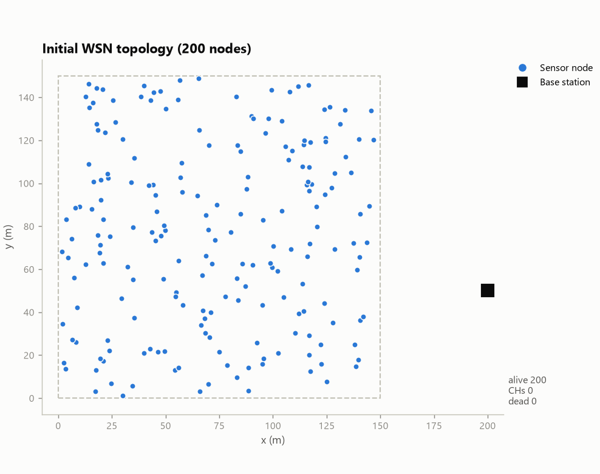

**Observed:** 200 nodes uniformly deployed in 150 x 150 m (seed 42); BS at (200, 50). Mean node–BS distance 137.6 m (max 209.4 m); d0 = 87.7 m, so 88% of nodes would use the multipath (d^4) model for a direct BS transmission.

### LEACH: cluster heads selected in round 1 (run 0).

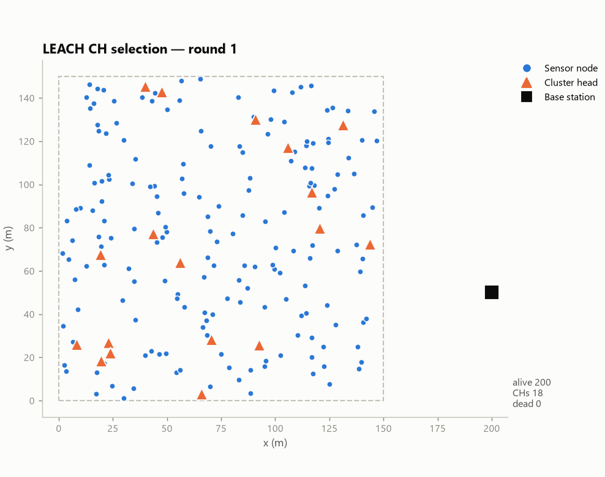

**Observed:** 18 CHs; mean CH–BS distance 142.3 m.

### LEACH: cluster formation in round 1 (members joined the nearest CH).

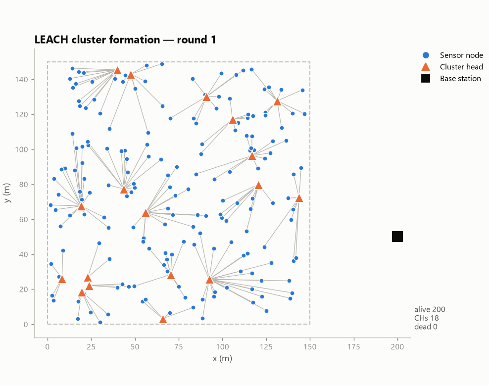

**Observed:** 18 clusters, sizes 3–23 (CV 0.48); member→CH distance mean 18.1 m, max 47.9 m.

### LEACH: network at its half-node-death round (run 0); dead nodes are marked x, alive nodes shaded by residual energy.

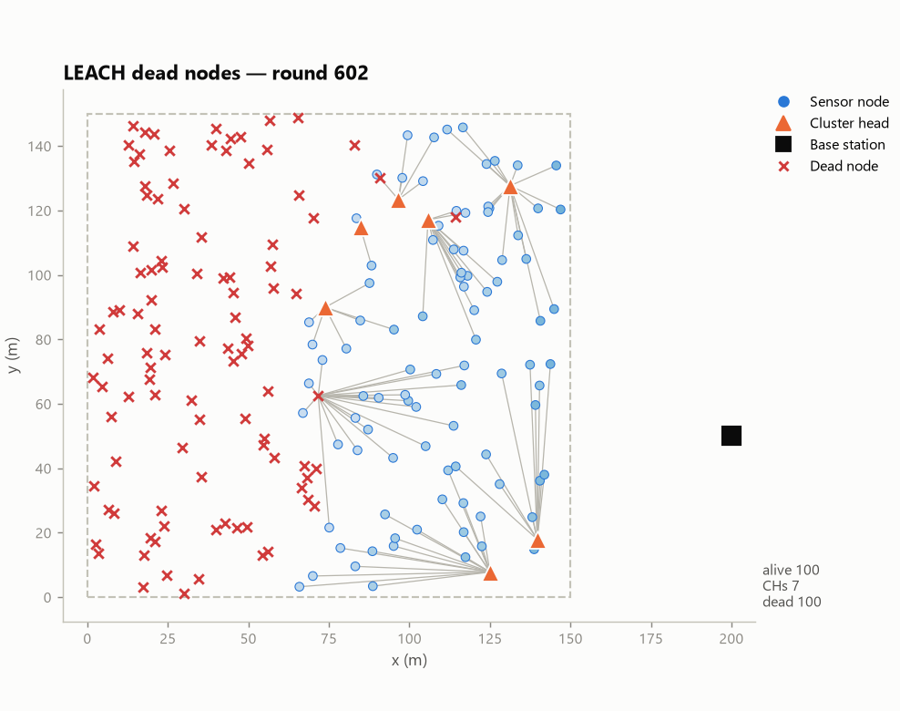

**Observed:** Round 602: 100 dead, 100 alive. Mean distance to BS — dead nodes 172.3 m, alive nodes 102.9 m (far nodes died first on average).

### DEAI-PSO: cluster heads selected in round 1 (run 0).

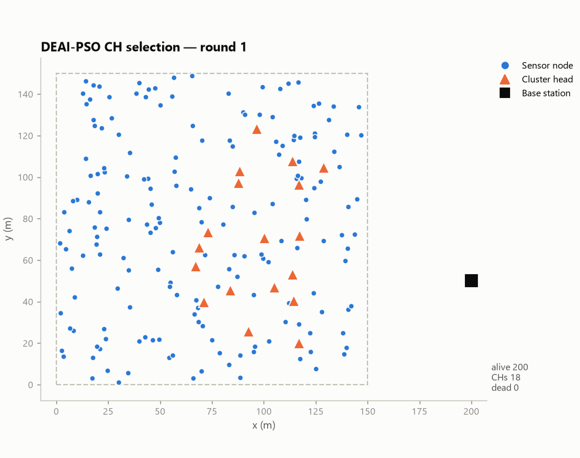

**Observed:** 18 CHs; mean CH–BS distance 108.6 m.

### DEAI-PSO: cluster formation in round 1 (members joined the nearest CH).

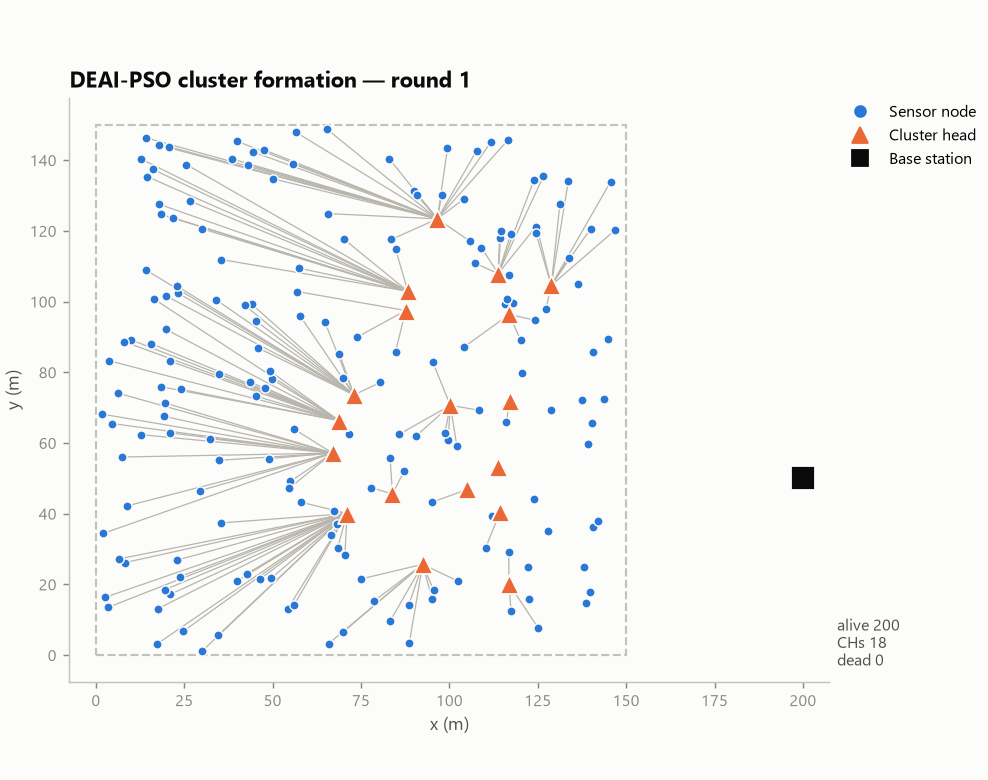

**Observed:** 18 clusters, sizes 1–27 (CV 0.75); member→CH distance mean 33.2 m, max 85.6 m.

### DEAI-PSO: network at its half-node-death round (run 0); dead nodes are marked x, alive nodes shaded by residual energy.

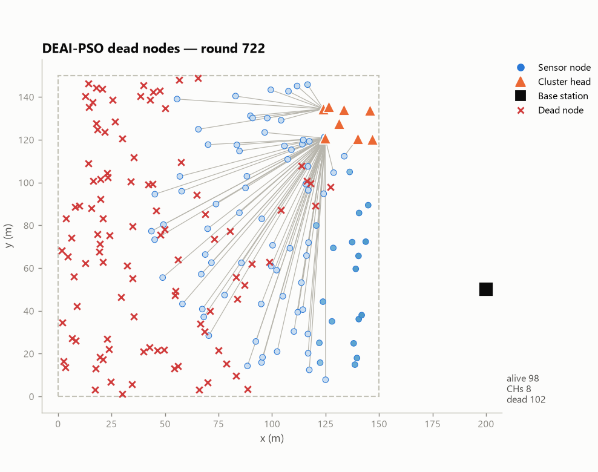

**Observed:** Round 722: 102 dead, 98 alive. Mean distance to BS — dead nodes 165.9 m, alive nodes 108.2 m (far nodes died first on average).

### GWO (Eq. 12): cluster heads selected in round 1 (run 0).

.png)

**Observed:** 18 CHs; mean CH–BS distance 110.5 m.

### GWO (Eq. 12): cluster formation in round 1 (members joined the nearest CH).

.png)

**Observed:** 18 clusters, sizes 2–23 (CV 0.60); member→CH distance mean 31.4 m, max 85.6 m.

### GWO (Eq. 12): network at its half-node-death round (run 0); dead nodes are marked x, alive nodes shaded by residual energy.

.png)

**Observed:** Round 739: 101 dead, 99 alive. Mean distance to BS — dead nodes 166.2 m, alive nodes 108.5 m (far nodes died first on average).

### ABC (Eq. 12): cluster heads selected in round 1 (run 0).

.png)

**Observed:** 13 CHs; mean CH–BS distance 110.5 m.

### ABC (Eq. 12): cluster formation in round 1 (members joined the nearest CH).

.png)

**Observed:** 13 clusters, sizes 3–33 (CV 0.69); member→CH distance mean 32.9 m, max 84.1 m.

### ABC (Eq. 12): network at its half-node-death round (run 0); dead nodes are marked x, alive nodes shaded by residual energy.

.png)

**Observed:** Round 736: 100 dead, 100 alive. Mean distance to BS — dead nodes 166.6 m, alive nodes 108.6 m (far nodes died first on average).

### Hybrid GWO-ABC (Eq. 12): cluster heads selected in round 1 (run 0).

.png)

**Observed:** 15 CHs; mean CH–BS distance 113.0 m.

### Hybrid GWO-ABC (Eq. 12): cluster formation in round 1 (members joined the nearest CH).

.png)

**Observed:** 15 clusters, sizes 4–23 (CV 0.57); member→CH distance mean 30.0 m, max 75.1 m.

### Hybrid GWO-ABC (Eq. 12): data communication in round 1 — members send to their CH (grey links), CHs aggregate and forward to the BS (arrows).

.png)

**Observed:** 15 clusters, sizes 4–23 (CV 0.57); member→CH distance mean 30.0 m, max 75.1 m.

### Hybrid GWO-ABC (Eq. 12): network at its half-node-death round (run 0); dead nodes are marked x, alive nodes shaded by residual energy.

.png)

**Observed:** Round 739: 100 dead, 100 alive. Mean distance to BS — dead nodes 168.4 m, alive nodes 106.9 m (far nodes died first on average).

### Hybrid GWO-ABC: cluster heads selected in round 1 (run 0).

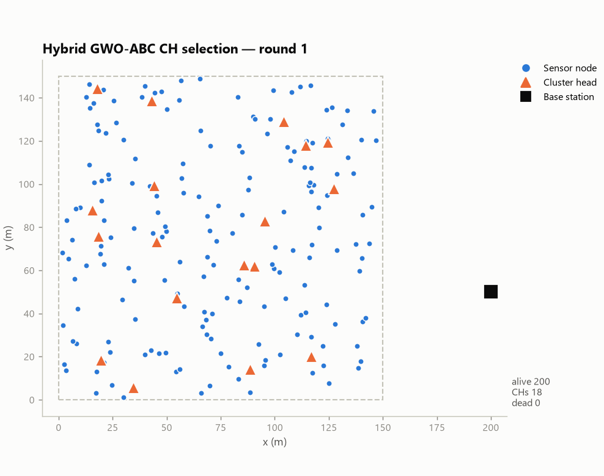

**Observed:** 18 CHs; mean CH–BS distance 141.2 m.

### Hybrid GWO-ABC: cluster formation in round 1 (members joined the nearest CH).

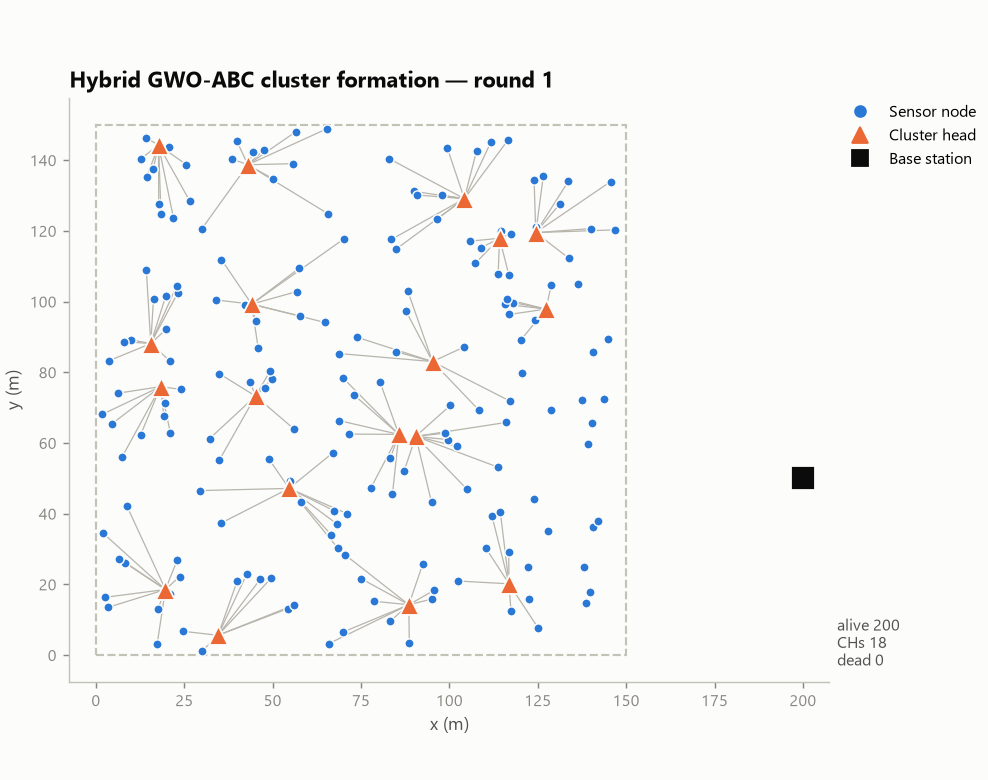

**Observed:** 18 clusters, sizes 8–12 (CV 0.14); member→CH distance mean 13.8 m, max 31.9 m.

### Hybrid GWO-ABC: network at its half-node-death round (run 0); dead nodes are marked x, alive nodes shaded by residual energy.

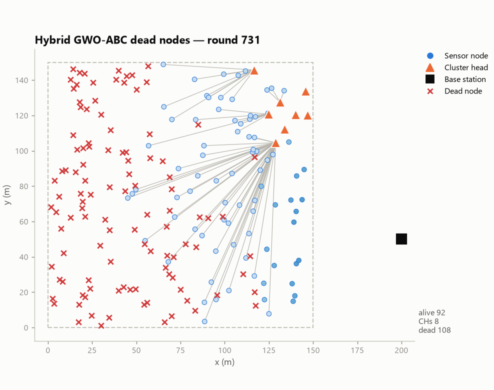

**Observed:** Round 731: 108 dead, 92 alive. Mean distance to BS — dead nodes 164.8 m, alive nodes 105.7 m (far nodes died first on average).

### DEAI-PSO: best-so-far fitness per iteration of the round-1 CH optimisation (mean ± std over runs).

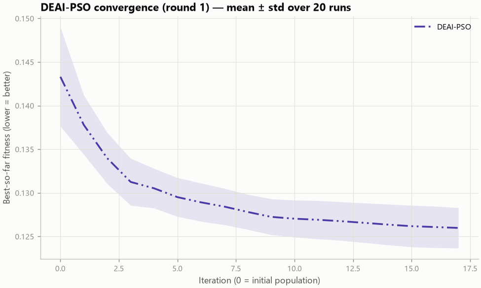

**Observed:** mean best fitness 0.1433 → 0.1260 (12.1% lower); 95% of the improvement reached by iteration 12

### GWO (Eq. 12): best-so-far fitness per iteration of the round-1 CH optimisation (mean ± std over runs).

.png)

**Observed:** mean best fitness 0.1450 → 0.1264 (12.8% lower); 95% of the improvement reached by iteration 17

### ABC (Eq. 12): best-so-far fitness per iteration of the round-1 CH optimisation (mean ± std over runs).

.png)

**Observed:** mean best fitness 0.1535 → 0.1290 (15.9% lower); 95% of the improvement reached by iteration 25

### Hybrid GWO-ABC (Eq. 12): best-so-far fitness per iteration of the round-1 CH optimisation (mean ± std over runs).

.png)

**Observed:** GWO: mean best fitness 0.1535 → 0.1262 (17.8% lower); 95% of the improvement reached by iteration 16; ABC: mean best fitness 0.1611 → 0.1262 (21.6% lower); 95% of the improvement reached by iteration 15; HYBRID: mean best fitness 0.1519 → 0.1262 (16.9% lower); 95% of the improvement reached by iteration 17

### Hybrid GWO-ABC: best-so-far fitness per iteration of the round-1 CH optimisation (mean ± std over runs).

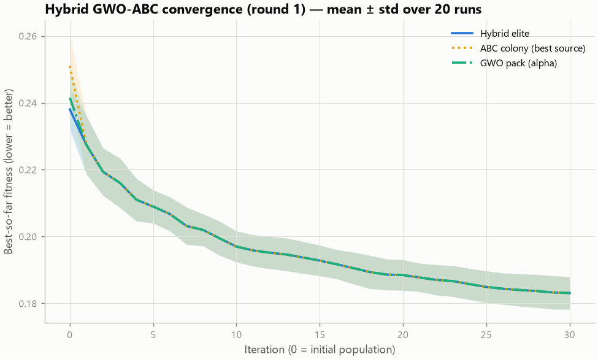

**Observed:** GWO: mean best fitness 0.2415 → 0.1831 (24.2% lower); 95% of the improvement reached by iteration 24; ABC: mean best fitness 0.2511 → 0.1831 (27.1% lower); 95% of the improvement reached by iteration 24; HYBRID: mean best fitness 0.2380 → 0.1831 (23.1% lower); 95% of the improvement reached by iteration 24

### Alive nodes vs rounds.

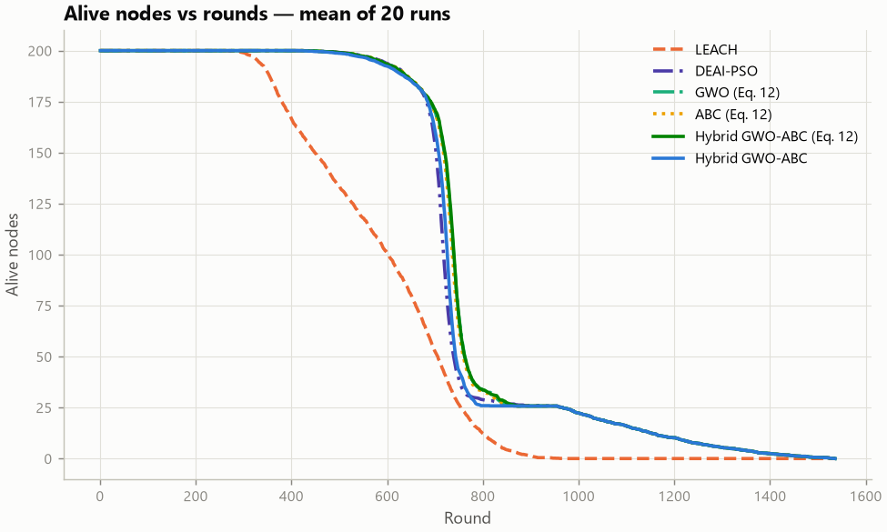

**Observed:** LEACH: FND 292, HND 602, LND 920; DEAI-PSO: FND 489, HND 718, LND 1487; GWO (Eq. 12): FND 483, HND 739, LND 1487; ABC (Eq. 12): FND 484, HND 737, LND 1487; Hybrid GWO-ABC (Eq. 12): FND 483, HND 740, LND 1487; Hybrid GWO-ABC: FND 471, HND 726, LND 1487

### Dead nodes vs rounds.

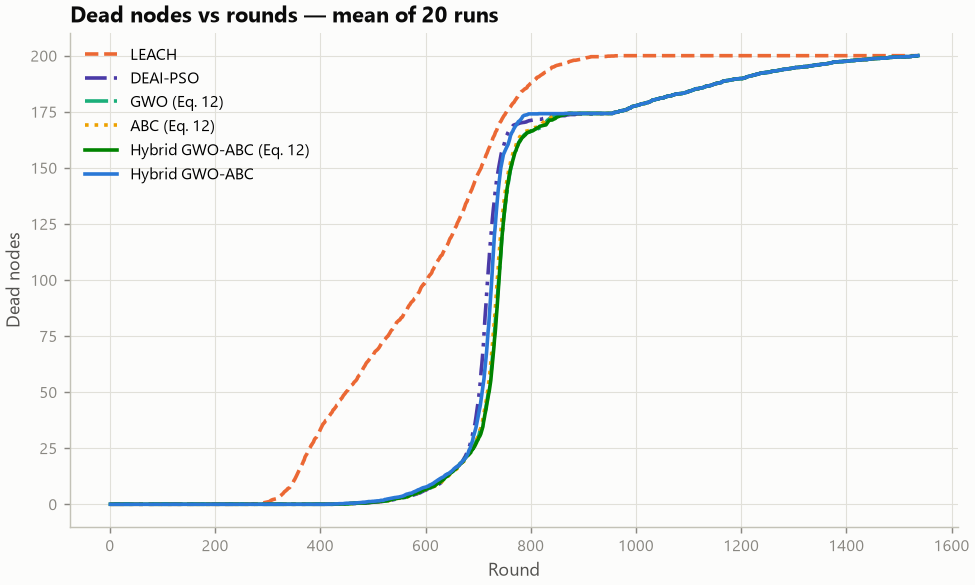

**Observed:** Mirror image of the alive-nodes curve; a steeper rise means nodes die closer together.

### Residual energy vs rounds.

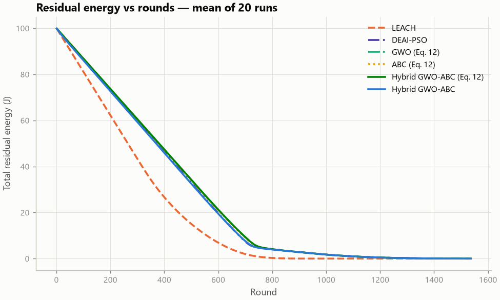

**Observed:** Residual energy at round 300: LEACH 43.28 J; DEAI-PSO 59.76 J; GWO (Eq. 12) 60.48 J; ABC (Eq. 12) 60.36 J; Hybrid GWO-ABC (Eq. 12) 60.51 J; Hybrid GWO-ABC 59.28 J

### Energy consumption vs rounds.

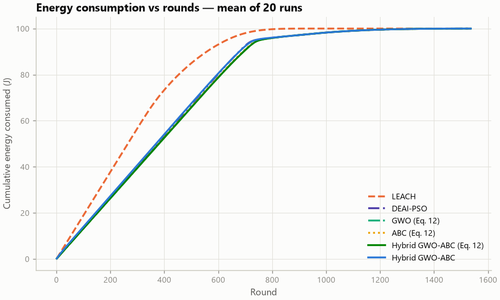

**Observed:** Consumed by round 300: LEACH 56.72 J; DEAI-PSO 40.24 J; GWO (Eq. 12) 39.52 J; ABC (Eq. 12) 39.64 J; Hybrid GWO-ABC (Eq. 12) 39.49 J; Hybrid GWO-ABC 40.72 J

### Throughput vs rounds (cumulative).

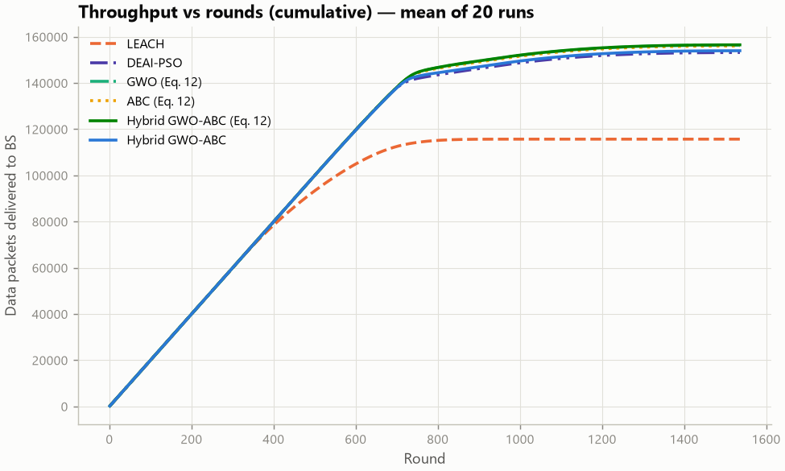

**Observed:** Total delivered: LEACH 115,698; DEAI-PSO 153,202; GWO (Eq. 12) 156,419; ABC (Eq. 12) 156,050; Hybrid GWO-ABC (Eq. 12) 156,526; Hybrid GWO-ABC 153,978

### PDR vs rounds.

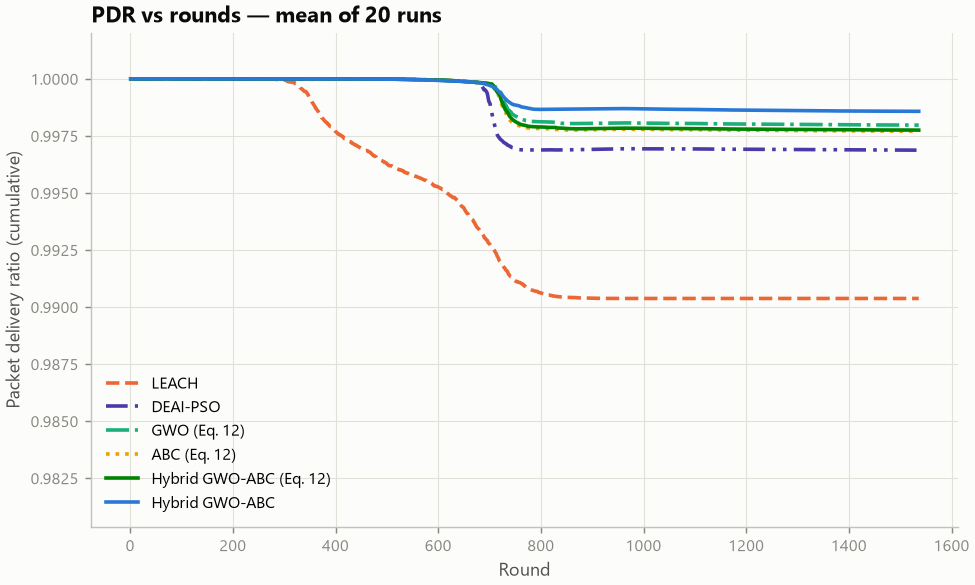

**Observed:** Final PDR: LEACH 0.9904; DEAI-PSO 0.9969; GWO (Eq. 12) 0.9980; ABC (Eq. 12) 0.9977; Hybrid GWO-ABC (Eq. 12) 0.9978; Hybrid GWO-ABC 0.9986

### CH count vs rounds (20-round rolling mean).

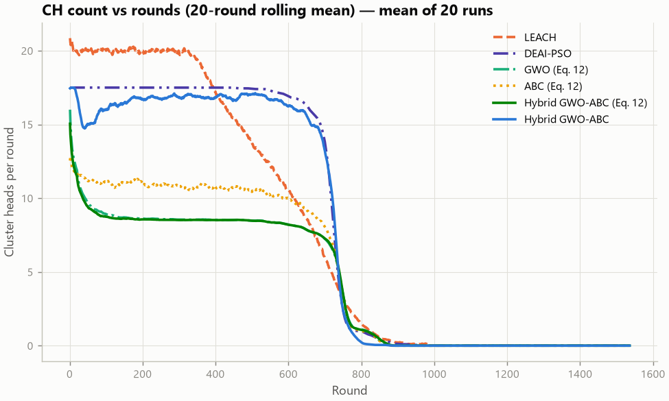

**Observed:** Mean CHs/round (rounds 1–300): LEACH 20.00 (per-round std 4.24); DEAI-PSO 17.50 (per-round std 0.50); GWO (Eq. 12) 9.05 (per-round std 1.20); ABC (Eq. 12) 11.06 (per-round std 2.51); Hybrid GWO-ABC (Eq. 12) 8.92 (per-round std 1.07); Hybrid GWO-ABC 16.38 (per-round std 2.74)

### Average cluster distance vs rounds (20-round rolling mean).

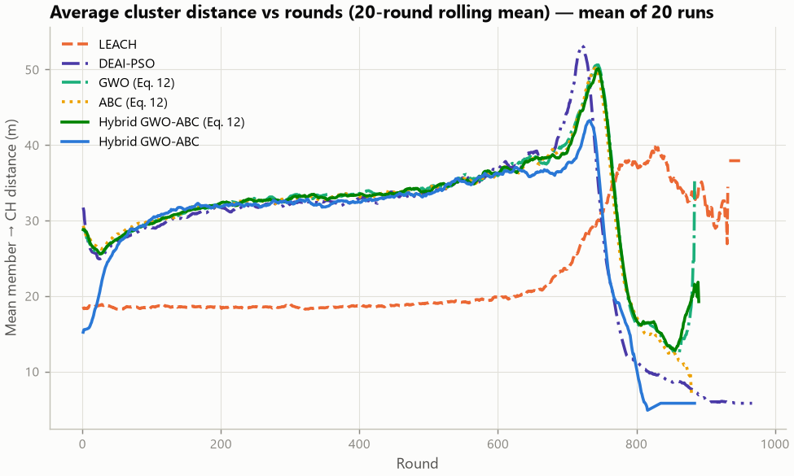

**Observed:** Mean member→CH distance: LEACH 18.54 m; DEAI-PSO 30.06 m; GWO (Eq. 12) 30.69 m; ABC (Eq. 12) 30.75 m; Hybrid GWO-ABC (Eq. 12) 30.65 m; Hybrid GWO-ABC 29.98 m

### Total CH-selection runtime per simulation (log scale, mean ± std).

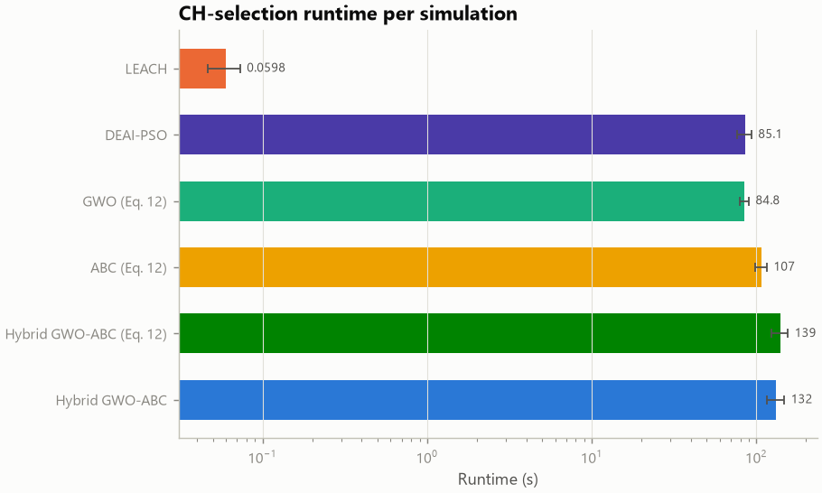

**Observed:** LEACH 0.06 s (0.07 ms/round, 0 fitness evaluations); DEAI-PSO 85.13 s (57.33 ms/round, 545,486 fitness evaluations); GWO (Eq. 12) 84.79 s (57.11 ms/round, 517,328 fitness evaluations); ABC (Eq. 12) 107.07 s (72.11 ms/round, 512,530 fitness evaluations); Hybrid GWO-ABC (Eq. 12) 139.45 s (93.91 ms/round, 520,459 fitness evaluations); Hybrid GWO-ABC 132.08 s (88.95 ms/round, 480,500 fitness evaluations)

### FND / HND / LND comparison (mean ± std over runs).

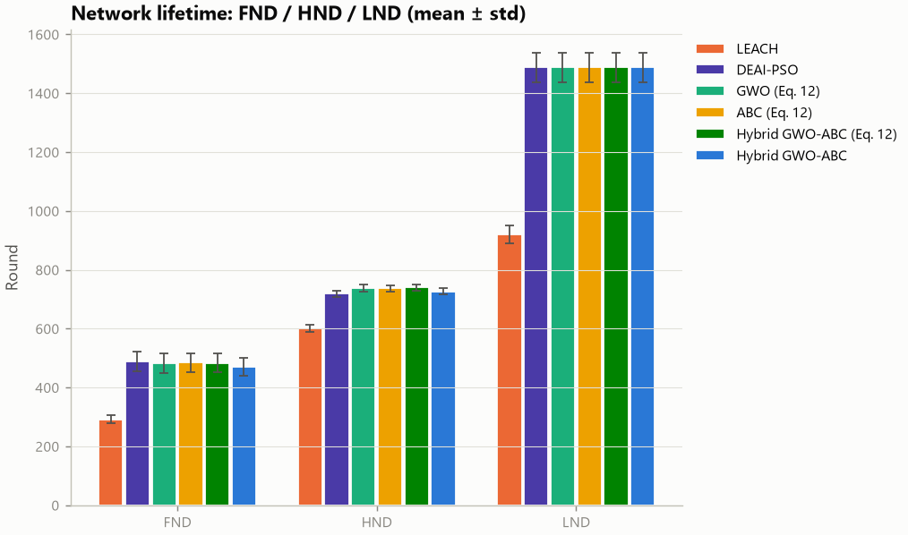

**Observed:** LEACH: FND 292, HND 602, LND 920; DEAI-PSO: FND 489, HND 718, LND 1487; GWO (Eq. 12): FND 483, HND 739, LND 1487; ABC (Eq. 12): FND 484, HND 737, LND 1487; Hybrid GWO-ABC (Eq. 12): FND 483, HND 740, LND 1487; Hybrid GWO-ABC: FND 471, HND 726, LND 1487

### Where the energy goes: mean energy per radio activity over rounds 1–300.

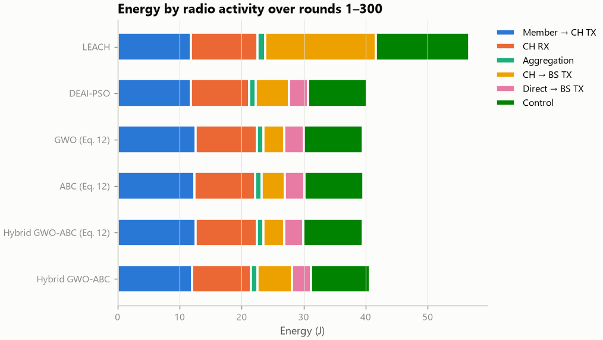

**Observed:** LEACH: total 41.63 J, largest share CH→BS TX (43%); DEAI-PSO: total 30.72 J, largest share member TX (39%); GWO (Eq. 12): total 29.99 J, largest share member TX (42%); ABC (Eq. 12): total 30.11 J, largest share member TX (41%); Hybrid GWO-ABC (Eq. 12): total 29.96 J, largest share member TX (42%); Hybrid GWO-ABC: total 31.19 J, largest share member TX (38%)

### Final fitness: same objective and weights for every algorithm.

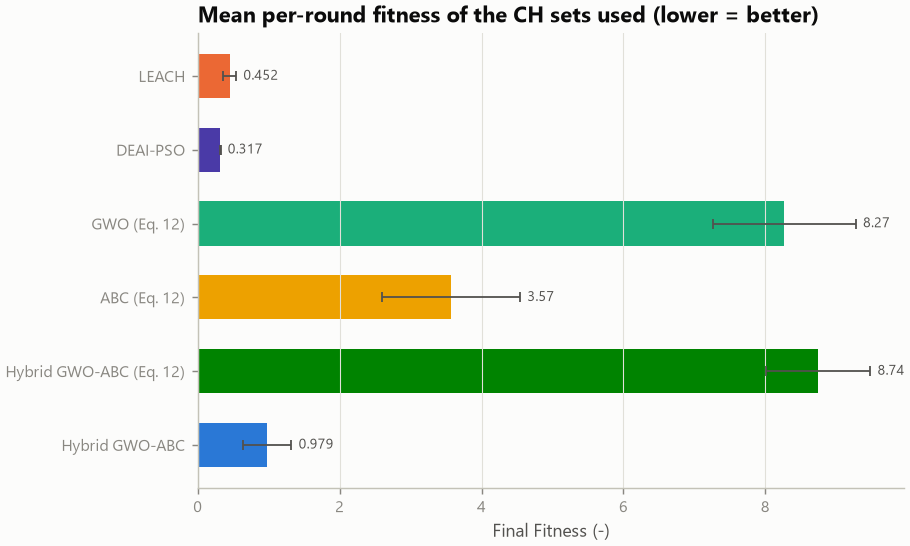

**Observed:** LEACH 0.4522; DEAI-PSO 0.3168; GWO (Eq. 12) 8.2685; ABC (Eq. 12) 3.5708; Hybrid GWO-ABC (Eq. 12) 8.7437; Hybrid GWO-ABC 0.9795

## Metric-by-metric interpretation

#### FND
- **What it represents:** First Node Death: the round in which the first node's residual energy reached 0.
- **How it was calculated:** min over nodes of the round in which residual energy reached 0 (simulation horizon if none died). (higher is better, unit: rounds)
- **Why it matters:** Marks the end of the stability period, during which every sensor still reports.
- **Observed (mean ± std over runs):** LEACH 292 (± 15), DEAI-PSO 489 (± 33), GWO (Eq. 12) 483 (± 32), ABC (Eq. 12) 484 (± 32), Hybrid GWO-ABC (Eq. 12) 483 (± 32), Hybrid GWO-ABC 471 (± 31). Best mean: **DEAI-PSO**.
- **Proposed vs baselines:** vs LEACH: Hybrid GWO-ABC (Eq. 12) is 65.22% better (improvement formula), p = 0.000431 (Holm), Cliff's δ = +1.00 (large) → **proposed better**; vs DEAI-PSO: Hybrid GWO-ABC (Eq. 12) is 1.16% worse (improvement formula), p = 0.00175 (Holm), Cliff's δ = -0.11 (negligible) → **proposed worse**; vs GWO (Eq. 12): Hybrid GWO-ABC (Eq. 12) is 0.12% better (improvement formula), p = 0.0151 (Holm), Cliff's δ = +0.04 (negligible) → **proposed better** — practically small; vs ABC (Eq. 12): Hybrid GWO-ABC (Eq. 12) is 0.19% worse (improvement formula), p = 0.0301 (Holm), Cliff's δ = -0.03 (negligible) → **proposed worse** — practically small; vs Hybrid GWO-ABC: Hybrid GWO-ABC (Eq. 12) is 2.68% better (improvement formula), p = 0.000431 (Holm), Cliff's δ = +0.22 (small) → **proposed better**.
- **Is the difference meaningful?** 5 of 5 comparisons are statistically significant at α = 0.05 after Holm correction. Differences that are not significant, or below 1.0% in size, should not be presented as improvements.
- **Possible explanation:** CH selection that avoids low-energy nodes and rotates the CH role evenly delays the first death; a node chosen repeatedly as CH (e.g. because it is close to the BS) dies early. Measured LND − FND spread (rounds): LEACH 628, DEAI-PSO 999, GWO (Eq. 12) 1005, ABC (Eq. 12) 1003, Hybrid GWO-ABC (Eq. 12) 1004, Hybrid GWO-ABC 1017.

#### HND
- **What it represents:** Half Node Death: the round in which at least 50% of the nodes were dead.
- **How it was calculated:** round in which the number of dead nodes reached ceil(N/2). (higher is better, unit: rounds)
- **Why it matters:** Indicates how long the network keeps useful coverage.
- **Observed (mean ± std over runs):** LEACH 602 (± 13), DEAI-PSO 718 (± 12), GWO (Eq. 12) 739 (± 12), ABC (Eq. 12) 737 (± 12), Hybrid GWO-ABC (Eq. 12) 740 (± 12), Hybrid GWO-ABC 726 (± 11). Best mean: **Hybrid GWO-ABC (Eq. 12)**.
- **Proposed vs baselines:** vs LEACH: Hybrid GWO-ABC (Eq. 12) is 22.95% better (improvement formula), p = 0.000362 (Holm), Cliff's δ = +1.00 (large) → **proposed better**; vs DEAI-PSO: Hybrid GWO-ABC (Eq. 12) is 2.98% better (improvement formula), p = 0.000362 (Holm), Cliff's δ = +0.82 (large) → **proposed better**; vs GWO (Eq. 12): Hybrid GWO-ABC (Eq. 12) is 0.11% better (improvement formula), p = 0.0172 (Holm), Cliff's δ = +0.05 (negligible) → **proposed better** — practically small; vs ABC (Eq. 12): Hybrid GWO-ABC (Eq. 12) is 0.41% better (improvement formula), p = 0.000362 (Holm), Cliff's δ = +0.21 (small) → **proposed better** — practically small; vs Hybrid GWO-ABC: Hybrid GWO-ABC (Eq. 12) is 1.89% better (improvement formula), p = 0.000362 (Holm), Cliff's δ = +0.70 (large) → **proposed better**.
- **Is the difference meaningful?** 5 of 5 comparisons are statistically significant at α = 0.05 after Holm correction. Differences that are not significant, or below 1.0% in size, should not be presented as improvements.
- **Possible explanation:** HND reflects how evenly energy is drained across the whole network.

#### LND
- **What it represents:** Last Node Death: the round in which the last alive node died.
- **How it was calculated:** round in which the last node died (simulation horizon if nodes were still alive). (higher is better, unit: rounds)
- **Why it matters:** Upper bound of the network lifetime.
- **Observed (mean ± std over runs):** LEACH 920 (± 30), DEAI-PSO 1,487 (± 51), GWO (Eq. 12) 1,487 (± 51), ABC (Eq. 12) 1,487 (± 51), Hybrid GWO-ABC (Eq. 12) 1,487 (± 51), Hybrid GWO-ABC 1,487 (± 51). Best mean: **DEAI-PSO**.
- **Proposed vs baselines:** vs LEACH: Hybrid GWO-ABC (Eq. 12) is 61.59% better (improvement formula), p = 0.000442 (Holm), Cliff's δ = +1.00 (large) → **proposed better**; vs DEAI-PSO: Hybrid GWO-ABC (Eq. 12) is 0.00% equal (improvement formula), p = 1 (Holm), Cliff's δ = +0.00 (negligible) → **no significant difference** — practically small; vs GWO (Eq. 12): Hybrid GWO-ABC (Eq. 12) is 0.00% equal (improvement formula), p = 1 (Holm), Cliff's δ = +0.00 (negligible) → **no significant difference** — practically small; vs ABC (Eq. 12): Hybrid GWO-ABC (Eq. 12) is 0.00% equal (improvement formula), p = 1 (Holm), Cliff's δ = +0.00 (negligible) → **no significant difference** — practically small; vs Hybrid GWO-ABC: Hybrid GWO-ABC (Eq. 12) is 0.00% equal (improvement formula), p = 1 (Holm), Cliff's δ = +0.00 (negligible) → **no significant difference** — practically small.
- **Is the difference meaningful?** 1 of 5 comparisons are statistically significant at α = 0.05 after Holm correction. Differences that are not significant, or below 1.0% in size, should not be presented as improvements.
- **Possible explanation:** A very even energy drain makes all nodes die at nearly the same time: FND is delayed but the last node also dies sooner. Uneven drain leaves a few nodes with spare energy that keep running. Measured LND − FND spread (rounds): LEACH 628, DEAI-PSO 999, GWO (Eq. 12) 1005, ABC (Eq. 12) 1003, Hybrid GWO-ABC (Eq. 12) 1004, Hybrid GWO-ABC 1017.

#### Residual Energy
- **What it represents:** Total residual energy of all nodes at the checkpoint round.
- **How it was calculated:** sum of node residual energies after the checkpoint round. (higher is better, unit: J)
- **Why it matters:** More energy left at the same round means cheaper operation.
- **Observed (mean ± std over runs):** LEACH 43.278 (± 0.764), DEAI-PSO 59.759 (± 0.550), GWO (Eq. 12) 60.482 (± 0.526), ABC (Eq. 12) 60.365 (± 0.535), Hybrid GWO-ABC (Eq. 12) 60.514 (± 0.528), Hybrid GWO-ABC 59.284 (± 0.558). Best mean: **Hybrid GWO-ABC (Eq. 12)**.
- **Proposed vs baselines:** vs LEACH: Hybrid GWO-ABC (Eq. 12) is 39.83% better (improvement formula), p = 9.54e-06 (Holm), Cliff's δ = +1.00 (large) → **proposed better**; vs DEAI-PSO: Hybrid GWO-ABC (Eq. 12) is 1.26% better (improvement formula), p = 9.54e-06 (Holm), Cliff's δ = +0.68 (large) → **proposed better**; vs GWO (Eq. 12): Hybrid GWO-ABC (Eq. 12) is 0.05% better (improvement formula), p = 9.54e-06 (Holm), Cliff's δ = +0.10 (negligible) → **proposed better** — practically small; vs ABC (Eq. 12): Hybrid GWO-ABC (Eq. 12) is 0.25% better (improvement formula), p = 9.54e-06 (Holm), Cliff's δ = +0.18 (small) → **proposed better** — practically small; vs Hybrid GWO-ABC: Hybrid GWO-ABC (Eq. 12) is 2.08% better (improvement formula), p = 9.54e-06 (Holm), Cliff's δ = +0.91 (large) → **proposed better**.
- **Is the difference meaningful?** 5 of 5 comparisons are statistically significant at α = 0.05 after Holm correction. Differences that are not significant, or below 1.0% in size, should not be presented as improvements.
- **Possible explanation:** Residual energy at a fixed round depends on per-round radio cost: shorter member->CH links and shorter or fewer CH->BS links consume less.

#### Energy Consumption
- **What it represents:** Initial total energy minus residual energy at the checkpoint round.
- **How it was calculated:** N * E0 - residual energy at the checkpoint round. (lower is better, unit: J)
- **Why it matters:** Energy spent to operate the network for the same number of rounds.
- **Observed (mean ± std over runs):** LEACH 56.722 (± 0.764), DEAI-PSO 40.241 (± 0.550), GWO (Eq. 12) 39.518 (± 0.526), ABC (Eq. 12) 39.635 (± 0.535), Hybrid GWO-ABC (Eq. 12) 39.486 (± 0.528), Hybrid GWO-ABC 40.716 (± 0.558). Best mean: **Hybrid GWO-ABC (Eq. 12)**.
- **Proposed vs baselines:** vs LEACH: Hybrid GWO-ABC (Eq. 12) is 30.39% better (reduction formula), p = 9.54e-06 (Holm), Cliff's δ = +1.00 (large) → **proposed better**; vs DEAI-PSO: Hybrid GWO-ABC (Eq. 12) is 1.88% better (reduction formula), p = 9.54e-06 (Holm), Cliff's δ = +0.68 (large) → **proposed better**; vs GWO (Eq. 12): Hybrid GWO-ABC (Eq. 12) is 0.08% better (reduction formula), p = 9.54e-06 (Holm), Cliff's δ = +0.10 (negligible) → **proposed better** — practically small; vs ABC (Eq. 12): Hybrid GWO-ABC (Eq. 12) is 0.38% better (reduction formula), p = 9.54e-06 (Holm), Cliff's δ = +0.18 (small) → **proposed better** — practically small; vs Hybrid GWO-ABC: Hybrid GWO-ABC (Eq. 12) is 3.02% better (reduction formula), p = 9.54e-06 (Holm), Cliff's δ = +0.91 (large) → **proposed better**.
- **Is the difference meaningful?** 5 of 5 comparisons are statistically significant at α = 0.05 after Holm correction. Differences that are not significant, or below 1.0% in size, should not be presented as improvements.
- **Possible explanation:** Consumption is the complement of residual energy at the same checkpoint.

#### Throughput
- **What it represents:** Total sensor data packets delivered to the BS over the whole simulation (directly or inside an aggregated CH packet).
- **How it was calculated:** count of sensor readings that reached the BS over the whole run. (higher is better, unit: packets)
- **Why it matters:** Amount of sensed data the application actually receives.
- **Observed (mean ± std over runs):** LEACH 115,698 (± 1,505), DEAI-PSO 153,202 (± 2,951), GWO (Eq. 12) 156,419 (± 2,711), ABC (Eq. 12) 156,050 (± 2,729), Hybrid GWO-ABC (Eq. 12) 156,526 (± 2,659), Hybrid GWO-ABC 153,978 (± 2,614). Best mean: **Hybrid GWO-ABC (Eq. 12)**.
- **Proposed vs baselines:** vs LEACH: Hybrid GWO-ABC (Eq. 12) is 35.29% better (improvement formula), p = 9.54e-06 (Holm), Cliff's δ = +1.00 (large) → **proposed better**; vs DEAI-PSO: Hybrid GWO-ABC (Eq. 12) is 2.17% better (improvement formula), p = 9.54e-06 (Holm), Cliff's δ = +0.59 (large) → **proposed better**; vs GWO (Eq. 12): Hybrid GWO-ABC (Eq. 12) is 0.07% better (improvement formula), p = 0.0646 (Holm), Cliff's δ = +0.04 (negligible) → **no significant difference** — practically small; vs ABC (Eq. 12): Hybrid GWO-ABC (Eq. 12) is 0.31% better (improvement formula), p = 9.54e-06 (Holm), Cliff's δ = +0.13 (negligible) → **proposed better** — practically small; vs Hybrid GWO-ABC: Hybrid GWO-ABC (Eq. 12) is 1.65% better (improvement formula), p = 9.54e-06 (Holm), Cliff's δ = +0.50 (large) → **proposed better**.
- **Is the difference meaningful?** 4 of 5 comparisons are statistically significant at α = 0.05 after Holm correction. Differences that are not significant, or below 1.0% in size, should not be presented as improvements.
- **Possible explanation:** Throughput grows with the number of rounds in which nodes are alive and with the share of packets that are not lost to CHs dying mid-round.

#### PDR
- **What it represents:** Packet Delivery Ratio = delivered data packets / generated data packets.
- **How it was calculated:** delivered readings / generated readings over the whole run. (higher is better, unit: ratio)
- **Why it matters:** Reliability: share of generated readings that reach the BS.
- **Observed (mean ± std over runs):** LEACH 0.9904 (± 0.0006), DEAI-PSO 0.9969 (± 0.0014), GWO (Eq. 12) 0.9980 (± 0.0008), ABC (Eq. 12) 0.9977 (± 0.0009), Hybrid GWO-ABC (Eq. 12) 0.9978 (± 0.0010), Hybrid GWO-ABC 0.9986 (± 0.0001). Best mean: **Hybrid GWO-ABC**.
- **Proposed vs baselines:** vs LEACH: Hybrid GWO-ABC (Eq. 12) is 0.74% better (improvement formula), p = 9.54e-06 (Holm), Cliff's δ = +1.00 (large) → **proposed better** — practically small; vs DEAI-PSO: Hybrid GWO-ABC (Eq. 12) is 0.09% better (improvement formula), p = 0.0799 (Holm), Cliff's δ = +0.38 (medium) → **no significant difference** — practically small; vs GWO (Eq. 12): Hybrid GWO-ABC (Eq. 12) is 0.02% worse (improvement formula), p = 0.522 (Holm), Cliff's δ = -0.09 (negligible) → **no significant difference** — practically small; vs ABC (Eq. 12): Hybrid GWO-ABC (Eq. 12) is 0.00% better (improvement formula), p = 0.784 (Holm), Cliff's δ = +0.07 (negligible) → **no significant difference** — practically small; vs Hybrid GWO-ABC: Hybrid GWO-ABC (Eq. 12) is 0.08% worse (improvement formula), p = 0.00193 (Holm), Cliff's δ = -0.53 (large) → **proposed worse** — practically small.
- **Is the difference meaningful?** 2 of 5 comparisons are statistically significant at α = 0.05 after Holm correction. Differences that are not significant, or below 1.0% in size, should not be presented as improvements.
- **Possible explanation:** Packets are lost when a CH runs out of energy before forwarding its cluster's data, or when a node dies while transmitting. Energy-feasibility checks on CHs reduce such losses.

#### Avg. Cluster Distance
- **What it represents:** Mean member->CH distance, averaged over rounds 1..checkpoint.
- **How it was calculated:** per round mean member->CH distance, averaged over rounds 1..checkpoint. (lower is better, unit: m)
- **Why it matters:** Shorter intra-cluster links cost less transmission energy (d^2 / d^4).
- **Observed (mean ± std over runs):** LEACH 18.542 (± 0.288), DEAI-PSO 30.058 (± 1.300), GWO (Eq. 12) 30.687 (± 0.927), ABC (Eq. 12) 30.747 (± 0.890), Hybrid GWO-ABC (Eq. 12) 30.653 (± 0.915), Hybrid GWO-ABC 29.983 (± 1.298). Best mean: **LEACH**.
- **Proposed vs baselines:** vs LEACH: Hybrid GWO-ABC (Eq. 12) is 65.31% worse (reduction formula), p = 9.54e-06 (Holm), Cliff's δ = -1.00 (large) → **proposed worse**; vs DEAI-PSO: Hybrid GWO-ABC (Eq. 12) is 1.98% worse (reduction formula), p = 0.000107 (Holm), Cliff's δ = -0.27 (small) → **proposed worse**; vs GWO (Eq. 12): Hybrid GWO-ABC (Eq. 12) is 0.11% better (reduction formula), p = 0.231 (Holm), Cliff's δ = +0.01 (negligible) → **no significant difference** — practically small; vs ABC (Eq. 12): Hybrid GWO-ABC (Eq. 12) is 0.31% better (reduction formula), p = 0.00731 (Holm), Cliff's δ = +0.07 (negligible) → **proposed better** — practically small; vs Hybrid GWO-ABC: Hybrid GWO-ABC (Eq. 12) is 2.23% worse (reduction formula), p = 0.000784 (Holm), Cliff's δ = -0.34 (medium) → **proposed worse**.
- **Is the difference meaningful?** 4 of 5 comparisons are statistically significant at α = 0.05 after Holm correction. Differences that are not significant, or below 1.0% in size, should not be presented as improvements.
- **Possible explanation:** The fitness function explicitly penalises member->CH distance; LEACH places CHs at random positions, which typically lengthens member links.

#### Avg. CH-BS Distance
- **What it represents:** Mean CH->BS distance, averaged over rounds 1..checkpoint.
- **How it was calculated:** per round mean CH->BS distance, averaged over rounds 1..checkpoint. (lower is better, unit: m)
- **Why it matters:** CH->BS is the longest and most expensive hop.
- **Observed (mean ± std over runs):** LEACH 135.940 (± 2.488), DEAI-PSO 104.609 (± 1.804), GWO (Eq. 12) 110.364 (± 1.843), ABC (Eq. 12) 108.029 (± 1.982), Hybrid GWO-ABC (Eq. 12) 110.377 (± 1.752), Hybrid GWO-ABC 107.514 (± 2.619). Best mean: **DEAI-PSO**.
- **Proposed vs baselines:** vs LEACH: Hybrid GWO-ABC (Eq. 12) is 18.81% better (reduction formula), p = 9.54e-06 (Holm), Cliff's δ = +1.00 (large) → **proposed better**; vs DEAI-PSO: Hybrid GWO-ABC (Eq. 12) is 5.51% worse (reduction formula), p = 9.54e-06 (Holm), Cliff's δ = -0.98 (large) → **proposed worse**; vs GWO (Eq. 12): Hybrid GWO-ABC (Eq. 12) is 0.01% worse (reduction formula), p = 0.729 (Holm), Cliff's δ = -0.00 (negligible) → **no significant difference** — practically small; vs ABC (Eq. 12): Hybrid GWO-ABC (Eq. 12) is 2.17% worse (reduction formula), p = 9.54e-06 (Holm), Cliff's δ = -0.64 (large) → **proposed worse**; vs Hybrid GWO-ABC: Hybrid GWO-ABC (Eq. 12) is 2.66% worse (reduction formula), p = 9.54e-06 (Holm), Cliff's δ = -0.61 (large) → **proposed worse**.
- **Is the difference meaningful?** 4 of 5 comparisons are statistically significant at α = 0.05 after Holm correction. Differences that are not significant, or below 1.0% in size, should not be presented as improvements.
- **Possible explanation:** The fitness penalises CH->BS distance, but the energy-eligibility rule and the energy term limit how often nodes near the BS can be selected.

#### Runtime
- **What it represents:** Total wall-clock time spent selecting CHs over the whole simulation.
- **How it was calculated:** sum of wall-clock CH-selection time over all rounds (time.perf_counter). (lower is better, unit: s)
- **Why it matters:** Computational cost of the CH selection algorithm.
- **Observed (mean ± std over runs):** LEACH 0.06 (± 0.01), DEAI-PSO 85.13 (± 8.50), GWO (Eq. 12) 84.79 (± 5.49), ABC (Eq. 12) 107.07 (± 8.95), Hybrid GWO-ABC (Eq. 12) 139.45 (± 16.36), Hybrid GWO-ABC 132.08 (± 16.00). Best mean: **LEACH**.
- **Proposed vs baselines:** vs LEACH: Hybrid GWO-ABC (Eq. 12) is 232926.98% worse (reduction formula), p = 9.54e-06 (Holm), Cliff's δ = -1.00 (large) → **proposed worse** (proposed/baseline ratio 2330×); vs DEAI-PSO: Hybrid GWO-ABC (Eq. 12) is 63.82% worse (reduction formula), p = 9.54e-06 (Holm), Cliff's δ = -0.93 (large) → **proposed worse**; vs GWO (Eq. 12): Hybrid GWO-ABC (Eq. 12) is 64.46% worse (reduction formula), p = 9.54e-06 (Holm), Cliff's δ = -0.91 (large) → **proposed worse**; vs ABC (Eq. 12): Hybrid GWO-ABC (Eq. 12) is 30.25% worse (reduction formula), p = 9.54e-06 (Holm), Cliff's δ = -0.91 (large) → **proposed worse**; vs Hybrid GWO-ABC: Hybrid GWO-ABC (Eq. 12) is 5.58% worse (reduction formula), p = 9.54e-06 (Holm), Cliff's δ = -0.49 (large) → **proposed worse**.
- **Is the difference meaningful?** 5 of 5 comparisons are statistically significant at α = 0.05 after Holm correction. Differences that are not significant, or below 1.0% in size, should not be presented as improvements.
- **Possible explanation:** Metaheuristics evaluate hundreds of candidate CH sets per round; LEACH needs one random draw per node. The hybrid runs two populations and more operators per iteration, which adds overhead even at an equal number of fitness evaluations. Runtime relative to LEACH: DEAI-PSO 1422×, GWO (Eq. 12) 1417×, ABC (Eq. 12) 1789×, Hybrid GWO-ABC (Eq. 12) 2330×, Hybrid GWO-ABC 2207×.

#### Final Fitness
- **What it represents:** Mean per-round fitness (same function and weights for every algorithm) of the CH set actually used, over rounds 1..checkpoint. Lower is better.
- **How it was calculated:** per round fitness of the CH set used (same weights for all), mean over rounds 1..checkpoint. (lower is better, unit: -)
- **Why it matters:** Quality of the CH configurations according to the optimisation objective.
- **Observed (mean ± std over runs):** LEACH 0.4522 (± 0.0898), DEAI-PSO 0.3168 (± 0.0048), GWO (Eq. 12) 8.2685 (± 1.0076), ABC (Eq. 12) 3.5708 (± 0.9743), Hybrid GWO-ABC (Eq. 12) 8.7437 (± 0.7369), Hybrid GWO-ABC 0.9795 (± 0.3413). Best mean: **DEAI-PSO**.
- **Proposed vs baselines:** vs LEACH: Hybrid GWO-ABC (Eq. 12) is 1833.75% worse (reduction formula), p = 9.54e-06 (Holm), Cliff's δ = -1.00 (large) → **proposed worse** (proposed/baseline ratio 19×); vs DEAI-PSO: Hybrid GWO-ABC (Eq. 12) is 2660.42% worse (reduction formula), p = 9.54e-06 (Holm), Cliff's δ = -1.00 (large) → **proposed worse** (proposed/baseline ratio 28×); vs GWO (Eq. 12): Hybrid GWO-ABC (Eq. 12) is 5.75% worse (reduction formula), p = 9.54e-06 (Holm), Cliff's δ = -0.28 (small) → **proposed worse**; vs ABC (Eq. 12): Hybrid GWO-ABC (Eq. 12) is 144.86% worse (reduction formula), p = 9.54e-06 (Holm), Cliff's δ = -1.00 (large) → **proposed worse**; vs Hybrid GWO-ABC: Hybrid GWO-ABC (Eq. 12) is 792.68% worse (reduction formula), p = 9.54e-06 (Holm), Cliff's δ = -1.00 (large) → **proposed worse**.
- **Is the difference meaningful?** 5 of 5 comparisons are statistically significant at α = 0.05 after Holm correction. Differences that are not significant, or below 1.0% in size, should not be presented as improvements.
- **Possible explanation:** Optimisers minimise this objective directly; LEACH does not use it, and rounds in which LEACH elects zero CHs or too many receive the invalid-solution penalty.

#### Node-rounds
- **What it represents:** Sum over rounds of the number of alive nodes (area under the alive-nodes curve).
- **How it was calculated:** sum over rounds of alive nodes. (higher is better, unit: node x rounds)
- **Why it matters:** Single-number lifetime measure that accounts for the whole death curve.
- **Observed (mean ± std over runs):** LEACH 116,622 (± 1,529), DEAI-PSO 153,481 (± 2,901), GWO (Eq. 12) 156,536 (± 2,701), ABC (Eq. 12) 156,208 (± 2,712), Hybrid GWO-ABC (Eq. 12) 156,679 (± 2,669), Hybrid GWO-ABC 153,997 (± 2,610). Best mean: **Hybrid GWO-ABC (Eq. 12)**.
- **Proposed vs baselines:** vs LEACH: Hybrid GWO-ABC (Eq. 12) is 34.35% better (improvement formula), p = 9.54e-06 (Holm), Cliff's δ = +1.00 (large) → **proposed better**; vs DEAI-PSO: Hybrid GWO-ABC (Eq. 12) is 2.08% better (improvement formula), p = 9.54e-06 (Holm), Cliff's δ = +0.57 (large) → **proposed better**; vs GWO (Eq. 12): Hybrid GWO-ABC (Eq. 12) is 0.09% better (improvement formula), p = 0.000851 (Holm), Cliff's δ = +0.04 (negligible) → **proposed better** — practically small; vs ABC (Eq. 12): Hybrid GWO-ABC (Eq. 12) is 0.30% better (improvement formula), p = 9.54e-06 (Holm), Cliff's δ = +0.14 (negligible) → **proposed better** — practically small; vs Hybrid GWO-ABC: Hybrid GWO-ABC (Eq. 12) is 1.74% better (improvement formula), p = 9.54e-06 (Holm), Cliff's δ = +0.55 (large) → **proposed better**.
- **Is the difference meaningful?** 5 of 5 comparisons are statistically significant at α = 0.05 after Holm correction. Differences that are not significant, or below 1.0% in size, should not be presented as improvements.
- **Possible explanation:** The area under the alive-nodes curve combines stability period and tail length.

#### Cluster Imbalance
- **What it represents:** Coefficient of variation of cluster sizes, averaged over rounds 1..checkpoint.
- **How it was calculated:** per round std/mean of cluster sizes, averaged over rounds 1..checkpoint. (lower is better, unit: CV)
- **Why it matters:** Balanced clusters spread the CH load evenly.
- **Observed (mean ± std over runs):** LEACH 0.5700 (± 0.0072), DEAI-PSO 1.3906 (± 0.0565), GWO (Eq. 12) 0.8621 (± 0.0387), ABC (Eq. 12) 1.0441 (± 0.0454), Hybrid GWO-ABC (Eq. 12) 0.8473 (± 0.0374), Hybrid GWO-ABC 1.2450 (± 0.1049). Best mean: **LEACH**.
- **Proposed vs baselines:** vs LEACH: Hybrid GWO-ABC (Eq. 12) is 48.66% worse (reduction formula), p = 9.54e-06 (Holm), Cliff's δ = -1.00 (large) → **proposed worse**; vs DEAI-PSO: Hybrid GWO-ABC (Eq. 12) is 39.07% better (reduction formula), p = 9.54e-06 (Holm), Cliff's δ = +1.00 (large) → **proposed better**; vs GWO (Eq. 12): Hybrid GWO-ABC (Eq. 12) is 1.72% better (reduction formula), p = 9.54e-06 (Holm), Cliff's δ = +0.28 (small) → **proposed better**; vs ABC (Eq. 12): Hybrid GWO-ABC (Eq. 12) is 18.85% better (reduction formula), p = 9.54e-06 (Holm), Cliff's δ = +1.00 (large) → **proposed better**; vs Hybrid GWO-ABC: Hybrid GWO-ABC (Eq. 12) is 31.95% better (reduction formula), p = 9.54e-06 (Holm), Cliff's δ = +1.00 (large) → **proposed better**.
- **Is the difference meaningful?** 5 of 5 comparisons are statistically significant at α = 0.05 after Holm correction. Differences that are not significant, or below 1.0% in size, should not be presented as improvements.
- **Possible explanation:** The fitness penalises unequal cluster sizes; nearest-CH assignment does not.

## Cluster-head records (run 0)

Every selected CH of every round is recorded in `ch_log_run0.csv` (round, CH id, coordinates, residual energy at selection, distance to the BS, cluster size including the CH). Dead and duplicate CHs are removed before clustering, so only valid CHs appear.

### LEACH

Over 845 rounds with CHs: 13.80 CHs/round on average; mean CH residual energy at selection 0.2461 J; mean CH–BS distance 127.05 m; 200 distinct nodes served as CH, the most frequent one 91 times.

Round 1 cluster heads:

| CH id | x (m) | y (m) | Residual energy (J) | CH–BS (m) | Cluster size |
|---|---:|---:|---:|---:|---:|
| 4 | 19.22 | 67.56 | 0.5 | 181.6 | 21 |
| 17 | 70.43 | 28.42 | 0.5 | 131.4 | 11 |
| 27 | 105.8 | 117.1 | 0.5 | 115.7 | 9 |
| 51 | 39.88 | 145.4 | 0.5 | 186.4 | 14 |
| 68 | 143.8 | 72.35 | 0.5 | 60.49 | 9 |
| 74 | 65.84 | 3.242 | 0.5 | 142.1 | 5 |
| 84 | 47.57 | 142.9 | 0.5 | 178.5 | 10 |
| 85 | 43.64 | 77.26 | 0.5 | 158.7 | 16 |
| 97 | 22.99 | 26.89 | 0.5 | 178.5 | 3 |
| 108 | 19.66 | 18.56 | 0.5 | 183.1 | 7 |
| 122 | 90.9 | 130.2 | 0.5 | 135.4 | 11 |
| 124 | 56.13 | 63.88 | 0.5 | 144.5 | 15 |
| 135 | 8.309 | 26.2 | 0.5 | 193.2 | 6 |
| 139 | 131.3 | 127.7 | 0.5 | 103.7 | 12 |
| 149 | 116.9 | 96.37 | 0.5 | 95.14 | 14 |
| 163 | 120.7 | 79.91 | 0.5 | 84.79 | 10 |
| 175 | 92.42 | 25.69 | 0.5 | 110.3 | 23 |
| 187 | 23.64 | 22.17 | 0.5 | 178.5 | 4 |

### DEAI-PSO

Over 825 rounds with CHs: 15.60 CHs/round on average; mean CH residual energy at selection 0.2753 J; mean CH–BS distance 100.06 m; 164 distinct nodes served as CH, the most frequent one 576 times.

Round 1 cluster heads:

| CH id | x (m) | y (m) | Residual energy (J) | CH–BS (m) | Cluster size |
|---|---:|---:|---:|---:|---:|
| 1 | 128.8 | 104.6 | 0.5 | 89.74 | 10 |
| 6 | 96.58 | 123.4 | 0.5 | 126.8 | 25 |
| 10 | 113.7 | 53.18 | 0.5 | 86.35 | 1 |
| 21 | 105 | 46.85 | 0.5 | 95.01 | 2 |
| 30 | 100.3 | 70.66 | 0.5 | 101.9 | 8 |
| 33 | 83.88 | 45.59 | 0.5 | 116.2 | 4 |
| 46 | 66.92 | 57.15 | 0.5 | 133.3 | 18 |
| 58 | 113.8 | 107.9 | 0.5 | 103.9 | 10 |
| 60 | 87.61 | 97.48 | 0.5 | 122 | 4 |
| 70 | 73 | 73.61 | 0.5 | 129.2 | 15 |
| 72 | 71.02 | 40.05 | 0.5 | 129.4 | 27 |
| 149 | 116.9 | 96.37 | 0.5 | 95.14 | 7 |
| 150 | 116.8 | 20.18 | 0.5 | 88.34 | 4 |
| 175 | 92.42 | 25.69 | 0.5 | 110.3 | 11 |
| 185 | 114.4 | 40.58 | 0.5 | 86.14 | 3 |
| 191 | 117 | 71.91 | 0.5 | 85.8 | 2 |
| 196 | 88.24 | 102.9 | 0.5 | 123.7 | 14 |
| 199 | 68.78 | 66.35 | 0.5 | 132.2 | 17 |

### GWO (Eq. 12)

Over 830 rounds with CHs: 8.21 CHs/round on average; mean CH residual energy at selection 0.2840 J; mean CH–BS distance 103.68 m; 161 distinct nodes served as CH, the most frequent one 389 times.

Round 1 cluster heads:

| CH id | x (m) | y (m) | Residual energy (J) | CH–BS (m) | Cluster size |
|---|---:|---:|---:|---:|---:|
| 0 | 116.1 | 65.83 | 0.5 | 85.39 | 2 |
| 1 | 128.8 | 104.6 | 0.5 | 89.74 | 3 |
| 6 | 96.58 | 123.4 | 0.5 | 126.8 | 23 |
| 8 | 83.19 | 9.573 | 0.5 | 123.6 | 9 |
| 9 | 124.1 | 94.75 | 0.5 | 88.07 | 7 |
| 17 | 70.43 | 28.42 | 0.5 | 131.4 | 19 |
| 22 | 124.8 | 120.7 | 0.5 | 103.2 | 8 |
| 27 | 105.8 | 117.1 | 0.5 | 115.7 | 6 |
| 43 | 108.4 | 69.28 | 0.5 | 93.65 | 7 |
| 46 | 66.92 | 57.15 | 0.5 | 133.3 | 14 |
| 53 | 67.4 | 40.84 | 0.5 | 132.9 | 13 |
| 66 | 87.16 | 52.03 | 0.5 | 112.9 | 7 |
| 70 | 73 | 73.61 | 0.5 | 129.2 | 17 |
| 117 | 140 | 120.7 | 0.5 | 92.72 | 4 |
| 150 | 116.8 | 20.18 | 0.5 | 88.34 | 5 |
| 185 | 114.4 | 40.58 | 0.5 | 86.14 | 5 |
| 196 | 88.24 | 102.9 | 0.5 | 123.7 | 16 |
| 199 | 68.78 | 66.35 | 0.5 | 132.2 | 17 |

### ABC (Eq. 12)

Over 823 rounds with CHs: 10.12 CHs/round on average; mean CH residual energy at selection 0.2852 J; mean CH–BS distance 101.62 m; 160 distinct nodes served as CH, the most frequent one 406 times.

Round 1 cluster heads:

| CH id | x (m) | y (m) | Residual energy (J) | CH–BS (m) | Cluster size |
|---|---:|---:|---:|---:|---:|
| 9 | 124.1 | 94.75 | 0.5 | 88.07 | 8 |
| 10 | 113.7 | 53.18 | 0.5 | 86.35 | 3 |
| 28 | 68.84 | 85.31 | 0.5 | 135.8 | 33 |
| 30 | 100.3 | 70.66 | 0.5 | 101.9 | 5 |
| 31 | 84.79 | 114.7 | 0.5 | 132.2 | 26 |
| 32 | 95.21 | 83.04 | 0.5 | 109.9 | 4 |
| 79 | 109 | 115.3 | 0.5 | 112 | 11 |
| 120 | 124.4 | 119.5 | 0.5 | 102.7 | 14 |
| 123 | 90.47 | 61.89 | 0.5 | 110.2 | 6 |
| 155 | 71.68 | 62.53 | 0.5 | 128.9 | 18 |
| 175 | 92.42 | 25.69 | 0.5 | 110.3 | 24 |
| 185 | 114.4 | 40.58 | 0.5 | 86.14 | 6 |
| 199 | 68.78 | 66.35 | 0.5 | 132.2 | 24 |

### Hybrid GWO-ABC (Eq. 12)

Over 817 rounds with CHs: 8.23 CHs/round on average; mean CH residual energy at selection 0.2821 J; mean CH–BS distance 103.75 m; 161 distinct nodes served as CH, the most frequent one 399 times.

Round 1 cluster heads:

| CH id | x (m) | y (m) | Residual energy (J) | CH–BS (m) | Cluster size |
|---|---:|---:|---:|---:|---:|
| 0 | 116.1 | 65.83 | 0.5 | 85.39 | 8 |
| 6 | 96.58 | 123.4 | 0.5 | 126.8 | 11 |
| 12 | 116.8 | 29.2 | 0.5 | 85.8 | 8 |
| 17 | 70.43 | 28.42 | 0.5 | 131.4 | 23 |
| 39 | 83.55 | 117.6 | 0.5 | 134.6 | 23 |
| 46 | 66.92 | 57.15 | 0.5 | 133.3 | 21 |
| 58 | 113.8 | 107.9 | 0.5 | 103.9 | 10 |
| 72 | 71.02 | 40.05 | 0.5 | 129.4 | 6 |
| 89 | 133.8 | 112.3 | 0.5 | 90.93 | 8 |
| 144 | 78.56 | 15.25 | 0.5 | 126.3 | 10 |
| 148 | 146.9 | 120.3 | 0.5 | 88.08 | 4 |
| 164 | 94.94 | 43.22 | 0.5 | 105.3 | 5 |
| 171 | 120.1 | 89.05 | 0.5 | 88.9 | 5 |
| 177 | 69.9 | 78.39 | 0.5 | 133.2 | 20 |
| 179 | 73.82 | 89.94 | 0.5 | 132.3 | 20 |

### Hybrid GWO-ABC

Over 779 rounds with CHs: 15.85 CHs/round on average; mean CH residual energy at selection 0.2763 J; mean CH–BS distance 99.62 m; 182 distinct nodes served as CH, the most frequent one 582 times.

Round 1 cluster heads:

| CH id | x (m) | y (m) | Residual energy (J) | CH–BS (m) | Cluster size |
|---|---:|---:|---:|---:|---:|
| 3 | 114.2 | 117.9 | 0.5 | 109.4 | 8 |
| 32 | 95.21 | 83.04 | 0.5 | 109.9 | 9 |
| 38 | 44.04 | 99.29 | 0.5 | 163.6 | 11 |
| 49 | 17.7 | 144.3 | 0.5 | 205.2 | 11 |
| 64 | 15.51 | 88.15 | 0.5 | 188.4 | 11 |
| 81 | 34.53 | 5.612 | 0.5 | 171.3 | 9 |
| 104 | 18.27 | 75.95 | 0.5 | 183.6 | 10 |
| 108 | 19.66 | 18.56 | 0.5 | 183.1 | 12 |
| 110 | 45.14 | 73.29 | 0.5 | 156.6 | 9 |
| 112 | 42.97 | 138.7 | 0.5 | 180.4 | 11 |
| 120 | 124.4 | 119.5 | 0.5 | 102.7 | 11 |
| 123 | 90.47 | 61.89 | 0.5 | 110.2 | 10 |
| 142 | 85.68 | 62.44 | 0.5 | 115 | 9 |
| 150 | 116.8 | 20.18 | 0.5 | 88.34 | 8 |
| 162 | 127.3 | 97.89 | 0.5 | 87.07 | 8 |
| 166 | 104.2 | 129.1 | 0.5 | 124.2 | 12 |
| 174 | 88.51 | 14.26 | 0.5 | 117.1 | 11 |
| 186 | 54.63 | 47.17 | 0.5 | 145.4 | 12 |


## Reproducing this experiment

```
python main.py reproduce "C:\Users\Admin\Hybrid-GWO-ABC-WSN\results\base_paper\BP3_200nodes"
```

`config.json` holds every parameter; `experiment.json` holds the algorithms, run count and seeds.
