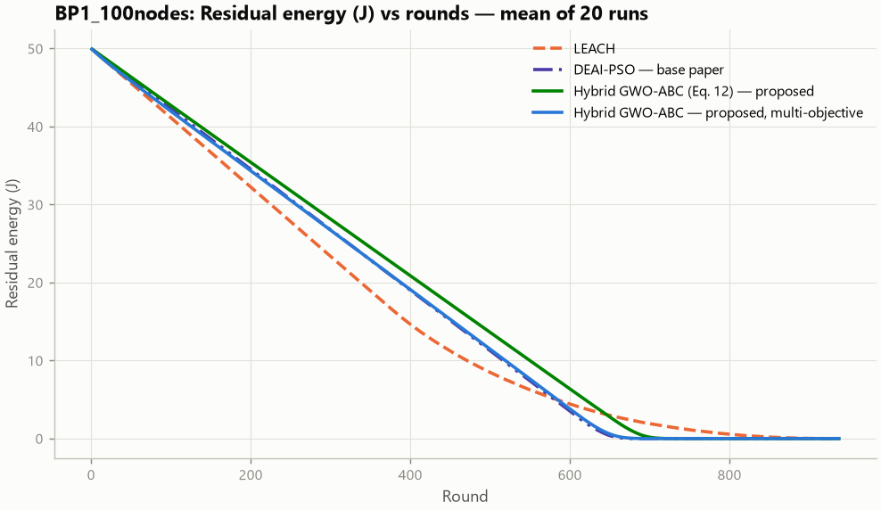
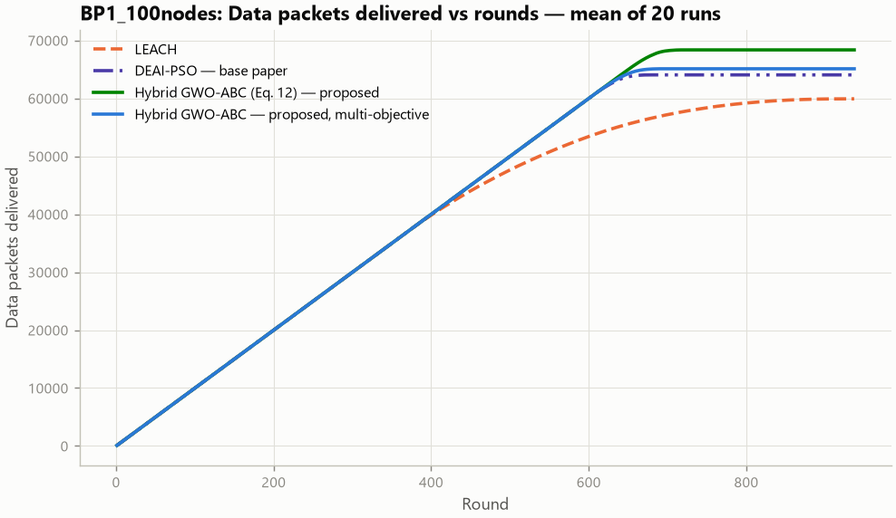
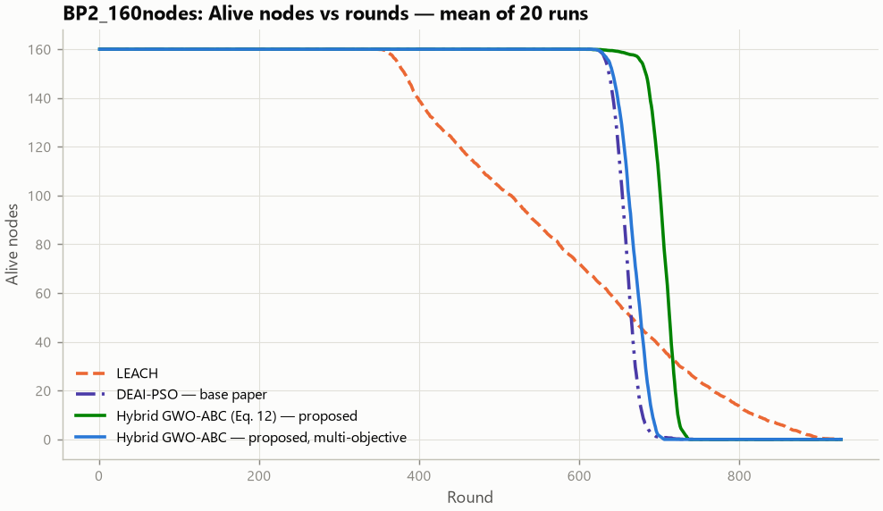
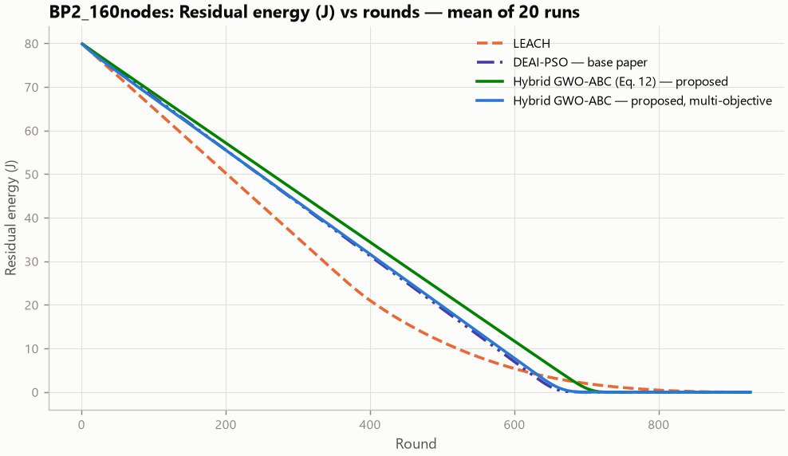
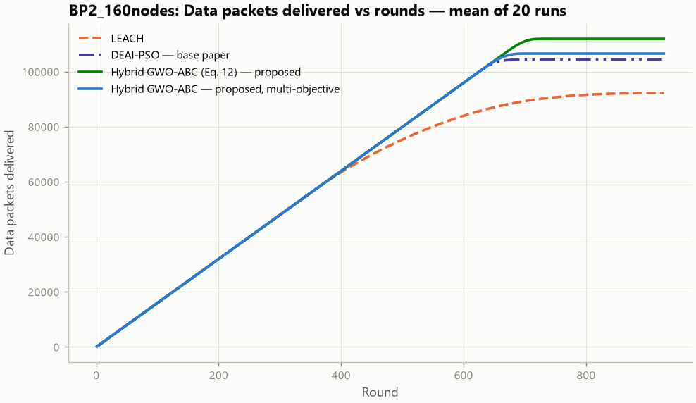
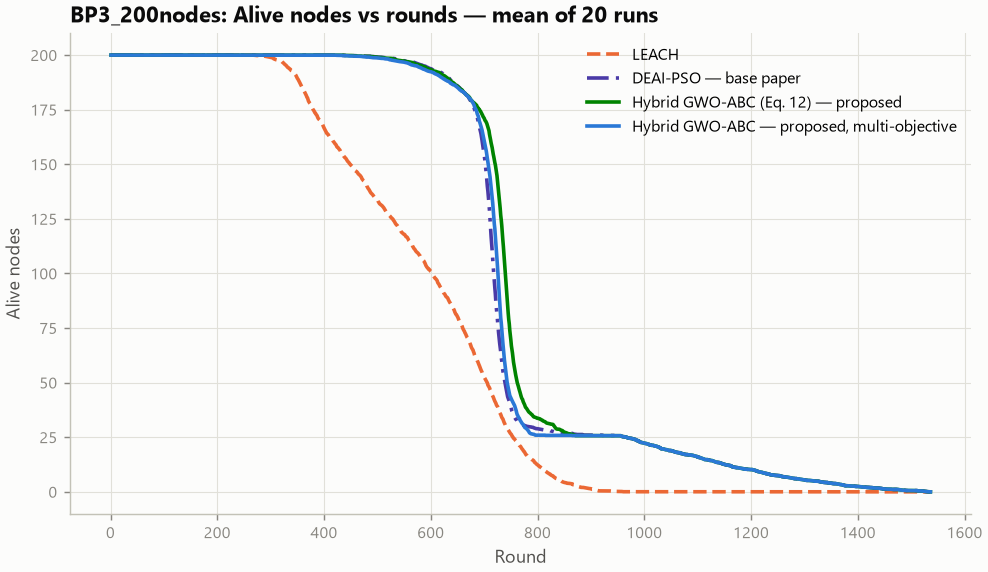
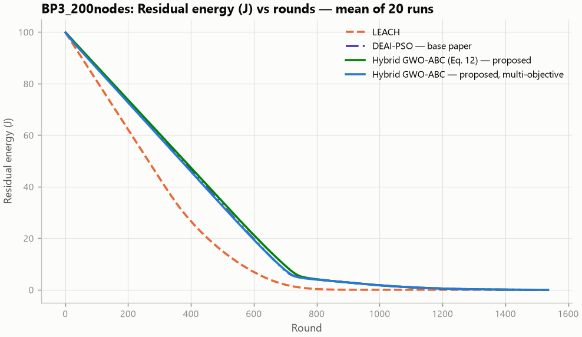
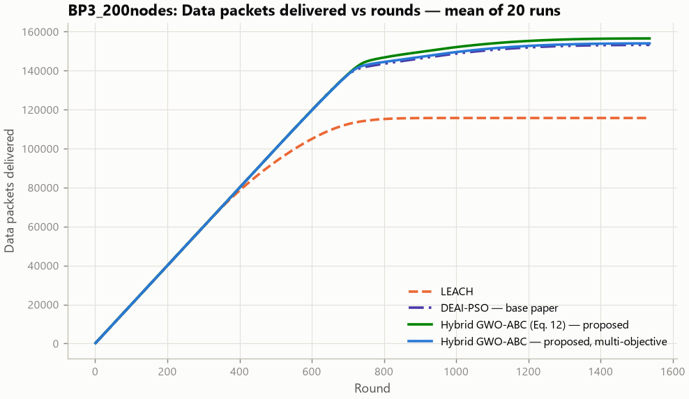
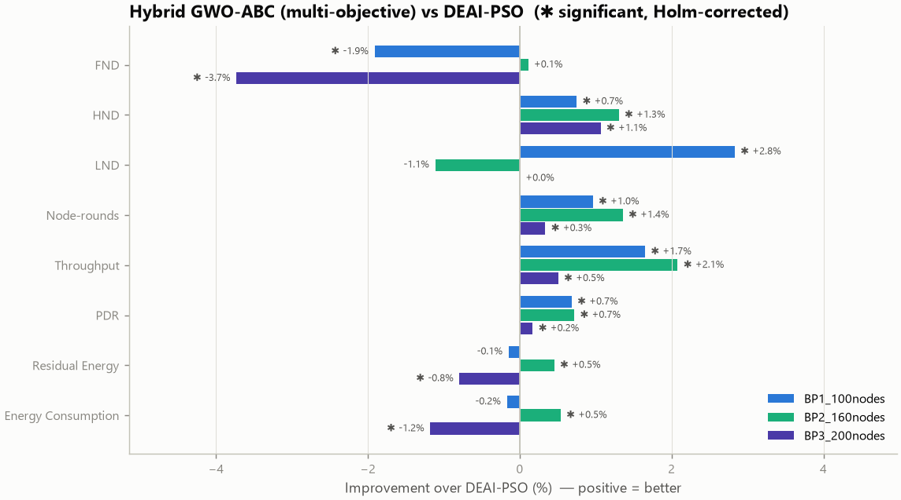

# Improvement over the base paper: Hybrid GWO-ABC vs DEAI-PSO

**Base paper (existing system):** M. Haris and H. Nam, "Enhancing Energy Efficiency in IoT-WSNs Through Optimized PSO Cluster Head Selection," *IEEE Access*, vol. 13, pp. 126496–126512, 2025, doi:10.1109/ACCESS.2025.3583922.

**What is compared.** The base paper's contribution is an optimiser — PSO with double-exponential adaptive inertia (DEAI-PSO) — for its cluster-head selection problem (network model, Eq. 12 objective, 10 % CH target, free nodes near the BS). The like-for-like test of improving on it keeps that problem and objective and replaces only the optimiser: **Hybrid GWO-ABC (Eq. 12)** (the proposed Hybrid GWO-ABC optimiser minimising the same Eq. 12 with the same weight *a*). The project's own multi-objective version (**Hybrid GWO-ABC**) is reported as well (section 5).

## 1. Verdict (generated from the measured data)

Across the 3 base-paper scenarios and 8 headline metrics (24 paired comparisons, 20 runs each, Holm-corrected over all 24 tests), Hybrid GWO-ABC (Eq. 12) is **significantly better than DEAI-PSO in 18**, significantly worse in 1, and not significantly different in 5.

- **BP1_100nodes** — significantly improved: HND +6.90 %, LND +7.09 %, Node-rounds +6.72 %, Throughput +6.74 %, Residual Energy +5.11 %, Energy Consumption +5.89 %; significantly worse: none; not significant: FND (+0.51 %), PDR (+0.03 %).
- **BP2_160nodes** — significantly improved: HND +7.39 %, LND +3.27 %, Node-rounds +7.02 %, Throughput +7.22 %, PDR +0.20 %, Residual Energy +5.49 %, Energy Consumption +6.51 %; significantly worse: none; not significant: FND (+1.53 %).
- **BP3_200nodes** — significantly improved: HND +2.98 %, Node-rounds +2.08 %, Throughput +2.17 %, Residual Energy +1.26 %, Energy Consumption +1.88 %; significantly worse: FND -1.16 %; not significant: LND (+0.00 %), PDR (+0.09 %).

## 2. How the comparison was made fair

| Condition | Setting (identical for every algorithm) |
|---|---|
| Networks | same random deployments: run *r* uses seed 42 + r for every algorithm |
| Radio model | E_elec 50 nJ/bit, ε_fs 10 pJ/bit/m², ε_mp 0.0013 pJ/bit/m⁴, E_DA 5 nJ/bit (base paper Table 3) |
| Traffic | 4000-bit data packets, 200-bit control packets (Table 3), one reading per alive node per round |
| Energy / BS | 0.5 J per node; BS at (200, 50), outside the field (Table 3) |
| Objective | DEAI-PSO and Hybrid GWO-ABC (Eq. 12) minimise the same Eq. 12 with the same weight a |
| CH ratio | target 10% of alive nodes (DEAI-PSO: exactly 10 %; the binary encoding of the proposed optimiser may use 5–15 %; the fixed-10 % variant isolates this in section 6) |
| Three-tier model | nodes within 85 m of the BS are free nodes for every centralised algorithm (base paper's rule) |
| CH candidates | residual energy ≥ mean (PSO-C rule, base paper ref. [41]) for every centralised algorithm |
| Search budget | equal fitness evaluations per round (≈ 620): DEAI-PSO 36 particles (Table 3) × matched iterations; GWO 20 wolves × 30; ABC 20 bees × 30; Hybrid 10 wolves + 10 bees × 30 |
| Baseline tuning | settings the paper leaves open were tuned **in DEAI-PSO's favour** on separate development seeds: a=0.8, d=metres (`dev_pilot/report.md`); the same a is used by Hybrid GWO-ABC (Eq. 12) |
| Proposed tuning | none — the Hybrid GWO-ABC settings are the project defaults used in every experiment |
| Runs | 20 paired runs per scenario on held-out seeds (the paper used 10); development seeds were never reused |
| Statistics | paired two-sided Wilcoxon signed-rank, Holm correction over each family of tests, Cliff's δ |

## 3. Headline results (mean ± std)

### BP1_100nodes — Scenario 1: 100 nodes, 100 x 100 m, BS (200, 50), 10 % CHs

| Metric | DEAI-PSO (base paper) | Hybrid GWO-ABC (Eq. 12) (proposed) | Improvement | Better in | p (Holm) | Cliff's δ | Verdict |
|---|---:|---:|---:|---|---:|---|---|
| FND (rounds) ↑ | 632 ± 16 | 636 ± 20 | +0.51 % | 8/20 runs | 1 | +0.09 (negligible) | no significant difference |
| HND (rounds) ↑ | 647 ± 17 | 691 ± 16 | +6.90 % | 20/20 runs | 0.0012 | +0.95 (large) | improved |
| LND (rounds) ↑ | 653 ± 18 | 700 ± 15 | +7.09 % | 20/20 runs | 0.0012 | +0.96 (large) | improved |
| Node-rounds (node x rounds) ↑ | 64,509 ± 1,718 | 68,842 ± 1,514 | +6.72 % | 20/20 runs | 4.6e-05 | +0.95 (large) | improved |
| Throughput (packets) ↑ | 64,045 ± 1,710 | 68,360 ± 1,539 | +6.74 % | 20/20 runs | 0.0012 | +0.95 (large) | improved |
| PDR (ratio) ↑ | 0.9913 ± 0.0012 | 0.9915 ± 0.0018 | +0.03 % | 11/20 runs | 1 | +0.13 (negligible) | no significant difference |
| Residual Energy (J) ↑ | 26.765 ± 0.598 | 28.134 ± 0.463 | +5.11 % | 20/20 runs | 4.6e-05 | +0.94 (large) | improved |
| Energy Consumption (J) ↓ | 23.235 ± 0.598 | 21.866 ± 0.463 | +5.89 % | 20/20 runs | 4.6e-05 | +0.94 (large) | improved |

### BP2_160nodes — Scenario 2: 160 nodes, 100 x 100 m, BS (200, 50), 10 % CHs

| Metric | DEAI-PSO (base paper) | Hybrid GWO-ABC (Eq. 12) (proposed) | Improvement | Better in | p (Holm) | Cliff's δ | Verdict |
|---|---:|---:|---:|---|---:|---|---|
| FND (rounds) ↑ | 635 ± 8 | 645 ± 18 | +1.53 % | 14/20 runs | 0.16 | +0.45 (medium) | no significant difference |
| HND (rounds) ↑ | 659 ± 10 | 708 ± 10 | +7.39 % | 20/20 runs | 0.0012 | +1.00 (large) | improved |
| LND (rounds) ↑ | 695 ± 27 | 718 ± 11 | +3.27 % | 18/20 runs | 0.0047 | +0.60 (large) | improved |
| Node-rounds (node x rounds) ↑ | 105,257 ± 1,692 | 112,643 ± 1,561 | +7.02 % | 20/20 runs | 4.6e-05 | +1.00 (large) | improved |
| Throughput (packets) ↑ | 104,428 ± 1,860 | 111,964 ± 1,594 | +7.22 % | 20/20 runs | 0.0012 | +1.00 (large) | improved |
| PDR (ratio) ↑ | 0.9906 ± 0.0023 | 0.9926 ± 0.0016 | +0.20 % | 16/20 runs | 0.0073 | +0.54 (large) | improved |
| Residual Energy (J) ↑ | 43.392 ± 0.572 | 45.776 ± 0.454 | +5.49 % | 20/20 runs | 4.6e-05 | +1.00 (large) | improved |
| Energy Consumption (J) ↓ | 36.608 ± 0.572 | 34.224 ± 0.454 | +6.51 % | 20/20 runs | 4.6e-05 | +1.00 (large) | improved |

### BP3_200nodes — Scenario 3: 200 nodes, 150 x 150 m, BS (200, 50), 10 % CHs

| Metric | DEAI-PSO (base paper) | Hybrid GWO-ABC (Eq. 12) (proposed) | Improvement | Better in | p (Holm) | Cliff's δ | Verdict |
|---|---:|---:|---:|---|---:|---|---|
| FND (rounds) ↑ | 489 ± 33 | 483 ± 32 | -1.16 % | 2/20 runs | 0.0047 | -0.11 (negligible) | worse |
| HND (rounds) ↑ | 718 ± 12 | 740 ± 12 | +2.98 % | 20/20 runs | 0.0012 | +0.82 (large) | improved |
| LND (rounds) ↑ | 1,487 ± 51 | 1,487 ± 51 | +0.00 % | 0/20 runs | 1 | +0.00 (negligible) | no significant difference |
| Node-rounds (node x rounds) ↑ | 153,481 ± 2,901 | 156,679 ± 2,669 | +2.08 % | 20/20 runs | 4.6e-05 | +0.57 (large) | improved |
| Throughput (packets) ↑ | 153,202 ± 2,951 | 156,526 ± 2,659 | +2.17 % | 20/20 runs | 4.6e-05 | +0.59 (large) | improved |
| PDR (ratio) ↑ | 0.9969 ± 0.0014 | 0.9978 ± 0.0010 | +0.09 % | 13/20 runs | 0.13 | +0.38 (medium) | no significant difference |
| Residual Energy (J) ↑ | 59.759 ± 0.550 | 60.514 ± 0.528 | +1.26 % | 20/20 runs | 4.6e-05 | +0.68 (large) | improved |
| Energy Consumption (J) ↓ | 40.241 ± 0.550 | 39.486 ± 0.528 | +1.88 % | 20/20 runs | 4.6e-05 | +0.68 (large) | improved |

↑ higher is better, ↓ lower is better. Improvement = ((P − B)/B)·100 for ↑ metrics and ((B − P)/B)·100 for ↓ metrics, so a positive value always means the proposed system is better. Residual energy and consumption are measured at round 300. Full per-scenario reports (all algorithms, figures, CH logs): `<scenario>/report.md`.

## 4. Is the hybrid better than its own components?

Hybrid GWO-ABC (Eq. 12) vs GWO (Eq. 12) and ABC (Eq. 12) — same objective, same budget (Holm over this family):

| Scenario · metric · baseline | Improvement % | p (Holm) | Verdict |
|---|---:|---:|---|
| BP1_100nodes · FND vs GWO (Eq. 12) | +0.10 | 0.166 | no significant difference |
| BP1_100nodes · HND vs GWO (Eq. 12) | +0.07 | 0.236 | no significant difference |
| BP1_100nodes · LND vs GWO (Eq. 12) | +0.04 | 0.97 | no significant difference |
| BP1_100nodes · Node-rounds vs GWO (Eq. 12) | +0.07 | 0.00164 | improved |
| BP1_100nodes · Throughput vs GWO (Eq. 12) | +0.09 | 0.106 | no significant difference |
| BP2_160nodes · FND vs GWO (Eq. 12) | +0.06 | 0.639 | no significant difference |
| BP2_160nodes · HND vs GWO (Eq. 12) | +0.04 | 0.97 | no significant difference |
| BP2_160nodes · LND vs GWO (Eq. 12) | +0.03 | 0.97 | no significant difference |
| BP2_160nodes · Node-rounds vs GWO (Eq. 12) | +0.05 | 0.00431 | improved |
| BP2_160nodes · Throughput vs GWO (Eq. 12) | +0.07 | 0.904 | no significant difference |
| BP3_200nodes · FND vs GWO (Eq. 12) | +0.12 | 0.106 | no significant difference |
| BP3_200nodes · HND vs GWO (Eq. 12) | +0.11 | 0.189 | no significant difference |
| BP3_200nodes · LND vs GWO (Eq. 12) | +0.00 | 1 | no significant difference |
| BP3_200nodes · Node-rounds vs GWO (Eq. 12) | +0.09 | 0.0136 | improved |
| BP3_200nodes · Throughput vs GWO (Eq. 12) | +0.07 | 0.517 | no significant difference |
| BP1_100nodes · FND vs ABC (Eq. 12) | -0.16 | 0.0655 | no significant difference |
| BP1_100nodes · HND vs ABC (Eq. 12) | +0.51 | 0.00164 | improved |
| BP1_100nodes · LND vs ABC (Eq. 12) | +0.53 | 0.00164 | improved |
| BP1_100nodes · Node-rounds vs ABC (Eq. 12) | +0.46 | 5.72e-05 | improved |
| BP1_100nodes · Throughput vs ABC (Eq. 12) | +0.56 | 5.72e-05 | improved |
| BP2_160nodes · FND vs ABC (Eq. 12) | -0.22 | 0.00164 | worse |
| BP2_160nodes · HND vs ABC (Eq. 12) | +0.75 | 0.00164 | improved |
| BP2_160nodes · LND vs ABC (Eq. 12) | +0.67 | 0.00164 | improved |
| BP2_160nodes · Node-rounds vs ABC (Eq. 12) | +0.65 | 5.72e-05 | improved |
| BP2_160nodes · Throughput vs ABC (Eq. 12) | +0.77 | 5.72e-05 | improved |
| BP3_200nodes · FND vs ABC (Eq. 12) | -0.19 | 0.271 | no significant difference |
| BP3_200nodes · HND vs ABC (Eq. 12) | +0.41 | 0.00164 | improved |
| BP3_200nodes · LND vs ABC (Eq. 12) | +0.00 | 1 | no significant difference |
| BP3_200nodes · Node-rounds vs ABC (Eq. 12) | +0.30 | 5.72e-05 | improved |
| BP3_200nodes · Throughput vs ABC (Eq. 12) | +0.31 | 5.72e-05 | improved |

## 5. The project's multi-objective version vs DEAI-PSO

Hybrid GWO-ABC minimises the project's five-term fitness (energy, intra-cluster distance, CH–BS distance, balance, CH count) instead of Eq. 12. Separate Holm family:

- **BP1_100nodes** — significantly improved: HND +0.75 %, LND +2.83 %, Node-rounds +0.96 %, Throughput +1.65 %, PDR +0.68 %; significantly worse: FND -1.91 %; not significant: Residual Energy (-0.15 %), Energy Consumption (-0.17 %).
- **BP2_160nodes** — significantly improved: HND +1.31 %, Node-rounds +1.36 %, Throughput +2.08 %, PDR +0.72 %, Residual Energy +0.45 %, Energy Consumption +0.54 %; significantly worse: none; not significant: FND (+0.11 %), LND (-1.11 %).
- **BP3_200nodes** — significantly improved: HND +1.07 %, Node-rounds +0.34 %, Throughput +0.51 %, PDR +0.17 %; significantly worse: FND -3.73 %, Residual Energy -0.79 %, Energy Consumption -1.18 %; not significant: LND (+0.00 %).

With the BS 100–200 m away, the multi-objective fitness divides round energy by a worst-case bound, so differences in real Joules (d⁴ CH → BS costs) barely change its score; Eq. 12 measures Joules directly. This is why the like-for-like Eq. 12 comparison is the primary one, and it is a lesson for the project's own fitness design (see the README discussion).

## 6. Where does the improvement come from? (BP1)

Each optimiser was run with each objective under identical conditions; the fixed-K variant forces exactly 10 % CHs like DEAI-PSO, separating the optimiser's search ability from the adaptive CH count.

**Node-rounds** (mean over 20 runs)

| Optimiser \ objective | Eq. 12 (base paper) | multi-objective (project) |
|---|---:|---:|
| DEAI-PSO optimiser | 64,508.7 | 63,327.2 |
| Hybrid GWO-ABC optimiser | 68,842.1 | 65,129.5 |

**HND** (mean over 20 runs)

| Optimiser \ objective | Eq. 12 (base paper) | multi-objective (project) |
|---|---:|---:|
| DEAI-PSO optimiser | 646.8 | 632.2 |
| Hybrid GWO-ABC optimiser | 691.4 | 651.6 |

**FND** (mean over 20 runs)

| Optimiser \ objective | Eq. 12 (base paper) | multi-objective (project) |
|---|---:|---:|
| DEAI-PSO optimiser | 632.3 | 614.6 |
| Hybrid GWO-ABC optimiser | 635.5 | 620.2 |

**LND** (mean over 20 runs)

| Optimiser \ objective | Eq. 12 (base paper) | multi-objective (project) |
|---|---:|---:|
| DEAI-PSO optimiser | 653.4 | 662.1 |
| Hybrid GWO-ABC optimiser | 699.7 | 671.9 |

Effect of changing one factor at a time (paired runs, unadjusted p):

| Metric | Change | From → to | Δ % | Wilcoxon p |
|---|---|---|---:|---:|
| Node-rounds | optimiser (objective = Eq. 12) | DEAI-PSO → Hybrid GWO-ABC (Eq. 12) | +6.72 | 1.9e-06 |
| Node-rounds | optimiser, CH count fixed at 10 % (objective = Eq. 12) | DEAI-PSO → Hybrid GWO-ABC (Eq. 12, fixed K) | +0.44 | 1.9e-06 |
| Node-rounds | adaptive CH count (Hybrid, Eq. 12) | Hybrid GWO-ABC (Eq. 12, fixed K) → Hybrid GWO-ABC (Eq. 12) | +6.25 | 1.9e-06 |
| Node-rounds | optimiser (objective = multi-objective) | DEAI-PSO + proposed fitness → Hybrid GWO-ABC | +2.85 | 8.8e-05 |
| Node-rounds | objective (optimiser = DEAI-PSO) | DEAI-PSO → DEAI-PSO + proposed fitness | -1.83 | 1.9e-06 |
| Node-rounds | objective (optimiser = Hybrid) | Hybrid GWO-ABC (Eq. 12) → Hybrid GWO-ABC | -5.39 | 1.9e-06 |
| HND | optimiser (objective = Eq. 12) | DEAI-PSO → Hybrid GWO-ABC (Eq. 12) | +6.90 | 8.6e-05 |
| HND | optimiser, CH count fixed at 10 % (objective = Eq. 12) | DEAI-PSO → Hybrid GWO-ABC (Eq. 12, fixed K) | +0.42 | 8.5e-05 |
| HND | adaptive CH count (Hybrid, Eq. 12) | Hybrid GWO-ABC (Eq. 12, fixed K) → Hybrid GWO-ABC (Eq. 12) | +6.45 | 8.6e-05 |
| HND | optimiser (objective = multi-objective) | DEAI-PSO + proposed fitness → Hybrid GWO-ABC | +3.08 | 8.5e-05 |
| HND | objective (optimiser = DEAI-PSO) | DEAI-PSO → DEAI-PSO + proposed fitness | -2.26 | 8.5e-05 |
| HND | objective (optimiser = Hybrid) | Hybrid GWO-ABC (Eq. 12) → Hybrid GWO-ABC | -5.75 | 8.7e-05 |
| FND | optimiser (objective = Eq. 12) | DEAI-PSO → Hybrid GWO-ABC (Eq. 12) | +0.51 | 0.85 |
| FND | optimiser, CH count fixed at 10 % (objective = Eq. 12) | DEAI-PSO → Hybrid GWO-ABC (Eq. 12, fixed K) | +0.77 | 9e-05 |
| FND | adaptive CH count (Hybrid, Eq. 12) | Hybrid GWO-ABC (Eq. 12, fixed K) → Hybrid GWO-ABC (Eq. 12) | -0.26 | 0.49 |
| FND | optimiser (objective = multi-objective) | DEAI-PSO + proposed fitness → Hybrid GWO-ABC | +0.90 | 0.062 |
| FND | objective (optimiser = DEAI-PSO) | DEAI-PSO → DEAI-PSO + proposed fitness | -2.79 | 8.3e-05 |
| FND | objective (optimiser = Hybrid) | Hybrid GWO-ABC (Eq. 12) → Hybrid GWO-ABC | -2.42 | 8.7e-05 |

**Reading:** on node-rounds the proposed optimiser gains +6.72 % over DEAI-PSO on the same Eq. 12 objective. With the CH count fixed at exactly 10 % like DEAI-PSO it gains +0.44 % (Wilcoxon p = 1.9e-06): that part is the better search alone. The remaining 6.27 points come from the proposed binary encoding, which lets the optimiser use fewer CHs when that lowers Eq. 12 — fewer expensive CH → BS transmissions to the distant BS (section 7).

## 7. Mechanism evidence

Averages over all runs (distances and energy up to the checkpoint round).

| Scenario · algorithm | CHs per round | member→CH distance (m) | CH→BS distance (m) | lost packets | PDR |
|---|---:|---:|---:|---:|---:|
| BP1_100nodes · DEAI-PSO | 10.000 | 24.102 | 124.399 | 563.500 | 0.991 |
| BP1_100nodes · Hybrid GWO-ABC (Eq. 12) | 5.086 | 27.482 | 127.608 | 582.150 | 0.992 |
| BP1_100nodes · Hybrid GWO-ABC | 7.543 | 25.320 | 131.646 | 127.350 | 0.998 |
| BP2_160nodes · DEAI-PSO | 16.000 | 20.364 | 124.275 | 989.050 | 0.991 |
| BP2_160nodes · Hybrid GWO-ABC (Eq. 12) | 8.022 | 24.030 | 125.650 | 839.000 | 0.993 |
| BP2_160nodes · Hybrid GWO-ABC | 14.486 | 20.480 | 126.118 | 244.950 | 0.998 |
| BP3_200nodes · DEAI-PSO | 17.500 | 30.058 | 104.609 | 478.950 | 0.997 |
| BP3_200nodes · Hybrid GWO-ABC (Eq. 12) | 8.919 | 30.653 | 110.377 | 352.250 | 0.998 |
| BP3_200nodes · Hybrid GWO-ABC | 16.375 | 29.983 | 107.514 | 219.050 | 0.999 |

Energy spent per radio activity up to the checkpoint round (J, mean per run):

| Scenario · algorithm | Member → CH TX | CH RX | Aggregation | CH → BS TX | Free/direct → BS TX | Control packets | total |
|---|---:|---:|---:|---:|---:|---:|---:|
| BP1_100nodes · DEAI-PSO | 6.284 | 5.400 | 0.600 | 5.068 | 0.000 | 5.883 | 23.235 |
| BP1_100nodes · Hybrid GWO-ABC (Eq. 12) | 6.873 | 5.695 | 0.600 | 2.814 | 0.000 | 5.883 | 21.866 |
| BP1_100nodes · Hybrid GWO-ABC | 6.590 | 5.547 | 0.600 | 4.653 | 0.000 | 5.883 | 23.274 |
| BP2_160nodes · DEAI-PSO | 9.675 | 8.640 | 0.960 | 8.012 | 0.000 | 9.321 | 36.608 |
| BP2_160nodes · Hybrid GWO-ABC (Eq. 12) | 10.625 | 9.119 | 0.960 | 4.200 | 0.000 | 9.321 | 34.224 |
| BP2_160nodes · Hybrid GWO-ABC | 9.812 | 8.731 | 0.960 | 7.587 | 0.000 | 9.321 | 36.411 |
| BP3_200nodes · DEAI-PSO | 11.835 | 9.405 | 1.046 | 5.314 | 3.119 | 9.524 | 40.241 |
| BP3_200nodes · Hybrid GWO-ABC (Eq. 12) | 12.556 | 9.920 | 1.046 | 3.322 | 3.119 | 9.524 | 39.486 |
| BP3_200nodes · Hybrid GWO-ABC | 11.999 | 9.473 | 1.046 | 5.557 | 3.119 | 9.524 | 40.716 |

- **BP1_100nodes:** Hybrid GWO-ABC (Eq. 12) used 5.09 CHs per round vs 10.00 for DEAI-PSO; up to the checkpoint its CH → BS transmissions cost 2.81 J vs 5.07 J (44.5 % less), member → CH transmissions 6.87 J vs 6.28 J (9.4 % more), total 21.87 J vs 23.23 J (5.9 % less); lost packets per run 582 vs 564.
- **BP2_160nodes:** Hybrid GWO-ABC (Eq. 12) used 8.02 CHs per round vs 16.00 for DEAI-PSO; up to the checkpoint its CH → BS transmissions cost 4.20 J vs 8.01 J (47.6 % less), member → CH transmissions 10.62 J vs 9.67 J (9.8 % more), total 34.22 J vs 36.61 J (6.5 % less); lost packets per run 839 vs 989.
- **BP3_200nodes:** Hybrid GWO-ABC (Eq. 12) used 8.92 CHs per round vs 17.50 for DEAI-PSO; up to the checkpoint its CH → BS transmissions cost 3.32 J vs 5.31 J (37.5 % less), member → CH transmissions 12.56 J vs 11.83 J (6.1 % more), total 39.49 J vs 40.24 J (1.9 % less); lost packets per run 352 vs 479.

## 8. Computational cost (sequential, single process)

CH-selection time per round over the first 100 rounds, median of 5 seeds, no other load. All metaheuristics spend about the same number of fitness evaluations per round.

| Scenario (median ms/round) | LEACH | DEAI-PSO | GWO (Eq. 12) | ABC (Eq. 12) | Hybrid GWO-ABC (Eq. 12) | Hybrid GWO-ABC |
|---|---:|---:|---:|---:|---:|---:|
| BP1_100nodes | 0.01 | 14.73 | 13.03 | 20.57 | 27.06 | 28.23 |
| BP2_160nodes | 0.01 | 31.37 | 20.41 | 26.11 | 32.84 | 32.08 |
| BP3_200nodes | 0.01 | 37.95 | 19.31 | 26.08 | 33.42 | 33.94 |

| Scenario (fitness evaluations/round) | LEACH | DEAI-PSO | GWO (Eq. 12) | ABC (Eq. 12) | Hybrid GWO-ABC (Eq. 12) | Hybrid GWO-ABC |
|---|---:|---:|---:|---:|---:|---:|
| BP1_100nodes | 0 | 648 | 620 | 614 | 624 | 623 |
| BP2_160nodes | 0 | 648 | 620 | 612 | 619 | 618 |
| BP3_200nodes | 0 | 648 | 620 | 612 | 618 | 617 |

Time per round, Hybrid GWO-ABC (Eq. 12) / DEAI-PSO — BP1_100nodes: ×1.84; BP2_160nodes: ×1.05; BP3_200nodes: ×0.88. This is reported as a trade-off; both stay well below one second per round.

## 9. The base paper's published numbers (reference only)

Table 6 of the base paper reports these FND / HND / LND values (MATLAB R2023a, 10 runs):

| Scenario | Algorithm | FND | HND | LND |
|---|---|---:|---:|---:|
| BP1_100nodes | LEACH | 1100 | 3207 | 3400 |
| BP1_100nodes | LEACH-FL | 1605 | 3210 | 3698 |
| BP1_100nodes | KM-PSO | 2000 | 3320 | 3725 |
| BP1_100nodes | LEACH-FC | 1556 | 2900 | 3845 |
| BP1_100nodes | DEAI-PSO | 1700 | 3500 | 4178 |
| BP2_160nodes | LEACH | 1245 | 3494 | 3556 |
| BP2_160nodes | LEACH-FL | 1289 | 3678 | 3756 |
| BP2_160nodes | KM-PSO | 1434 | 3793 | 4078 |
| BP2_160nodes | LEACH-FC | 1267 | 3912 | 4393 |
| BP2_160nodes | DEAI-PSO | 1759 | 4119 | 4500 |
| BP3_200nodes | LEACH | 1510 | 3896 | 4423 |
| BP3_200nodes | LEACH-FL | 1578 | 3771 | 4112 |
| BP3_200nodes | KM-PSO | 1598 | 3709 | 4756 |
| BP3_200nodes | LEACH-FC | 1529 | 3956 | 4403 |
| BP3_200nodes | DEAI-PSO | 1875 | 4234 | 4693 |

These values cannot be compared with any simulator that applies the paper's own Table 3 parameters to one 4000-bit reading per node per round: the transmitter electronics alone cost 4000 × 50 nJ = 0.2 mJ per packet, so a 0.5 J node can transmit at most 2,500 times — no node can live beyond 2,500 rounds — whereas the paper reports LND values of 3,400–4,756 rounds (even for LEACH). The paper's simulator must therefore count rounds or energy differently. For this reason the base paper's method was re-implemented and both systems were run in the **same** simulator under the **same** conditions; only those numbers (sections 1–8) are used to judge improvement.

## 10. Limitations of this comparison

- DEAI-PSO is a re-implementation from the paper; details the paper does not state (weight *a*, units of d in Eq. 13, acceleration-coefficient ranges, velocity clamp, mapping of CH coordinates to nodes) had to be chosen. Open choices were tuned in DEAI-PSO's favour on development seeds, and the mapping follows PSO-C (the paper's reference [41]).
- The paper's 36 particles × 5000 iterations per clustering were not used; every method received the same budget (≈ 620 evaluations per round), so differences reflect the methods, not the budget.
- Single-hop CH → BS transmission, as stated in the paper's data-transmission section; optional multi-hop forwarding between CHs is not modelled.
- LEACH-FL, LEACH-FC and KM-PSO from the paper were not re-implemented; LEACH, GWO and ABC are included as additional baselines.
