# Attribution: optimiser x objective (BP1)

2 x 2 study separating the effect of the optimiser (DEAI-PSO vs Hybrid GWO-ABC) from the effect of the objective (base paper Eq. 12 vs proposed multi-objective fitness).

All numbers below were produced by the simulator in this folder (20 independent paired runs per algorithm; run r uses deployment/algorithm seed 42 + r). Raw per-run results: `runs_raw.csv`; per-round histories: `history_raw.csv.gz`; statistics: `statistics.csv`; proposed-vs-baseline tests: `improvement_vs_baselines.csv`.

## Configuration

| Parameter | Value |
|---|---|
| Nodes | 100 |
| Area (m) | 100 x 100 |
| BS position | (200, 50) |
| Initial energy (J/node) | 0.5 |
| Packet size (bits) | 4000 |
| Control packet (bits) | 200 |
| Max rounds | 3000 |
| CH percentage p | 0.1 |
| CH count tolerance | K_opt x (1 ± 0.5) |
| CH eligibility (optimisers) | E ≥ 1.0 x mean alive energy |
| Optimisation iterations / round | 30 |
| GWO population | 20 |
| ABC colony size (food sources) | 20 (10) |
| ABC abandonment limit | 10 |
| Hybrid budget share / transfer / feedback | 0.5 / 3 / True |
| Fitness weights w1..w5 | 0.3, 0.25, 0.2, 0.15, 0.1 |
| Radio E_elec / E_fs / E_mp / E_DA | 5e-08 / 1e-11 / 1.3e-15 / 5e-09 |
| Checkpoint round (energy / averages) | 300 |
| Base seed | 42 |

## Final result table (mean ± std over runs)

| Metric | DEAI-PSO | DEAI-PSO + proposed fitness | Hybrid GWO-ABC (Eq. 12) | Hybrid GWO-ABC (Eq. 12, fixed K) | Hybrid GWO-ABC |
|---|---:|---:|---:|---:|---:|
| FND (rounds) | 632 ± 16 | 615 ± 17 | 636 ± 20 | 637 ± 17 | 620 ± 17 |
| HND (rounds) | 647 ± 17 | 632 ± 18 | 691 ± 16 | 650 ± 18 | 652 ± 18 |
| LND (rounds) | 653 ± 18 | 662 ± 15 | 700 ± 15 | 654 ± 18 | 672 ± 15 |
| Residual Energy (J) | 26.765 ± 0.598 | 25.979 ± 0.697 | 28.134 ± 0.463 | 26.872 ± 0.620 | 26.726 ± 0.642 |
| Energy Consumption (J) | 23.235 ± 0.598 | 24.021 ± 0.697 | 21.866 ± 0.463 | 23.128 ± 0.620 | 23.274 ± 0.642 |
| Throughput (packets) | 64,045 ± 1,710 | 63,210 ± 1,778 | 68,360 ± 1,539 | 64,387 ± 1,744 | 65,102 ± 1,692 |
| PDR (ratio) | 0.9913 ± 0.0012 | 0.9966 ± 0.0011 | 0.9915 ± 0.0018 | 0.9922 ± 0.0008 | 0.9981 ± 0.0003 |
| Avg. Cluster Distance (m) | 24.102 ± 1.524 | 23.266 ± 1.468 | 27.482 ± 1.358 | 23.676 ± 1.441 | 25.320 ± 1.517 |
| Avg. CH-BS Distance (m) | 124.399 ± 2.627 | 129.022 ± 2.984 | 127.608 ± 2.294 | 123.883 ± 2.875 | 131.646 ± 2.853 |
| Runtime (s) | 37.71 ± 1.95 | 30.84 ± 1.12 | 88.75 ± 7.83 | 85.28 ± 7.66 | 87.62 ± 8.66 |
| Final Fitness (-) | 0.3255 ± 0.0049 | 0.3094 ± 0.0049 | 0.3302 ± 0.0078 | 0.3237 ± 0.0049 | 0.2993 ± 0.0061 |

Residual energy and energy consumption are measured at the checkpoint round 300; distance, imbalance and fitness averages cover rounds 1–300. '≥' marks lifetime values where at least one run had not reached the event within 3000 rounds (the horizon is then used as a lower bound).

## Descriptive statistics

**FND (rounds)**

| Algorithm | n | mean | std | min | max |
|---|---:|---:|---:|---:|---:|
| DEAI-PSO | 20 | 632 | 16 | 603 | 663 |
| DEAI-PSO + proposed fitness | 20 | 615 | 17 | 583 | 647 |
| Hybrid GWO-ABC (Eq. 12) | 20 | 636 | 20 | 591 | 675 |
| Hybrid GWO-ABC (Eq. 12, fixed K) | 20 | 637 | 17 | 608 | 672 |
| Hybrid GWO-ABC | 20 | 620 | 17 | 587 | 646 |

**HND (rounds)**

| Algorithm | n | mean | std | min | max |
|---|---:|---:|---:|---:|---:|
| DEAI-PSO | 20 | 647 | 17 | 615 | 677 |
| DEAI-PSO + proposed fitness | 20 | 632 | 18 | 599 | 662 |
| Hybrid GWO-ABC (Eq. 12) | 20 | 691 | 16 | 663 | 721 |
| Hybrid GWO-ABC (Eq. 12, fixed K) | 20 | 650 | 18 | 616 | 680 |
| Hybrid GWO-ABC | 20 | 652 | 18 | 616 | 681 |

**LND (rounds)**

| Algorithm | n | mean | std | min | max |
|---|---:|---:|---:|---:|---:|
| DEAI-PSO | 20 | 653 | 18 | 620 | 683 |
| DEAI-PSO + proposed fitness | 20 | 662 | 15 | 638 | 687 |
| Hybrid GWO-ABC (Eq. 12) | 20 | 700 | 15 | 672 | 728 |
| Hybrid GWO-ABC (Eq. 12, fixed K) | 20 | 654 | 18 | 622 | 685 |
| Hybrid GWO-ABC | 20 | 672 | 15 | 643 | 697 |

**Residual Energy (J)**

| Algorithm | n | mean | std | min | max |
|---|---:|---:|---:|---:|---:|
| DEAI-PSO | 20 | 26.765 | 0.598 | 25.631 | 27.781 |
| DEAI-PSO + proposed fitness | 20 | 25.979 | 0.697 | 24.581 | 27.110 |
| Hybrid GWO-ABC (Eq. 12) | 20 | 28.134 | 0.463 | 27.277 | 29.029 |
| Hybrid GWO-ABC (Eq. 12, fixed K) | 20 | 26.872 | 0.620 | 25.661 | 27.911 |
| Hybrid GWO-ABC | 20 | 26.726 | 0.642 | 25.356 | 27.752 |

**Energy Consumption (J)**

| Algorithm | n | mean | std | min | max |
|---|---:|---:|---:|---:|---:|
| DEAI-PSO | 20 | 23.235 | 0.598 | 22.219 | 24.369 |
| DEAI-PSO + proposed fitness | 20 | 24.021 | 0.697 | 22.890 | 25.419 |
| Hybrid GWO-ABC (Eq. 12) | 20 | 21.866 | 0.463 | 20.971 | 22.723 |
| Hybrid GWO-ABC (Eq. 12, fixed K) | 20 | 23.128 | 0.620 | 22.089 | 24.339 |
| Hybrid GWO-ABC | 20 | 23.274 | 0.642 | 22.248 | 24.644 |

**Throughput (packets)**

| Algorithm | n | mean | std | min | max |
|---|---:|---:|---:|---:|---:|
| DEAI-PSO | 20 | 64,045 | 1,710 | 60,858 | 66,995 |
| DEAI-PSO + proposed fitness | 20 | 63,210 | 1,778 | 59,888 | 66,182 |
| Hybrid GWO-ABC (Eq. 12) | 20 | 68,360 | 1,539 | 65,544 | 71,285 |
| Hybrid GWO-ABC (Eq. 12, fixed K) | 20 | 64,387 | 1,744 | 61,129 | 67,478 |
| Hybrid GWO-ABC | 20 | 65,102 | 1,692 | 61,712 | 68,007 |

**PDR (ratio)**

| Algorithm | n | mean | std | min | max |
|---|---:|---:|---:|---:|---:|
| DEAI-PSO | 20 | 0.9913 | 0.0012 | 0.9885 | 0.9934 |
| DEAI-PSO + proposed fitness | 20 | 0.9966 | 0.0011 | 0.9946 | 0.9984 |
| Hybrid GWO-ABC (Eq. 12) | 20 | 0.9915 | 0.0018 | 0.9881 | 0.9944 |
| Hybrid GWO-ABC (Eq. 12, fixed K) | 20 | 0.9922 | 0.0008 | 0.9904 | 0.9933 |
| Hybrid GWO-ABC | 20 | 0.9981 | 0.0003 | 0.9974 | 0.9984 |

**Runtime (s)**

| Algorithm | n | mean | std | min | max |
|---|---:|---:|---:|---:|---:|
| DEAI-PSO | 20 | 37.71 | 1.95 | 34.70 | 41.58 |
| DEAI-PSO + proposed fitness | 20 | 30.84 | 1.12 | 28.73 | 32.97 |
| Hybrid GWO-ABC (Eq. 12) | 20 | 88.75 | 7.83 | 58.89 | 95.91 |
| Hybrid GWO-ABC (Eq. 12, fixed K) | 20 | 85.28 | 7.66 | 55.88 | 93.25 |
| Hybrid GWO-ABC | 20 | 87.62 | 8.66 | 54.91 | 96.63 |

## Hybrid GWO-ABC (Eq. 12) vs baselines

Improvement % uses ((P − B) / B) × 100 for higher-is-better metrics and ((B − P) / B) × 100 for lower-is-better metrics, so a positive value always means the proposed algorithm did better. p-values: paired two-sided Wilcoxon signed-rank test, Holm-corrected over the baselines. Cliff's δ > 0 favours the proposed algorithm (|δ| < 0.147 negligible, < 0.33 small, < 0.474 medium, otherwise large).

| Metric | Baseline | Better | Improvement % | p (Holm) | Cliff's δ | Effect | Verdict |
|---|---|---|---:|---:|---:|---|---|
| FND | DEAI-PSO | higher | +0.51 | 0.979 | +0.09 | negligible | no significant difference |
| FND | DEAI-PSO + proposed fitness | higher | +3.40 | 0.00109 | +0.62 | large | proposed better |
| FND | Hybrid GWO-ABC (Eq. 12, fixed K) | higher | -0.26 | 0.979 | -0.08 | negligible | no significant difference |
| FND | Hybrid GWO-ABC | higher | +2.48 | 0.00035 | +0.49 | large | proposed better |
| HND | DEAI-PSO | higher | +6.90 | 0.000346 | +0.95 | large | proposed better |
| HND | DEAI-PSO + proposed fitness | higher | +9.36 | 0.000346 | +1.00 | large | proposed better |
| HND | Hybrid GWO-ABC (Eq. 12, fixed K) | higher | +6.45 | 0.000346 | +0.94 | large | proposed better |
| HND | Hybrid GWO-ABC | higher | +6.10 | 0.000346 | +0.93 | large | proposed better |
| LND | DEAI-PSO | higher | +7.09 | 0.000323 | +0.96 | large | proposed better |
| LND | DEAI-PSO + proposed fitness | higher | +5.67 | 0.000323 | +0.93 | large | proposed better |
| LND | Hybrid GWO-ABC (Eq. 12, fixed K) | higher | +6.91 | 0.000323 | +0.95 | large | proposed better |
| LND | Hybrid GWO-ABC | higher | +4.15 | 0.000323 | +0.81 | large | proposed better |
| Node-rounds | DEAI-PSO | higher | +6.72 | 7.63e-06 | +0.95 | large | proposed better |
| Node-rounds | DEAI-PSO + proposed fitness | higher | +8.71 | 7.63e-06 | +0.99 | large | proposed better |
| Node-rounds | Hybrid GWO-ABC (Eq. 12, fixed K) | higher | +6.25 | 7.63e-06 | +0.94 | large | proposed better |
| Node-rounds | Hybrid GWO-ABC | higher | +5.70 | 7.63e-06 | +0.93 | large | proposed better |
| Residual Energy | DEAI-PSO | higher | +5.11 | 7.63e-06 | +0.94 | large | proposed better |
| Residual Energy | DEAI-PSO + proposed fitness | higher | +8.30 | 7.63e-06 | +1.00 | large | proposed better |
| Residual Energy | Hybrid GWO-ABC (Eq. 12, fixed K) | higher | +4.70 | 7.63e-06 | +0.92 | large | proposed better |
| Residual Energy | Hybrid GWO-ABC | higher | +5.27 | 7.63e-06 | +0.95 | large | proposed better |
| Energy Consumption | DEAI-PSO | lower | +5.89 | 7.63e-06 | +0.94 | large | proposed better |
| Energy Consumption | DEAI-PSO + proposed fitness | lower | +8.97 | 7.63e-06 | +1.00 | large | proposed better |
| Energy Consumption | Hybrid GWO-ABC (Eq. 12, fixed K) | lower | +5.46 | 7.63e-06 | +0.92 | large | proposed better |
| Energy Consumption | Hybrid GWO-ABC | lower | +6.05 | 7.63e-06 | +0.95 | large | proposed better |
| Throughput | DEAI-PSO | higher | +6.74 | 8.84e-05 | +0.95 | large | proposed better |
| Throughput | DEAI-PSO + proposed fitness | higher | +8.15 | 7.63e-06 | +0.98 | large | proposed better |
| Throughput | Hybrid GWO-ABC (Eq. 12, fixed K) | higher | +6.17 | 7.63e-06 | +0.94 | large | proposed better |
| Throughput | Hybrid GWO-ABC | higher | +5.00 | 7.63e-06 | +0.84 | large | proposed better |
| PDR | DEAI-PSO | higher | +0.03 | 0.756 | +0.13 | negligible | no significant difference |
| PDR | DEAI-PSO + proposed fitness | higher | -0.50 | 7.63e-06 | -1.00 | large | proposed worse |
| PDR | Hybrid GWO-ABC (Eq. 12, fixed K) | higher | -0.06 | 0.491 | -0.20 | small | no significant difference |
| PDR | Hybrid GWO-ABC | higher | -0.65 | 7.63e-06 | -1.00 | large | proposed worse |
| Avg. Cluster Distance | DEAI-PSO | lower | -14.03 | 7.63e-06 | -0.92 | large | proposed worse |
| Avg. Cluster Distance | DEAI-PSO + proposed fitness | lower | -18.12 | 7.63e-06 | -0.96 | large | proposed worse |
| Avg. Cluster Distance | Hybrid GWO-ABC (Eq. 12, fixed K) | lower | -16.08 | 7.63e-06 | -0.94 | large | proposed worse |
| Avg. Cluster Distance | Hybrid GWO-ABC | lower | -8.54 | 7.63e-06 | -0.69 | large | proposed worse |
| Avg. CH-BS Distance | DEAI-PSO | lower | -2.58 | 7.63e-06 | -0.64 | large | proposed worse |
| Avg. CH-BS Distance | DEAI-PSO + proposed fitness | lower | +1.10 | 7.63e-06 | +0.28 | small | proposed better |
| Avg. CH-BS Distance | Hybrid GWO-ABC (Eq. 12, fixed K) | lower | -3.01 | 7.63e-06 | -0.68 | large | proposed worse |
| Avg. CH-BS Distance | Hybrid GWO-ABC | lower | +3.07 | 7.63e-06 | +0.71 | large | proposed better |
| Final Fitness | DEAI-PSO | lower | -1.44 | 0.000586 | -0.39 | medium | proposed worse |
| Final Fitness | DEAI-PSO + proposed fitness | lower | -6.70 | 7.63e-06 | -0.99 | large | proposed worse |
| Final Fitness | Hybrid GWO-ABC (Eq. 12, fixed K) | lower | -1.99 | 3.81e-05 | -0.52 | large | proposed worse |
| Final Fitness | Hybrid GWO-ABC | lower | -10.32 | 7.63e-06 | -1.00 | large | proposed worse |
| Runtime | DEAI-PSO | lower | -135.37 | 7.63e-06 | -1.00 | large | proposed worse |
| Runtime | DEAI-PSO + proposed fitness | lower | -187.82 | 7.63e-06 | -1.00 | large | proposed worse |
| Runtime | Hybrid GWO-ABC (Eq. 12, fixed K) | lower | -4.07 | 7.63e-06 | -0.62 | large | proposed worse |
| Runtime | Hybrid GWO-ABC | lower | -1.29 | 0.00121 | -0.21 | small | proposed worse |

### Trade-offs

- **Hybrid GWO-ABC (Eq. 12) vs DEAI-PSO** — significantly better: HND (+6.90%), LND (+7.09%), Node-rounds (+6.72%), Residual Energy (+5.11%), Energy Consumption (+5.89%), Throughput (+6.74%), Cluster Imbalance (+41.51%); significantly worse: Avg. Cluster Distance (-14.03%), Avg. CH-BS Distance (-2.58%), Final Fitness (-1.44%), Runtime (-135.37%), Runtime / round (-119.80%), Fitness Evaluations (-3.11%); no significant difference: FND, PDR.
- **Hybrid GWO-ABC (Eq. 12) vs DEAI-PSO + proposed fitness** — significantly better: FND (+3.40%), HND (+9.36%), LND (+5.67%), Node-rounds (+8.71%), Residual Energy (+8.30%), Energy Consumption (+8.97%), Throughput (+8.15%), Avg. CH-BS Distance (+1.10%), Cluster Imbalance (+30.25%); significantly worse: PDR (-0.50%, < 1%: practically negligible), Avg. Cluster Distance (-18.12%), Final Fitness (-6.70%), Runtime (-187.82%), Runtime / round (-172.41%), Fitness Evaluations (-1.74%); no significant difference: none.
- **Hybrid GWO-ABC (Eq. 12) vs Hybrid GWO-ABC (Eq. 12, fixed K)** — significantly better: HND (+6.45%), LND (+6.91%), Node-rounds (+6.25%), Residual Energy (+4.70%), Energy Consumption (+5.46%), Throughput (+6.17%), Cluster Imbalance (+40.61%), Runtime / round (+2.68%); significantly worse: Avg. Cluster Distance (-16.08%), Avg. CH-BS Distance (-3.01%), Final Fitness (-1.99%), Runtime (-4.07%), Fitness Evaluations (-7.03%); no significant difference: FND, PDR.
- **Hybrid GWO-ABC (Eq. 12) vs Hybrid GWO-ABC** — significantly better: FND (+2.48%), HND (+6.10%), LND (+4.15%), Node-rounds (+5.70%), Residual Energy (+5.27%), Energy Consumption (+6.05%), Throughput (+5.00%), Avg. CH-BS Distance (+3.07%), Runtime / round (+2.75%); significantly worse: PDR (-0.65%, < 1%: practically negligible), Avg. Cluster Distance (-8.54%), Final Fitness (-10.32%), Runtime (-1.29%), Fitness Evaluations (-4.06%); no significant difference: Cluster Imbalance.

## Figures

### Initial WSN topology (run 0; every algorithm uses this same network in run 0).


**Observed:** 100 nodes uniformly deployed in 100 x 100 m (seed 42); BS at (200, 50). Mean node–BS distance 155.7 m (max 201.9 m); d0 = 87.7 m, so 100% of nodes would use the multipath (d^4) model for a direct BS transmission.

### DEAI-PSO: cluster heads selected in round 1 (run 0).


**Observed:** 10 CHs; mean CH–BS distance 128.6 m.

### DEAI-PSO: cluster formation in round 1 (members joined the nearest CH).


**Observed:** 10 clusters, sizes 2–27 (CV 0.76); member→CH distance mean 28.1 m, max 66.2 m.

### DEAI-PSO: network at its half-node-death round (run 0); dead nodes are marked x, alive nodes shaded by residual energy.

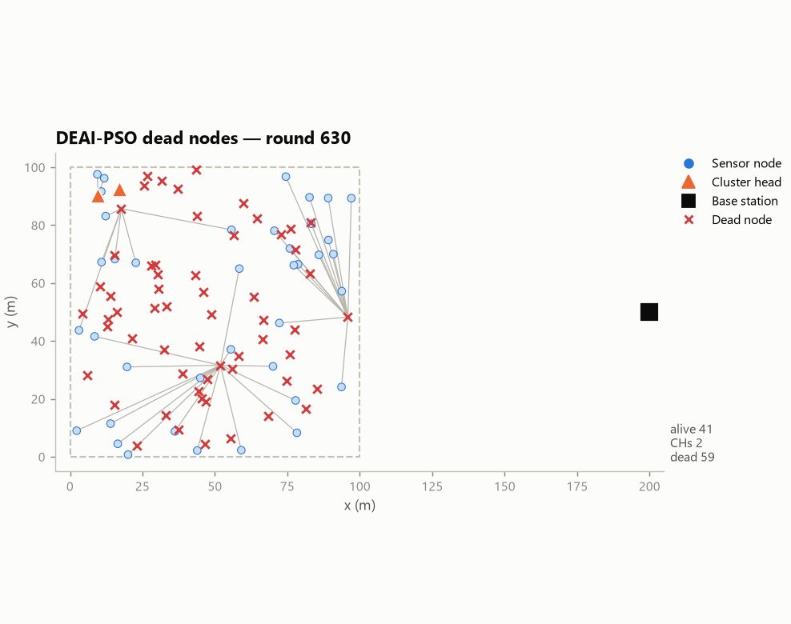

**Observed:** Round 630: 59 dead, 41 alive. Mean distance to BS — dead nodes 157.1 m, alive nodes 153.7 m (far nodes died first on average).

### DEAI-PSO + proposed fitness: cluster heads selected in round 1 (run 0).

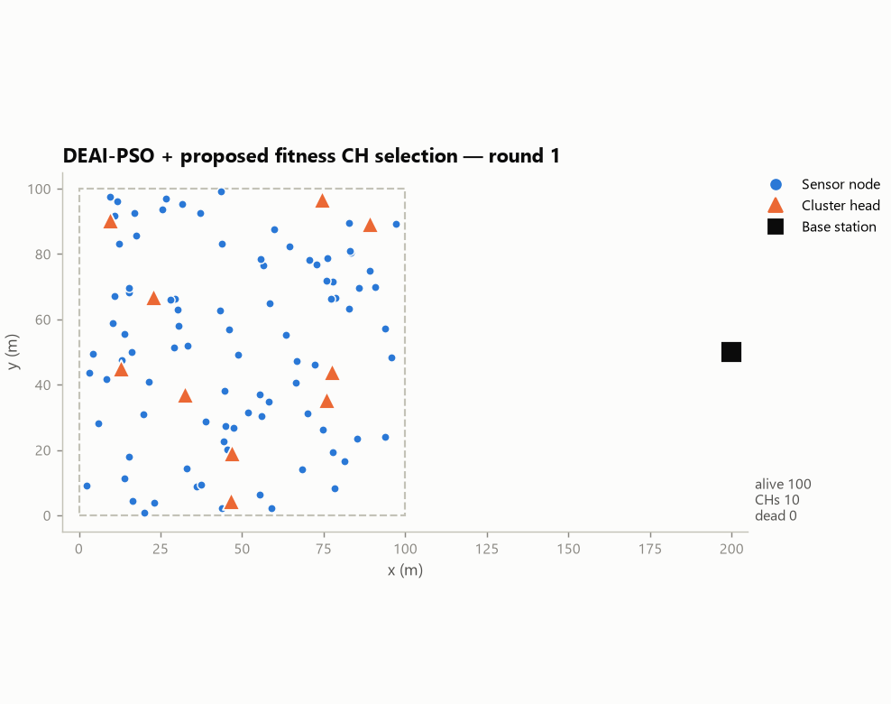

**Observed:** 10 CHs; mean CH–BS distance 154.3 m.

### DEAI-PSO + proposed fitness: cluster formation in round 1 (members joined the nearest CH).

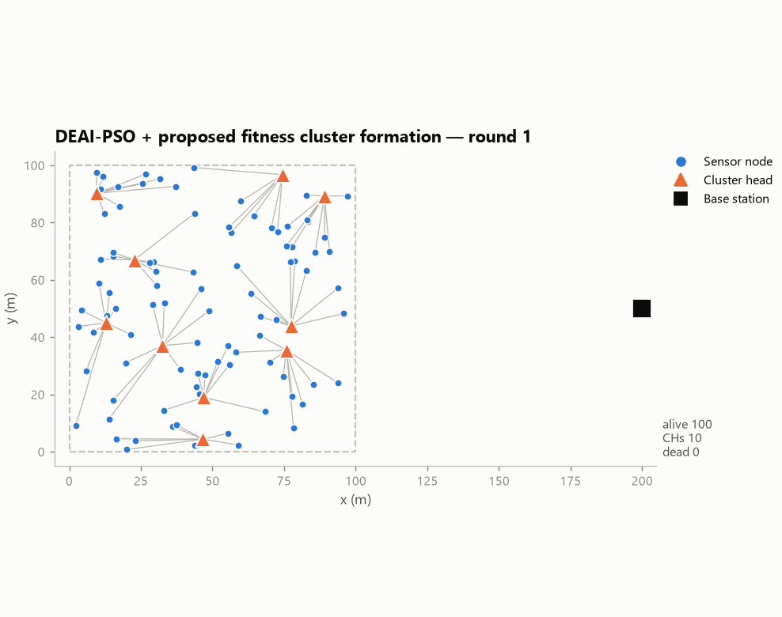

**Observed:** 10 clusters, sizes 8–11 (CV 0.09); member→CH distance mean 15.3 m, max 37.5 m.

### DEAI-PSO + proposed fitness: network at its half-node-death round (run 0); dead nodes are marked x, alive nodes shaded by residual energy.

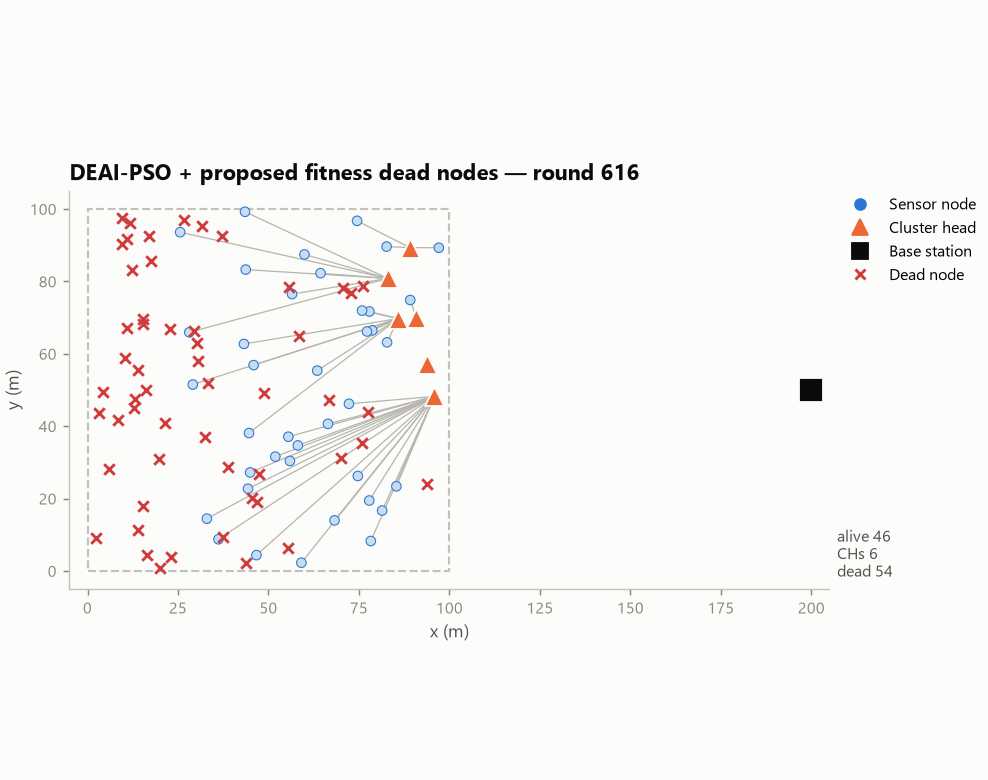

**Observed:** Round 616: 54 dead, 46 alive. Mean distance to BS — dead nodes 170.9 m, alive nodes 137.9 m (far nodes died first on average).

### Hybrid GWO-ABC (Eq. 12): cluster heads selected in round 1 (run 0).

.png)

**Observed:** 7 CHs; mean CH–BS distance 126.4 m.

### Hybrid GWO-ABC (Eq. 12): cluster formation in round 1 (members joined the nearest CH).

.png)

**Observed:** 7 clusters, sizes 5–25 (CV 0.40); member→CH distance mean 33.8 m, max 74.7 m.

### Hybrid GWO-ABC (Eq. 12): data communication in round 1 — members send to their CH (grey links), CHs aggregate and forward to the BS (arrows).

.png)

**Observed:** 7 clusters, sizes 5–25 (CV 0.40); member→CH distance mean 33.8 m, max 74.7 m.

### Hybrid GWO-ABC (Eq. 12): network at its half-node-death round (run 0); dead nodes are marked x, alive nodes shaded by residual energy.

.png)

**Observed:** Round 679: 53 dead, 47 alive. Mean distance to BS — dead nodes 154.0 m, alive nodes 157.6 m (near nodes died first on average).

### Hybrid GWO-ABC (Eq. 12, fixed K): cluster heads selected in round 1 (run 0).

.png)

**Observed:** 10 CHs; mean CH–BS distance 123.5 m.

### Hybrid GWO-ABC (Eq. 12, fixed K): cluster formation in round 1 (members joined the nearest CH).

.png)

**Observed:** 10 clusters, sizes 2–25 (CV 0.68); member→CH distance mean 30.5 m, max 76.0 m.

### Hybrid GWO-ABC (Eq. 12, fixed K): network at its half-node-death round (run 0); dead nodes are marked x, alive nodes shaded by residual energy.

.png)

**Observed:** Round 632: 59 dead, 41 alive. Mean distance to BS — dead nodes 157.5 m, alive nodes 153.1 m (far nodes died first on average).

### Hybrid GWO-ABC: cluster heads selected in round 1 (run 0).


**Observed:** 10 CHs; mean CH–BS distance 154.0 m.

### Hybrid GWO-ABC: cluster formation in round 1 (members joined the nearest CH).

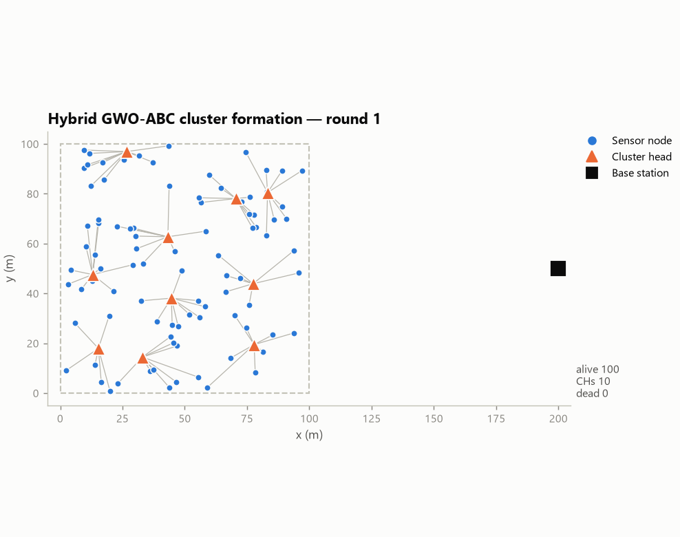

**Observed:** 10 clusters, sizes 7–13 (CV 0.17); member→CH distance mean 12.7 m, max 25.4 m.

### Hybrid GWO-ABC: network at its half-node-death round (run 0); dead nodes are marked x, alive nodes shaded by residual energy.


**Observed:** Round 637: 50 dead, 50 alive. Mean distance to BS — dead nodes 174.2 m, alive nodes 137.2 m (far nodes died first on average).

### DEAI-PSO: best-so-far fitness per iteration of the round-1 CH optimisation (mean ± std over runs).

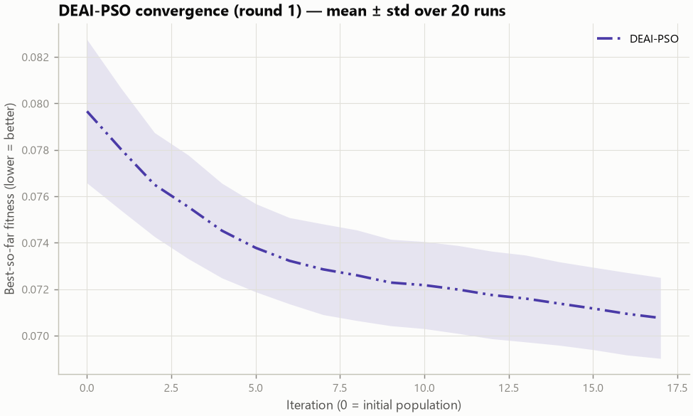

**Observed:** mean best fitness 0.0797 → 0.0708 (11.2% lower); 95% of the improvement reached by iteration 15

### DEAI-PSO + proposed fitness: best-so-far fitness per iteration of the round-1 CH optimisation (mean ± std over runs).

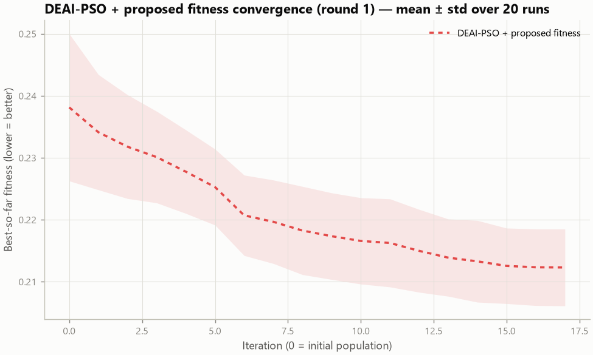

**Observed:** mean best fitness 0.2381 → 0.2123 (10.8% lower); 95% of the improvement reached by iteration 14

### Hybrid GWO-ABC (Eq. 12): best-so-far fitness per iteration of the round-1 CH optimisation (mean ± std over runs).

.png)

**Observed:** GWO: mean best fitness 0.0812 → 0.0676 (16.7% lower); 95% of the improvement reached by iteration 13; ABC: mean best fitness 0.0823 → 0.0676 (17.8% lower); 95% of the improvement reached by iteration 12; HYBRID: mean best fitness 0.0790 → 0.0676 (14.4% lower); 95% of the improvement reached by iteration 14

### Hybrid GWO-ABC (Eq. 12, fixed K): best-so-far fitness per iteration of the round-1 CH optimisation (mean ± std over runs).

.png)

**Observed:** GWO: mean best fitness 0.0863 → 0.0690 (20.1% lower); 95% of the improvement reached by iteration 13; ABC: mean best fitness 0.0904 → 0.0690 (23.7% lower); 95% of the improvement reached by iteration 12; HYBRID: mean best fitness 0.0855 → 0.0690 (19.3% lower); 95% of the improvement reached by iteration 13

### Hybrid GWO-ABC: best-so-far fitness per iteration of the round-1 CH optimisation (mean ± std over runs).


**Observed:** GWO: mean best fitness 0.2668 → 0.2079 (22.1% lower); 95% of the improvement reached by iteration 19; ABC: mean best fitness 0.2705 → 0.2079 (23.1% lower); 95% of the improvement reached by iteration 18; HYBRID: mean best fitness 0.2604 → 0.2079 (20.2% lower); 95% of the improvement reached by iteration 19

### Alive nodes vs rounds.

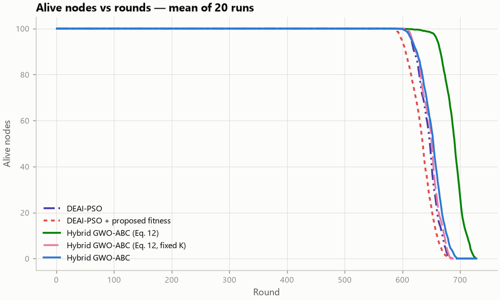

**Observed:** DEAI-PSO: FND 632, HND 647, LND 653; DEAI-PSO + proposed fitness: FND 615, HND 632, LND 662; Hybrid GWO-ABC (Eq. 12): FND 636, HND 691, LND 700; Hybrid GWO-ABC (Eq. 12, fixed K): FND 637, HND 650, LND 654; Hybrid GWO-ABC: FND 620, HND 652, LND 672

### Dead nodes vs rounds.

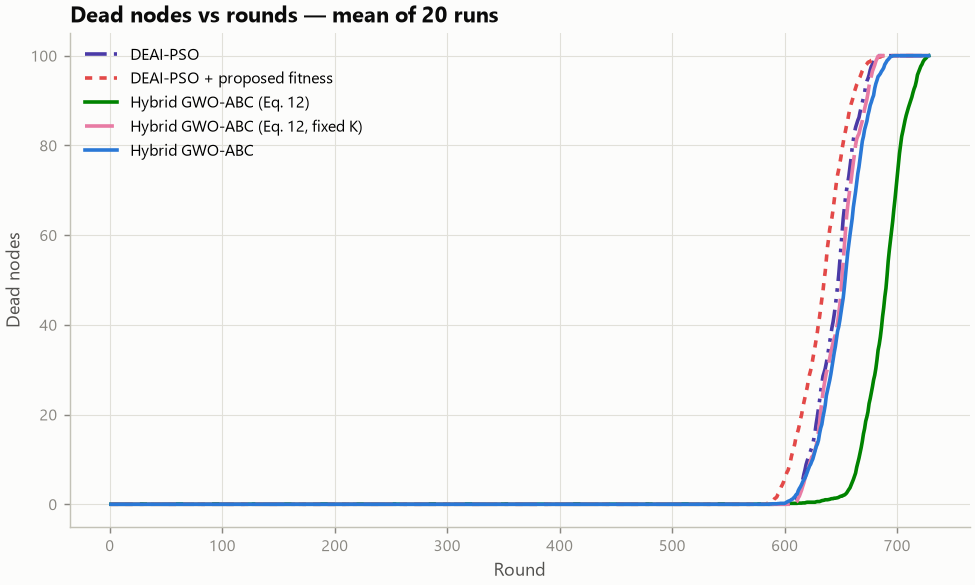

**Observed:** Mirror image of the alive-nodes curve; a steeper rise means nodes die closer together.

### Residual energy vs rounds.

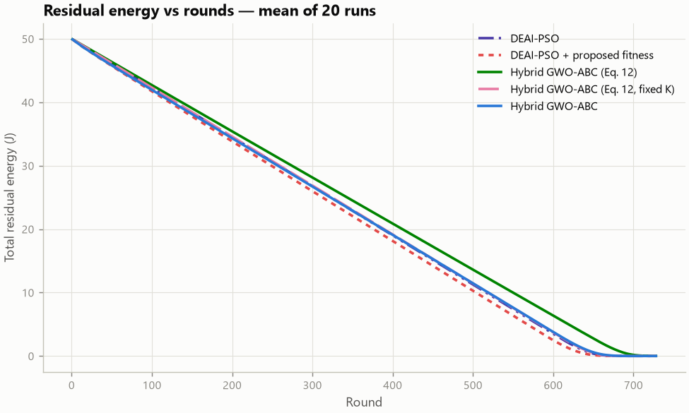

**Observed:** Residual energy at round 300: DEAI-PSO 26.77 J; DEAI-PSO + proposed fitness 25.98 J; Hybrid GWO-ABC (Eq. 12) 28.13 J; Hybrid GWO-ABC (Eq. 12, fixed K) 26.87 J; Hybrid GWO-ABC 26.73 J

### Energy consumption vs rounds.

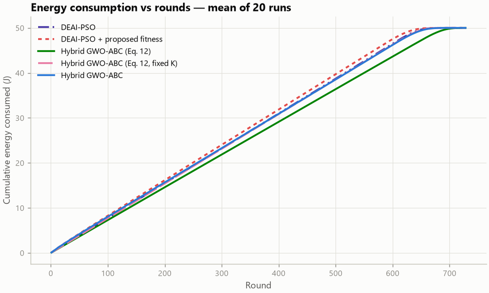

**Observed:** Consumed by round 300: DEAI-PSO 23.23 J; DEAI-PSO + proposed fitness 24.02 J; Hybrid GWO-ABC (Eq. 12) 21.87 J; Hybrid GWO-ABC (Eq. 12, fixed K) 23.13 J; Hybrid GWO-ABC 23.27 J

### Throughput vs rounds (cumulative).

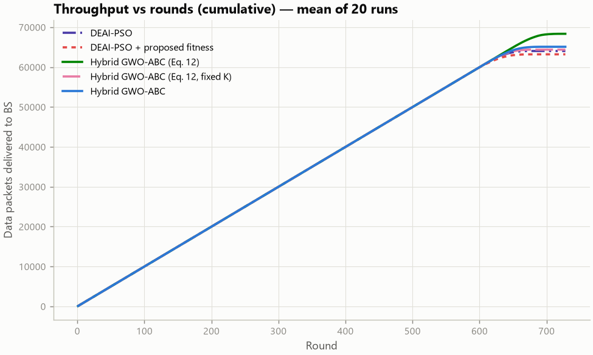

**Observed:** Total delivered: DEAI-PSO 64,045; DEAI-PSO + proposed fitness 63,210; Hybrid GWO-ABC (Eq. 12) 68,360; Hybrid GWO-ABC (Eq. 12, fixed K) 64,387; Hybrid GWO-ABC 65,102

### PDR vs rounds.

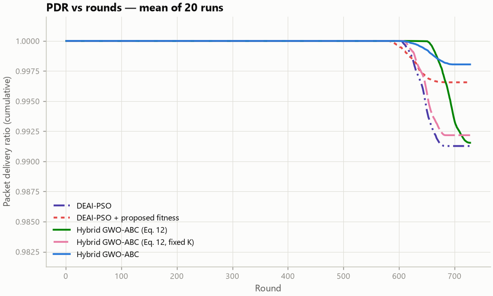

**Observed:** Final PDR: DEAI-PSO 0.9913; DEAI-PSO + proposed fitness 0.9966; Hybrid GWO-ABC (Eq. 12) 0.9915; Hybrid GWO-ABC (Eq. 12, fixed K) 0.9922; Hybrid GWO-ABC 0.9981

### CH count vs rounds (20-round rolling mean).

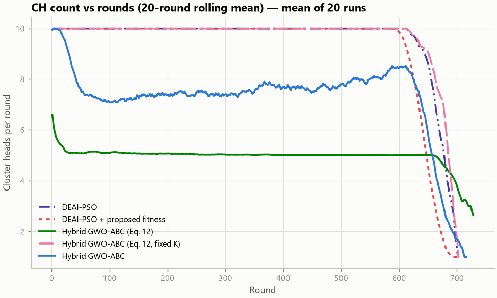

**Observed:** Mean CHs/round (rounds 1–300): DEAI-PSO 10.00 (per-round std 0.00); DEAI-PSO + proposed fitness 10.00 (per-round std 0.00); Hybrid GWO-ABC (Eq. 12) 5.09 (per-round std 0.30); Hybrid GWO-ABC (Eq. 12, fixed K) 10.00 (per-round std 0.00); Hybrid GWO-ABC 7.54 (per-round std 2.21)

### Average cluster distance vs rounds (20-round rolling mean).

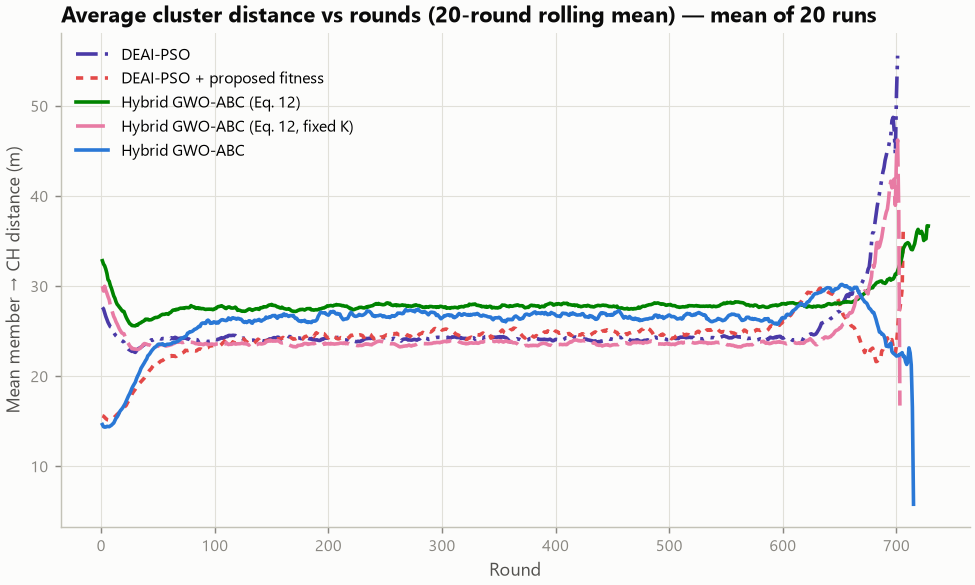

**Observed:** Mean member→CH distance: DEAI-PSO 24.10 m; DEAI-PSO + proposed fitness 23.27 m; Hybrid GWO-ABC (Eq. 12) 27.48 m; Hybrid GWO-ABC (Eq. 12, fixed K) 23.68 m; Hybrid GWO-ABC 25.32 m

### Total CH-selection runtime per simulation (log scale, mean ± std).

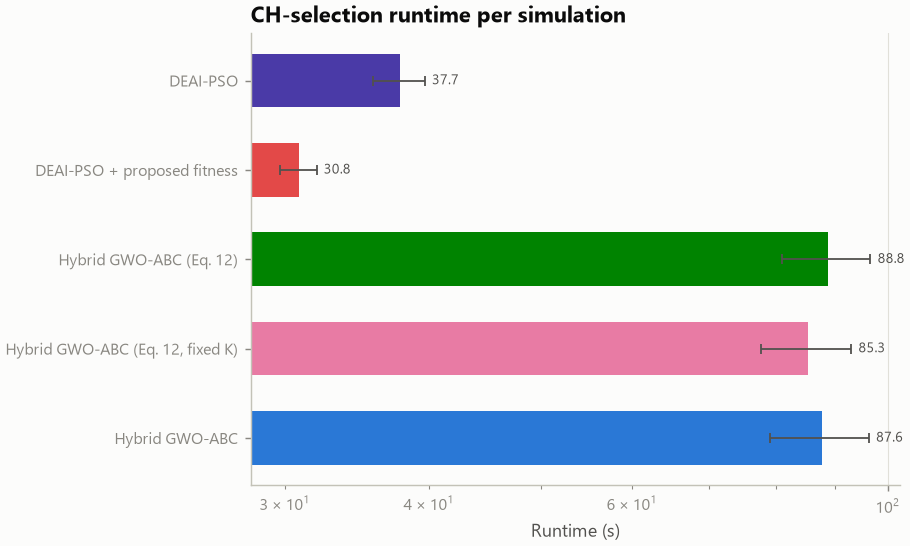

**Observed:** DEAI-PSO 37.71 s (57.71 ms/round, 423,371 fitness evaluations); DEAI-PSO + proposed fitness 30.84 s (46.57 ms/round, 429,073 fitness evaluations); Hybrid GWO-ABC (Eq. 12) 88.75 s (126.85 ms/round, 436,543 fitness evaluations); Hybrid GWO-ABC (Eq. 12, fixed K) 85.28 s (130.35 ms/round, 407,882 fitness evaluations); Hybrid GWO-ABC 87.62 s (130.44 ms/round, 419,512 fitness evaluations)

### FND / HND / LND comparison (mean ± std over runs).

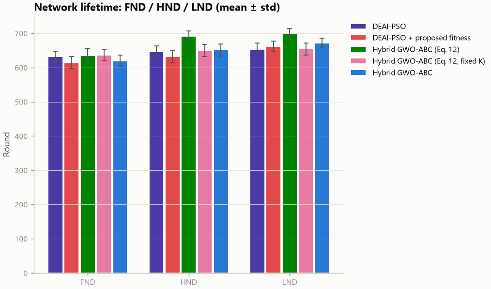

**Observed:** DEAI-PSO: FND 632, HND 647, LND 653; DEAI-PSO + proposed fitness: FND 615, HND 632, LND 662; Hybrid GWO-ABC (Eq. 12): FND 636, HND 691, LND 700; Hybrid GWO-ABC (Eq. 12, fixed K): FND 637, HND 650, LND 654; Hybrid GWO-ABC: FND 620, HND 652, LND 672

### Where the energy goes: mean energy per radio activity over rounds 1–300.

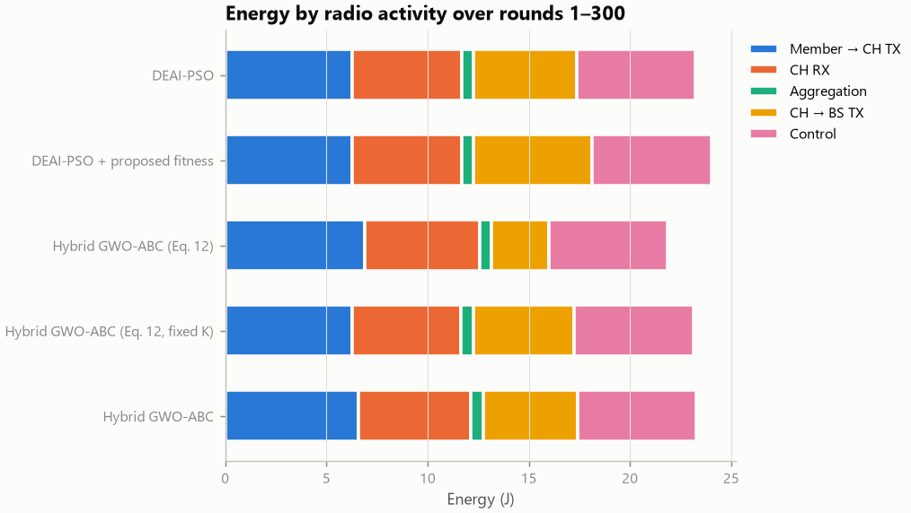

**Observed:** DEAI-PSO: total 17.35 J, largest share member TX (36%); DEAI-PSO + proposed fitness: total 18.14 J, largest share member TX (35%); Hybrid GWO-ABC (Eq. 12): total 15.98 J, largest share member TX (43%); Hybrid GWO-ABC (Eq. 12, fixed K): total 17.24 J, largest share member TX (36%); Hybrid GWO-ABC: total 17.39 J, largest share member TX (38%)

### Final fitness: same objective and weights for every algorithm.

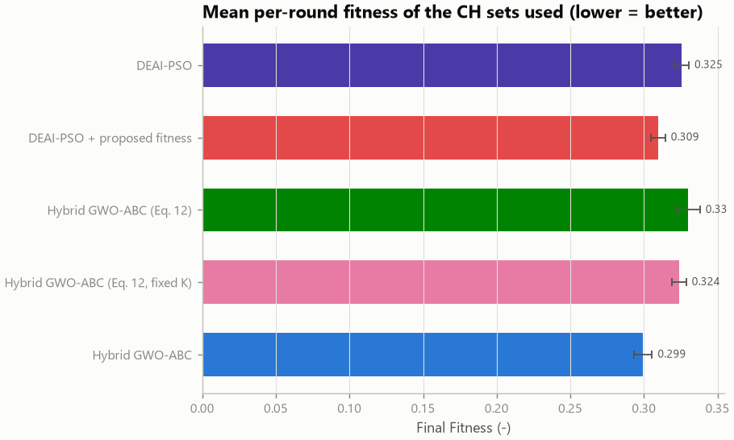

**Observed:** DEAI-PSO 0.3255; DEAI-PSO + proposed fitness 0.3094; Hybrid GWO-ABC (Eq. 12) 0.3302; Hybrid GWO-ABC (Eq. 12, fixed K) 0.3237; Hybrid GWO-ABC 0.2993

## Metric-by-metric interpretation

#### FND
- **What it represents:** First Node Death: the round in which the first node's residual energy reached 0.
- **How it was calculated:** min over nodes of the round in which residual energy reached 0 (simulation horizon if none died). (higher is better, unit: rounds)
- **Why it matters:** Marks the end of the stability period, during which every sensor still reports.
- **Observed (mean ± std over runs):** DEAI-PSO 632 (± 16), DEAI-PSO + proposed fitness 615 (± 17), Hybrid GWO-ABC (Eq. 12) 636 (± 20), Hybrid GWO-ABC (Eq. 12, fixed K) 637 (± 17), Hybrid GWO-ABC 620 (± 17). Best mean: **Hybrid GWO-ABC (Eq. 12, fixed K)**.
- **Proposed vs baselines:** vs DEAI-PSO: Hybrid GWO-ABC (Eq. 12) is 0.51% better (improvement formula), p = 0.979 (Holm), Cliff's δ = +0.09 (negligible) → **no significant difference** — practically small; vs DEAI-PSO + proposed fitness: Hybrid GWO-ABC (Eq. 12) is 3.40% better (improvement formula), p = 0.00109 (Holm), Cliff's δ = +0.62 (large) → **proposed better**; vs Hybrid GWO-ABC (Eq. 12, fixed K): Hybrid GWO-ABC (Eq. 12) is 0.26% worse (improvement formula), p = 0.979 (Holm), Cliff's δ = -0.08 (negligible) → **no significant difference** — practically small; vs Hybrid GWO-ABC: Hybrid GWO-ABC (Eq. 12) is 2.48% better (improvement formula), p = 0.00035 (Holm), Cliff's δ = +0.49 (large) → **proposed better**.
- **Is the difference meaningful?** 2 of 4 comparisons are statistically significant at α = 0.05 after Holm correction. Differences that are not significant, or below 1.0% in size, should not be presented as improvements.
- **Possible explanation:** CH selection that avoids low-energy nodes and rotates the CH role evenly delays the first death; a node chosen repeatedly as CH (e.g. because it is close to the BS) dies early. Measured LND − FND spread (rounds): DEAI-PSO 21, DEAI-PSO + proposed fitness 48, Hybrid GWO-ABC (Eq. 12) 64, Hybrid GWO-ABC (Eq. 12, fixed K) 17, Hybrid GWO-ABC 52.

#### HND
- **What it represents:** Half Node Death: the round in which at least 50% of the nodes were dead.
- **How it was calculated:** round in which the number of dead nodes reached ceil(N/2). (higher is better, unit: rounds)
- **Why it matters:** Indicates how long the network keeps useful coverage.
- **Observed (mean ± std over runs):** DEAI-PSO 647 (± 17), DEAI-PSO + proposed fitness 632 (± 18), Hybrid GWO-ABC (Eq. 12) 691 (± 16), Hybrid GWO-ABC (Eq. 12, fixed K) 650 (± 18), Hybrid GWO-ABC 652 (± 18). Best mean: **Hybrid GWO-ABC (Eq. 12)**.
- **Proposed vs baselines:** vs DEAI-PSO: Hybrid GWO-ABC (Eq. 12) is 6.90% better (improvement formula), p = 0.000346 (Holm), Cliff's δ = +0.95 (large) → **proposed better**; vs DEAI-PSO + proposed fitness: Hybrid GWO-ABC (Eq. 12) is 9.36% better (improvement formula), p = 0.000346 (Holm), Cliff's δ = +1.00 (large) → **proposed better**; vs Hybrid GWO-ABC (Eq. 12, fixed K): Hybrid GWO-ABC (Eq. 12) is 6.45% better (improvement formula), p = 0.000346 (Holm), Cliff's δ = +0.94 (large) → **proposed better**; vs Hybrid GWO-ABC: Hybrid GWO-ABC (Eq. 12) is 6.10% better (improvement formula), p = 0.000346 (Holm), Cliff's δ = +0.93 (large) → **proposed better**.
- **Is the difference meaningful?** 4 of 4 comparisons are statistically significant at α = 0.05 after Holm correction. Differences that are not significant, or below 1.0% in size, should not be presented as improvements.
- **Possible explanation:** HND reflects how evenly energy is drained across the whole network.

#### LND
- **What it represents:** Last Node Death: the round in which the last alive node died.
- **How it was calculated:** round in which the last node died (simulation horizon if nodes were still alive). (higher is better, unit: rounds)
- **Why it matters:** Upper bound of the network lifetime.
- **Observed (mean ± std over runs):** DEAI-PSO 653 (± 18), DEAI-PSO + proposed fitness 662 (± 15), Hybrid GWO-ABC (Eq. 12) 700 (± 15), Hybrid GWO-ABC (Eq. 12, fixed K) 654 (± 18), Hybrid GWO-ABC 672 (± 15). Best mean: **Hybrid GWO-ABC (Eq. 12)**.
- **Proposed vs baselines:** vs DEAI-PSO: Hybrid GWO-ABC (Eq. 12) is 7.09% better (improvement formula), p = 0.000323 (Holm), Cliff's δ = +0.96 (large) → **proposed better**; vs DEAI-PSO + proposed fitness: Hybrid GWO-ABC (Eq. 12) is 5.67% better (improvement formula), p = 0.000323 (Holm), Cliff's δ = +0.93 (large) → **proposed better**; vs Hybrid GWO-ABC (Eq. 12, fixed K): Hybrid GWO-ABC (Eq. 12) is 6.91% better (improvement formula), p = 0.000323 (Holm), Cliff's δ = +0.95 (large) → **proposed better**; vs Hybrid GWO-ABC: Hybrid GWO-ABC (Eq. 12) is 4.15% better (improvement formula), p = 0.000323 (Holm), Cliff's δ = +0.81 (large) → **proposed better**.
- **Is the difference meaningful?** 4 of 4 comparisons are statistically significant at α = 0.05 after Holm correction. Differences that are not significant, or below 1.0% in size, should not be presented as improvements.
- **Possible explanation:** A very even energy drain makes all nodes die at nearly the same time: FND is delayed but the last node also dies sooner. Uneven drain leaves a few nodes with spare energy that keep running. Measured LND − FND spread (rounds): DEAI-PSO 21, DEAI-PSO + proposed fitness 48, Hybrid GWO-ABC (Eq. 12) 64, Hybrid GWO-ABC (Eq. 12, fixed K) 17, Hybrid GWO-ABC 52.

#### Residual Energy
- **What it represents:** Total residual energy of all nodes at the checkpoint round.
- **How it was calculated:** sum of node residual energies after the checkpoint round. (higher is better, unit: J)
- **Why it matters:** More energy left at the same round means cheaper operation.
- **Observed (mean ± std over runs):** DEAI-PSO 26.765 (± 0.598), DEAI-PSO + proposed fitness 25.979 (± 0.697), Hybrid GWO-ABC (Eq. 12) 28.134 (± 0.463), Hybrid GWO-ABC (Eq. 12, fixed K) 26.872 (± 0.620), Hybrid GWO-ABC 26.726 (± 0.642). Best mean: **Hybrid GWO-ABC (Eq. 12)**.
- **Proposed vs baselines:** vs DEAI-PSO: Hybrid GWO-ABC (Eq. 12) is 5.11% better (improvement formula), p = 7.63e-06 (Holm), Cliff's δ = +0.94 (large) → **proposed better**; vs DEAI-PSO + proposed fitness: Hybrid GWO-ABC (Eq. 12) is 8.30% better (improvement formula), p = 7.63e-06 (Holm), Cliff's δ = +1.00 (large) → **proposed better**; vs Hybrid GWO-ABC (Eq. 12, fixed K): Hybrid GWO-ABC (Eq. 12) is 4.70% better (improvement formula), p = 7.63e-06 (Holm), Cliff's δ = +0.92 (large) → **proposed better**; vs Hybrid GWO-ABC: Hybrid GWO-ABC (Eq. 12) is 5.27% better (improvement formula), p = 7.63e-06 (Holm), Cliff's δ = +0.95 (large) → **proposed better**.
- **Is the difference meaningful?** 4 of 4 comparisons are statistically significant at α = 0.05 after Holm correction. Differences that are not significant, or below 1.0% in size, should not be presented as improvements.
- **Possible explanation:** Residual energy at a fixed round depends on per-round radio cost: shorter member->CH links and shorter or fewer CH->BS links consume less.

#### Energy Consumption
- **What it represents:** Initial total energy minus residual energy at the checkpoint round.
- **How it was calculated:** N * E0 - residual energy at the checkpoint round. (lower is better, unit: J)
- **Why it matters:** Energy spent to operate the network for the same number of rounds.
- **Observed (mean ± std over runs):** DEAI-PSO 23.235 (± 0.598), DEAI-PSO + proposed fitness 24.021 (± 0.697), Hybrid GWO-ABC (Eq. 12) 21.866 (± 0.463), Hybrid GWO-ABC (Eq. 12, fixed K) 23.128 (± 0.620), Hybrid GWO-ABC 23.274 (± 0.642). Best mean: **Hybrid GWO-ABC (Eq. 12)**.
- **Proposed vs baselines:** vs DEAI-PSO: Hybrid GWO-ABC (Eq. 12) is 5.89% better (reduction formula), p = 7.63e-06 (Holm), Cliff's δ = +0.94 (large) → **proposed better**; vs DEAI-PSO + proposed fitness: Hybrid GWO-ABC (Eq. 12) is 8.97% better (reduction formula), p = 7.63e-06 (Holm), Cliff's δ = +1.00 (large) → **proposed better**; vs Hybrid GWO-ABC (Eq. 12, fixed K): Hybrid GWO-ABC (Eq. 12) is 5.46% better (reduction formula), p = 7.63e-06 (Holm), Cliff's δ = +0.92 (large) → **proposed better**; vs Hybrid GWO-ABC: Hybrid GWO-ABC (Eq. 12) is 6.05% better (reduction formula), p = 7.63e-06 (Holm), Cliff's δ = +0.95 (large) → **proposed better**.
- **Is the difference meaningful?** 4 of 4 comparisons are statistically significant at α = 0.05 after Holm correction. Differences that are not significant, or below 1.0% in size, should not be presented as improvements.
- **Possible explanation:** Consumption is the complement of residual energy at the same checkpoint.

#### Throughput
- **What it represents:** Total sensor data packets delivered to the BS over the whole simulation (directly or inside an aggregated CH packet).
- **How it was calculated:** count of sensor readings that reached the BS over the whole run. (higher is better, unit: packets)
- **Why it matters:** Amount of sensed data the application actually receives.
- **Observed (mean ± std over runs):** DEAI-PSO 64,045 (± 1,710), DEAI-PSO + proposed fitness 63,210 (± 1,778), Hybrid GWO-ABC (Eq. 12) 68,360 (± 1,539), Hybrid GWO-ABC (Eq. 12, fixed K) 64,387 (± 1,744), Hybrid GWO-ABC 65,102 (± 1,692). Best mean: **Hybrid GWO-ABC (Eq. 12)**.
- **Proposed vs baselines:** vs DEAI-PSO: Hybrid GWO-ABC (Eq. 12) is 6.74% better (improvement formula), p = 8.84e-05 (Holm), Cliff's δ = +0.95 (large) → **proposed better**; vs DEAI-PSO + proposed fitness: Hybrid GWO-ABC (Eq. 12) is 8.15% better (improvement formula), p = 7.63e-06 (Holm), Cliff's δ = +0.98 (large) → **proposed better**; vs Hybrid GWO-ABC (Eq. 12, fixed K): Hybrid GWO-ABC (Eq. 12) is 6.17% better (improvement formula), p = 7.63e-06 (Holm), Cliff's δ = +0.94 (large) → **proposed better**; vs Hybrid GWO-ABC: Hybrid GWO-ABC (Eq. 12) is 5.00% better (improvement formula), p = 7.63e-06 (Holm), Cliff's δ = +0.84 (large) → **proposed better**.
- **Is the difference meaningful?** 4 of 4 comparisons are statistically significant at α = 0.05 after Holm correction. Differences that are not significant, or below 1.0% in size, should not be presented as improvements.
- **Possible explanation:** Throughput grows with the number of rounds in which nodes are alive and with the share of packets that are not lost to CHs dying mid-round.

#### PDR
- **What it represents:** Packet Delivery Ratio = delivered data packets / generated data packets.
- **How it was calculated:** delivered readings / generated readings over the whole run. (higher is better, unit: ratio)
- **Why it matters:** Reliability: share of generated readings that reach the BS.
- **Observed (mean ± std over runs):** DEAI-PSO 0.9913 (± 0.0012), DEAI-PSO + proposed fitness 0.9966 (± 0.0011), Hybrid GWO-ABC (Eq. 12) 0.9915 (± 0.0018), Hybrid GWO-ABC (Eq. 12, fixed K) 0.9922 (± 0.0008), Hybrid GWO-ABC 0.9981 (± 0.0003). Best mean: **Hybrid GWO-ABC**.
- **Proposed vs baselines:** vs DEAI-PSO: Hybrid GWO-ABC (Eq. 12) is 0.03% better (improvement formula), p = 0.756 (Holm), Cliff's δ = +0.13 (negligible) → **no significant difference** — practically small; vs DEAI-PSO + proposed fitness: Hybrid GWO-ABC (Eq. 12) is 0.50% worse (improvement formula), p = 7.63e-06 (Holm), Cliff's δ = -1.00 (large) → **proposed worse** — practically small; vs Hybrid GWO-ABC (Eq. 12, fixed K): Hybrid GWO-ABC (Eq. 12) is 0.06% worse (improvement formula), p = 0.491 (Holm), Cliff's δ = -0.20 (small) → **no significant difference** — practically small; vs Hybrid GWO-ABC: Hybrid GWO-ABC (Eq. 12) is 0.65% worse (improvement formula), p = 7.63e-06 (Holm), Cliff's δ = -1.00 (large) → **proposed worse** — practically small.
- **Is the difference meaningful?** 2 of 4 comparisons are statistically significant at α = 0.05 after Holm correction. Differences that are not significant, or below 1.0% in size, should not be presented as improvements.
- **Possible explanation:** Packets are lost when a CH runs out of energy before forwarding its cluster's data, or when a node dies while transmitting. Energy-feasibility checks on CHs reduce such losses.

#### Avg. Cluster Distance
- **What it represents:** Mean member->CH distance, averaged over rounds 1..checkpoint.
- **How it was calculated:** per round mean member->CH distance, averaged over rounds 1..checkpoint. (lower is better, unit: m)
- **Why it matters:** Shorter intra-cluster links cost less transmission energy (d^2 / d^4).
- **Observed (mean ± std over runs):** DEAI-PSO 24.102 (± 1.524), DEAI-PSO + proposed fitness 23.266 (± 1.468), Hybrid GWO-ABC (Eq. 12) 27.482 (± 1.358), Hybrid GWO-ABC (Eq. 12, fixed K) 23.676 (± 1.441), Hybrid GWO-ABC 25.320 (± 1.517). Best mean: **DEAI-PSO + proposed fitness**.
- **Proposed vs baselines:** vs DEAI-PSO: Hybrid GWO-ABC (Eq. 12) is 14.03% worse (reduction formula), p = 7.63e-06 (Holm), Cliff's δ = -0.92 (large) → **proposed worse**; vs DEAI-PSO + proposed fitness: Hybrid GWO-ABC (Eq. 12) is 18.12% worse (reduction formula), p = 7.63e-06 (Holm), Cliff's δ = -0.96 (large) → **proposed worse**; vs Hybrid GWO-ABC (Eq. 12, fixed K): Hybrid GWO-ABC (Eq. 12) is 16.08% worse (reduction formula), p = 7.63e-06 (Holm), Cliff's δ = -0.94 (large) → **proposed worse**; vs Hybrid GWO-ABC: Hybrid GWO-ABC (Eq. 12) is 8.54% worse (reduction formula), p = 7.63e-06 (Holm), Cliff's δ = -0.69 (large) → **proposed worse**.
- **Is the difference meaningful?** 4 of 4 comparisons are statistically significant at α = 0.05 after Holm correction. Differences that are not significant, or below 1.0% in size, should not be presented as improvements.
- **Possible explanation:** The fitness function explicitly penalises member->CH distance; LEACH places CHs at random positions, which typically lengthens member links.

#### Avg. CH-BS Distance
- **What it represents:** Mean CH->BS distance, averaged over rounds 1..checkpoint.
- **How it was calculated:** per round mean CH->BS distance, averaged over rounds 1..checkpoint. (lower is better, unit: m)
- **Why it matters:** CH->BS is the longest and most expensive hop.
- **Observed (mean ± std over runs):** DEAI-PSO 124.399 (± 2.627), DEAI-PSO + proposed fitness 129.022 (± 2.984), Hybrid GWO-ABC (Eq. 12) 127.608 (± 2.294), Hybrid GWO-ABC (Eq. 12, fixed K) 123.883 (± 2.875), Hybrid GWO-ABC 131.646 (± 2.853). Best mean: **Hybrid GWO-ABC (Eq. 12, fixed K)**.
- **Proposed vs baselines:** vs DEAI-PSO: Hybrid GWO-ABC (Eq. 12) is 2.58% worse (reduction formula), p = 7.63e-06 (Holm), Cliff's δ = -0.64 (large) → **proposed worse**; vs DEAI-PSO + proposed fitness: Hybrid GWO-ABC (Eq. 12) is 1.10% better (reduction formula), p = 7.63e-06 (Holm), Cliff's δ = +0.28 (small) → **proposed better**; vs Hybrid GWO-ABC (Eq. 12, fixed K): Hybrid GWO-ABC (Eq. 12) is 3.01% worse (reduction formula), p = 7.63e-06 (Holm), Cliff's δ = -0.68 (large) → **proposed worse**; vs Hybrid GWO-ABC: Hybrid GWO-ABC (Eq. 12) is 3.07% better (reduction formula), p = 7.63e-06 (Holm), Cliff's δ = +0.71 (large) → **proposed better**.
- **Is the difference meaningful?** 4 of 4 comparisons are statistically significant at α = 0.05 after Holm correction. Differences that are not significant, or below 1.0% in size, should not be presented as improvements.
- **Possible explanation:** The fitness penalises CH->BS distance, but the energy-eligibility rule and the energy term limit how often nodes near the BS can be selected.

#### Runtime
- **What it represents:** Total wall-clock time spent selecting CHs over the whole simulation.
- **How it was calculated:** sum of wall-clock CH-selection time over all rounds (time.perf_counter). (lower is better, unit: s)
- **Why it matters:** Computational cost of the CH selection algorithm.
- **Observed (mean ± std over runs):** DEAI-PSO 37.71 (± 1.95), DEAI-PSO + proposed fitness 30.84 (± 1.12), Hybrid GWO-ABC (Eq. 12) 88.75 (± 7.83), Hybrid GWO-ABC (Eq. 12, fixed K) 85.28 (± 7.66), Hybrid GWO-ABC 87.62 (± 8.66). Best mean: **DEAI-PSO + proposed fitness**.
- **Proposed vs baselines:** vs DEAI-PSO: Hybrid GWO-ABC (Eq. 12) is 135.37% worse (reduction formula), p = 7.63e-06 (Holm), Cliff's δ = -1.00 (large) → **proposed worse**; vs DEAI-PSO + proposed fitness: Hybrid GWO-ABC (Eq. 12) is 187.82% worse (reduction formula), p = 7.63e-06 (Holm), Cliff's δ = -1.00 (large) → **proposed worse**; vs Hybrid GWO-ABC (Eq. 12, fixed K): Hybrid GWO-ABC (Eq. 12) is 4.07% worse (reduction formula), p = 7.63e-06 (Holm), Cliff's δ = -0.62 (large) → **proposed worse**; vs Hybrid GWO-ABC: Hybrid GWO-ABC (Eq. 12) is 1.29% worse (reduction formula), p = 0.00121 (Holm), Cliff's δ = -0.21 (small) → **proposed worse**.
- **Is the difference meaningful?** 4 of 4 comparisons are statistically significant at α = 0.05 after Holm correction. Differences that are not significant, or below 1.0% in size, should not be presented as improvements.
- **Possible explanation:** Metaheuristics evaluate hundreds of candidate CH sets per round; LEACH needs one random draw per node. The hybrid runs two populations and more operators per iteration, which adds overhead even at an equal number of fitness evaluations.

#### Final Fitness
- **What it represents:** Mean per-round fitness (same function and weights for every algorithm) of the CH set actually used, over rounds 1..checkpoint. Lower is better.
- **How it was calculated:** per round fitness of the CH set used (same weights for all), mean over rounds 1..checkpoint. (lower is better, unit: -)
- **Why it matters:** Quality of the CH configurations according to the optimisation objective.
- **Observed (mean ± std over runs):** DEAI-PSO 0.3255 (± 0.0049), DEAI-PSO + proposed fitness 0.3094 (± 0.0049), Hybrid GWO-ABC (Eq. 12) 0.3302 (± 0.0078), Hybrid GWO-ABC (Eq. 12, fixed K) 0.3237 (± 0.0049), Hybrid GWO-ABC 0.2993 (± 0.0061). Best mean: **Hybrid GWO-ABC**.
- **Proposed vs baselines:** vs DEAI-PSO: Hybrid GWO-ABC (Eq. 12) is 1.44% worse (reduction formula), p = 0.000586 (Holm), Cliff's δ = -0.39 (medium) → **proposed worse**; vs DEAI-PSO + proposed fitness: Hybrid GWO-ABC (Eq. 12) is 6.70% worse (reduction formula), p = 7.63e-06 (Holm), Cliff's δ = -0.99 (large) → **proposed worse**; vs Hybrid GWO-ABC (Eq. 12, fixed K): Hybrid GWO-ABC (Eq. 12) is 1.99% worse (reduction formula), p = 3.81e-05 (Holm), Cliff's δ = -0.52 (large) → **proposed worse**; vs Hybrid GWO-ABC: Hybrid GWO-ABC (Eq. 12) is 10.32% worse (reduction formula), p = 7.63e-06 (Holm), Cliff's δ = -1.00 (large) → **proposed worse**.
- **Is the difference meaningful?** 4 of 4 comparisons are statistically significant at α = 0.05 after Holm correction. Differences that are not significant, or below 1.0% in size, should not be presented as improvements.
- **Possible explanation:** Optimisers minimise this objective directly; LEACH does not use it, and rounds in which LEACH elects zero CHs or too many receive the invalid-solution penalty.

#### Node-rounds
- **What it represents:** Sum over rounds of the number of alive nodes (area under the alive-nodes curve).
- **How it was calculated:** sum over rounds of alive nodes. (higher is better, unit: node x rounds)
- **Why it matters:** Single-number lifetime measure that accounts for the whole death curve.
- **Observed (mean ± std over runs):** DEAI-PSO 64,509 (± 1,718), DEAI-PSO + proposed fitness 63,327 (± 1,761), Hybrid GWO-ABC (Eq. 12) 68,842 (± 1,514), Hybrid GWO-ABC (Eq. 12, fixed K) 64,795 (± 1,765), Hybrid GWO-ABC 65,130 (± 1,701). Best mean: **Hybrid GWO-ABC (Eq. 12)**.
- **Proposed vs baselines:** vs DEAI-PSO: Hybrid GWO-ABC (Eq. 12) is 6.72% better (improvement formula), p = 7.63e-06 (Holm), Cliff's δ = +0.95 (large) → **proposed better**; vs DEAI-PSO + proposed fitness: Hybrid GWO-ABC (Eq. 12) is 8.71% better (improvement formula), p = 7.63e-06 (Holm), Cliff's δ = +0.99 (large) → **proposed better**; vs Hybrid GWO-ABC (Eq. 12, fixed K): Hybrid GWO-ABC (Eq. 12) is 6.25% better (improvement formula), p = 7.63e-06 (Holm), Cliff's δ = +0.94 (large) → **proposed better**; vs Hybrid GWO-ABC: Hybrid GWO-ABC (Eq. 12) is 5.70% better (improvement formula), p = 7.63e-06 (Holm), Cliff's δ = +0.93 (large) → **proposed better**.
- **Is the difference meaningful?** 4 of 4 comparisons are statistically significant at α = 0.05 after Holm correction. Differences that are not significant, or below 1.0% in size, should not be presented as improvements.
- **Possible explanation:** The area under the alive-nodes curve combines stability period and tail length.

#### Cluster Imbalance
- **What it represents:** Coefficient of variation of cluster sizes, averaged over rounds 1..checkpoint.
- **How it was calculated:** per round std/mean of cluster sizes, averaged over rounds 1..checkpoint. (lower is better, unit: CV)
- **Why it matters:** Balanced clusters spread the CH load evenly.
- **Observed (mean ± std over runs):** DEAI-PSO 1.0292 (± 0.0609), DEAI-PSO + proposed fitness 0.8630 (± 0.0616), Hybrid GWO-ABC (Eq. 12) 0.6020 (± 0.0456), Hybrid GWO-ABC (Eq. 12, fixed K) 1.0136 (± 0.0580), Hybrid GWO-ABC 0.5872 (± 0.1005). Best mean: **Hybrid GWO-ABC**.
- **Proposed vs baselines:** vs DEAI-PSO: Hybrid GWO-ABC (Eq. 12) is 41.51% better (reduction formula), p = 7.63e-06 (Holm), Cliff's δ = +1.00 (large) → **proposed better**; vs DEAI-PSO + proposed fitness: Hybrid GWO-ABC (Eq. 12) is 30.25% better (reduction formula), p = 7.63e-06 (Holm), Cliff's δ = +1.00 (large) → **proposed better**; vs Hybrid GWO-ABC (Eq. 12, fixed K): Hybrid GWO-ABC (Eq. 12) is 40.61% better (reduction formula), p = 7.63e-06 (Holm), Cliff's δ = +1.00 (large) → **proposed better**; vs Hybrid GWO-ABC: Hybrid GWO-ABC (Eq. 12) is 2.52% worse (reduction formula), p = 0.312 (Holm), Cliff's δ = -0.12 (negligible) → **no significant difference**.
- **Is the difference meaningful?** 3 of 4 comparisons are statistically significant at α = 0.05 after Holm correction. Differences that are not significant, or below 1.0% in size, should not be presented as improvements.
- **Possible explanation:** The fitness penalises unequal cluster sizes; nearest-CH assignment does not.

## Cluster-head records (run 0)

Every selected CH of every round is recorded in `ch_log_run0.csv` (round, CH id, coordinates, residual energy at selection, distance to the BS, cluster size including the CH). Dead and duplicate CHs are removed before clustering, so only valid CHs appear.

### DEAI-PSO

Over 635 rounds with CHs: 9.91 CHs/round on average; mean CH residual energy at selection 0.2517 J; mean CH–BS distance 128.43 m; 100 distinct nodes served as CH, the most frequent one 375 times.

Round 1 cluster heads:

| CH id | x (m) | y (m) | Residual energy (J) | CH–BS (m) | Cluster size |
|---|---:|---:|---:|---:|---:|
| 3 | 76.11 | 78.61 | 0.5 | 127.1 | 5 |
| 6 | 64.39 | 82.28 | 0.5 | 139.4 | 14 |
| 10 | 75.81 | 35.45 | 0.5 | 125 | 6 |
| 24 | 68.25 | 13.98 | 0.5 | 136.6 | 18 |
| 40 | 66.43 | 40.64 | 0.5 | 133.9 | 14 |
| 50 | 90.86 | 69.97 | 0.5 | 111 | 5 |
| 60 | 58.41 | 64.98 | 0.5 | 142.4 | 27 |
| 69 | 78.27 | 8.273 | 0.5 | 128.7 | 2 |
| 90 | 89.08 | 89.34 | 0.5 | 117.7 | 4 |
| 92 | 77.2 | 66.17 | 0.5 | 123.9 | 5 |

### DEAI-PSO + proposed fitness

Over 646 rounds with CHs: 9.58 CHs/round on average; mean CH residual energy at selection 0.2591 J; mean CH–BS distance 130.36 m; 100 distinct nodes served as CH, the most frequent one 372 times.

Round 1 cluster heads:

| CH id | x (m) | y (m) | Residual energy (J) | CH–BS (m) | Cluster size |
|---|---:|---:|---:|---:|---:|
| 0 | 77.4 | 43.89 | 0.5 | 122.8 | 10 |
| 4 | 12.81 | 45.04 | 0.5 | 187.3 | 11 |
| 10 | 75.81 | 35.45 | 0.5 | 125 | 10 |
| 13 | 46.67 | 4.38 | 0.5 | 160 | 9 |
| 15 | 74.48 | 96.75 | 0.5 | 133.9 | 8 |
| 16 | 32.58 | 37.05 | 0.5 | 167.9 | 10 |
| 17 | 46.96 | 18.95 | 0.5 | 156.2 | 10 |
| 19 | 22.69 | 66.98 | 0.5 | 178.1 | 10 |
| 54 | 9.639 | 90.26 | 0.5 | 194.6 | 11 |
| 90 | 89.08 | 89.34 | 0.5 | 117.7 | 11 |

### Hybrid GWO-ABC (Eq. 12)

Over 688 rounds with CHs: 4.96 CHs/round on average; mean CH residual energy at selection 0.2535 J; mean CH–BS distance 130.20 m; 99 distinct nodes served as CH, the most frequent one 189 times.

Round 1 cluster heads:

| CH id | x (m) | y (m) | Residual energy (J) | CH–BS (m) | Cluster size |
|---|---:|---:|---:|---:|---:|
| 1 | 85.86 | 69.74 | 0.5 | 115.8 | 5 |
| 12 | 77.84 | 19.46 | 0.5 | 125.9 | 10 |
| 21 | 70.03 | 31.24 | 0.5 | 131.3 | 16 |
| 22 | 83.23 | 80.48 | 0.5 | 120.7 | 15 |
| 30 | 66.84 | 47.11 | 0.5 | 133.2 | 25 |
| 40 | 66.43 | 40.64 | 0.5 | 133.9 | 15 |
| 92 | 77.2 | 66.17 | 0.5 | 123.9 | 14 |

### Hybrid GWO-ABC (Eq. 12, fixed K)

Over 637 rounds with CHs: 9.92 CHs/round on average; mean CH residual energy at selection 0.2516 J; mean CH–BS distance 128.11 m; 100 distinct nodes served as CH, the most frequent one 388 times.

Round 1 cluster heads:

| CH id | x (m) | y (m) | Residual energy (J) | CH–BS (m) | Cluster size |
|---|---:|---:|---:|---:|---:|
| 6 | 64.39 | 82.28 | 0.5 | 139.4 | 18 |
| 10 | 75.81 | 35.45 | 0.5 | 125 | 10 |
| 11 | 97.07 | 89.31 | 0.5 | 110.2 | 3 |
| 12 | 77.84 | 19.46 | 0.5 | 125.9 | 9 |
| 32 | 63.47 | 55.36 | 0.5 | 136.6 | 10 |
| 60 | 58.41 | 64.98 | 0.5 | 142.4 | 25 |
| 68 | 95.86 | 48.23 | 0.5 | 104.2 | 2 |
| 69 | 78.27 | 8.273 | 0.5 | 128.7 | 11 |
| 89 | 89.17 | 74.86 | 0.5 | 113.6 | 10 |
| 95 | 93.68 | 24.1 | 0.5 | 109.4 | 2 |

### Hybrid GWO-ABC

Over 661 rounds with CHs: 7.56 CHs/round on average; mean CH residual energy at selection 0.2588 J; mean CH–BS distance 130.85 m; 100 distinct nodes served as CH, the most frequent one 298 times.

Round 1 cluster heads:

| CH id | x (m) | y (m) | Residual energy (J) | CH–BS (m) | Cluster size |
|---|---:|---:|---:|---:|---:|
| 0 | 77.4 | 43.89 | 0.5 | 122.8 | 8 |
| 12 | 77.84 | 19.46 | 0.5 | 125.9 | 9 |
| 18 | 12.99 | 47.57 | 0.5 | 187 | 13 |
| 22 | 83.23 | 80.48 | 0.5 | 120.7 | 10 |
| 27 | 70.52 | 78.07 | 0.5 | 132.5 | 11 |
| 46 | 44.62 | 38.1 | 0.5 | 155.8 | 10 |
| 51 | 26.59 | 96.92 | 0.5 | 179.6 | 12 |
| 59 | 43.21 | 62.73 | 0.5 | 157.3 | 10 |
| 63 | 32.99 | 14.45 | 0.5 | 170.8 | 10 |
| 97 | 15.33 | 17.93 | 0.5 | 187.4 | 7 |


## Reproducing this experiment

```
python main.py reproduce "C:\Users\Admin\Hybrid-GWO-ABC-WSN\results\base_paper\attribution_BP1"
```

`config.json` holds every parameter; `experiment.json` holds the algorithms, run count and seeds.
