# Algorithm comparison


All numbers below were produced by the simulator in this folder (3 independent paired runs per algorithm; run r uses deployment/algorithm seed 42 + r). Raw per-run results: `runs_raw.csv`; per-round histories: `history_raw.csv.gz`; statistics: `statistics.csv`; proposed-vs-baseline tests: `improvement_vs_baselines.csv`.

## Configuration

| Parameter | Value |
|---|---|
| Nodes | 100 |
| Area (m) | 100 x 100 |
| BS position | (50, 50) |
| Initial energy (J/node) | 0.5 |
| Packet size (bits) | 4000 |
| Control packet (bits) | 0 |
| Max rounds | 2000 |
| CH percentage p | 0.05 |
| CH count tolerance | K_opt x (1 ± 0.5) |
| CH eligibility (optimisers) | E ≥ 1.0 x mean alive energy |
| Optimisation iterations / round | 30 |
| GWO population | 20 |
| ABC colony size (food sources) | 20 (10) |
| ABC abandonment limit | 10 |
| Hybrid budget share / transfer / feedback | 0.5 / 3 / True |
| Fitness weights w1..w5 | 0.3, 0.25, 0.2, 0.15, 0.1 |
| Radio E_elec / E_fs / E_mp / E_DA | 5e-08 / 1e-11 / 1.3e-15 / 5e-09 |
| Checkpoint round (energy / averages) | 500 |
| Base seed | 42 |

## Final result table (mean ± std over runs)

| Metric | Random | LEACH | GWO | ABC | Hybrid GWO-ABC |
|---|---:|---:|---:|---:|---:|
| FND (rounds) | 787 ± 13 | 898 ± 29 | 1,131 ± 10 | 1,128 ± 15 | 1,131 ± 9 |
| HND (rounds) | 1,130 ± 4 | 1,101 ± 7 | 1,141 ± 10 | 1,142 ± 9 | 1,142 ± 9 |
| LND (rounds) | 1,327 ± 22 | 1,269 ± 28 | 1,167 ± 6 | 1,166 ± 7 | 1,165 ± 11 |
| Residual Energy (J) | 27.775 ± 0.089 | 27.405 ± 0.038 | 28.164 ± 0.103 | 28.176 ± 0.112 | 28.165 ± 0.115 |
| Energy Consumption (J) | 22.225 ± 0.089 | 22.595 ± 0.038 | 21.836 ± 0.103 | 21.824 ± 0.112 | 21.835 ± 0.115 |
| Throughput (packets) | 110,161 ± 298 | 109,057 ± 422 | 114,144 ± 789 | 114,157 ± 887 | 114,098 ± 703 |
| PDR (ratio) | 0.9907 ± 0.0003 | 0.9902 ± 0.0021 | 0.9987 ± 0.0003 | 0.9987 ± 0.0004 | 0.9980 ± 0.0004 |
| Avg. Cluster Distance (m) | 24.861 ± 0.658 | 26.918 ± 0.430 | 22.044 ± 0.911 | 21.955 ± 0.993 | 22.041 ± 1.016 |
| Avg. CH-BS Distance (m) | 38.419 ± 1.129 | 38.632 ± 1.061 | 38.229 ± 1.067 | 38.209 ± 0.993 | 38.244 ± 1.127 |
| Runtime (s) | 0.50 ± 0.02 | 0.05 ± 0.00 | 40.79 ± 0.14 | 66.49 ± 0.70 | 78.25 ± 0.68 |
| Final Fitness (-) | 0.2948 ± 0.0144 | 1.2720 ± 0.1455 | 0.2442 ± 0.0130 | 0.2427 ± 0.0137 | 0.2411 ± 0.0137 |

Residual energy and energy consumption are measured at the checkpoint round 500; distance, imbalance and fitness averages cover rounds 1–500. '≥' marks lifetime values where at least one run had not reached the event within 2000 rounds (the horizon is then used as a lower bound).

## Descriptive statistics

**FND (rounds)**

| Algorithm | n | mean | std | min | max |
|---|---:|---:|---:|---:|---:|
| Random | 3 | 787 | 13 | 776 | 801 |
| LEACH | 3 | 898 | 29 | 877 | 931 |
| GWO | 3 | 1,131 | 10 | 1,119 | 1,138 |
| ABC | 3 | 1,128 | 15 | 1,111 | 1,138 |
| Hybrid GWO-ABC | 3 | 1,131 | 9 | 1,122 | 1,140 |

**HND (rounds)**

| Algorithm | n | mean | std | min | max |
|---|---:|---:|---:|---:|---:|
| Random | 3 | 1,130 | 4 | 1,126 | 1,134 |
| LEACH | 3 | 1,101 | 7 | 1,095 | 1,108 |
| GWO | 3 | 1,141 | 10 | 1,130 | 1,148 |
| ABC | 3 | 1,142 | 9 | 1,131 | 1,147 |
| Hybrid GWO-ABC | 3 | 1,142 | 9 | 1,132 | 1,148 |

**LND (rounds)**

| Algorithm | n | mean | std | min | max |
|---|---:|---:|---:|---:|---:|
| Random | 3 | 1,327 | 22 | 1,305 | 1,348 |
| LEACH | 3 | 1,269 | 28 | 1,242 | 1,297 |
| GWO | 3 | 1,167 | 6 | 1,163 | 1,173 |
| ABC | 3 | 1,166 | 7 | 1,159 | 1,173 |
| Hybrid GWO-ABC | 3 | 1,165 | 11 | 1,157 | 1,177 |

**Residual Energy (J)**

| Algorithm | n | mean | std | min | max |
|---|---:|---:|---:|---:|---:|
| Random | 3 | 27.775 | 0.089 | 27.718 | 27.878 |
| LEACH | 3 | 27.405 | 0.038 | 27.375 | 27.448 |
| GWO | 3 | 28.164 | 0.103 | 28.045 | 28.228 |
| ABC | 3 | 28.176 | 0.112 | 28.047 | 28.251 |
| Hybrid GWO-ABC | 3 | 28.165 | 0.115 | 28.035 | 28.252 |

**Energy Consumption (J)**

| Algorithm | n | mean | std | min | max |
|---|---:|---:|---:|---:|---:|
| Random | 3 | 22.225 | 0.089 | 22.122 | 22.282 |
| LEACH | 3 | 22.595 | 0.038 | 22.552 | 22.625 |
| GWO | 3 | 21.836 | 0.103 | 21.772 | 21.955 |
| ABC | 3 | 21.824 | 0.112 | 21.749 | 21.953 |
| Hybrid GWO-ABC | 3 | 21.835 | 0.115 | 21.748 | 21.965 |

**Throughput (packets)**

| Algorithm | n | mean | std | min | max |
|---|---:|---:|---:|---:|---:|
| Random | 3 | 110,161 | 298 | 109,825 | 110,393 |
| LEACH | 3 | 109,057 | 422 | 108,726 | 109,533 |
| GWO | 3 | 114,144 | 789 | 113,240 | 114,689 |
| ABC | 3 | 114,157 | 887 | 113,133 | 114,701 |
| Hybrid GWO-ABC | 3 | 114,098 | 703 | 113,288 | 114,549 |

**PDR (ratio)**

| Algorithm | n | mean | std | min | max |
|---|---:|---:|---:|---:|---:|
| Random | 3 | 0.9907 | 0.0003 | 0.9904 | 0.9910 |
| LEACH | 3 | 0.9902 | 0.0021 | 0.9878 | 0.9920 |
| GWO | 3 | 0.9987 | 0.0003 | 0.9985 | 0.9991 |
| ABC | 3 | 0.9987 | 0.0004 | 0.9984 | 0.9991 |
| Hybrid GWO-ABC | 3 | 0.9980 | 0.0004 | 0.9976 | 0.9983 |

**Runtime (s)**

| Algorithm | n | mean | std | min | max |
|---|---:|---:|---:|---:|---:|
| Random | 3 | 0.50 | 0.02 | 0.48 | 0.51 |
| LEACH | 3 | 0.05 | 0.00 | 0.05 | 0.05 |
| GWO | 3 | 40.79 | 0.14 | 40.70 | 40.94 |
| ABC | 3 | 66.49 | 0.70 | 65.69 | 67.01 |
| Hybrid GWO-ABC | 3 | 78.25 | 0.68 | 77.53 | 78.86 |

## Hybrid GWO-ABC vs baselines

Improvement % uses ((P − B) / B) × 100 for higher-is-better metrics and ((B − P) / B) × 100 for lower-is-better metrics, so a positive value always means the proposed algorithm did better. p-values: paired two-sided Wilcoxon signed-rank test, Holm-corrected over the baselines. Cliff's δ > 0 favours the proposed algorithm (|δ| < 0.147 negligible, < 0.33 small, < 0.474 medium, otherwise large).

| Metric | Baseline | Better | Improvement % | p (Holm) | Cliff's δ | Effect | Verdict |
|---|---|---|---:|---:|---:|---|---|
| FND | Random | higher | +43.81 | 1 | +1.00 | large | no significant difference |
| FND | LEACH | higher | +25.94 | 1 | +1.00 | large | no significant difference |
| FND | GWO | higher | +0.06 | 1 | +0.11 | negligible | no significant difference |
| FND | ABC | higher | +0.33 | 1 | +0.11 | negligible | no significant difference |
| HND | Random | higher | +1.03 | 1 | +0.78 | large | no significant difference |
| HND | LEACH | higher | +3.76 | 1 | +1.00 | large | no significant difference |
| HND | GWO | higher | +0.06 | 1 | +0.11 | negligible | no significant difference |
| HND | ABC | higher | +0.03 | 1 | +0.11 | negligible | no significant difference |
| LND | Random | higher | -12.26 | 1 | -1.00 | large | no significant difference |
| LND | LEACH | higher | -8.22 | 1 | -1.00 | large | no significant difference |
| LND | GWO | higher | -0.17 | 1 | -0.33 | medium | no significant difference |
| LND | ABC | higher | -0.14 | 1 | -0.11 | negligible | no significant difference |
| Node-rounds | Random | higher | +2.82 | 1 | +1.00 | large | no significant difference |
| Node-rounds | LEACH | higher | +3.80 | 1 | +1.00 | large | no significant difference |
| Node-rounds | GWO | higher | +0.03 | 1 | +0.11 | negligible | no significant difference |
| Node-rounds | ABC | higher | +0.02 | 1 | -0.11 | negligible | no significant difference |
| Residual Energy | Random | higher | +1.40 | 1 | +1.00 | large | no significant difference |
| Residual Energy | LEACH | higher | +2.77 | 1 | +1.00 | large | no significant difference |
| Residual Energy | GWO | higher | +0.00 | 1 | -0.11 | negligible | no significant difference |
| Residual Energy | ABC | higher | -0.04 | 1 | -0.11 | negligible | no significant difference |
| Energy Consumption | Random | lower | +1.75 | 1 | +1.00 | large | no significant difference |
| Energy Consumption | LEACH | lower | +3.36 | 1 | +1.00 | large | no significant difference |
| Energy Consumption | GWO | lower | +0.01 | 1 | -0.11 | negligible | no significant difference |
| Energy Consumption | ABC | lower | -0.05 | 1 | -0.11 | negligible | no significant difference |
| Throughput | Random | higher | +3.57 | 1 | +1.00 | large | no significant difference |
| Throughput | LEACH | higher | +4.62 | 1 | +1.00 | large | no significant difference |
| Throughput | GWO | higher | -0.04 | 1 | -0.11 | negligible | no significant difference |
| Throughput | ABC | higher | -0.05 | 1 | -0.33 | medium | no significant difference |
| PDR | Random | higher | +0.73 | 1 | +1.00 | large | no significant difference |
| PDR | LEACH | higher | +0.79 | 1 | +1.00 | large | no significant difference |
| PDR | GWO | higher | -0.07 | 1 | -1.00 | large | no significant difference |
| PDR | ABC | higher | -0.07 | 1 | -1.00 | large | no significant difference |
| Avg. Cluster Distance | Random | lower | +11.35 | 1 | +1.00 | large | no significant difference |
| Avg. Cluster Distance | LEACH | lower | +18.12 | 1 | +1.00 | large | no significant difference |
| Avg. Cluster Distance | GWO | lower | +0.01 | 1 | -0.11 | negligible | no significant difference |
| Avg. Cluster Distance | ABC | lower | -0.39 | 1 | -0.33 | medium | no significant difference |
| Avg. CH-BS Distance | Random | lower | +0.46 | 1 | +0.33 | medium | no significant difference |
| Avg. CH-BS Distance | LEACH | lower | +1.00 | 1 | +0.33 | medium | no significant difference |
| Avg. CH-BS Distance | GWO | lower | -0.04 | 1 | +0.11 | negligible | no significant difference |
| Avg. CH-BS Distance | ABC | lower | -0.09 | 1 | -0.11 | negligible | no significant difference |
| Final Fitness | Random | lower | +18.22 | 1 | +1.00 | large | no significant difference |
| Final Fitness | LEACH | lower | +81.04 | 1 | +1.00 | large | no significant difference |
| Final Fitness | GWO | lower | +1.24 | 1 | +0.33 | medium | no significant difference |
| Final Fitness | ABC | lower | +0.66 | 1 | -0.11 | negligible | no significant difference |
| Runtime | Random | lower | -15693.88 | 1 | -1.00 | large | no significant difference |
| Runtime | LEACH | lower | -154993.59 | 1 | -1.00 | large | no significant difference |
| Runtime | GWO | lower | -91.84 | 1 | -1.00 | large | no significant difference |
| Runtime | ABC | lower | -17.69 | 1 | -1.00 | large | no significant difference |

### Trade-offs

- **Hybrid GWO-ABC vs Random** — significantly better: none; significantly worse: none; no significant difference: FND, HND, LND, Node-rounds, Residual Energy, Energy Consumption, Throughput, PDR, Avg. Cluster Distance, Avg. CH-BS Distance, Cluster Imbalance, Final Fitness, Runtime, Runtime / round, Fitness Evaluations.
- **Hybrid GWO-ABC vs LEACH** — significantly better: none; significantly worse: none; no significant difference: FND, HND, LND, Node-rounds, Residual Energy, Energy Consumption, Throughput, PDR, Avg. Cluster Distance, Avg. CH-BS Distance, Cluster Imbalance, Final Fitness, Runtime, Runtime / round, Fitness Evaluations.
- **Hybrid GWO-ABC vs GWO** — significantly better: none; significantly worse: none; no significant difference: FND, HND, LND, Node-rounds, Residual Energy, Energy Consumption, Throughput, PDR, Avg. Cluster Distance, Avg. CH-BS Distance, Cluster Imbalance, Final Fitness, Runtime, Runtime / round, Fitness Evaluations.
- **Hybrid GWO-ABC vs ABC** — significantly better: none; significantly worse: none; no significant difference: FND, HND, LND, Node-rounds, Residual Energy, Energy Consumption, Throughput, PDR, Avg. Cluster Distance, Avg. CH-BS Distance, Cluster Imbalance, Final Fitness, Runtime, Runtime / round, Fitness Evaluations.

## Figures

### Initial WSN topology (run 0; every algorithm uses this same network in run 0).


**Observed:** 100 nodes uniformly deployed in 100 x 100 m (seed 42); BS at (50, 50). Mean node–BS distance 37.5 m (max 62.9 m); d0 = 87.7 m, so 0% of nodes would use the multipath (d^4) model for a direct BS transmission.

### Random: cluster heads selected in round 1 (run 0).

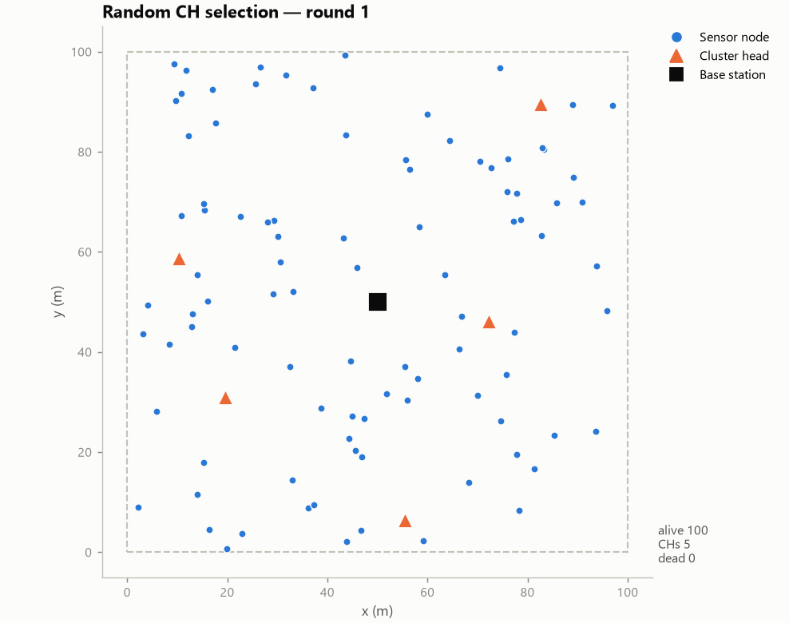

**Observed:** 5 CHs; mean CH–BS distance 38.9 m.

### Random: cluster formation in round 1 (members joined the nearest CH).

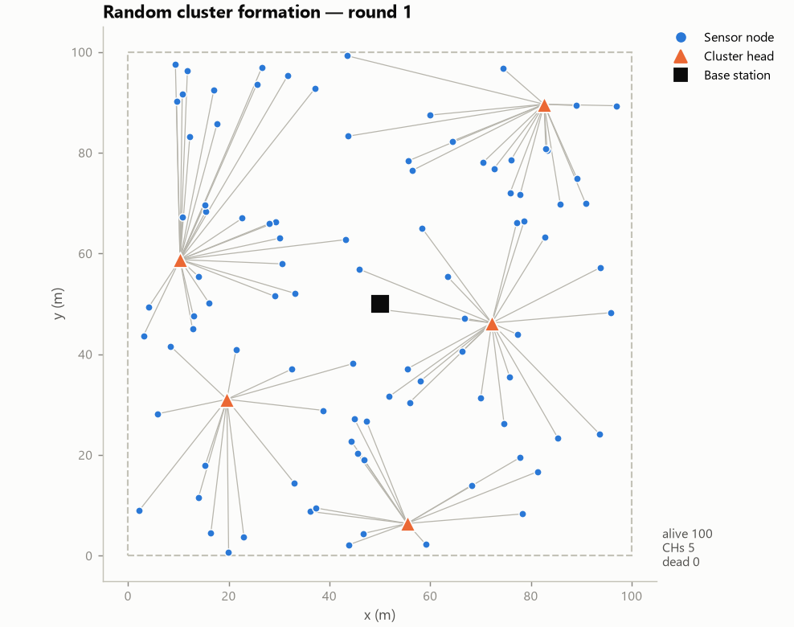

**Observed:** 5 clusters, sizes 14–29 (CV 0.27); member→CH distance mean 20.6 m, max 43.2 m.

### Random: network at its half-node-death round (run 0); dead nodes are marked x, alive nodes shaded by residual energy.


**Observed:** Round 1134: 50 dead, 50 alive. Mean distance to BS — dead nodes 28.3 m, alive nodes 46.7 m (near nodes died first on average).

### LEACH: cluster heads selected in round 1 (run 0).


**Observed:** 4 CHs; mean CH–BS distance 45.5 m.

### LEACH: cluster formation in round 1 (members joined the nearest CH).


**Observed:** 4 clusters, sizes 17–34 (CV 0.27); member→CH distance mean 36.8 m, max 91.2 m.

### LEACH: network at its half-node-death round (run 0); dead nodes are marked x, alive nodes shaded by residual energy.


**Observed:** Round 1108: 50 dead, 50 alive. Mean distance to BS — dead nodes 27.8 m, alive nodes 47.2 m (near nodes died first on average).

### GWO: cluster heads selected in round 1 (run 0).

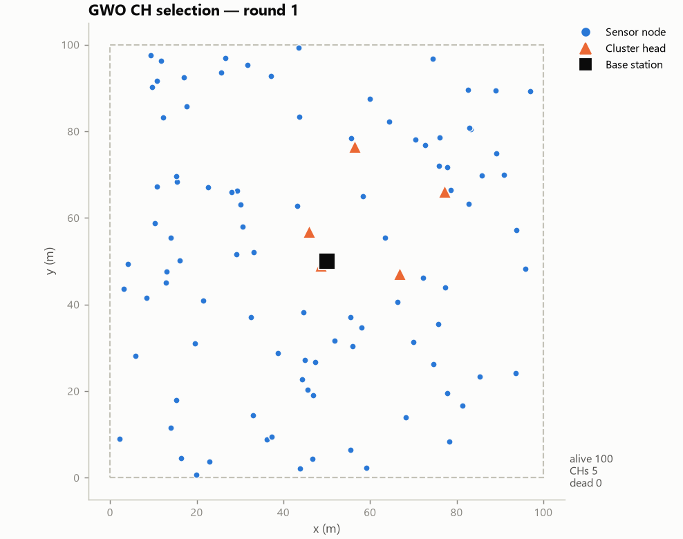

**Observed:** 5 CHs; mean CH–BS distance 17.1 m.

### GWO: cluster formation in round 1 (members joined the nearest CH).


**Observed:** 5 clusters, sizes 18–25 (CV 0.14); member→CH distance mean 27.5 m, max 61.3 m.

### GWO: network at its half-node-death round (run 0); dead nodes are marked x, alive nodes shaded by residual energy.

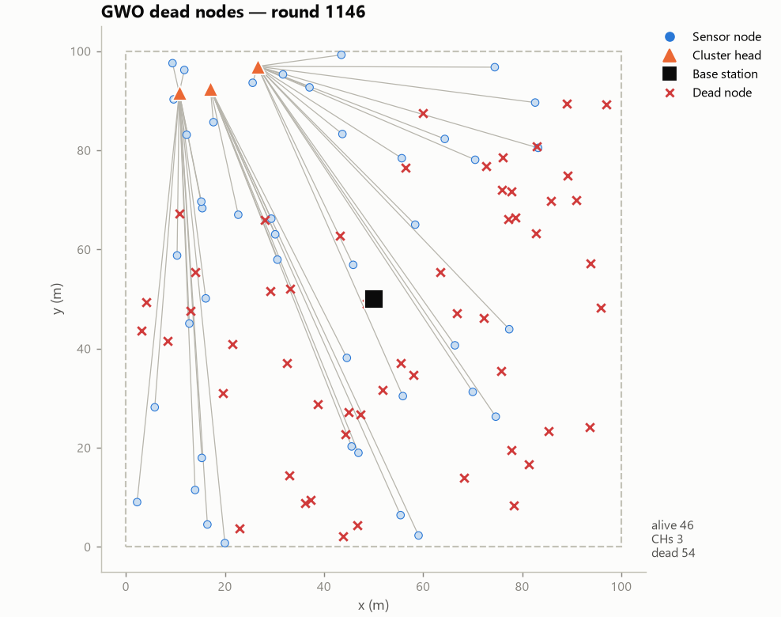

**Observed:** Round 1146: 54 dead, 46 alive. Mean distance to BS — dead nodes 35.0 m, alive nodes 40.4 m (near nodes died first on average).

### ABC: cluster heads selected in round 1 (run 0).

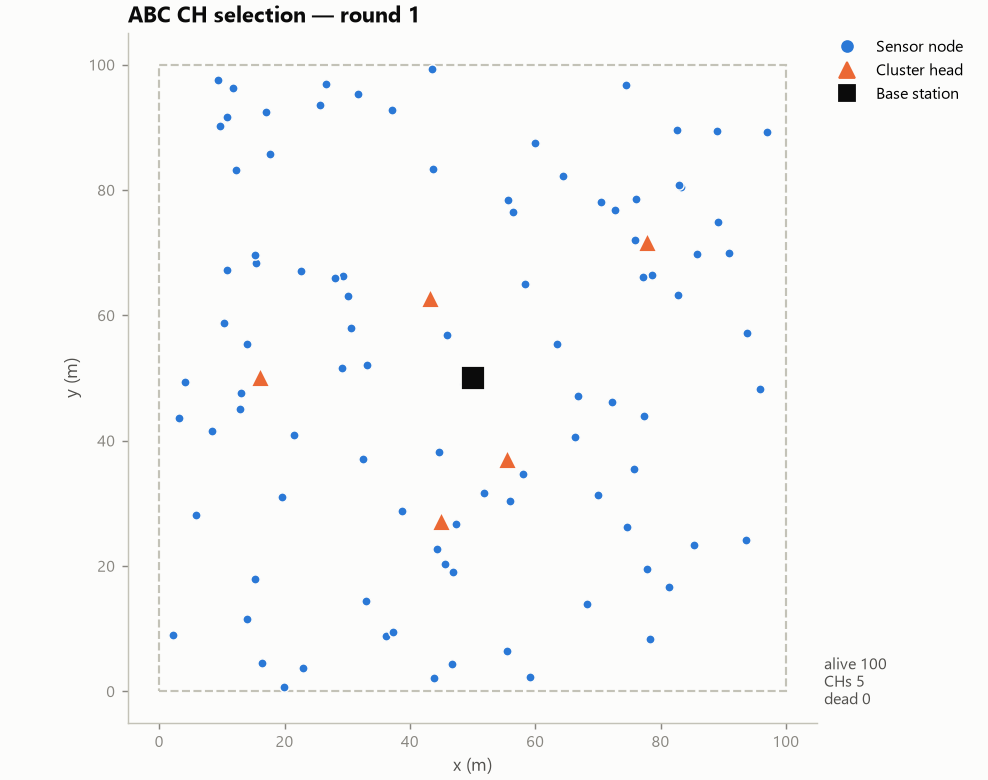

**Observed:** 5 CHs; mean CH–BS distance 24.2 m.

### ABC: cluster formation in round 1 (members joined the nearest CH).

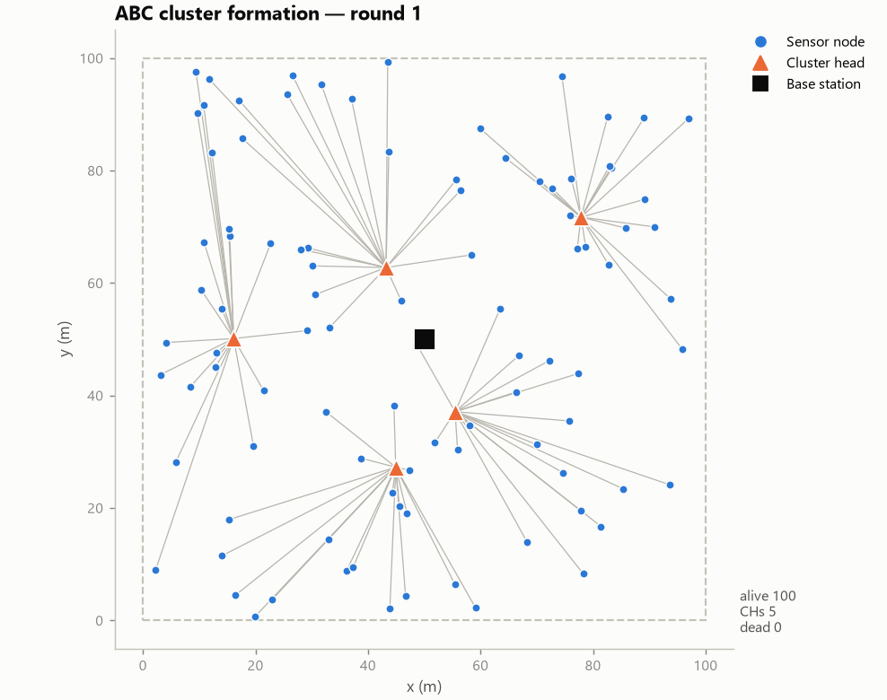

**Observed:** 5 clusters, sizes 19–21 (CV 0.04); member→CH distance mean 20.0 m, max 47.9 m.

### ABC: network at its half-node-death round (run 0); dead nodes are marked x, alive nodes shaded by residual energy.


**Observed:** Round 1147: 59 dead, 41 alive. Mean distance to BS — dead nodes 34.5 m, alive nodes 41.9 m (near nodes died first on average).

### Hybrid GWO-ABC: cluster heads selected in round 1 (run 0).

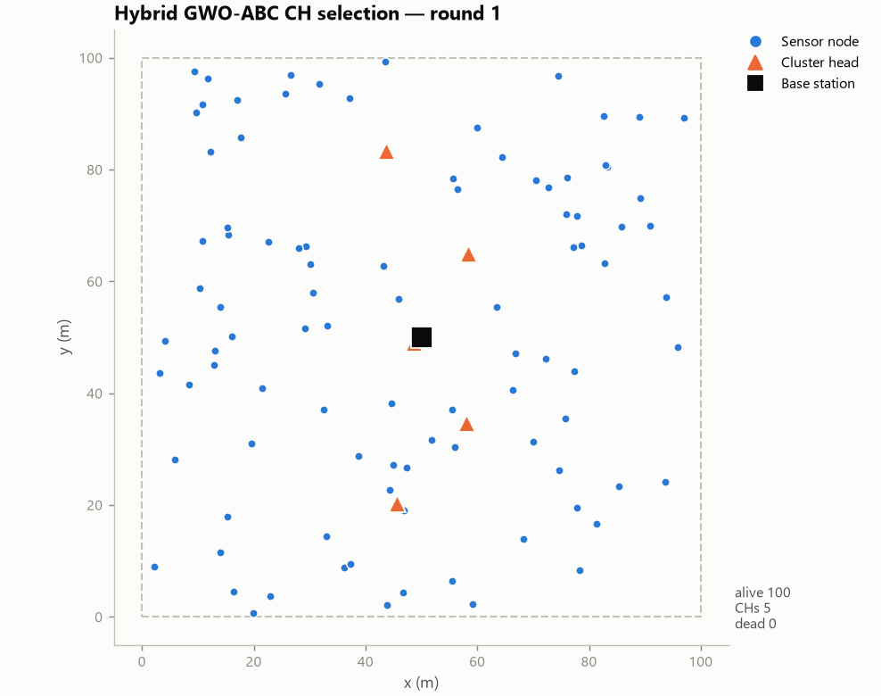

**Observed:** 5 CHs; mean CH–BS distance 20.0 m.

### Hybrid GWO-ABC: cluster formation in round 1 (members joined the nearest CH).

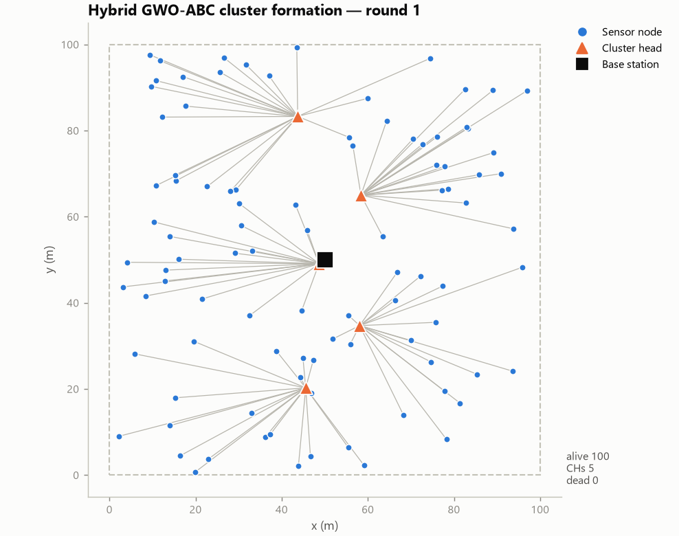

**Observed:** 5 clusters, sizes 18–22 (CV 0.08); member→CH distance mean 24.1 m, max 45.9 m.

### Hybrid GWO-ABC: data communication in round 1 — members send to their CH (grey links), CHs aggregate and forward to the BS (arrows).


**Observed:** 5 clusters, sizes 18–22 (CV 0.08); member→CH distance mean 24.1 m, max 45.9 m.

### Hybrid GWO-ABC: network at its half-node-death round (run 0); dead nodes are marked x, alive nodes shaded by residual energy.


**Observed:** Round 1146: 50 dead, 50 alive. Mean distance to BS — dead nodes 34.1 m, alive nodes 40.9 m (near nodes died first on average).

### GWO: best-so-far fitness per iteration of the round-1 CH optimisation (mean ± std over runs).

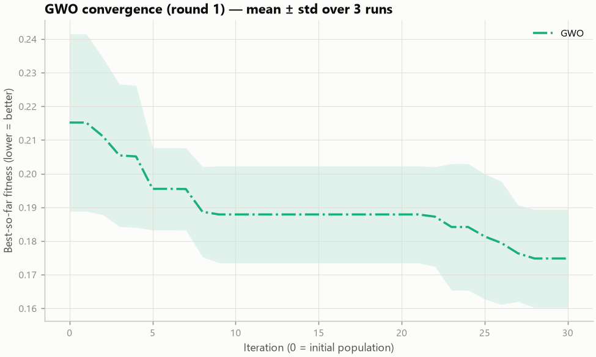

**Observed:** mean best fitness 0.2152 → 0.1748 (18.8% lower); 95% of the improvement reached by iteration 27

### ABC: best-so-far fitness per iteration of the round-1 CH optimisation (mean ± std over runs).

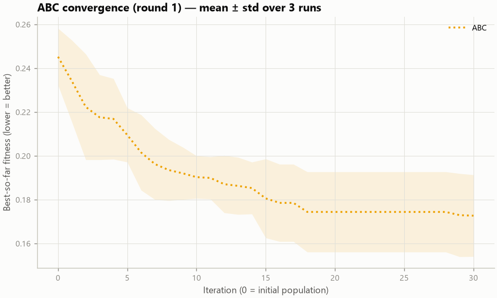

**Observed:** mean best fitness 0.2452 → 0.1727 (29.6% lower); 95% of the improvement reached by iteration 18

### Hybrid GWO-ABC: best-so-far fitness per iteration of the round-1 CH optimisation (mean ± std over runs).

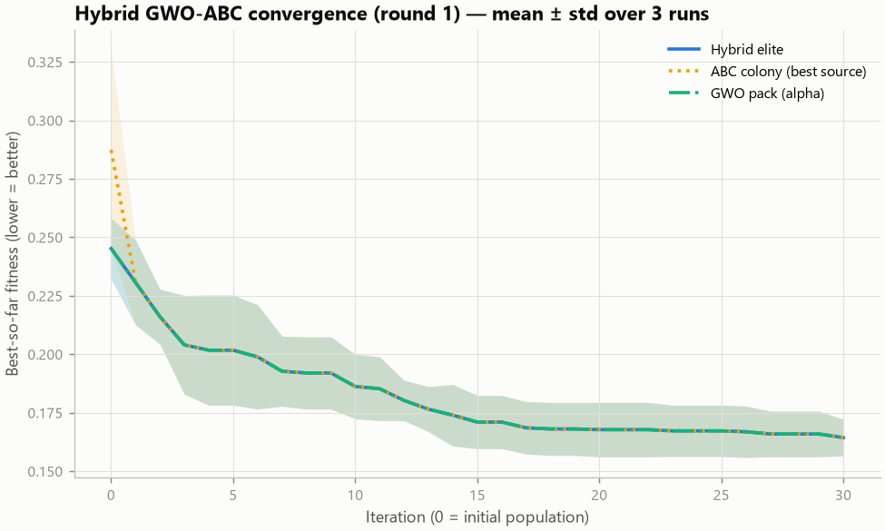

**Observed:** GWO: mean best fitness 0.2452 → 0.1644 (33.0% lower); 95% of the improvement reached by iteration 18; ABC: mean best fitness 0.2874 → 0.1644 (42.8% lower); 95% of the improvement reached by iteration 17; HYBRID: mean best fitness 0.2452 → 0.1644 (33.0% lower); 95% of the improvement reached by iteration 18

### Alive nodes vs rounds.

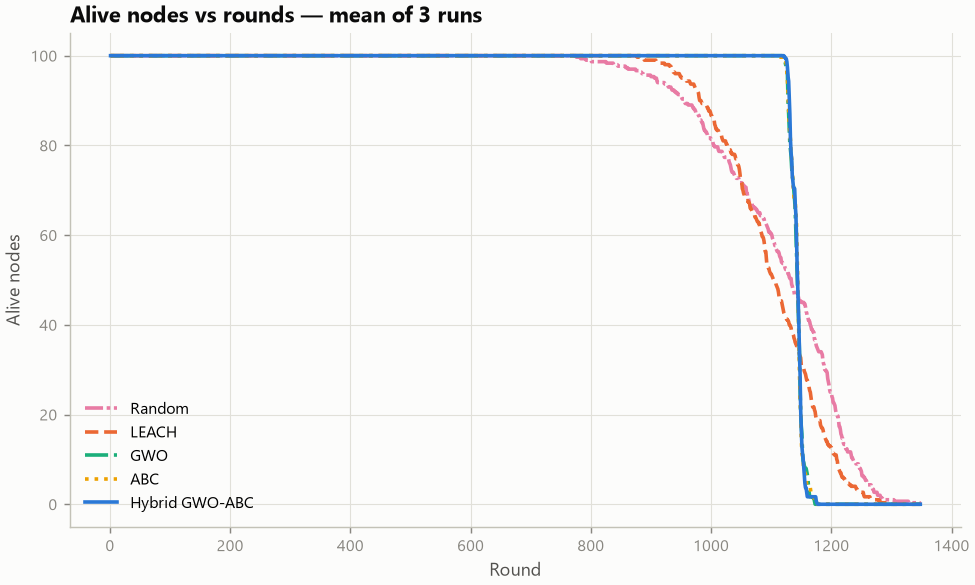

**Observed:** Random: FND 787, HND 1130, LND 1327; LEACH: FND 898, HND 1101, LND 1269; GWO: FND 1131, HND 1141, LND 1167; ABC: FND 1128, HND 1142, LND 1166; Hybrid GWO-ABC: FND 1131, HND 1142, LND 1165

### Dead nodes vs rounds.

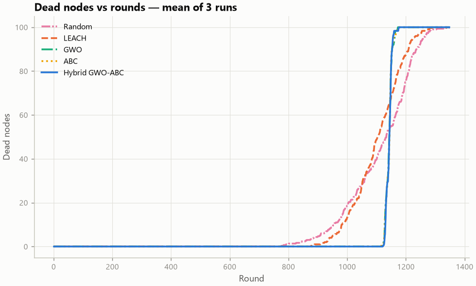

**Observed:** Mirror image of the alive-nodes curve; a steeper rise means nodes die closer together.

### Residual energy vs rounds.

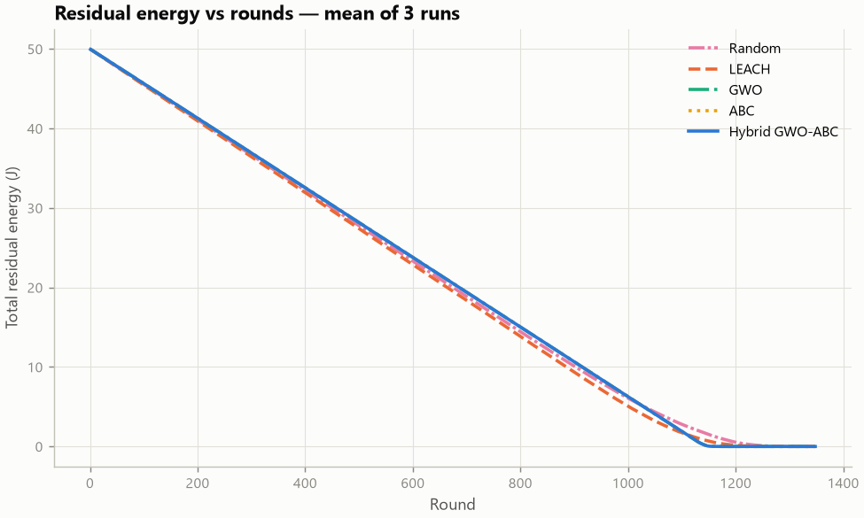

**Observed:** Residual energy at round 500: Random 27.78 J; LEACH 27.41 J; GWO 28.16 J; ABC 28.18 J; Hybrid GWO-ABC 28.17 J

### Energy consumption vs rounds.

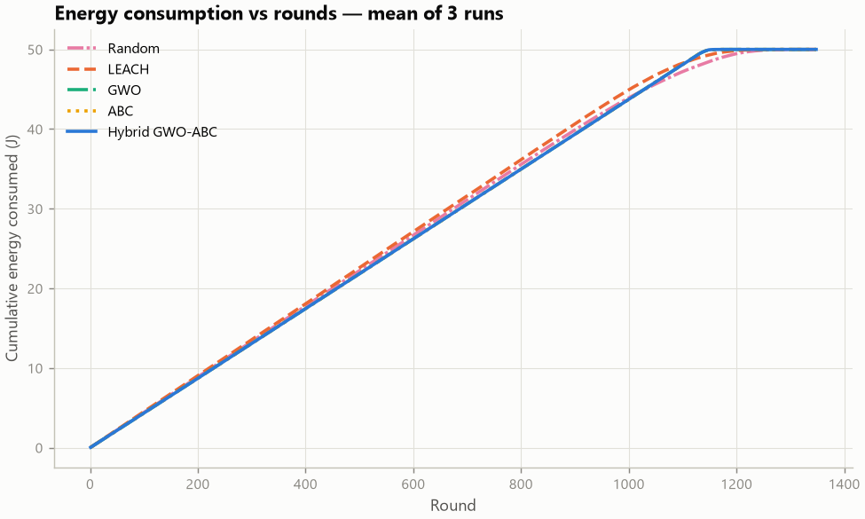

**Observed:** Consumed by round 500: Random 22.22 J; LEACH 22.59 J; GWO 21.84 J; ABC 21.82 J; Hybrid GWO-ABC 21.83 J

### Throughput vs rounds (cumulative).

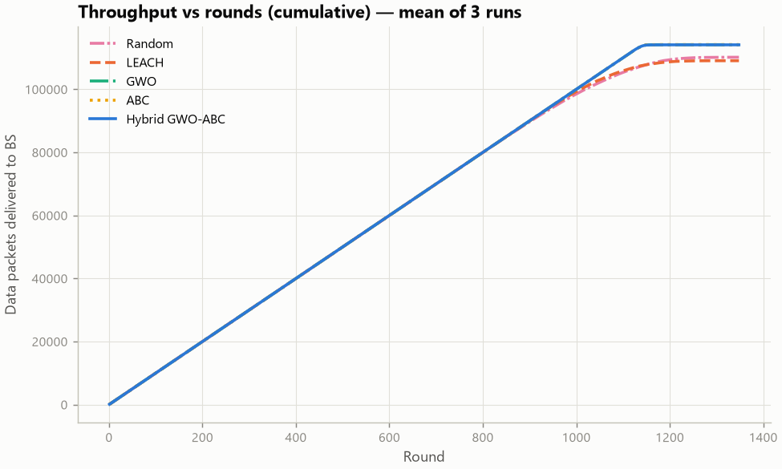

**Observed:** Total delivered: Random 110,161; LEACH 109,057; GWO 114,144; ABC 114,157; Hybrid GWO-ABC 114,098

### PDR vs rounds.

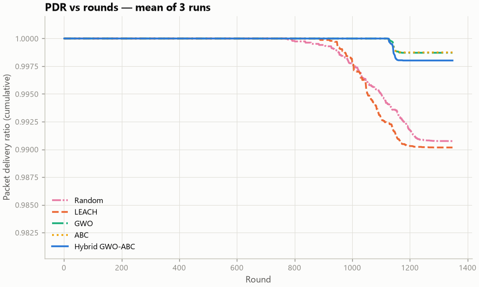

**Observed:** Final PDR: Random 0.9907; LEACH 0.9902; GWO 0.9987; ABC 0.9987; Hybrid GWO-ABC 0.9980

### CH count vs rounds (20-round rolling mean).

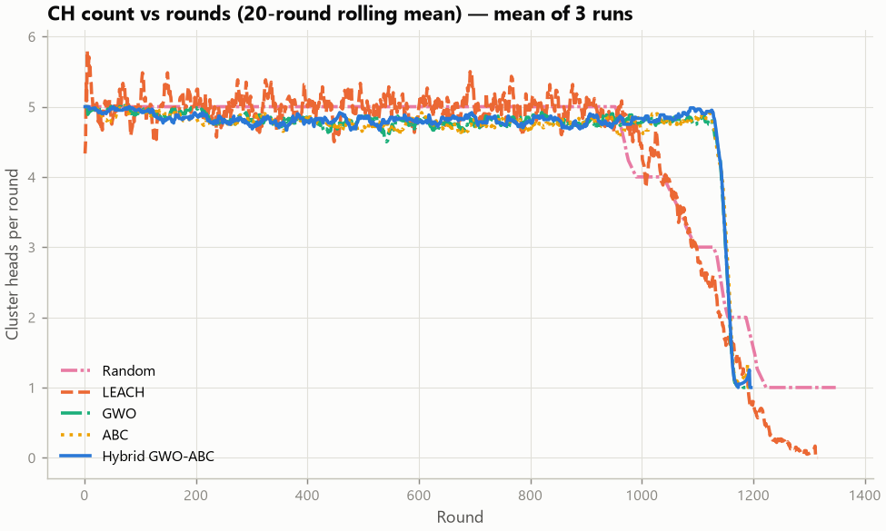

**Observed:** Mean CHs/round (rounds 1–500): Random 5.00 (per-round std 0.00); LEACH 5.00 (per-round std 2.17); GWO 4.85 (per-round std 0.52); ABC 4.82 (per-round std 0.52); Hybrid GWO-ABC 4.84 (per-round std 0.50)

### Average cluster distance vs rounds (20-round rolling mean).

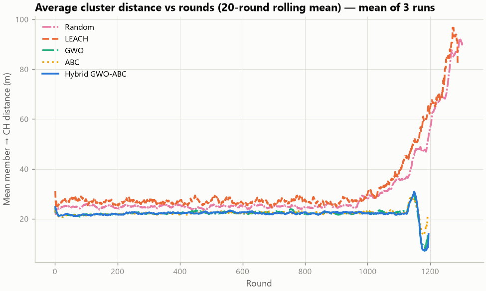

**Observed:** Mean member→CH distance: Random 24.86 m; LEACH 26.92 m; GWO 22.04 m; ABC 21.95 m; Hybrid GWO-ABC 22.04 m

### Total CH-selection runtime per simulation (log scale, mean ± std).

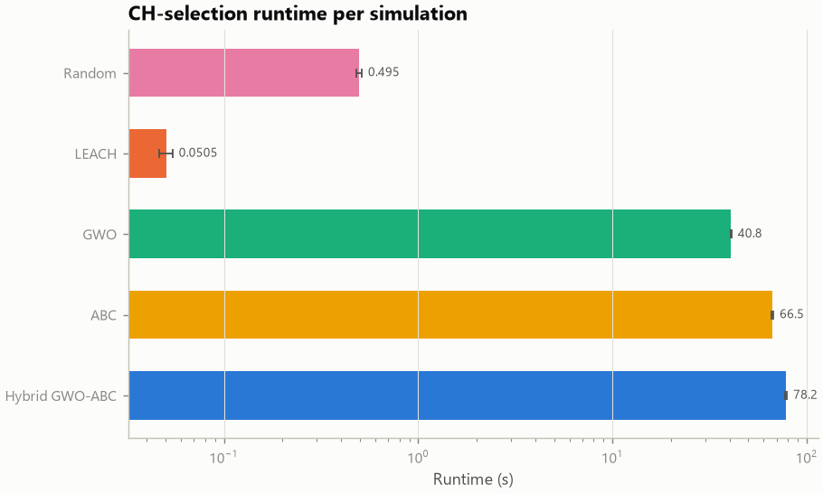

**Observed:** Random 0.50 s (0.37 ms/round, 0 fitness evaluations); LEACH 0.05 s (0.04 ms/round, 0 fitness evaluations); GWO 40.79 s (34.96 ms/round, 723,333 fitness evaluations); ABC 66.49 s (57.00 ms/round, 727,906 fitness evaluations); Hybrid GWO-ABC 78.25 s (67.19 ms/round, 730,597 fitness evaluations)

### FND / HND / LND comparison (mean ± std over runs).

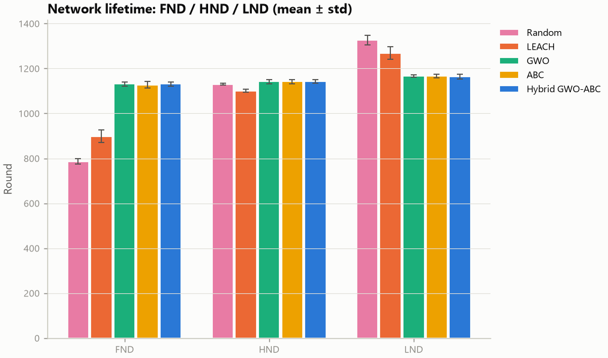

**Observed:** Random: FND 787, HND 1130, LND 1327; LEACH: FND 898, HND 1101, LND 1269; GWO: FND 1131, HND 1141, LND 1167; ABC: FND 1128, HND 1142, LND 1166; Hybrid GWO-ABC: FND 1131, HND 1142, LND 1165

### Where the energy goes: mean energy per radio activity over rounds 1–500.

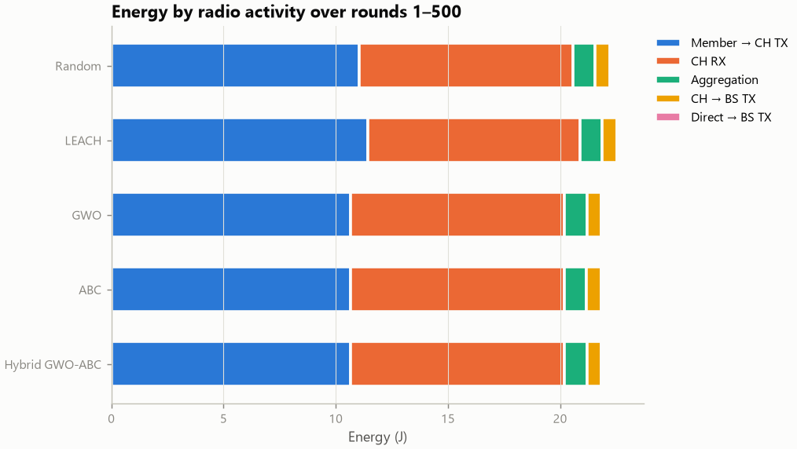

**Observed:** Random: total 22.22 J, largest share member TX (50%); LEACH: total 22.59 J, largest share member TX (51%); GWO: total 21.84 J, largest share member TX (49%); ABC: total 21.82 J, largest share member TX (49%); Hybrid GWO-ABC: total 21.83 J, largest share member TX (49%)

### Final fitness: same objective and weights for every algorithm.

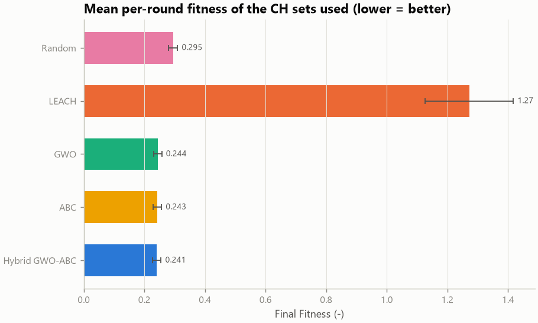

**Observed:** Random 0.2948; LEACH 1.2720; GWO 0.2442; ABC 0.2427; Hybrid GWO-ABC 0.2411

## Metric-by-metric interpretation

#### FND
- **What it represents:** First Node Death: the round in which the first node's residual energy reached 0.
- **How it was calculated:** min over nodes of the round in which residual energy reached 0 (simulation horizon if none died). (higher is better, unit: rounds)
- **Why it matters:** Marks the end of the stability period, during which every sensor still reports.
- **Observed (mean ± std over runs):** Random 787 (± 13), LEACH 898 (± 29), GWO 1,131 (± 10), ABC 1,128 (± 15), Hybrid GWO-ABC 1,131 (± 9). Best mean: **Hybrid GWO-ABC**.
- **Proposed vs baselines:** vs Random: Hybrid GWO-ABC is 43.81% better (improvement formula), p = 1 (Holm), Cliff's δ = +1.00 (large) → **no significant difference**; vs LEACH: Hybrid GWO-ABC is 25.94% better (improvement formula), p = 1 (Holm), Cliff's δ = +1.00 (large) → **no significant difference**; vs GWO: Hybrid GWO-ABC is 0.06% better (improvement formula), p = 1 (Holm), Cliff's δ = +0.11 (negligible) → **no significant difference** — practically small; vs ABC: Hybrid GWO-ABC is 0.33% better (improvement formula), p = 1 (Holm), Cliff's δ = +0.11 (negligible) → **no significant difference** — practically small.
- **Is the difference meaningful?** 0 of 4 comparisons are statistically significant at α = 0.05 after Holm correction. Differences that are not significant, or below 1.0% in size, should not be presented as improvements.
- **Possible explanation:** CH selection that avoids low-energy nodes and rotates the CH role evenly delays the first death; a node chosen repeatedly as CH (e.g. because it is close to the BS) dies early. Measured LND − FND spread (rounds): Random 541, LEACH 371, GWO 36, ABC 39, Hybrid GWO-ABC 33.

#### HND
- **What it represents:** Half Node Death: the round in which at least 50% of the nodes were dead.
- **How it was calculated:** round in which the number of dead nodes reached ceil(N/2). (higher is better, unit: rounds)
- **Why it matters:** Indicates how long the network keeps useful coverage.
- **Observed (mean ± std over runs):** Random 1,130 (± 4), LEACH 1,101 (± 7), GWO 1,141 (± 10), ABC 1,142 (± 9), Hybrid GWO-ABC 1,142 (± 9). Best mean: **Hybrid GWO-ABC**.
- **Proposed vs baselines:** vs Random: Hybrid GWO-ABC is 1.03% better (improvement formula), p = 1 (Holm), Cliff's δ = +0.78 (large) → **no significant difference**; vs LEACH: Hybrid GWO-ABC is 3.76% better (improvement formula), p = 1 (Holm), Cliff's δ = +1.00 (large) → **no significant difference**; vs GWO: Hybrid GWO-ABC is 0.06% better (improvement formula), p = 1 (Holm), Cliff's δ = +0.11 (negligible) → **no significant difference** — practically small; vs ABC: Hybrid GWO-ABC is 0.03% better (improvement formula), p = 1 (Holm), Cliff's δ = +0.11 (negligible) → **no significant difference** — practically small.
- **Is the difference meaningful?** 0 of 4 comparisons are statistically significant at α = 0.05 after Holm correction. Differences that are not significant, or below 1.0% in size, should not be presented as improvements.
- **Possible explanation:** HND reflects how evenly energy is drained across the whole network.

#### LND
- **What it represents:** Last Node Death: the round in which the last alive node died.
- **How it was calculated:** round in which the last node died (simulation horizon if nodes were still alive). (higher is better, unit: rounds)
- **Why it matters:** Upper bound of the network lifetime.
- **Observed (mean ± std over runs):** Random 1,327 (± 22), LEACH 1,269 (± 28), GWO 1,167 (± 6), ABC 1,166 (± 7), Hybrid GWO-ABC 1,165 (± 11). Best mean: **Random**.
- **Proposed vs baselines:** vs Random: Hybrid GWO-ABC is 12.26% worse (improvement formula), p = 1 (Holm), Cliff's δ = -1.00 (large) → **no significant difference**; vs LEACH: Hybrid GWO-ABC is 8.22% worse (improvement formula), p = 1 (Holm), Cliff's δ = -1.00 (large) → **no significant difference**; vs GWO: Hybrid GWO-ABC is 0.17% worse (improvement formula), p = 1 (Holm), Cliff's δ = -0.33 (medium) → **no significant difference** — practically small; vs ABC: Hybrid GWO-ABC is 0.14% worse (improvement formula), p = 1 (Holm), Cliff's δ = -0.11 (negligible) → **no significant difference** — practically small.
- **Is the difference meaningful?** 0 of 4 comparisons are statistically significant at α = 0.05 after Holm correction. Differences that are not significant, or below 1.0% in size, should not be presented as improvements.
- **Possible explanation:** A very even energy drain makes all nodes die at nearly the same time: FND is delayed but the last node also dies sooner. Uneven drain leaves a few nodes with spare energy that keep running. Measured LND − FND spread (rounds): Random 541, LEACH 371, GWO 36, ABC 39, Hybrid GWO-ABC 33.

#### Residual Energy
- **What it represents:** Total residual energy of all nodes at the checkpoint round.
- **How it was calculated:** sum of node residual energies after the checkpoint round. (higher is better, unit: J)
- **Why it matters:** More energy left at the same round means cheaper operation.
- **Observed (mean ± std over runs):** Random 27.775 (± 0.089), LEACH 27.405 (± 0.038), GWO 28.164 (± 0.103), ABC 28.176 (± 0.112), Hybrid GWO-ABC 28.165 (± 0.115). Best mean: **ABC**.
- **Proposed vs baselines:** vs Random: Hybrid GWO-ABC is 1.40% better (improvement formula), p = 1 (Holm), Cliff's δ = +1.00 (large) → **no significant difference**; vs LEACH: Hybrid GWO-ABC is 2.77% better (improvement formula), p = 1 (Holm), Cliff's δ = +1.00 (large) → **no significant difference**; vs GWO: Hybrid GWO-ABC is 0.00% better (improvement formula), p = 1 (Holm), Cliff's δ = -0.11 (negligible) → **no significant difference** — practically small; vs ABC: Hybrid GWO-ABC is 0.04% worse (improvement formula), p = 1 (Holm), Cliff's δ = -0.11 (negligible) → **no significant difference** — practically small.
- **Is the difference meaningful?** 0 of 4 comparisons are statistically significant at α = 0.05 after Holm correction. Differences that are not significant, or below 1.0% in size, should not be presented as improvements.
- **Possible explanation:** Residual energy at a fixed round depends on per-round radio cost: shorter member->CH links and shorter or fewer CH->BS links consume less.

#### Energy Consumption
- **What it represents:** Initial total energy minus residual energy at the checkpoint round.
- **How it was calculated:** N * E0 - residual energy at the checkpoint round. (lower is better, unit: J)
- **Why it matters:** Energy spent to operate the network for the same number of rounds.
- **Observed (mean ± std over runs):** Random 22.225 (± 0.089), LEACH 22.595 (± 0.038), GWO 21.836 (± 0.103), ABC 21.824 (± 0.112), Hybrid GWO-ABC 21.835 (± 0.115). Best mean: **ABC**.
- **Proposed vs baselines:** vs Random: Hybrid GWO-ABC is 1.75% better (reduction formula), p = 1 (Holm), Cliff's δ = +1.00 (large) → **no significant difference**; vs LEACH: Hybrid GWO-ABC is 3.36% better (reduction formula), p = 1 (Holm), Cliff's δ = +1.00 (large) → **no significant difference**; vs GWO: Hybrid GWO-ABC is 0.01% better (reduction formula), p = 1 (Holm), Cliff's δ = -0.11 (negligible) → **no significant difference** — practically small; vs ABC: Hybrid GWO-ABC is 0.05% worse (reduction formula), p = 1 (Holm), Cliff's δ = -0.11 (negligible) → **no significant difference** — practically small.
- **Is the difference meaningful?** 0 of 4 comparisons are statistically significant at α = 0.05 after Holm correction. Differences that are not significant, or below 1.0% in size, should not be presented as improvements.
- **Possible explanation:** Consumption is the complement of residual energy at the same checkpoint.

#### Throughput
- **What it represents:** Total sensor data packets delivered to the BS over the whole simulation (directly or inside an aggregated CH packet).
- **How it was calculated:** count of sensor readings that reached the BS over the whole run. (higher is better, unit: packets)
- **Why it matters:** Amount of sensed data the application actually receives.
- **Observed (mean ± std over runs):** Random 110,161 (± 298), LEACH 109,057 (± 422), GWO 114,144 (± 789), ABC 114,157 (± 887), Hybrid GWO-ABC 114,098 (± 703). Best mean: **ABC**.
- **Proposed vs baselines:** vs Random: Hybrid GWO-ABC is 3.57% better (improvement formula), p = 1 (Holm), Cliff's δ = +1.00 (large) → **no significant difference**; vs LEACH: Hybrid GWO-ABC is 4.62% better (improvement formula), p = 1 (Holm), Cliff's δ = +1.00 (large) → **no significant difference**; vs GWO: Hybrid GWO-ABC is 0.04% worse (improvement formula), p = 1 (Holm), Cliff's δ = -0.11 (negligible) → **no significant difference** — practically small; vs ABC: Hybrid GWO-ABC is 0.05% worse (improvement formula), p = 1 (Holm), Cliff's δ = -0.33 (medium) → **no significant difference** — practically small.
- **Is the difference meaningful?** 0 of 4 comparisons are statistically significant at α = 0.05 after Holm correction. Differences that are not significant, or below 1.0% in size, should not be presented as improvements.
- **Possible explanation:** Throughput grows with the number of rounds in which nodes are alive and with the share of packets that are not lost to CHs dying mid-round.

#### PDR
- **What it represents:** Packet Delivery Ratio = delivered data packets / generated data packets.
- **How it was calculated:** delivered readings / generated readings over the whole run. (higher is better, unit: ratio)
- **Why it matters:** Reliability: share of generated readings that reach the BS.
- **Observed (mean ± std over runs):** Random 0.9907 (± 0.0003), LEACH 0.9902 (± 0.0021), GWO 0.9987 (± 0.0003), ABC 0.9987 (± 0.0004), Hybrid GWO-ABC 0.9980 (± 0.0004). Best mean: **ABC**.
- **Proposed vs baselines:** vs Random: Hybrid GWO-ABC is 0.73% better (improvement formula), p = 1 (Holm), Cliff's δ = +1.00 (large) → **no significant difference** — practically small; vs LEACH: Hybrid GWO-ABC is 0.79% better (improvement formula), p = 1 (Holm), Cliff's δ = +1.00 (large) → **no significant difference** — practically small; vs GWO: Hybrid GWO-ABC is 0.07% worse (improvement formula), p = 1 (Holm), Cliff's δ = -1.00 (large) → **no significant difference** — practically small; vs ABC: Hybrid GWO-ABC is 0.07% worse (improvement formula), p = 1 (Holm), Cliff's δ = -1.00 (large) → **no significant difference** — practically small.
- **Is the difference meaningful?** 0 of 4 comparisons are statistically significant at α = 0.05 after Holm correction. Differences that are not significant, or below 1.0% in size, should not be presented as improvements.
- **Possible explanation:** Packets are lost when a CH runs out of energy before forwarding its cluster's data, or when a node dies while transmitting. Energy-feasibility checks on CHs reduce such losses.

#### Avg. Cluster Distance
- **What it represents:** Mean member->CH distance, averaged over rounds 1..checkpoint.
- **How it was calculated:** per round mean member->CH distance, averaged over rounds 1..checkpoint. (lower is better, unit: m)
- **Why it matters:** Shorter intra-cluster links cost less transmission energy (d^2 / d^4).
- **Observed (mean ± std over runs):** Random 24.861 (± 0.658), LEACH 26.918 (± 0.430), GWO 22.044 (± 0.911), ABC 21.955 (± 0.993), Hybrid GWO-ABC 22.041 (± 1.016). Best mean: **ABC**.
- **Proposed vs baselines:** vs Random: Hybrid GWO-ABC is 11.35% better (reduction formula), p = 1 (Holm), Cliff's δ = +1.00 (large) → **no significant difference**; vs LEACH: Hybrid GWO-ABC is 18.12% better (reduction formula), p = 1 (Holm), Cliff's δ = +1.00 (large) → **no significant difference**; vs GWO: Hybrid GWO-ABC is 0.01% better (reduction formula), p = 1 (Holm), Cliff's δ = -0.11 (negligible) → **no significant difference** — practically small; vs ABC: Hybrid GWO-ABC is 0.39% worse (reduction formula), p = 1 (Holm), Cliff's δ = -0.33 (medium) → **no significant difference** — practically small.
- **Is the difference meaningful?** 0 of 4 comparisons are statistically significant at α = 0.05 after Holm correction. Differences that are not significant, or below 1.0% in size, should not be presented as improvements.
- **Possible explanation:** The fitness function explicitly penalises member->CH distance; LEACH places CHs at random positions, which typically lengthens member links.

#### Avg. CH-BS Distance
- **What it represents:** Mean CH->BS distance, averaged over rounds 1..checkpoint.
- **How it was calculated:** per round mean CH->BS distance, averaged over rounds 1..checkpoint. (lower is better, unit: m)
- **Why it matters:** CH->BS is the longest and most expensive hop.
- **Observed (mean ± std over runs):** Random 38.419 (± 1.129), LEACH 38.632 (± 1.061), GWO 38.229 (± 1.067), ABC 38.209 (± 0.993), Hybrid GWO-ABC 38.244 (± 1.127). Best mean: **ABC**.
- **Proposed vs baselines:** vs Random: Hybrid GWO-ABC is 0.46% better (reduction formula), p = 1 (Holm), Cliff's δ = +0.33 (medium) → **no significant difference** — practically small; vs LEACH: Hybrid GWO-ABC is 1.00% better (reduction formula), p = 1 (Holm), Cliff's δ = +0.33 (medium) → **no significant difference**; vs GWO: Hybrid GWO-ABC is 0.04% worse (reduction formula), p = 1 (Holm), Cliff's δ = +0.11 (negligible) → **no significant difference** — practically small; vs ABC: Hybrid GWO-ABC is 0.09% worse (reduction formula), p = 1 (Holm), Cliff's δ = -0.11 (negligible) → **no significant difference** — practically small.
- **Is the difference meaningful?** 0 of 4 comparisons are statistically significant at α = 0.05 after Holm correction. Differences that are not significant, or below 1.0% in size, should not be presented as improvements.
- **Possible explanation:** The fitness penalises CH->BS distance, but the energy-eligibility rule and the energy term limit how often nodes near the BS can be selected.

#### Runtime
- **What it represents:** Total wall-clock time spent selecting CHs over the whole simulation.
- **How it was calculated:** sum of wall-clock CH-selection time over all rounds (time.perf_counter). (lower is better, unit: s)
- **Why it matters:** Computational cost of the CH selection algorithm.
- **Observed (mean ± std over runs):** Random 0.50 (± 0.02), LEACH 0.05 (± 0.00), GWO 40.79 (± 0.14), ABC 66.49 (± 0.70), Hybrid GWO-ABC 78.25 (± 0.68). Best mean: **LEACH**.
- **Proposed vs baselines:** vs Random: Hybrid GWO-ABC is 15693.88% worse (reduction formula), p = 1 (Holm), Cliff's δ = -1.00 (large) → **no significant difference** (proposed/baseline ratio 158×); vs LEACH: Hybrid GWO-ABC is 154993.59% worse (reduction formula), p = 1 (Holm), Cliff's δ = -1.00 (large) → **no significant difference** (proposed/baseline ratio 1551×); vs GWO: Hybrid GWO-ABC is 91.84% worse (reduction formula), p = 1 (Holm), Cliff's δ = -1.00 (large) → **no significant difference**; vs ABC: Hybrid GWO-ABC is 17.69% worse (reduction formula), p = 1 (Holm), Cliff's δ = -1.00 (large) → **no significant difference**.
- **Is the difference meaningful?** 0 of 4 comparisons are statistically significant at α = 0.05 after Holm correction. Differences that are not significant, or below 1.0% in size, should not be presented as improvements.
- **Possible explanation:** Metaheuristics evaluate hundreds of candidate CH sets per round; LEACH needs one random draw per node. The hybrid runs two populations and more operators per iteration, which adds overhead even at an equal number of fitness evaluations. Runtime relative to LEACH: Random 10×, GWO 808×, ABC 1318×, Hybrid GWO-ABC 1551×.

#### Final Fitness
- **What it represents:** Mean per-round fitness (same function and weights for every algorithm) of the CH set actually used, over rounds 1..checkpoint. Lower is better.
- **How it was calculated:** per round fitness of the CH set used (same weights for all), mean over rounds 1..checkpoint. (lower is better, unit: -)
- **Why it matters:** Quality of the CH configurations according to the optimisation objective.
- **Observed (mean ± std over runs):** Random 0.2948 (± 0.0144), LEACH 1.2720 (± 0.1455), GWO 0.2442 (± 0.0130), ABC 0.2427 (± 0.0137), Hybrid GWO-ABC 0.2411 (± 0.0137). Best mean: **Hybrid GWO-ABC**.
- **Proposed vs baselines:** vs Random: Hybrid GWO-ABC is 18.22% better (reduction formula), p = 1 (Holm), Cliff's δ = +1.00 (large) → **no significant difference**; vs LEACH: Hybrid GWO-ABC is 81.04% better (reduction formula), p = 1 (Holm), Cliff's δ = +1.00 (large) → **no significant difference**; vs GWO: Hybrid GWO-ABC is 1.24% better (reduction formula), p = 1 (Holm), Cliff's δ = +0.33 (medium) → **no significant difference**; vs ABC: Hybrid GWO-ABC is 0.66% better (reduction formula), p = 1 (Holm), Cliff's δ = -0.11 (negligible) → **no significant difference** — practically small.
- **Is the difference meaningful?** 0 of 4 comparisons are statistically significant at α = 0.05 after Holm correction. Differences that are not significant, or below 1.0% in size, should not be presented as improvements.
- **Possible explanation:** Optimisers minimise this objective directly; LEACH does not use it, and rounds in which LEACH elects zero CHs or too many receive the invalid-solution penalty.

#### Node-rounds
- **What it represents:** Sum over rounds of the number of alive nodes (area under the alive-nodes curve).
- **How it was calculated:** sum over rounds of alive nodes. (higher is better, unit: node x rounds)
- **Why it matters:** Single-number lifetime measure that accounts for the whole death curve.
- **Observed (mean ± std over runs):** Random 111,089 (± 322), LEACH 110,040 (± 350), GWO 114,192 (± 828), ABC 114,200 (± 853), Hybrid GWO-ABC 114,225 (± 739). Best mean: **Hybrid GWO-ABC**.
- **Proposed vs baselines:** vs Random: Hybrid GWO-ABC is 2.82% better (improvement formula), p = 1 (Holm), Cliff's δ = +1.00 (large) → **no significant difference**; vs LEACH: Hybrid GWO-ABC is 3.80% better (improvement formula), p = 1 (Holm), Cliff's δ = +1.00 (large) → **no significant difference**; vs GWO: Hybrid GWO-ABC is 0.03% better (improvement formula), p = 1 (Holm), Cliff's δ = +0.11 (negligible) → **no significant difference** — practically small; vs ABC: Hybrid GWO-ABC is 0.02% better (improvement formula), p = 1 (Holm), Cliff's δ = -0.11 (negligible) → **no significant difference** — practically small.
- **Is the difference meaningful?** 0 of 4 comparisons are statistically significant at α = 0.05 after Holm correction. Differences that are not significant, or below 1.0% in size, should not be presented as improvements.
- **Possible explanation:** The area under the alive-nodes curve combines stability period and tail length.

#### Cluster Imbalance
- **What it represents:** Coefficient of variation of cluster sizes, averaged over rounds 1..checkpoint.
- **How it was calculated:** per round std/mean of cluster sizes, averaged over rounds 1..checkpoint. (lower is better, unit: CV)
- **Why it matters:** Balanced clusters spread the CH load evenly.
- **Observed (mean ± std over runs):** Random 0.4777 (± 0.0061), LEACH 0.4481 (± 0.0113), GWO 0.1718 (± 0.0059), ABC 0.1534 (± 0.0097), Hybrid GWO-ABC 0.1470 (± 0.0039). Best mean: **Hybrid GWO-ABC**.
- **Proposed vs baselines:** vs Random: Hybrid GWO-ABC is 69.23% better (reduction formula), p = 1 (Holm), Cliff's δ = +1.00 (large) → **no significant difference**; vs LEACH: Hybrid GWO-ABC is 67.20% better (reduction formula), p = 1 (Holm), Cliff's δ = +1.00 (large) → **no significant difference**; vs GWO: Hybrid GWO-ABC is 14.46% better (reduction formula), p = 1 (Holm), Cliff's δ = +1.00 (large) → **no significant difference**; vs ABC: Hybrid GWO-ABC is 4.17% better (reduction formula), p = 1 (Holm), Cliff's δ = +0.56 (large) → **no significant difference**.
- **Is the difference meaningful?** 0 of 4 comparisons are statistically significant at α = 0.05 after Holm correction. Differences that are not significant, or below 1.0% in size, should not be presented as improvements.
- **Possible explanation:** The fitness penalises unequal cluster sizes; nearest-CH assignment does not.

## Cluster-head records (run 0)

Every selected CH of every round is recorded in `ch_log_run0.csv` (round, CH id, coordinates, residual energy at selection, distance to the BS, cluster size including the CH). Dead and duplicate CHs are removed before clustering, so only valid CHs appear.

### Random

Over 1348 rounds with CHs: 4.21 CHs/round on average; mean CH residual energy at selection 0.2519 J; mean CH–BS distance 38.70 m; 100 distinct nodes served as CH, the most frequent one 116 times.

Round 1 cluster heads:

| CH id | x (m) | y (m) | Residual energy (J) | CH–BS (m) | Cluster size |
|---|---:|---:|---:|---:|---:|
| 8 | 55.46 | 6.382 | 0.5 | 43.96 | 15 |
| 43 | 72.24 | 46.19 | 0.5 | 22.56 | 22 |
| 64 | 10.34 | 58.76 | 0.5 | 40.62 | 29 |
| 75 | 82.63 | 89.62 | 0.5 | 51.32 | 20 |
| 99 | 19.64 | 31.03 | 0.5 | 35.8 | 14 |

### LEACH

Over 1204 rounds with CHs: 4.60 CHs/round on average; mean CH residual energy at selection 0.2542 J; mean CH–BS distance 38.45 m; 100 distinct nodes served as CH, the most frequent one 65 times.

Round 1 cluster heads:

| CH id | x (m) | y (m) | Residual energy (J) | CH–BS (m) | Cluster size |
|---|---:|---:|---:|---:|---:|
| 27 | 70.52 | 78.07 | 0.5 | 34.77 | 29 |
| 51 | 26.59 | 96.92 | 0.5 | 52.44 | 20 |
| 68 | 95.86 | 48.23 | 0.5 | 45.89 | 34 |
| 84 | 31.71 | 95.29 | 0.5 | 48.84 | 17 |

### GWO

Over 1163 rounds with CHs: 4.75 CHs/round on average; mean CH residual energy at selection 0.2524 J; mean CH–BS distance 38.09 m; 100 distinct nodes served as CH, the most frequent one 67 times.

Round 1 cluster heads:

| CH id | x (m) | y (m) | Residual energy (J) | CH–BS (m) | Cluster size |
|---|---:|---:|---:|---:|---:|
| 28 | 45.89 | 56.87 | 0.5 | 8.008 | 21 |
| 30 | 66.84 | 47.11 | 0.5 | 17.09 | 18 |
| 31 | 56.52 | 76.5 | 0.5 | 27.29 | 18 |
| 70 | 48.67 | 49.07 | 0.5 | 1.626 | 25 |
| 92 | 77.2 | 66.17 | 0.5 | 31.64 | 18 |

### ABC

Over 1159 rounds with CHs: 4.76 CHs/round on average; mean CH residual energy at selection 0.2520 J; mean CH–BS distance 38.22 m; 100 distinct nodes served as CH, the most frequent one 66 times.

Round 1 cluster heads:

| CH id | x (m) | y (m) | Residual energy (J) | CH–BS (m) | Cluster size |
|---|---:|---:|---:|---:|---:|
| 44 | 16.13 | 50.1 | 0.5 | 33.87 | 21 |
| 52 | 77.88 | 71.69 | 0.5 | 35.32 | 21 |
| 53 | 44.94 | 27.22 | 0.5 | 23.33 | 20 |
| 59 | 43.21 | 62.73 | 0.5 | 14.43 | 19 |
| 82 | 55.49 | 37.09 | 0.5 | 14.02 | 19 |

### Hybrid GWO-ABC

Over 1160 rounds with CHs: 4.76 CHs/round on average; mean CH residual energy at selection 0.2526 J; mean CH–BS distance 38.11 m; 100 distinct nodes served as CH, the most frequent one 67 times.

Round 1 cluster heads:

| CH id | x (m) | y (m) | Residual energy (J) | CH–BS (m) | Cluster size |
|---|---:|---:|---:|---:|---:|
| 20 | 43.72 | 83.27 | 0.5 | 33.86 | 22 |
| 55 | 45.58 | 20.24 | 0.5 | 30.09 | 21 |
| 60 | 58.41 | 64.98 | 0.5 | 17.18 | 21 |
| 66 | 58.11 | 34.69 | 0.5 | 17.33 | 18 |
| 70 | 48.67 | 49.07 | 0.5 | 1.626 | 18 |


## Reproducing this experiment

```
python main.py reproduce "C:\Users\Admin\Hybrid-GWO-ABC-WSN\results\comparison_20261004_124852"
```

`config.json` holds every parameter; `experiment.json` holds the algorithms, run count and seeds.
