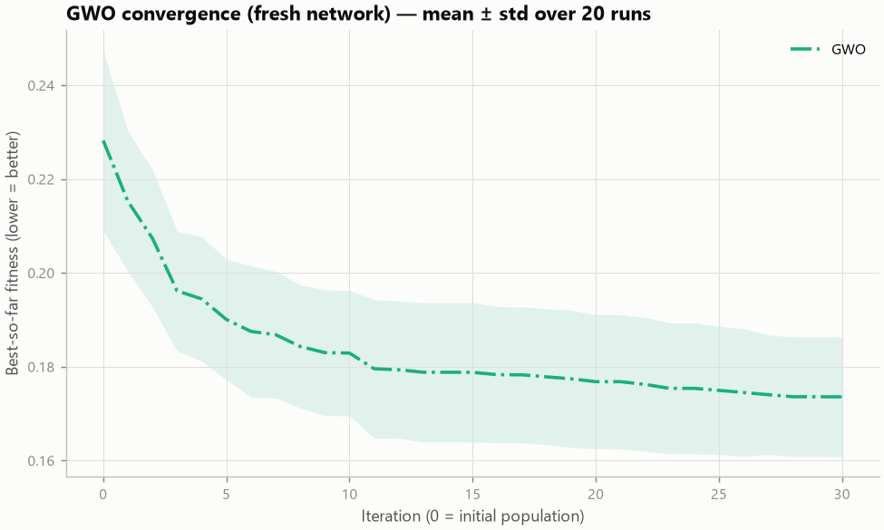
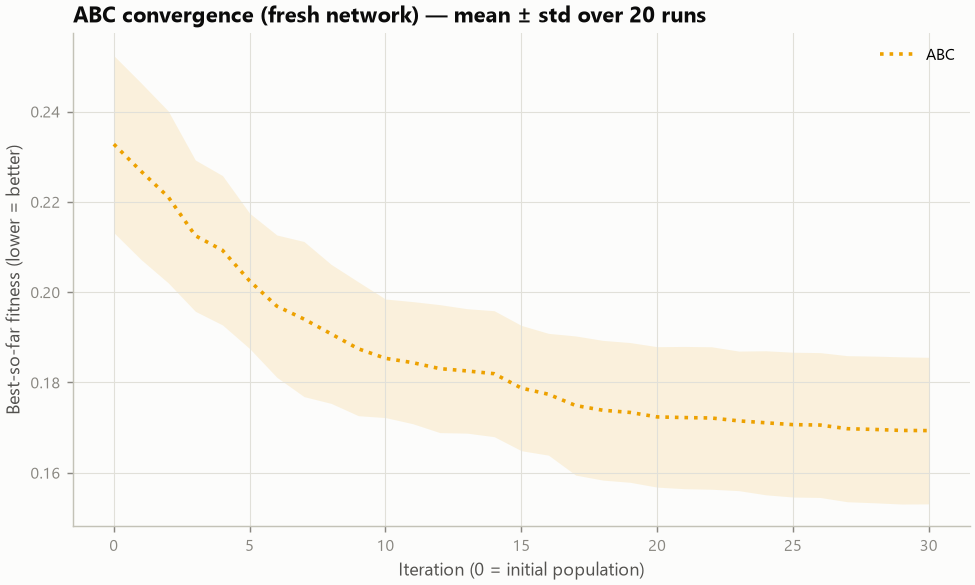
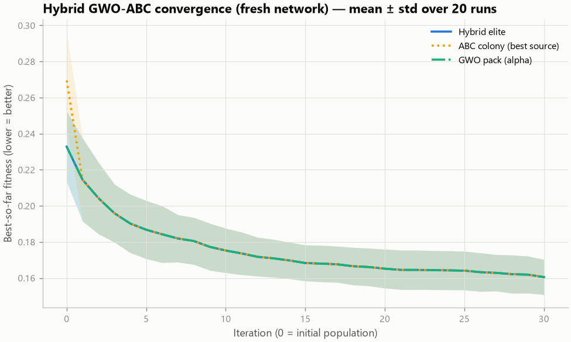
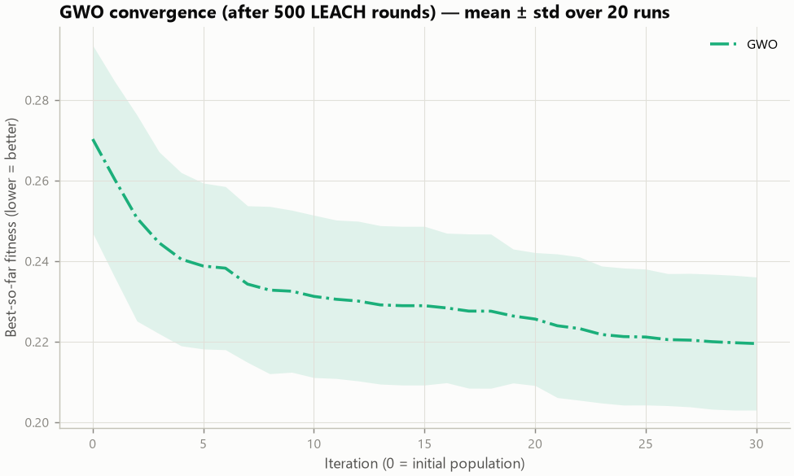
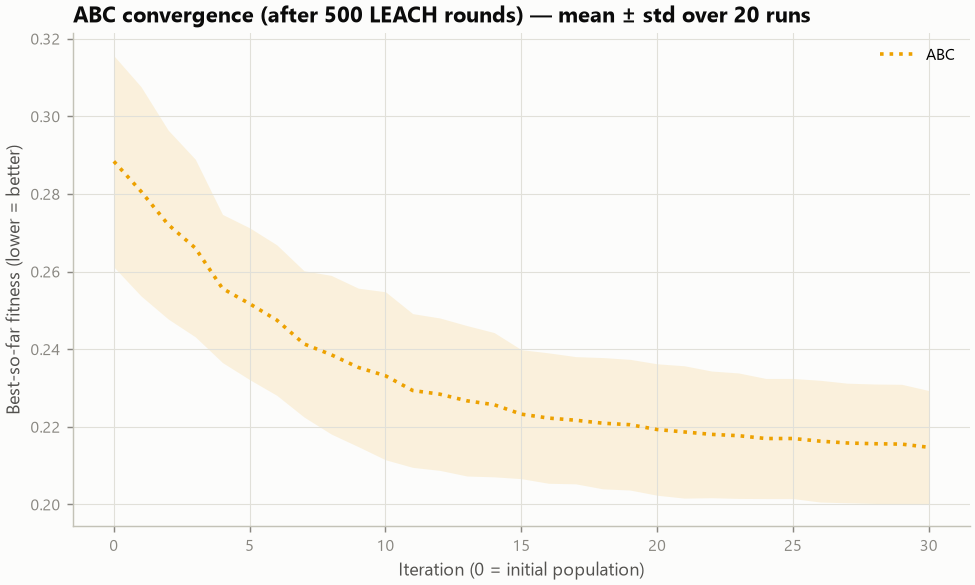
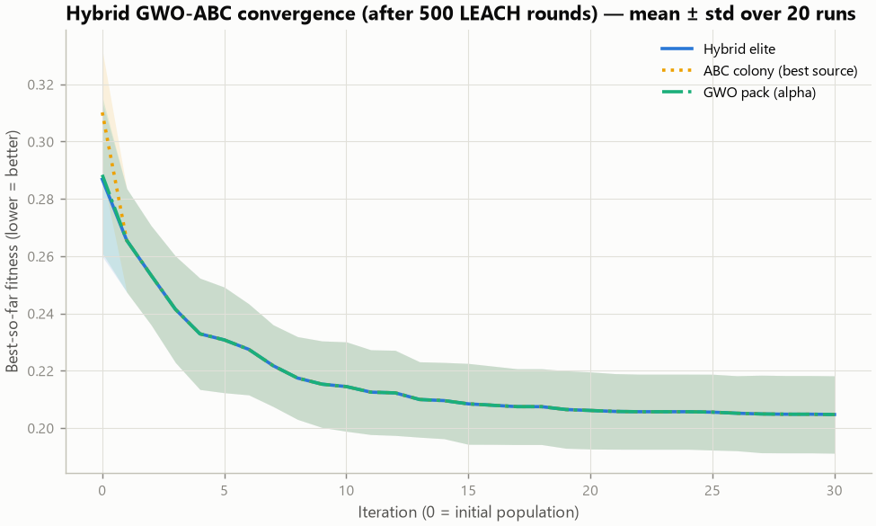
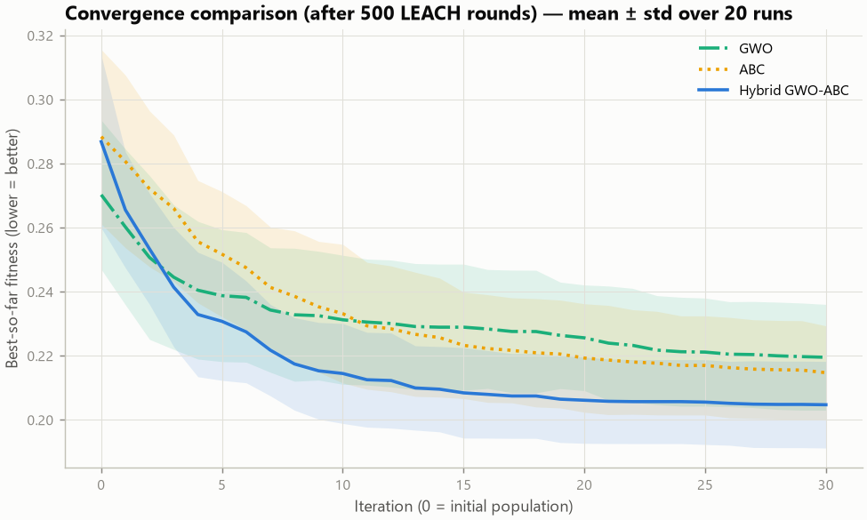

# Convergence analysis

GWO (population 20), ABC (colony 20) and Hybrid GWO-ABC (budget share 0.5) optimise the CH set of identical network states for 30 iterations with comparable fitness-evaluation budgets. Curves are best-so-far fitness (lower = better); raw data in `convergence_runs_raw.csv` and `curves_*.csv`.

## fresh network (round 0)

| Algorithm | initial | final | final_std | evaluations | time_ms |
|---|---:|---:|---:|---:|---:|
| GWO | 0.2282 | 0.1736 | 0.01308 | 620 | 10.48 |
| ABC | 0.2328 | 0.1693 | 0.01666 | 621.5 | 20.18 |
| Hybrid GWO-ABC | 0.2328 | 0.1605 | 0.009998 | 623.2 | 23.03 |

**Observed:** Hybrid final fitness is 7.53% lower (better) than GWO (Wilcoxon p = 4.77e-05). Hybrid final fitness is 5.22% lower (better) than ABC (Wilcoxon p = 0.00831).

## network after 500 LEACH rounds

| Algorithm | initial | final | final_std | evaluations | time_ms |
|---|---:|---:|---:|---:|---:|
| GWO | 0.2703 | 0.2195 | 0.01694 | 620 | 10.54 |
| ABC | 0.2884 | 0.2147 | 0.015 | 621.5 | 18.4 |
| Hybrid GWO-ABC | 0.2868 | 0.2047 | 0.01387 | 623.8 | 23.74 |

**Observed:** Hybrid final fitness is 6.75% lower (better) than GWO (Wilcoxon p = 0.00021). Hybrid final fitness is 4.66% lower (better) than ABC (Wilcoxon p = 0.00109).
