# Sensitivity analysis

One factor is varied at a time around the default configuration; 5 paired runs per setting (mean ± std). Raw data: `sensitivity_runs_raw.csv`, aggregated: `sensitivity_summary.csv`.

## Number of nodes

| Setting | Algorithm | FND | HND | LND | Throughput | PDR | Runtime |
|---:|---|---:|---:|---:|---|---:|---:|
| 100 | ABC | 1124 ± 12 | 1141 ± 6.7 | 1166 ± 5 | 1.141e+05 ± 6.4e+02 | 0.9989 ± 0.00033 | 110.9 ± 3.2 |
| 100 | GWO | 1130 ± 7.3 | 1141 ± 7.3 | 1166 ± 4.7 | 1.14e+05 ± 5.9e+02 | 0.9985 ± 0.00045 | 65.04 ± 3.1 |
| 100 | Hybrid GWO-ABC | 1130 ± 6.7 | 1141 ± 6.7 | 1162 ± 9.5 | 1.14e+05 ± 5.5e+02 | 0.9982 ± 0.0004 | 117.3 ± 1.3 |
| 100 | LEACH | 883.8 ± 30 | 1105 ± 9.3 | 1295 ± 46 | 1.093e+05 ± 5.9e+02 | 0.9894 ± 0.0019 | 0.0662 ± 0.0058 |
| 150 | ABC | 1158 ± 4.8 | 1169 ± 5 | 1185 ± 4.2 | 1.749e+05 ± 6.3e+02 | 0.9976 ± 0.0004 | 128.5 ± 3.2 |
| 150 | GWO | 1157 ± 6.4 | 1169 ± 4.2 | 1191 ± 8.3 | 1.749e+05 ± 6.9e+02 | 0.9971 ± 0.00073 | 89.17 ± 1.3 |
| 150 | Hybrid GWO-ABC | 1155 ± 9.6 | 1168 ± 5.3 | 1192 ± 13 | 1.748e+05 ± 5.2e+02 | 0.9969 ± 0.0012 | 155.3 ± 12 |
| 150 | LEACH | 913.4 ± 17 | 1134 ± 4.2 | 1369 ± 43 | 1.686e+05 ± 7.8e+02 | 0.9883 ± 0.00055 | 0.05749 ± 0.014 |
| 200 | ABC | 1163 ± 4.4 | 1176 ± 2.4 | 1210 ± 33 | 2.345e+05 ± 6e+02 | 0.9968 ± 0.00059 | 147.7 ± 2.1 |
| 200 | GWO | 1164 ± 3.5 | 1176 ± 3.1 | 1219 ± 36 | 2.346e+05 ± 7.4e+02 | 0.9971 ± 0.00098 | 104.3 ± 2.2 |
| 200 | Hybrid GWO-ABC | 1163 ± 6.7 | 1175 ± 2.5 | 1203 ± 18 | 2.342e+05 ± 7.2e+02 | 0.9967 ± 0.00085 | 176.2 ± 3.2 |
| 200 | LEACH | 930.6 ± 26 | 1151 ± 5.4 | 1402 ± 52 | 2.283e+05 ± 6.1e+02 | 0.9879 ± 0.00085 | 0.06083 ± 0.015 |
| 50 | ABC | 1082 ± 21 | 1096 ± 16 | 1111 ± 8.9 | 5.471e+04 ± 7e+02 | 0.9985 ± 0.00084 | 98.2 ± 1.8 |
| 50 | GWO | 1082 ± 18 | 1094 ± 16 | 1109 ± 19 | 5.467e+04 ± 7.7e+02 | 0.9987 ± 0.00068 | 45.6 ± 0.87 |
| 50 | Hybrid GWO-ABC | 1080 ± 21 | 1095 ± 17 | 1114 ± 11 | 5.472e+04 ± 8.1e+02 | 0.9987 ± 0.00051 | 104.4 ± 0.94 |
| 50 | LEACH | 954 ± 16 | 1080 ± 7.2 | 1223 ± 32 | 5.376e+04 ± 4.2e+02 | 0.993 ± 0.0011 | 0.05465 ± 0.0097 |

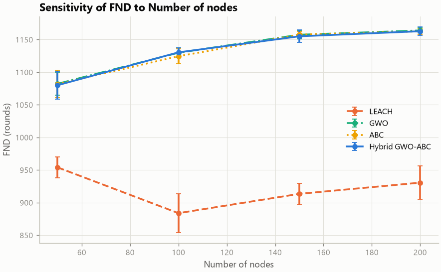

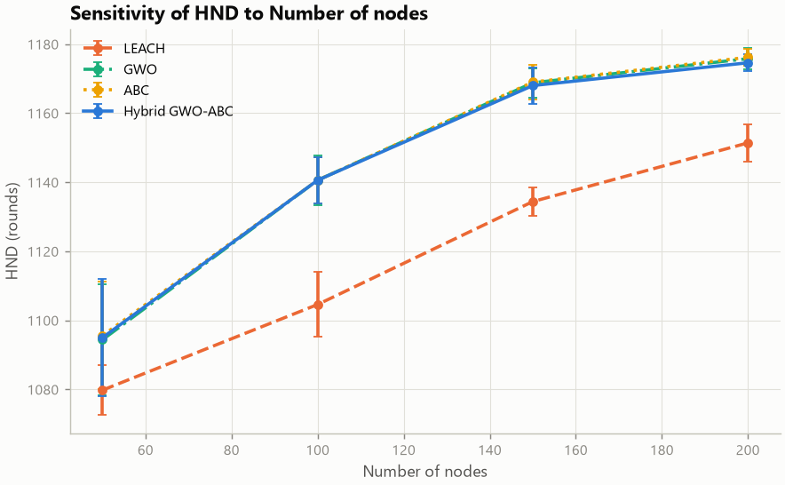

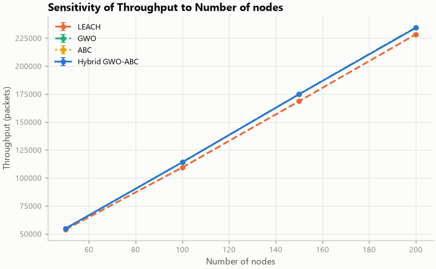

**Observed:** LEACH: FND ranges from 884 (at 100) to 954 (at 50); throughput 53,764–228,346 packets. GWO: FND ranges from 1082 (at 50) to 1164 (at 200); throughput 54,669–234,594 packets. ABC: FND ranges from 1082 (at 50) to 1163 (at 200); throughput 54,713–234,489 packets. Hybrid GWO-ABC: FND ranges from 1080 (at 50) to 1163 (at 200); throughput 54,722–234,221 packets. Highest FND per setting — 50: GWO; 100: Hybrid GWO-ABC; 150: ABC; 200: GWO.

## Square field side (m), BS at centre

| Setting | Algorithm | FND | HND | LND | Throughput | PDR | Runtime |
|---:|---|---:|---:|---:|---|---:|---:|
| 100 | ABC | 1124 ± 12 | 1141 ± 6.7 | 1166 ± 5 | 1.141e+05 ± 6.4e+02 | 0.9989 ± 0.00033 | 110.8 ± 3.5 |
| 100 | GWO | 1130 ± 7.3 | 1141 ± 7.3 | 1166 ± 4.7 | 1.14e+05 ± 5.9e+02 | 0.9985 ± 0.00045 | 62.62 ± 1.1 |
| 100 | Hybrid GWO-ABC | 1130 ± 6.7 | 1141 ± 6.7 | 1162 ± 9.5 | 1.14e+05 ± 5.5e+02 | 0.9982 ± 0.0004 | 140.6 ± 2.8 |
| 100 | LEACH | 883.8 ± 30 | 1105 ± 9.3 | 1295 ± 46 | 1.093e+05 ± 5.9e+02 | 0.9894 ± 0.0019 | 0.05693 ± 0.0063 |
| 150 | ABC | 1055 ± 8.9 | 1063 ± 8.6 | 1083 ± 8.1 | 1.063e+05 ± 8e+02 | 0.9987 ± 0.0004 | 103.1 ± 2.6 |
| 150 | GWO | 1056 ± 9.6 | 1063 ± 10 | 1080 ± 8.8 | 1.063e+05 ± 9.3e+02 | 0.9985 ± 0.00043 | 59.92 ± 1.1 |
| 150 | Hybrid GWO-ABC | 1055 ± 8.9 | 1063 ± 8.3 | 1080 ± 9.4 | 1.063e+05 ± 8.7e+02 | 0.9984 ± 0.00028 | 126.4 ± 2.4 |
| 150 | LEACH | 821.6 ± 15 | 969.4 ± 18 | 1087 ± 26 | 9.557e+04 ± 1.3e+03 | 0.9899 ± 0.0011 | 0.04021 ± 0.011 |
| 200 | ABC | 613.4 ± 99 | 910.4 ± 14 | 946 ± 20 | 8.792e+04 ± 1.4e+03 | 0.9987 ± 0.00015 | 90.45 ± 3.7 |
| 200 | GWO | 640.6 ± 1.2e+02 | 911.6 ± 11 | 943.4 ± 18 | 8.804e+04 ± 2.2e+03 | 0.9987 ± 0.00014 | 51.54 ± 1.5 |
| 200 | Hybrid GWO-ABC | 589 ± 75 | 909.6 ± 19 | 934.8 ± 8.8 | 8.679e+04 ± 1.8e+03 | 0.9986 ± 0.00032 | 106.9 ± 1.1 |
| 200 | LEACH | 492.8 ± 61 | 785.4 ± 29 | 1041 ± 42 | 7.651e+04 ± 2.8e+03 | 0.9932 ± 0.0013 | 0.04698 ± 0.016 |
| 50 | ABC | 1186 ± 3 | 1198 ± 2.4 | 1210 ± 2.7 | 1.196e+05 ± 3.4e+02 | 0.9981 ± 0.00097 | 124.7 ± 2.8 |
| 50 | GWO | 1181 ± 7.2 | 1197 ± 2.4 | 1214 ± 4 | 1.196e+05 ± 2.4e+02 | 0.9981 ± 0.0008 | 67.27 ± 1.2 |
| 50 | Hybrid GWO-ABC | 1180 ± 9.2 | 1198 ± 3.4 | 1212 ± 4.4 | 1.195e+05 ± 2.8e+02 | 0.9979 ± 0.00087 | 149.3 ± 2.4 |
| 50 | LEACH | 918.2 ± 37 | 1188 ± 9 | 1560 ± 52 | 1.188e+05 ± 2.1e+02 | 0.9885 ± 0.0015 | 0.08078 ± 0.027 |

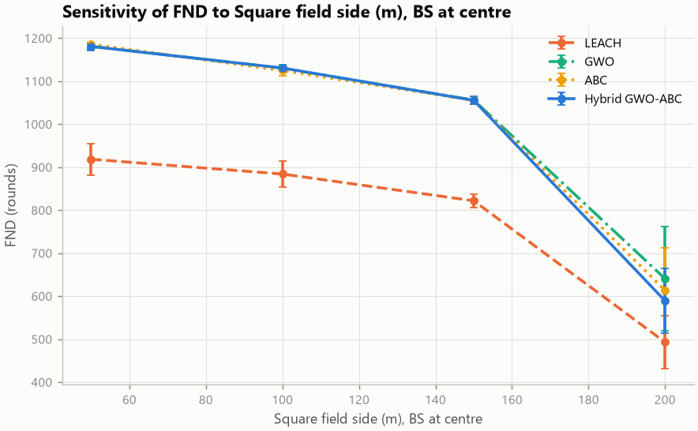

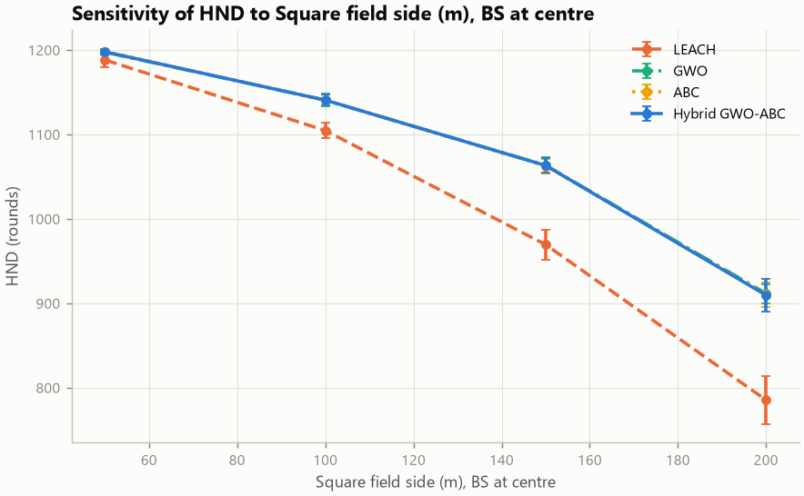

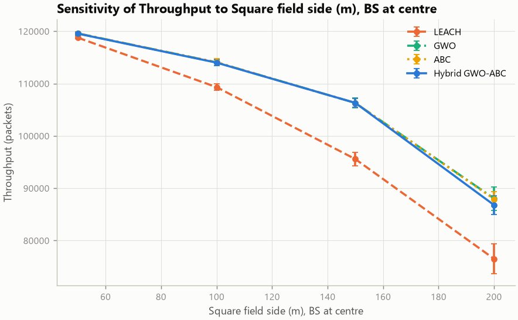

**Observed:** LEACH: FND ranges from 493 (at 200) to 918 (at 50); throughput 76,507–118,764 packets. GWO: FND ranges from 641 (at 200) to 1181 (at 50); throughput 88,041–119,579 packets. ABC: FND ranges from 613 (at 200) to 1186 (at 50); throughput 87,925–119,588 packets. Hybrid GWO-ABC: FND ranges from 589 (at 200) to 1180 (at 50); throughput 86,785–119,538 packets. Highest FND per setting — 50: ABC; 100: Hybrid GWO-ABC; 150: GWO; 200: GWO.

## Initial energy (J)

| Setting | Algorithm | FND | HND | LND | Throughput | PDR | Runtime |
|---:|---|---:|---:|---:|---|---:|---:|
| 0.25 | ABC | 562 ± 3.9 | 572.4 ± 3.5 | 585.2 ± 2.9 | 5.71e+04 ± 2.4e+02 | 0.997 ± 0.00086 | 56.88 ± 1.2 |
| 0.25 | GWO | 561.4 ± 3.2 | 572 ± 3.7 | 593 ± 9.5 | 5.715e+04 ± 2.7e+02 | 0.9976 ± 0.00051 | 32.27 ± 0.66 |
| 0.25 | Hybrid GWO-ABC | 562.8 ± 2.2 | 571.4 ± 3 | 585.4 ± 2.9 | 5.708e+04 ± 2.7e+02 | 0.9971 ± 0.00082 | 66.67 ± 0.66 |
| 0.25 | LEACH | 417.2 ± 8.6 | 558.8 ± 2.5 | 670.4 ± 21 | 5.421e+04 ± 1.7e+02 | 0.9788 ± 0.0025 | 0.02774 ± 0.0025 |
| 0.5 | ABC | 1124 ± 12 | 1141 ± 6.7 | 1166 ± 5 | 1.141e+05 ± 6.4e+02 | 0.9989 ± 0.00033 | 114.7 ± 1.6 |
| 0.5 | GWO | 1130 ± 7.3 | 1141 ± 7.3 | 1166 ± 4.7 | 1.14e+05 ± 5.9e+02 | 0.9985 ± 0.00045 | 61.82 ± 1 |
| 0.5 | Hybrid GWO-ABC | 1130 ± 6.7 | 1141 ± 6.7 | 1162 ± 9.5 | 1.14e+05 ± 5.5e+02 | 0.9982 ± 0.0004 | 134.5 ± 1.6 |
| 0.5 | LEACH | 883.8 ± 30 | 1105 ± 9.3 | 1295 ± 46 | 1.093e+05 ± 5.9e+02 | 0.9894 ± 0.0019 | 0.05843 ± 0.0077 |
| 1.0 | ABC | 2000 ± 0 | 2000 ± 0 | 2000 ± 0 | 2e+05 ± 0 | 1 ± 0 | 198.1 ± 3.4 |
| 1.0 | GWO | 2000 ± 0 | 2000 ± 0 | 2000 ± 0 | 2e+05 ± 0 | 1 ± 0 | 106.3 ± 0.87 |
| 1.0 | Hybrid GWO-ABC | 2000 ± 0 | 2000 ± 0 | 2000 ± 0 | 2e+05 ± 0 | 1 ± 0 | 235.5 ± 2.1 |
| 1.0 | LEACH | 1829 ± 50 | 2000 ± 0 | 2000 ± 0 | 1.989e+05 ± 3.6e+02 | 0.9985 ± 0.0006 | 0.09184 ± 0.0077 |

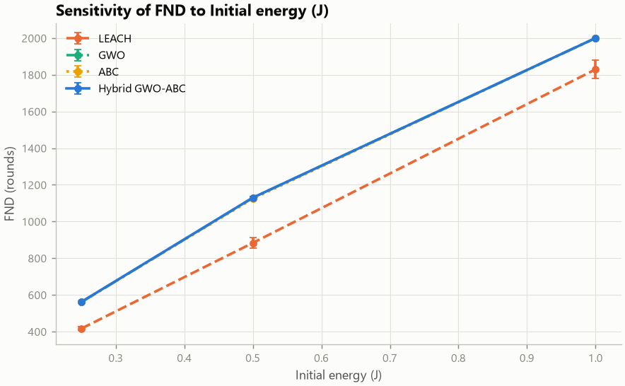

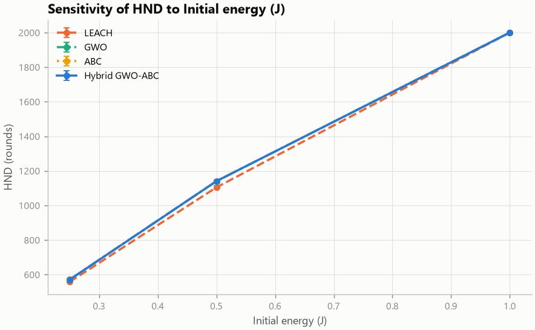

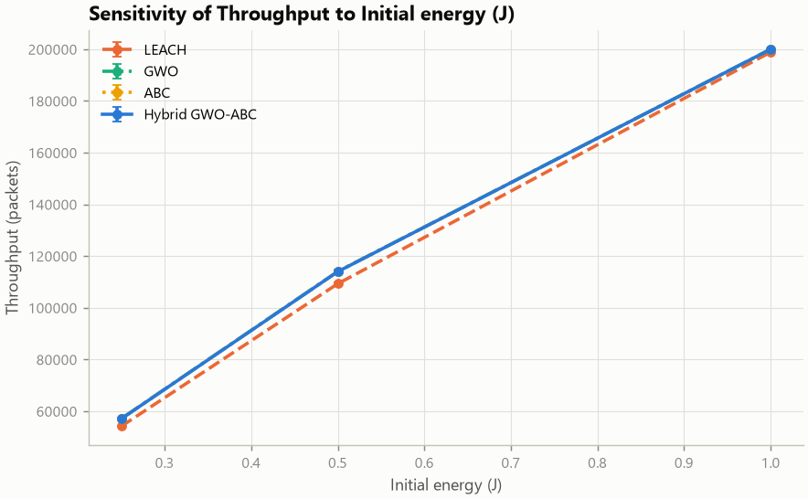

**Observed:** LEACH: FND ranges from 417 (at 0.25) to 1829 (at 1.0); throughput 54,207–198,881 packets. GWO: FND ranges from 561 (at 0.25) to 2000 (at 1.0); throughput 57,154–200,000 packets. ABC: FND ranges from 562 (at 0.25) to 2000 (at 1.0); throughput 57,102–200,000 packets. Hybrid GWO-ABC: FND ranges from 563 (at 0.25) to 2000 (at 1.0); throughput 57,080–200,000 packets. Highest FND per setting — 0.25: Hybrid GWO-ABC; 0.5: Hybrid GWO-ABC; 1.0: ABC.

## Target CH percentage p

| Setting | Algorithm | FND | HND | LND | Throughput | PDR | Runtime |
|---:|---|---:|---:|---:|---|---:|---:|
| 0.03 | ABC | 1066 ± 13 | 1092 ± 5.6 | 1120 ± 8.9 | 1.092e+05 ± 4.8e+02 | 0.999 ± 6.7e-05 | 111.8 ± 3.8 |
| 0.03 | GWO | 1067 ± 9.2 | 1091 ± 7.2 | 1117 ± 12 | 1.091e+05 ± 5.4e+02 | 0.9986 ± 0.00058 | 58.28 ± 2.1 |
| 0.03 | Hybrid GWO-ABC | 1067 ± 8.3 | 1092 ± 5.3 | 1120 ± 10 | 1.093e+05 ± 4.8e+02 | 0.999 ± 0.0002 | 133.3 ± 6.5 |
| 0.03 | LEACH | 891.4 ± 38 | 1071 ± 17 | 1252 ± 37 | 1.059e+05 ± 9.4e+02 | 0.9874 ± 0.0017 | 0.05946 ± 0.0081 |
| 0.05 | ABC | 1124 ± 12 | 1141 ± 6.7 | 1166 ± 5 | 1.141e+05 ± 6.4e+02 | 0.9989 ± 0.00033 | 120.6 ± 2.7 |
| 0.05 | GWO | 1130 ± 7.3 | 1141 ± 7.3 | 1166 ± 4.7 | 1.14e+05 ± 5.9e+02 | 0.9985 ± 0.00045 | 61.58 ± 1.5 |
| 0.05 | Hybrid GWO-ABC | 1130 ± 6.7 | 1141 ± 6.7 | 1162 ± 9.5 | 1.14e+05 ± 5.5e+02 | 0.9982 ± 0.0004 | 200.3 ± 28 |
| 0.05 | LEACH | 883.8 ± 30 | 1105 ± 9.3 | 1295 ± 46 | 1.093e+05 ± 5.9e+02 | 0.9894 ± 0.0019 | 0.0619 ± 0.0035 |
| 0.08 | ABC | 1171 ± 7.9 | 1178 ± 7.6 | 1191 ± 5.9 | 1.176e+05 ± 7.3e+02 | 0.9978 ± 0.00029 | 121.5 ± 1.6 |
| 0.08 | GWO | 1170 ± 9.2 | 1177 ± 9.1 | 1199 ± 13 | 1.175e+05 ± 8.9e+02 | 0.9979 ± 0.00042 | 66.84 ± 1.9 |
| 0.08 | Hybrid GWO-ABC | 1170 ± 8.3 | 1176 ± 8.3 | 1192 ± 8.5 | 1.174e+05 ± 7.8e+02 | 0.9977 ± 0.00059 | 223.6 ± 1.8 |
| 0.08 | LEACH | 956.8 ± 36 | 1145 ± 6.6 | 1378 ± 50 | 1.146e+05 ± 4.7e+02 | 0.9924 ± 0.0011 | 0.06519 ± 0.0046 |
| 0.1 | ABC | 1186 ± 7.9 | 1193 ± 8.2 | 1208 ± 6.2 | 1.19e+05 ± 8.2e+02 | 0.9979 ± 0.00026 | 126.2 ± 2 |
| 0.1 | GWO | 1184 ± 10 | 1191 ± 9.6 | 1204 ± 5.4 | 1.188e+05 ± 9.9e+02 | 0.9972 ± 0.00042 | 66.43 ± 2.4 |
| 0.1 | Hybrid GWO-ABC | 1184 ± 9 | 1191 ± 9 | 1204 ± 9.1 | 1.189e+05 ± 9.1e+02 | 0.9977 ± 0.0002 | 178.6 ± 33 |
| 0.1 | LEACH | 999.8 ± 22 | 1168 ± 7.3 | 1436 ± 47 | 1.171e+05 ± 4.1e+02 | 0.9939 ± 0.00081 | 0.06587 ± 0.0073 |

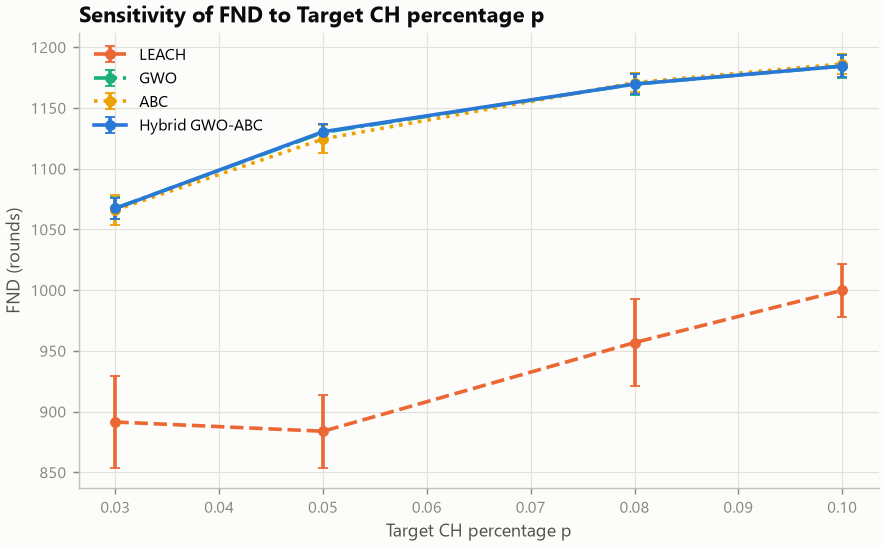

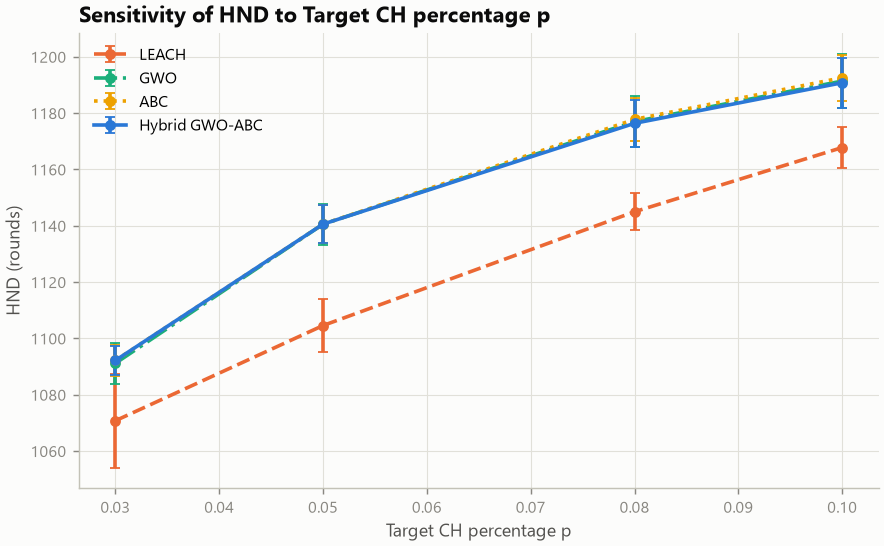

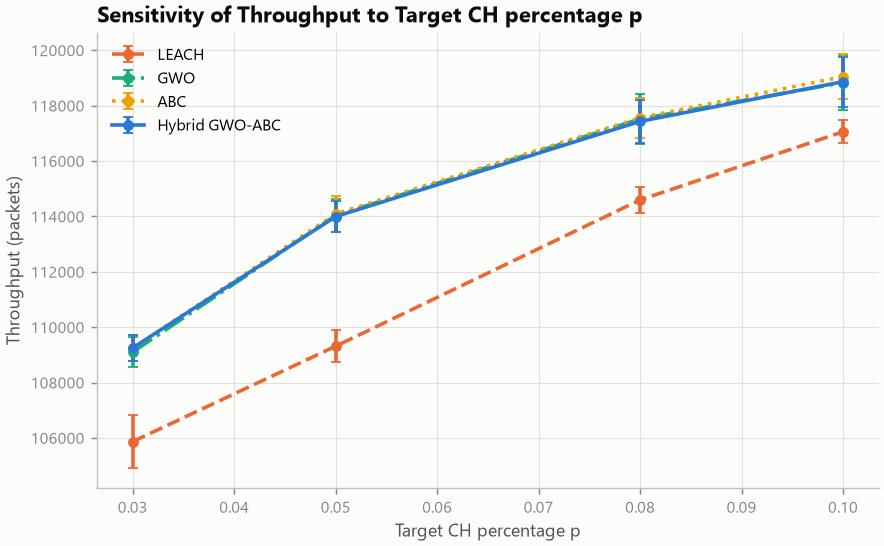

**Observed:** LEACH: FND ranges from 884 (at 0.05) to 1000 (at 0.1); throughput 105,869–117,057 packets. GWO: FND ranges from 1067 (at 0.03) to 1184 (at 0.1); throughput 109,104–118,833 packets. ABC: FND ranges from 1066 (at 0.03) to 1186 (at 0.1); throughput 109,244–119,049 packets. Hybrid GWO-ABC: FND ranges from 1067 (at 0.03) to 1184 (at 0.1); throughput 109,251–118,865 packets. Highest FND per setting — 0.03: GWO; 0.05: Hybrid GWO-ABC; 0.08: ABC; 0.1: ABC.

## BS position

| Setting | Algorithm | FND | HND | LND | Throughput | PDR | Runtime |
|---|---|---:|---:|---:|---|---:|---:|
| (0,0) | ABC | 1107 ± 8.4 | 1116 ± 8.1 | 1127 ± 5.1 | 1.113e+05 ± 7.4e+02 | 0.9971 ± 0.00047 | 113.8 ± 3.6 |
| (0,0) | GWO | 1106 ± 7.7 | 1116 ± 8.5 | 1128 ± 5.7 | 1.113e+05 ± 7.1e+02 | 0.9973 ± 0.0009 | 58.38 ± 0.96 |
| (0,0) | Hybrid GWO-ABC | 1105 ± 12 | 1115 ± 7.8 | 1125 ± 5.5 | 1.112e+05 ± 6.4e+02 | 0.997 ± 0.0011 | 139.2 ± 3.3 |
| (0,0) | LEACH | 867.6 ± 25 | 1067 ± 16 | 1383 ± 52 | 1.061e+05 ± 9.2e+02 | 0.9897 ± 0.0014 | 0.04756 ± 0.0049 |
| (50,100) | ABC | 1121 ± 5.7 | 1130 ± 5.6 | 1144 ± 4 | 1.129e+05 ± 4.8e+02 | 0.9984 ± 0.00059 | 115.5 ± 1 |
| (50,100) | GWO | 1120 ± 8.6 | 1130 ± 5 | 1143 ± 7.1 | 1.128e+05 ± 4.6e+02 | 0.9978 ± 0.00066 | 60.26 ± 1.7 |
| (50,100) | Hybrid GWO-ABC | 1118 ± 5.2 | 1129 ± 4.3 | 1142 ± 5.2 | 1.127e+05 ± 4.3e+02 | 0.9975 ± 0.00062 | 137.8 ± 1.1 |
| (50,100) | LEACH | 873.2 ± 30 | 1095 ± 5.2 | 1355 ± 41 | 1.08e+05 ± 4.2e+02 | 0.988 ± 0.0018 | 0.0608 ± 0.0084 |
| (50,150) | ABC | 1049 ± 8.6 | 1062 ± 10 | 1074 ± 8.2 | 1.059e+05 ± 9.4e+02 | 0.9973 ± 0.00065 | 105.9 ± 2.9 |
| (50,150) | GWO | 1050 ± 8.6 | 1062 ± 9.4 | 1076 ± 7.4 | 1.06e+05 ± 9e+02 | 0.9973 ± 0.00072 | 55.62 ± 1.2 |
| (50,150) | Hybrid GWO-ABC | 1050 ± 10 | 1062 ± 10 | 1075 ± 8.6 | 1.059e+05 ± 9.2e+02 | 0.9974 ± 0.00094 | 129.6 ± 4.8 |
| (50,150) | LEACH | 813.4 ± 27 | 996.8 ± 8.8 | 1298 ± 19 | 9.997e+04 ± 7.1e+02 | 0.9888 ± 0.0015 | 0.05788 ± 0.0047 |
| (50,50) | ABC | 1124 ± 12 | 1141 ± 6.7 | 1166 ± 5 | 1.141e+05 ± 6.4e+02 | 0.9989 ± 0.00033 | 118.7 ± 0.56 |
| (50,50) | GWO | 1130 ± 7.3 | 1141 ± 7.3 | 1166 ± 4.7 | 1.14e+05 ± 5.9e+02 | 0.9985 ± 0.00045 | 61.14 ± 2 |
| (50,50) | Hybrid GWO-ABC | 1130 ± 6.7 | 1141 ± 6.7 | 1162 ± 9.5 | 1.14e+05 ± 5.5e+02 | 0.9982 ± 0.0004 | 139.8 ± 0.48 |
| (50,50) | LEACH | 883.8 ± 30 | 1105 ± 9.3 | 1295 ± 46 | 1.093e+05 ± 5.9e+02 | 0.9894 ± 0.0019 | 0.06143 ± 0.01 |

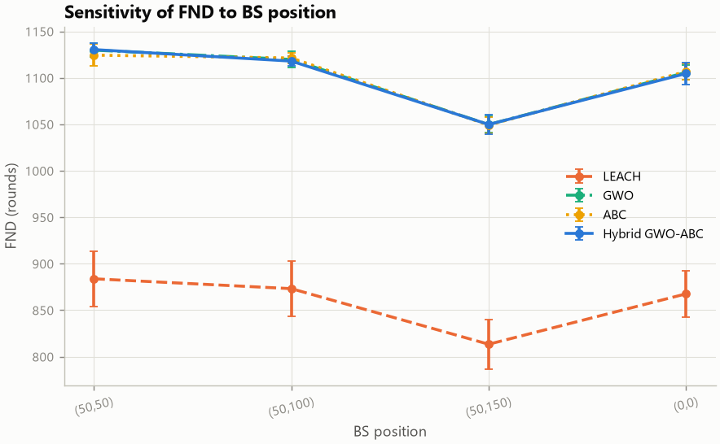

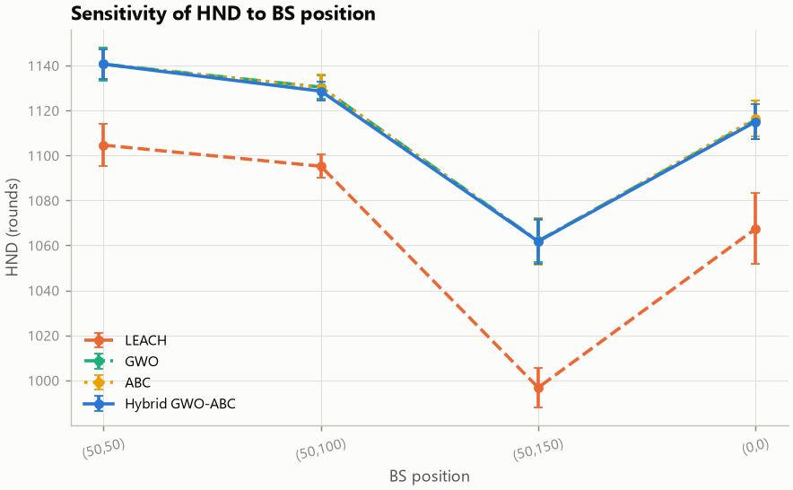

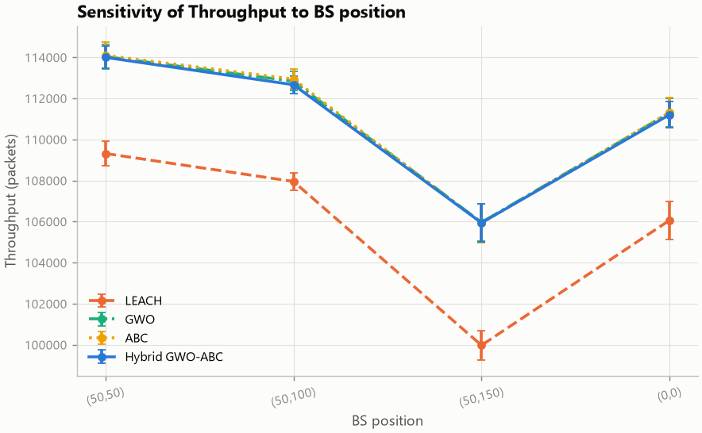

**Observed:** LEACH: FND ranges from 813 (at (50,150)) to 884 (at (50,50)); throughput 99,974–109,314 packets. GWO: FND ranges from 1050 (at (50,150)) to 1130 (at (50,50)); throughput 105,961–114,036 packets. ABC: FND ranges from 1049 (at (50,150)) to 1124 (at (50,50)); throughput 105,925–114,093 packets. Hybrid GWO-ABC: FND ranges from 1050 (at (50,150)) to 1130 (at (50,50)); throughput 105,939–113,995 packets. Highest FND per setting — (50,50): Hybrid GWO-ABC; (50,100): ABC; (50,150): GWO; (0,0): ABC.

## GWO population

| Setting | Algorithm | FND | HND | LND | Throughput | PDR | Runtime |
|---:|---|---:|---:|---:|---|---:|---:|
| 10 | GWO | 1131 ± 8.3 | 1141 ± 7.2 | 1166 ± 6.2 | 1.14e+05 ± 6.7e+02 | 0.9978 ± 0.00046 | 45 ± 1.2 |
| 10 | Hybrid GWO-ABC | 1130 ± 6.2 | 1141 ± 6.2 | 1159 ± 2.6 | 1.14e+05 ± 5.7e+02 | 0.9983 ± 0.00013 | 135.4 ± 1.7 |
| 20 | GWO | 1130 ± 7.3 | 1141 ± 7.3 | 1166 ± 4.7 | 1.14e+05 ± 5.9e+02 | 0.9985 ± 0.00045 | 59.98 ± 0.9 |
| 20 | Hybrid GWO-ABC | 1130 ± 6.7 | 1141 ± 6.7 | 1162 ± 9.5 | 1.14e+05 ± 5.5e+02 | 0.9982 ± 0.0004 | 144.5 ± 2 |
| 30 | GWO | 1130 ± 9.3 | 1141 ± 7 | 1165 ± 6.4 | 1.14e+05 ± 6.8e+02 | 0.9982 ± 0.0013 | 81.49 ± 1.5 |
| 30 | Hybrid GWO-ABC | 1128 ± 11 | 1140 ± 6.6 | 1163 ± 7.5 | 1.14e+05 ± 5.7e+02 | 0.9987 ± 0.00045 | 154.2 ± 2.8 |
| 40 | GWO | 1131 ± 6.3 | 1141 ± 7.2 | 1162 ± 4.9 | 1.14e+05 ± 6e+02 | 0.9984 ± 0.00064 | 95.54 ± 1 |
| 40 | Hybrid GWO-ABC | 1130 ± 8.3 | 1141 ± 7.1 | 1158 ± 4.2 | 1.14e+05 ± 6.7e+02 | 0.9983 ± 0.00021 | 160.1 ± 3 |

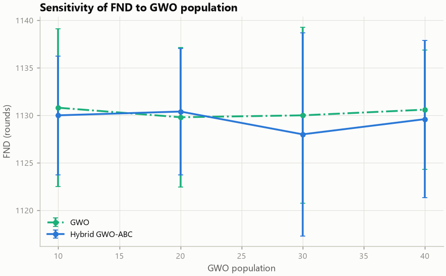

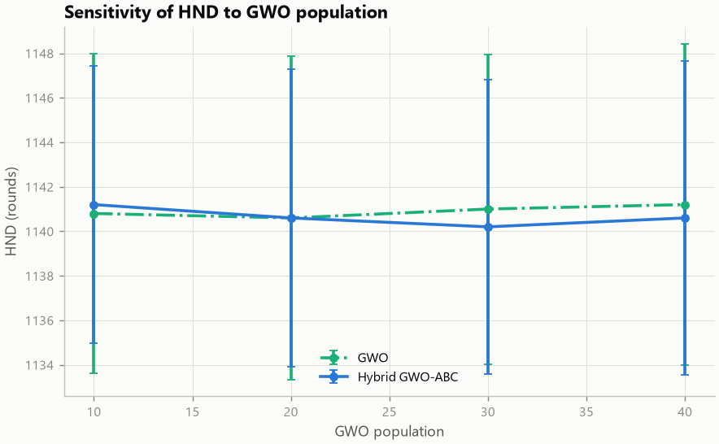

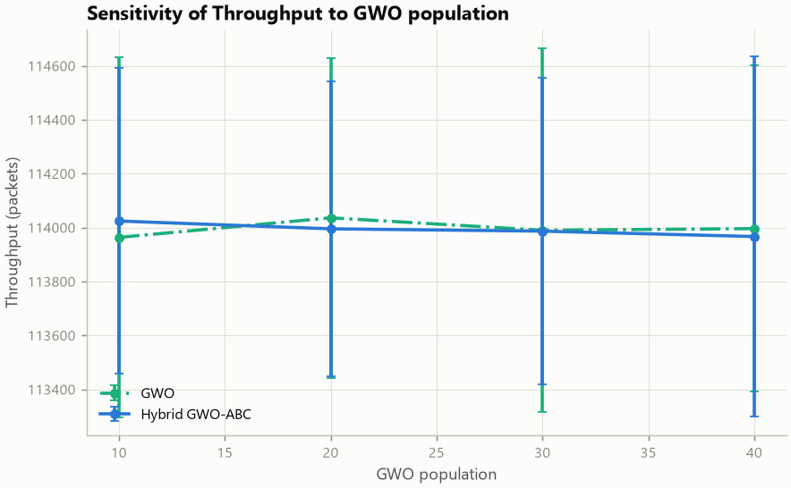

**Observed:** GWO: FND ranges from 1130 (at 20) to 1131 (at 10); throughput 113,963–114,036 packets. Hybrid GWO-ABC: FND ranges from 1128 (at 30) to 1130 (at 20); throughput 113,966–114,024 packets. Highest FND per setting — 10: GWO; 20: Hybrid GWO-ABC; 30: GWO; 40: GWO.

## ABC colony size

| Setting | Algorithm | FND | HND | LND | Throughput | PDR | Runtime |
|---:|---|---:|---:|---:|---|---:|---:|
| 10 | ABC | 1131 ± 6.8 | 1141 ± 7.2 | 1160 ± 2.5 | 1.14e+05 ± 6.8e+02 | 0.9984 ± 0.00043 | 99.99 ± 2 |
| 10 | Hybrid GWO-ABC | 1130 ± 7.4 | 1140 ± 7.6 | 1159 ± 3.6 | 1.139e+05 ± 6.8e+02 | 0.998 ± 0.00094 | 128.9 ± 4.6 |
| 20 | ABC | 1124 ± 12 | 1141 ± 6.7 | 1166 ± 5 | 1.141e+05 ± 6.4e+02 | 0.9989 ± 0.00033 | 125.9 ± 2.7 |
| 20 | Hybrid GWO-ABC | 1130 ± 6.7 | 1141 ± 6.7 | 1162 ± 9.5 | 1.14e+05 ± 5.5e+02 | 0.9982 ± 0.0004 | 142.4 ± 2.4 |
| 30 | ABC | 1128 ± 9.5 | 1140 ± 7.1 | 1162 ± 5 | 1.14e+05 ± 7e+02 | 0.9987 ± 0.00047 | 133.4 ± 2.3 |
| 30 | Hybrid GWO-ABC | 1128 ± 8.8 | 1142 ± 7.2 | 1156 ± 3 | 1.139e+05 ± 7.6e+02 | 0.9977 ± 0.0011 | 150.4 ± 3.6 |
| 40 | ABC | 1132 ± 8.6 | 1141 ± 8 | 1163 ± 5.3 | 1.141e+05 ± 6.6e+02 | 0.9989 ± 0.00055 | 149.8 ± 4.3 |
| 40 | Hybrid GWO-ABC | 1130 ± 12 | 1141 ± 6.7 | 1159 ± 1.5 | 1.14e+05 ± 6.3e+02 | 0.9987 ± 0.00052 | 160 ± 3.7 |

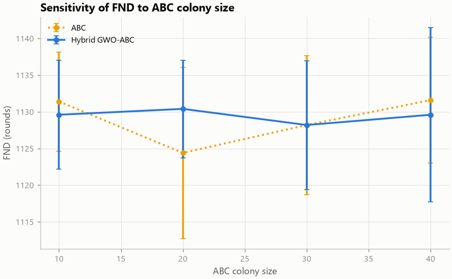

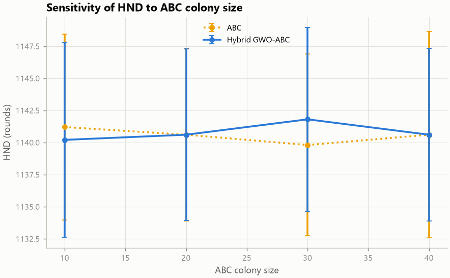

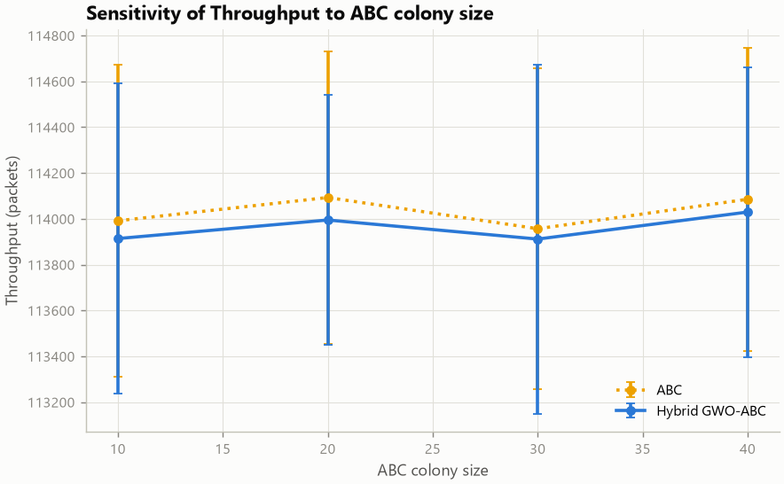

**Observed:** ABC: FND ranges from 1124 (at 20) to 1132 (at 40); throughput 113,957–114,093 packets. Hybrid GWO-ABC: FND ranges from 1128 (at 30) to 1130 (at 20); throughput 113,912–114,030 packets. Highest FND per setting — 10: ABC; 20: Hybrid GWO-ABC; 30: ABC; 40: ABC.

## Optimisation iterations

| Setting | Algorithm | FND | HND | LND | Throughput | PDR | Runtime |
|---:|---|---:|---:|---:|---|---:|---:|
| 10 | ABC | 1124 ± 11 | 1140 ± 6 | 1162 ± 7.6 | 1.139e+05 ± 5.3e+02 | 0.9985 ± 0.00035 | 38.76 ± 0.8 |
| 10 | GWO | 1129 ± 9.3 | 1141 ± 8 | 1161 ± 5.5 | 1.14e+05 ± 6.5e+02 | 0.998 ± 0.00085 | 23 ± 0.65 |
| 10 | Hybrid GWO-ABC | 1131 ± 6.8 | 1141 ± 6.8 | 1169 ± 8.6 | 1.14e+05 ± 6.3e+02 | 0.9981 ± 0.00047 | 47.82 ± 3.3 |
| 20 | ABC | 1131 ± 8.3 | 1141 ± 6.9 | 1160 ± 2 | 1.14e+05 ± 6e+02 | 0.9985 ± 0.00035 | 87.51 ± 1.2 |
| 20 | GWO | 1129 ± 8.1 | 1141 ± 6.9 | 1158 ± 9.3 | 1.139e+05 ± 7e+02 | 0.998 ± 0.00048 | 42.21 ± 1.3 |
| 20 | Hybrid GWO-ABC | 1129 ± 11 | 1141 ± 6.1 | 1165 ± 4.3 | 1.14e+05 ± 6e+02 | 0.998 ± 0.00078 | 93.91 ± 0.8 |
| 30 | ABC | 1124 ± 12 | 1141 ± 6.7 | 1166 ± 5 | 1.141e+05 ± 6.4e+02 | 0.9989 ± 0.00033 | 132.4 ± 1.7 |
| 30 | GWO | 1130 ± 7.3 | 1141 ± 7.3 | 1166 ± 4.7 | 1.14e+05 ± 5.9e+02 | 0.9985 ± 0.00045 | 62.39 ± 1.4 |
| 30 | Hybrid GWO-ABC | 1130 ± 6.7 | 1141 ± 6.7 | 1162 ± 9.5 | 1.14e+05 ± 5.5e+02 | 0.9982 ± 0.0004 | 141.5 ± 2.2 |
| 50 | ABC | 1131 ± 5.9 | 1142 ± 6.1 | 1158 ± 3.6 | 1.141e+05 ± 5.8e+02 | 0.9985 ± 0.00055 | 196.8 ± 2.4 |
| 50 | GWO | 1128 ± 13 | 1142 ± 7.4 | 1162 ± 5.9 | 1.14e+05 ± 7.1e+02 | 0.9981 ± 0.00071 | 100.4 ± 1.7 |
| 50 | Hybrid GWO-ABC | 1130 ± 8.5 | 1141 ± 7.7 | 1162 ± 6.2 | 1.14e+05 ± 6.8e+02 | 0.9982 ± 0.00035 | 233.6 ± 3.2 |

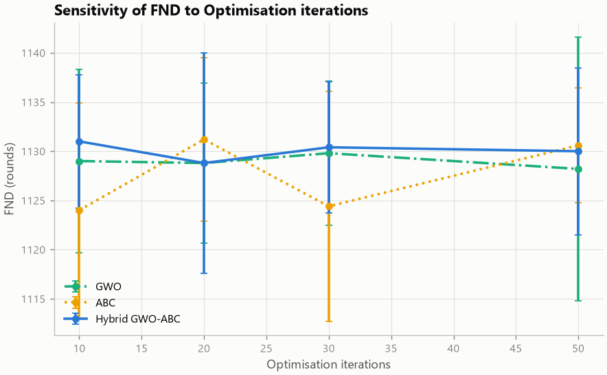

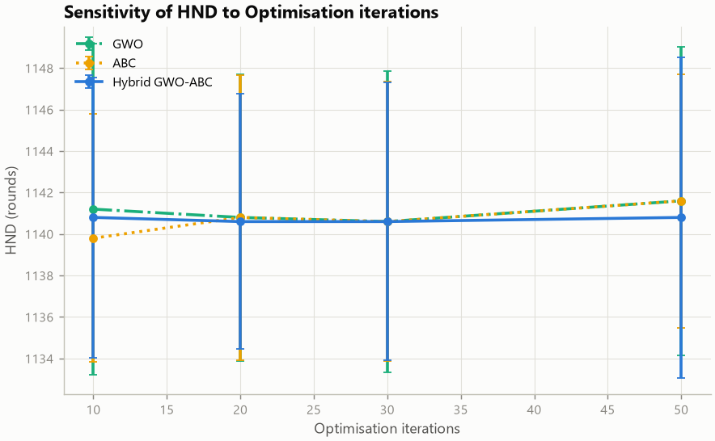

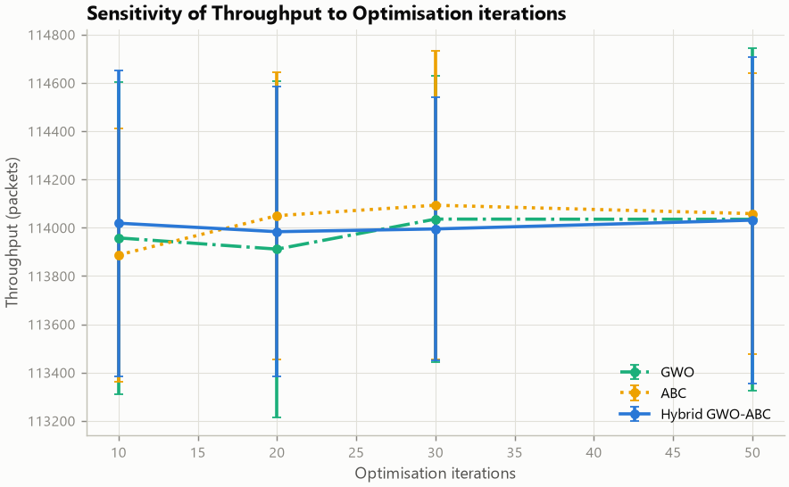

**Observed:** GWO: FND ranges from 1128 (at 50) to 1130 (at 30); throughput 113,911–114,036 packets. ABC: FND ranges from 1124 (at 10) to 1131 (at 20); throughput 113,887–114,093 packets. Hybrid GWO-ABC: FND ranges from 1129 (at 20) to 1131 (at 10); throughput 113,984–114,031 packets. Highest FND per setting — 10: Hybrid GWO-ABC; 20: ABC; 30: Hybrid GWO-ABC; 50: ABC.

## Fitness weights (w1..w5)

| Setting | Algorithm | FND | HND | LND | Throughput | PDR | Runtime |
|---|---|---:|---:|---:|---|---:|---:|
| balance-heavy (.20/.20/.15/.35/.10) | Hybrid GWO-ABC | 1115 ± 12 | 1128 ± 10 | 1162 ± 34 | 1.127e+05 ± 8.8e+02 | 0.9985 ± 0.00065 | 139.6 ± 2.9 |
| default (.30/.25/.20/.15/.10) | Hybrid GWO-ABC | 1130 ± 6.7 | 1141 ± 6.7 | 1162 ± 9.5 | 1.14e+05 ± 5.5e+02 | 0.9982 ± 0.0004 | 142.2 ± 1.3 |
| distance-heavy (.15/.35/.30/.10/.10) | Hybrid GWO-ABC | 1123 ± 8.5 | 1139 ± 6.2 | 1196 ± 49 | 1.137e+05 ± 7e+02 | 0.9981 ± 0.00076 | 145.2 ± 4.7 |
| energy-heavy (.50/.15/.15/.10/.10) | Hybrid GWO-ABC | 1136 ± 7.6 | 1147 ± 6.1 | 1157 ± 4.1 | 1.144e+05 ± 4.8e+02 | 0.9973 ± 0.00071 | 141 ± 2.7 |
| equal (.20 each) | Hybrid GWO-ABC | 1133 ± 6.5 | 1142 ± 7.5 | 1175 ± 22 | 1.141e+05 ± 6.9e+02 | 0.9982 ± 0.00072 | 143.5 ± 4.5 |

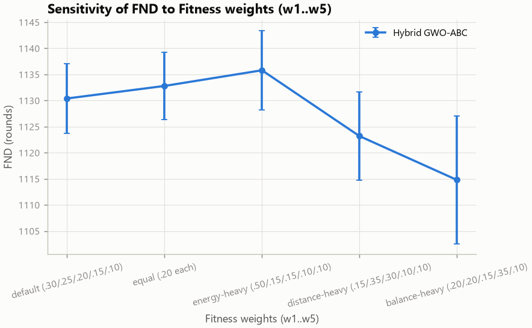

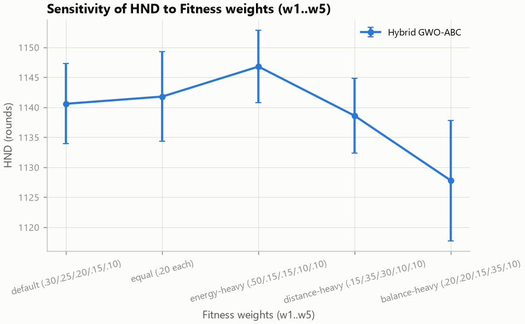

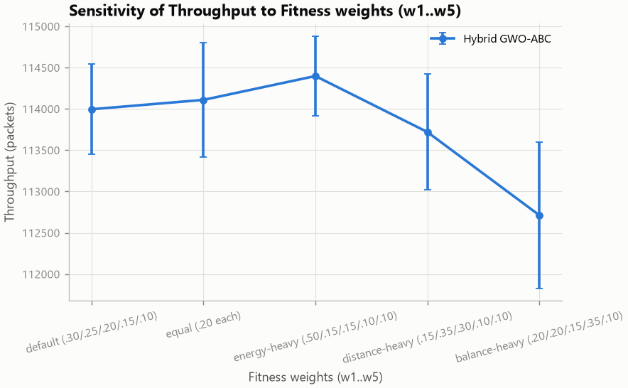

**Observed:** Hybrid GWO-ABC: FND ranges from 1115 (at balance-heavy (.20/.20/.15/.35/.10)) to 1136 (at energy-heavy (.50/.15/.15/.10/.10)); throughput 112,712–114,397 packets.

## CH eligibility threshold (x mean energy)

| Setting | Algorithm | FND | HND | LND | Throughput | PDR | Runtime |
|---:|---|---:|---:|---:|---|---:|---:|
| 0.0 | ABC | 665.2 ± 39 | 1214 ± 11 | 1299 ± 18 | 1.142e+05 ± 4.2e+02 | 0.9989 ± 0.00032 | 120.4 ± 6.5 |
| 0.0 | GWO | 658.6 ± 44 | 1192 ± 13 | 1305 ± 18 | 1.14e+05 ± 5.3e+02 | 0.999 ± 0.00017 | 70.64 ± 1 |
| 0.0 | Hybrid GWO-ABC | 644.2 ± 48 | 1215 ± 15 | 1298 ± 17 | 1.142e+05 ± 4.4e+02 | 0.999 ± 0.00012 | 153.7 ± 1.8 |
| 0.5 | ABC | 1056 ± 4.2 | 1138 ± 4.2 | 1239 ± 42 | 1.144e+05 ± 4e+02 | 0.9991 ± 2.5e-05 | 110.3 ± 2.5 |
| 0.5 | GWO | 1063 ± 7 | 1135 ± 5.1 | 1234 ± 14 | 1.143e+05 ± 4.7e+02 | 0.9991 ± 2.7e-05 | 66.36 ± 1.4 |
| 0.5 | Hybrid GWO-ABC | 1061 ± 5.4 | 1137 ± 4.7 | 1230 ± 30 | 1.144e+05 ± 4.3e+02 | 0.9991 ± 3.4e-05 | 145.8 ± 4.4 |
| 1.0 | ABC | 1124 ± 12 | 1141 ± 6.7 | 1166 ± 5 | 1.141e+05 ± 6.4e+02 | 0.9989 ± 0.00033 | 106.6 ± 1.5 |
| 1.0 | GWO | 1130 ± 7.3 | 1141 ± 7.3 | 1166 ± 4.7 | 1.14e+05 ± 5.9e+02 | 0.9985 ± 0.00045 | 60.38 ± 2.6 |
| 1.0 | Hybrid GWO-ABC | 1130 ± 6.7 | 1141 ± 6.7 | 1162 ± 9.5 | 1.14e+05 ± 5.5e+02 | 0.9982 ± 0.0004 | 144.1 ± 5 |

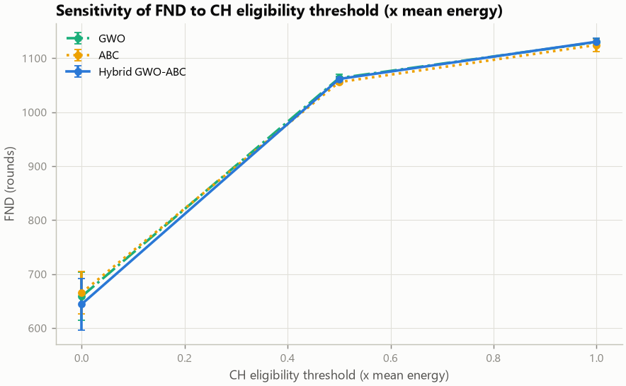

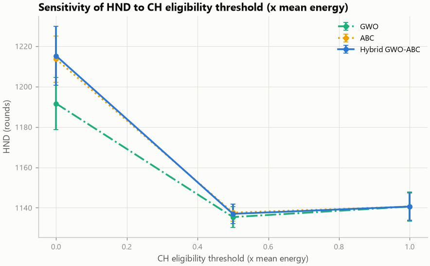

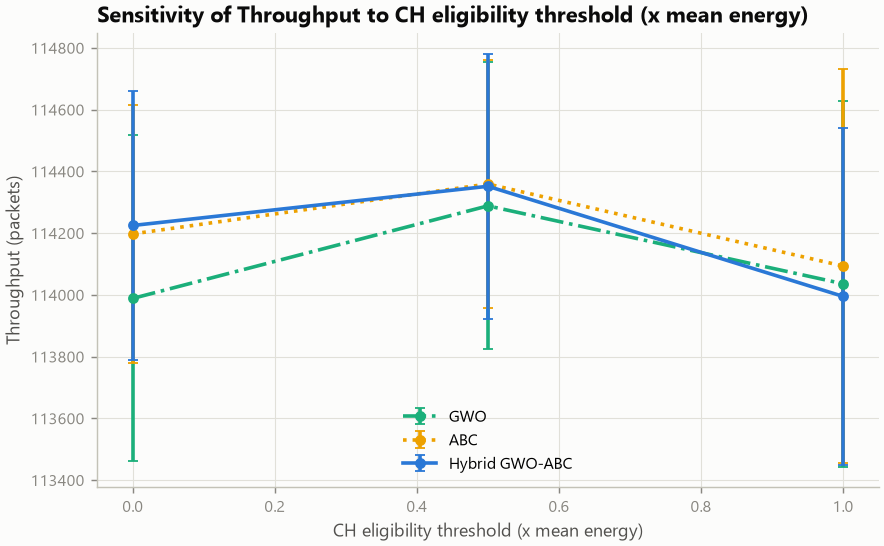

**Observed:** GWO: FND ranges from 659 (at 0.0) to 1130 (at 1.0); throughput 113,988–114,288 packets. ABC: FND ranges from 665 (at 0.0) to 1124 (at 1.0); throughput 114,093–114,359 packets. Hybrid GWO-ABC: FND ranges from 644 (at 0.0) to 1130 (at 1.0); throughput 113,995–114,352 packets. Highest FND per setting — 0.0: ABC; 0.5: GWO; 1.0: Hybrid GWO-ABC.
