# Single simulation: Hybrid GWO-ABC


All numbers below were produced by the simulator in this folder (1 independent paired runs per algorithm; run r uses deployment/algorithm seed 42 + r). Raw per-run results: `runs_raw.csv`; per-round histories: `history_raw.csv.gz`; statistics: `statistics.csv`; proposed-vs-baseline tests: `improvement_vs_baselines.csv`.

## Configuration

| Parameter | Value |
|---|---|
| Nodes | 100 |
| Area (m) | 100 x 100 |
| BS position | (50, 50) |
| Initial energy (J/node) | 0.5 |
| Packet size (bits) | 4000 |
| Control packet (bits) | 0 |
| Max rounds | 2000 |
| CH percentage p | 0.05 |
| CH count tolerance | K_opt x (1 ± 0.5) |
| CH eligibility (optimisers) | E ≥ 1.0 x mean alive energy |
| Optimisation iterations / round | 30 |
| GWO population | 20 |
| ABC colony size (food sources) | 20 (10) |
| ABC abandonment limit | 10 |
| Hybrid budget share / transfer / feedback | 0.5 / 3 / True |
| Fitness weights w1..w5 | 0.3, 0.25, 0.2, 0.15, 0.1 |
| Radio E_elec / E_fs / E_mp / E_DA | 5e-08 / 1e-11 / 1.3e-15 / 5e-09 |
| Checkpoint round (energy / averages) | 500 |
| Base seed | 42 |

## Final result table (mean ± std over runs)

| Metric | Hybrid GWO-ABC |
|---|---:|
| FND (rounds) | 1,132 |
| HND (rounds) | 1,146 |
| LND (rounds) | 1,160 |
| Residual Energy (J) | 28.210 |
| Energy Consumption (J) | 21.790 |
| Throughput (packets) | 114,457 |
| PDR (ratio) | 0.9981 |
| Avg. Cluster Distance (m) | 21.718 |
| Avg. CH-BS Distance (m) | 37.212 |
| Runtime (s) | 29.73 |
| Final Fitness (-) | 0.2396 |

Residual energy and energy consumption are measured at the checkpoint round 500; distance, imbalance and fitness averages cover rounds 1–500. '≥' marks lifetime values where at least one run had not reached the event within 2000 rounds (the horizon is then used as a lower bound).

## Descriptive statistics

**FND (rounds)**

| Algorithm | n | mean | std | min | max |
|---|---:|---:|---:|---:|---:|
| Hybrid GWO-ABC | 1 | 1,132 | 0 | 1,132 | 1,132 |

**HND (rounds)**

| Algorithm | n | mean | std | min | max |
|---|---:|---:|---:|---:|---:|
| Hybrid GWO-ABC | 1 | 1,146 | 0 | 1,146 | 1,146 |

**LND (rounds)**

| Algorithm | n | mean | std | min | max |
|---|---:|---:|---:|---:|---:|
| Hybrid GWO-ABC | 1 | 1,160 | 0 | 1,160 | 1,160 |

**Residual Energy (J)**

| Algorithm | n | mean | std | min | max |
|---|---:|---:|---:|---:|---:|
| Hybrid GWO-ABC | 1 | 28.210 | 0.000 | 28.210 | 28.210 |

**Energy Consumption (J)**

| Algorithm | n | mean | std | min | max |
|---|---:|---:|---:|---:|---:|
| Hybrid GWO-ABC | 1 | 21.790 | 0.000 | 21.790 | 21.790 |

**Throughput (packets)**

| Algorithm | n | mean | std | min | max |
|---|---:|---:|---:|---:|---:|
| Hybrid GWO-ABC | 1 | 114,457 | 0 | 114,457 | 114,457 |

**PDR (ratio)**

| Algorithm | n | mean | std | min | max |
|---|---:|---:|---:|---:|---:|
| Hybrid GWO-ABC | 1 | 0.9981 | 0.0000 | 0.9981 | 0.9981 |

**Runtime (s)**

| Algorithm | n | mean | std | min | max |
|---|---:|---:|---:|---:|---:|
| Hybrid GWO-ABC | 1 | 29.73 | 0.00 | 29.73 | 29.73 |

## Figures

### Initial WSN topology (run 0; every algorithm uses this same network in run 0).

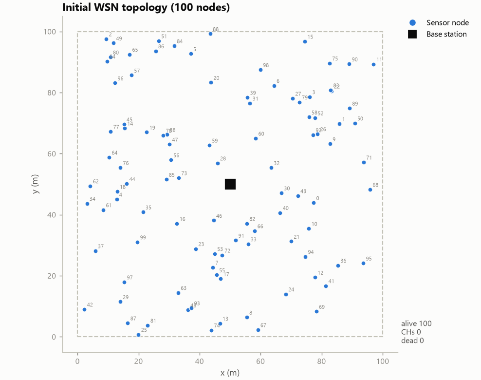

**Observed:** 100 nodes uniformly deployed in 100 x 100 m (seed 42); BS at (50, 50). Mean node–BS distance 37.5 m (max 62.9 m); d0 = 87.7 m, so 0% of nodes would use the multipath (d^4) model for a direct BS transmission.

### Hybrid GWO-ABC: cluster heads selected in round 1 (run 0).


**Observed:** 5 CHs; mean CH–BS distance 20.0 m.

### Hybrid GWO-ABC: cluster formation in round 1 (members joined the nearest CH).


**Observed:** 5 clusters, sizes 18–22 (CV 0.08); member→CH distance mean 24.1 m, max 45.9 m.

### Hybrid GWO-ABC: data communication in round 1 — members send to their CH (grey links), CHs aggregate and forward to the BS (arrows).


**Observed:** 5 clusters, sizes 18–22 (CV 0.08); member→CH distance mean 24.1 m, max 45.9 m.

### Hybrid GWO-ABC: network at its half-node-death round (run 0); dead nodes are marked x, alive nodes shaded by residual energy.

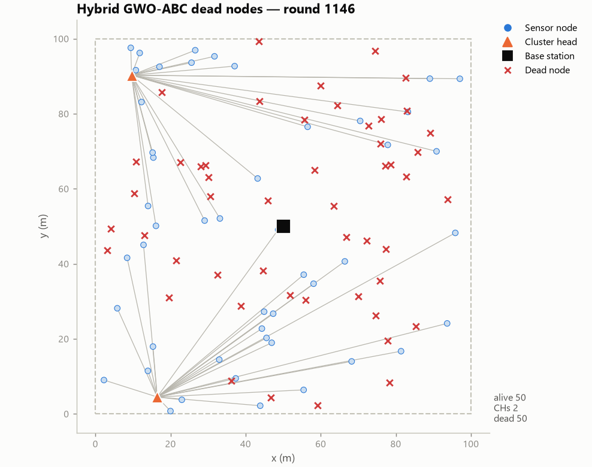

**Observed:** Round 1146: 50 dead, 50 alive. Mean distance to BS — dead nodes 34.1 m, alive nodes 40.9 m (near nodes died first on average).

### Hybrid GWO-ABC: best-so-far fitness per iteration of the round-1 CH optimisation (mean ± std over runs).

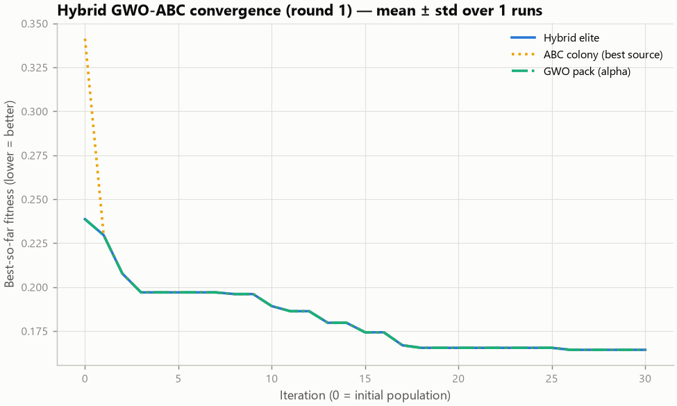

**Observed:** GWO: mean best fitness 0.2386 → 0.1643 (31.1% lower); 95% of the improvement reached by iteration 17; ABC: mean best fitness 0.3413 → 0.1643 (51.9% lower); 95% of the improvement reached by iteration 17; HYBRID: mean best fitness 0.2386 → 0.1643 (31.1% lower); 95% of the improvement reached by iteration 17

### Alive nodes vs rounds.

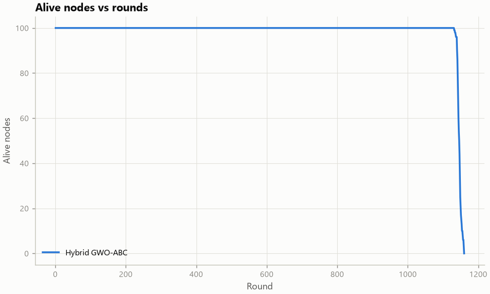

**Observed:** Hybrid GWO-ABC: FND 1132, HND 1146, LND 1160

### Dead nodes vs rounds.

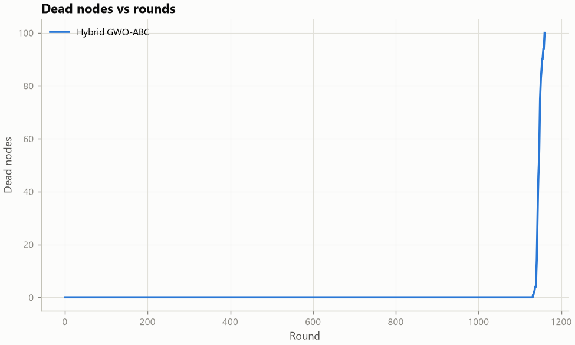

**Observed:** Mirror image of the alive-nodes curve; a steeper rise means nodes die closer together.

### Residual energy vs rounds.

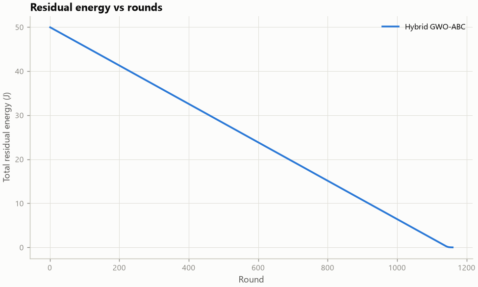

**Observed:** Residual energy at round 500: Hybrid GWO-ABC 28.21 J

### Energy consumption vs rounds.

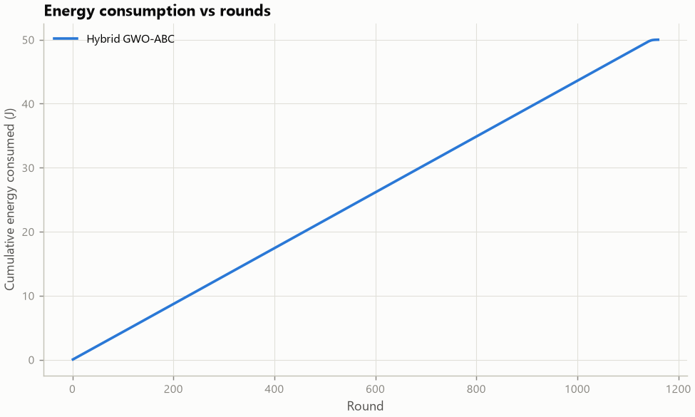

**Observed:** Consumed by round 500: Hybrid GWO-ABC 21.79 J

### Throughput vs rounds (cumulative).

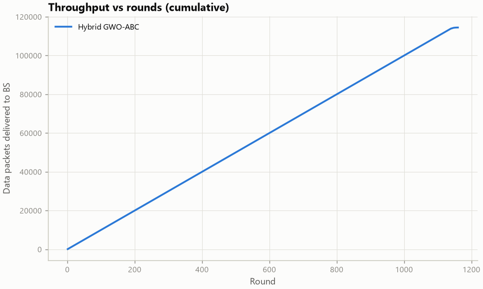

**Observed:** Total delivered: Hybrid GWO-ABC 114,457

### PDR vs rounds.

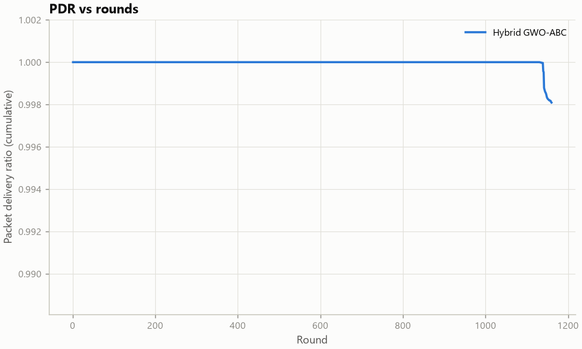

**Observed:** Final PDR: Hybrid GWO-ABC 0.9981

### CH count vs rounds (20-round rolling mean).

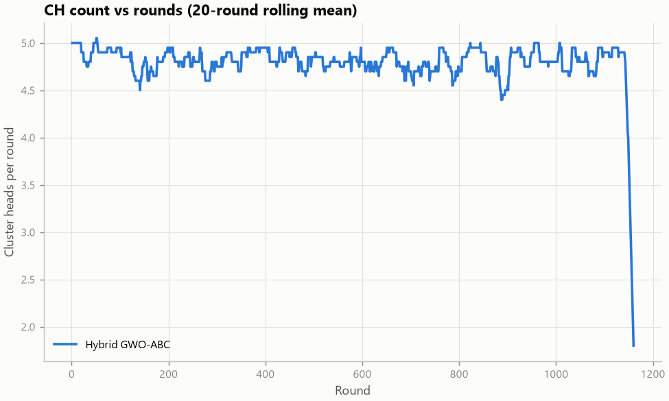

**Observed:** Mean CHs/round (rounds 1–500): Hybrid GWO-ABC 4.83 (per-round std 0.52)

### Average cluster distance vs rounds (20-round rolling mean).

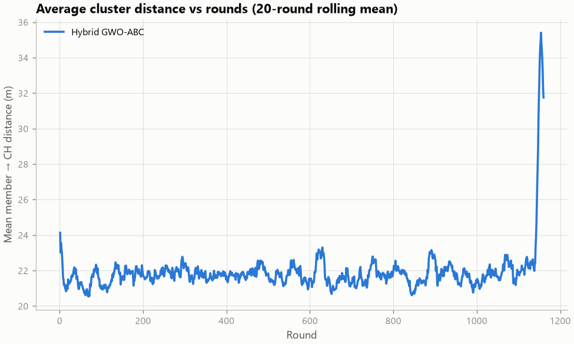

**Observed:** Mean member→CH distance: Hybrid GWO-ABC 21.72 m

### Total CH-selection runtime per simulation (log scale, mean ± std).

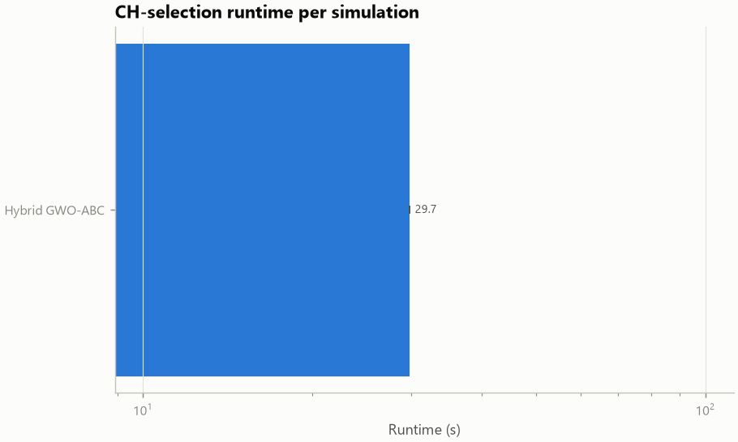

**Observed:** Hybrid GWO-ABC 29.73 s (25.63 ms/round, 727,486 fitness evaluations)

### FND / HND / LND comparison (mean ± std over runs).

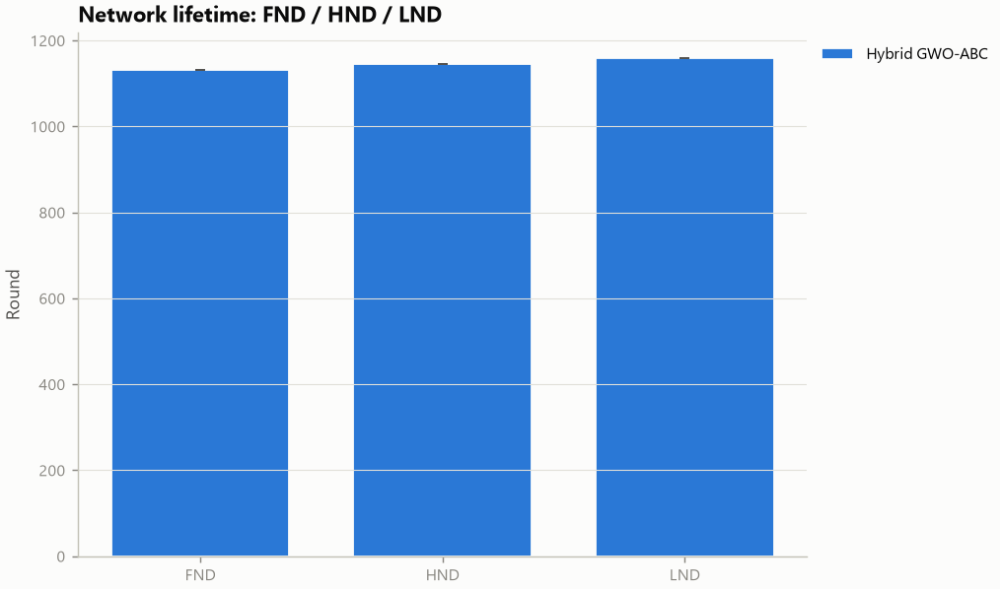

**Observed:** Hybrid GWO-ABC: FND 1132, HND 1146, LND 1160

### Where the energy goes: mean energy per radio activity over rounds 1–500.

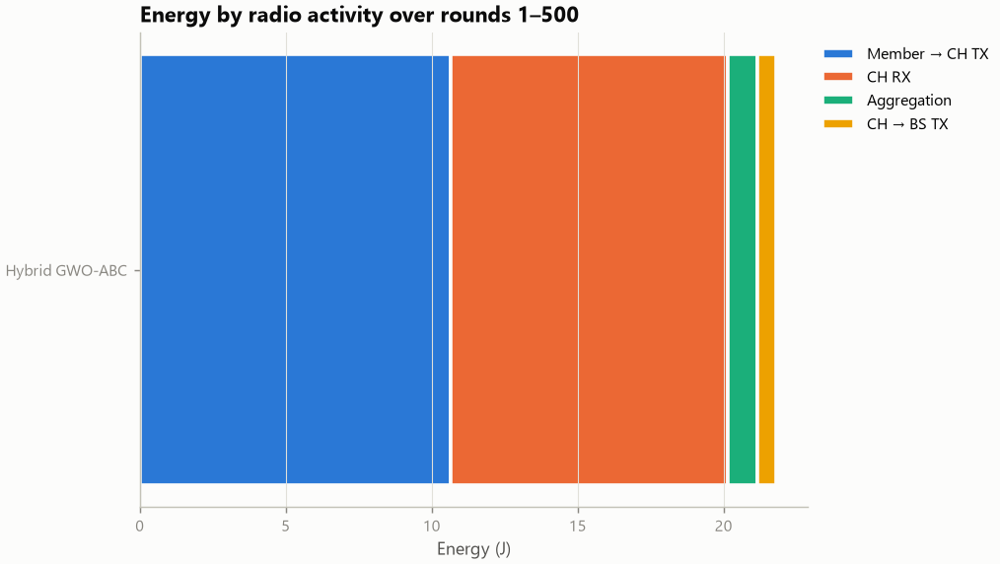

**Observed:** Hybrid GWO-ABC: total 21.79 J, largest share member TX (49%)

### Final fitness: same objective and weights for every algorithm.

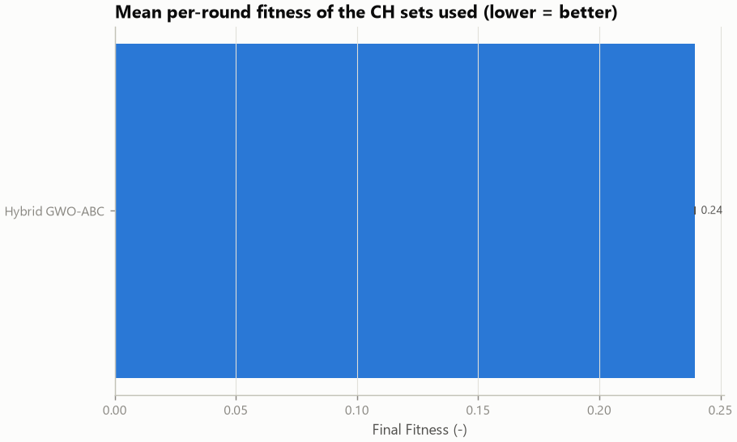

**Observed:** Hybrid GWO-ABC 0.2396

## Metric-by-metric interpretation

#### FND
- **What it represents:** First Node Death: the round in which the first node's residual energy reached 0.
- **How it was calculated:** min over nodes of the round in which residual energy reached 0 (simulation horizon if none died). (higher is better, unit: rounds)
- **Why it matters:** Marks the end of the stability period, during which every sensor still reports.
- **Observed (mean ± std over runs):** Hybrid GWO-ABC 1,132 (± n/a). Best mean: **Hybrid GWO-ABC**.
- **Possible explanation:** CH selection that avoids low-energy nodes and rotates the CH role evenly delays the first death; a node chosen repeatedly as CH (e.g. because it is close to the BS) dies early. Measured LND − FND spread (rounds): Hybrid GWO-ABC 28.

#### HND
- **What it represents:** Half Node Death: the round in which at least 50% of the nodes were dead.
- **How it was calculated:** round in which the number of dead nodes reached ceil(N/2). (higher is better, unit: rounds)
- **Why it matters:** Indicates how long the network keeps useful coverage.
- **Observed (mean ± std over runs):** Hybrid GWO-ABC 1,146 (± n/a). Best mean: **Hybrid GWO-ABC**.
- **Possible explanation:** HND reflects how evenly energy is drained across the whole network.

#### LND
- **What it represents:** Last Node Death: the round in which the last alive node died.
- **How it was calculated:** round in which the last node died (simulation horizon if nodes were still alive). (higher is better, unit: rounds)
- **Why it matters:** Upper bound of the network lifetime.
- **Observed (mean ± std over runs):** Hybrid GWO-ABC 1,160 (± n/a). Best mean: **Hybrid GWO-ABC**.
- **Possible explanation:** A very even energy drain makes all nodes die at nearly the same time: FND is delayed but the last node also dies sooner. Uneven drain leaves a few nodes with spare energy that keep running. Measured LND − FND spread (rounds): Hybrid GWO-ABC 28.

#### Residual Energy
- **What it represents:** Total residual energy of all nodes at the checkpoint round.
- **How it was calculated:** sum of node residual energies after the checkpoint round. (higher is better, unit: J)
- **Why it matters:** More energy left at the same round means cheaper operation.
- **Observed (mean ± std over runs):** Hybrid GWO-ABC 28.210 (± n/a). Best mean: **Hybrid GWO-ABC**.
- **Possible explanation:** Residual energy at a fixed round depends on per-round radio cost: shorter member->CH links and shorter or fewer CH->BS links consume less.

#### Energy Consumption
- **What it represents:** Initial total energy minus residual energy at the checkpoint round.
- **How it was calculated:** N * E0 - residual energy at the checkpoint round. (lower is better, unit: J)
- **Why it matters:** Energy spent to operate the network for the same number of rounds.
- **Observed (mean ± std over runs):** Hybrid GWO-ABC 21.790 (± n/a). Best mean: **Hybrid GWO-ABC**.
- **Possible explanation:** Consumption is the complement of residual energy at the same checkpoint.

#### Throughput
- **What it represents:** Total sensor data packets delivered to the BS over the whole simulation (directly or inside an aggregated CH packet).
- **How it was calculated:** count of sensor readings that reached the BS over the whole run. (higher is better, unit: packets)
- **Why it matters:** Amount of sensed data the application actually receives.
- **Observed (mean ± std over runs):** Hybrid GWO-ABC 114,457 (± n/a). Best mean: **Hybrid GWO-ABC**.
- **Possible explanation:** Throughput grows with the number of rounds in which nodes are alive and with the share of packets that are not lost to CHs dying mid-round.

#### PDR
- **What it represents:** Packet Delivery Ratio = delivered data packets / generated data packets.
- **How it was calculated:** delivered readings / generated readings over the whole run. (higher is better, unit: ratio)
- **Why it matters:** Reliability: share of generated readings that reach the BS.
- **Observed (mean ± std over runs):** Hybrid GWO-ABC 0.9981 (± n/a). Best mean: **Hybrid GWO-ABC**.
- **Possible explanation:** Packets are lost when a CH runs out of energy before forwarding its cluster's data, or when a node dies while transmitting. Energy-feasibility checks on CHs reduce such losses.

#### Avg. Cluster Distance
- **What it represents:** Mean member->CH distance, averaged over rounds 1..checkpoint.
- **How it was calculated:** per round mean member->CH distance, averaged over rounds 1..checkpoint. (lower is better, unit: m)
- **Why it matters:** Shorter intra-cluster links cost less transmission energy (d^2 / d^4).
- **Observed (mean ± std over runs):** Hybrid GWO-ABC 21.718 (± n/a). Best mean: **Hybrid GWO-ABC**.
- **Possible explanation:** The fitness function explicitly penalises member->CH distance; LEACH places CHs at random positions, which typically lengthens member links.

#### Avg. CH-BS Distance
- **What it represents:** Mean CH->BS distance, averaged over rounds 1..checkpoint.
- **How it was calculated:** per round mean CH->BS distance, averaged over rounds 1..checkpoint. (lower is better, unit: m)
- **Why it matters:** CH->BS is the longest and most expensive hop.
- **Observed (mean ± std over runs):** Hybrid GWO-ABC 37.212 (± n/a). Best mean: **Hybrid GWO-ABC**.
- **Possible explanation:** The fitness penalises CH->BS distance, but the energy-eligibility rule and the energy term limit how often nodes near the BS can be selected.

#### Runtime
- **What it represents:** Total wall-clock time spent selecting CHs over the whole simulation.
- **How it was calculated:** sum of wall-clock CH-selection time over all rounds (time.perf_counter). (lower is better, unit: s)
- **Why it matters:** Computational cost of the CH selection algorithm.
- **Observed (mean ± std over runs):** Hybrid GWO-ABC 29.73 (± n/a). Best mean: **Hybrid GWO-ABC**.
- **Possible explanation:** Metaheuristics evaluate hundreds of candidate CH sets per round; LEACH needs one random draw per node. The hybrid runs two populations and more operators per iteration, which adds overhead even at an equal number of fitness evaluations.

#### Final Fitness
- **What it represents:** Mean per-round fitness (same function and weights for every algorithm) of the CH set actually used, over rounds 1..checkpoint. Lower is better.
- **How it was calculated:** per round fitness of the CH set used (same weights for all), mean over rounds 1..checkpoint. (lower is better, unit: -)
- **Why it matters:** Quality of the CH configurations according to the optimisation objective.
- **Observed (mean ± std over runs):** Hybrid GWO-ABC 0.2396 (± n/a). Best mean: **Hybrid GWO-ABC**.
- **Possible explanation:** Optimisers minimise this objective directly; LEACH does not use it, and rounds in which LEACH elects zero CHs or too many receive the invalid-solution penalty.

#### Node-rounds
- **What it represents:** Sum over rounds of the number of alive nodes (area under the alive-nodes curve).
- **How it was calculated:** sum over rounds of alive nodes. (higher is better, unit: node x rounds)
- **Why it matters:** Single-number lifetime measure that accounts for the whole death curve.
- **Observed (mean ± std over runs):** Hybrid GWO-ABC 114,576 (± n/a). Best mean: **Hybrid GWO-ABC**.
- **Possible explanation:** The area under the alive-nodes curve combines stability period and tail length.

#### Cluster Imbalance
- **What it represents:** Coefficient of variation of cluster sizes, averaged over rounds 1..checkpoint.
- **How it was calculated:** per round std/mean of cluster sizes, averaged over rounds 1..checkpoint. (lower is better, unit: CV)
- **Why it matters:** Balanced clusters spread the CH load evenly.
- **Observed (mean ± std over runs):** Hybrid GWO-ABC 0.1513 (± n/a). Best mean: **Hybrid GWO-ABC**.
- **Possible explanation:** The fitness penalises unequal cluster sizes; nearest-CH assignment does not.

## Cluster-head records (run 0)

Every selected CH of every round is recorded in `ch_log_run0.csv` (round, CH id, coordinates, residual energy at selection, distance to the BS, cluster size including the CH). Dead and duplicate CHs are removed before clustering, so only valid CHs appear.

### Hybrid GWO-ABC

Over 1160 rounds with CHs: 4.76 CHs/round on average; mean CH residual energy at selection 0.2526 J; mean CH–BS distance 38.11 m; 100 distinct nodes served as CH, the most frequent one 67 times.

Round 1 cluster heads:

| CH id | x (m) | y (m) | Residual energy (J) | CH–BS (m) | Cluster size |
|---|---:|---:|---:|---:|---:|
| 20 | 43.72 | 83.27 | 0.5 | 33.86 | 22 |
| 55 | 45.58 | 20.24 | 0.5 | 30.09 | 21 |
| 60 | 58.41 | 64.98 | 0.5 | 17.18 | 21 |
| 66 | 58.11 | 34.69 | 0.5 | 17.33 | 18 |
| 70 | 48.67 | 49.07 | 0.5 | 1.626 | 18 |


## Reproducing this experiment

```
python main.py reproduce "C:\Users\Admin\Hybrid-GWO-ABC-WSN\results\single_Hybrid_GWO-ABC"
```

`config.json` holds every parameter; `experiment.json` holds the algorithms, run count and seeds.
